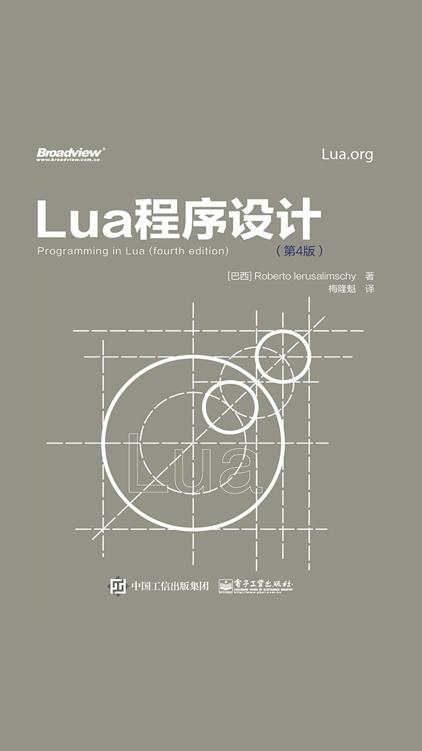

# Lua 程序设计



# 前言

1993年，当我和Waldemar、Luiz开发Lua语言时，我们并没有想象到它会像今天这样被如此广泛地使用。当年，Lua语言只是为了两个特定项目而开发的实验室项目；如今，Lua语言被大量应用于需要一门简明、可扩展、可移植且高效的脚本语言的领域中，例如嵌入式系统、移动设备、物联网，当然还有游戏。

Lua语言从一开始就被设计为能与C/C++及其他常用语言开发的软件集成在一起使用的语言，这种设计带来了非常多的好处。一方面，Lua语言不需要在性能、与三方软件交互等C语言已经非常完善的方面重复“造轮子”，可以直接依赖C语言实现上述特性，因而Lua语言非常精简；另一方面，通过引入安全的运行时环境、自动内存管理、良好的字符串处理能力和可变长的多种数据类型，Lua语言弥补了C语言在非面向硬件的高级抽象能力、动态数据结构、鲁棒性、调试能力等方面的不足。

Lua语言强大的原因之一就在于它的标准库，这不是偶然，毕竟扩展性本身就是Lua语言的主要能力之一。Lua语言中的许多特性为扩展性的实现提供了支持：动态类型使得一定程度的多态成为了可能，自动内存管理简化了接口的实现（无须关心内存的分配/释放及处理溢出），作为第一类值的函数支持高度的泛化，从而使得函数更加通用。

Lua语言除了是一门可扩展的语言外，还是一门胶水语言（glue language）。Lua语言支持组件化的软件开发方式，通过整合已有的高级组件构建新的应用。这些组件通常是通过C/C++等编译型强类型语言编写的，Lua语言充当了整合和连接这些组件的角色。通常，组件（或对象）是对程序开发过程中相对稳定逻辑的具体底层（如小部件和数据结构）的抽象，这些逻辑占用了程序运行时的大部分CPU时间，而产品生命周期中可能经常发生变化的逻辑则可以使用Lua语言来实现。当然，除了整合组件外，Lua语言也可以用来适配和改造组件，甚至创建全新的组件。

诚然，Lua语言并非这个世界上唯一的脚本语言，还有许多其他的脚本语言提供了类似的能力。尽管如此，Lua语言的很多特性使它成为解决许多问题的首选，这些特性如下。

可扩展： Lua语言具有卓越的可扩展性。Lua的可扩展性好到很多人认为Lua超越了编程语言的范畴，其甚至可以成为一种用于构建领域专用语言（Domain-Specific Language，DSL）的工具包。Lua从一开始就被设计为可扩展的，既支持使用Lua语言代码来扩展，也支持使用外部的C语言代码来扩展。在这一点上有一个很好的例证：Lua语言的大部分基础功能都是通过外部库实现的。我们可以很容易地将Lua与C/C++、Java、C#和Python等结合在一起使用。

简明： Lua语言是一门精简的语言。尽管它本身具有的概念并不多，但每个概念都很强大。这样的特性使得Lua语言的学习成本很低，也有助于减小其本身的大小（其包含所有标准库的Linux 64位版本仅有220 KB）。

高效： Lua语言的实现极为高效。独立的性能测试说明Lua语言是脚本语言中最快的语言之一。

可移植： Lua语言可以运行在我们听说过的几乎所有平台之上，包括所有的类UNIX操作系统（Linux、FreeBSD等）、Windows、Android、iOS、OSX、IBM大型机、游戏终端（PlayStation、Xbox、Wii等）、微处理器（如Arduino）等。针对所有这些平台的源码本质上是一样的，Lua语言遵循ANSI（ISO）C标准，并未使用条件编译来对不同平台进行代码的适配。因此，当需要适配新平台时，只要使用对应平台下的ISOC编译器重新编译Lua语言的源码就可以了。

**预期读者**

除了本书的最后一部分（其中讨论了Lua语言的C语言API）外，阅读本书并不需要对Lua语言或其他任何一种编程语言有预先了解。不过，阅读本书的确需要了解一些基本的编程概念，尤其是变量与赋值、控制结构、函数与参数、流与文件及数据结构等。

Lua语言有三类典型用户：在应用程序中嵌入式地使用Lua语言的用户、单独使用Lua语言的用户，以及和C语言一起使用Lua语言的用户。

诸如Adobe Lightroom、Nmap和魔兽世界等在内的许多应用程序中嵌入式地使用了Lua语言。这些应用使用Lua语言的C语言API去注册新函数、创建新类型和改变部分运算符的行为，以最终达到将Lua语言用于特定领域的目的。一般情况下，这些应用的用户根本感受不到Lua语言其实是一门被用于特定领域的独立编程语言。例如，Lightroom插件的很多开发者压根儿不知道他们使用的是Lua语言，Nmap的用户也倾向于将Lua语言视为Nmap脚本引擎所使用的语言，魔兽世界的很多玩家也认为Lua语言是这个游戏所独有的。尽管应用场景各异，Lua语言的核心是相同的，本书中将要讲的编程技巧也都是适用的。

除了用于文本处理和用后即弃的小程序外，作为一门独立的编程语言，Lua语言也同样适用于大中型项目。对于这些应用而言，Lua语言的主要能力源于标准库。例如，标准库提供了模式匹配和其他字符串处理函数。随着Lua语言不断改进对标准库的支持，第三方库的数量在不断增加。LuaRocks是一个Lua语言模块的部署和管理系统，该系统在2015年管理了1000多个涵盖各个领域的模块。

最后，还有一部分程序员会在编写程序时将Lua语言当作C语言的一个标准库来使用。他们通常更多地用C语言（相对于Lua语言）来进行编码，但是只有较好地理解了Lua语言才能写出简单易用且便于二者集成的接口。

**全书结构**

本书的这一版本增加了针对很多领域的新内容和示例，包括沙盒、协程以及日期和时间处理。此外，还增加了Lua 5.3的相关内容，包括整型值、位运算及无符号整型值等。

更具体地说，这一版对全书结构进行了重大的重构。在本版中，笔者尝试围绕编程中的常见主题来组织内容，而不是围绕编程语言（例如分章节介绍每个标准库）去组织内容。新的组织方式来自于Lua语言教学的实际经验，它能帮助读者从简单的主题开始循序渐进地学习。特别地，笔者认为这一版的组织方式让本书成为了Lua语言相关课程的一份更好的教学资源。

和前几版一样，本书共由4个部分组成，每个部分包括9章左右的内容，各有侧重。

第1部分涵盖了Lua语言的基础知识（因此这一部分被命名为语言基础），主要围绕数值、字符串、表和函数等几种主要数据类型，也对基本输入/输出模型和Lua语言的整体语法进行了介绍。

第2部分为编程实操，涵盖了在其他类似编程语言中也经常涉及的高级主题，如闭包、模式匹配、时间和日期处理、数据结构、模块和错误处理等。

第3部分为语言特性。顾名思义，这一部分介绍了Lua语言与其他语言相比的不同之处，如元表及其使用、环境、弱引用表、协程和反射等高级特性。

最后，和以前的版本一样，本书的第4部分介绍了Lua语言和C语言之间的API，以便于使用C语言的开发者能够发挥出Lua语言的全部能力。由于在这一部分中将使用C语言而非Lua语言进行编程，所以这一部分和本书的其他部分大相径庭。一些读者可能对Lua语言的C语言API毫无兴趣，而其他一些读者可能觉得这一部分是本书中最有意义的部分。

在本书的所有部分中，我们都专注于不同的语言结构，并且使用了大量的示例和练习来演示如何将这些语言结构应用于实际需求中。在一些章节之间，我们也设置了几个“插曲”，每个“插曲”都提供了一个简短但完整的Lua语言程序，以帮助读者建立对Lua语言的更多整体认识。

**其他资源**

官方文档是所有真正希望学习一门语言的人所必须具备的资料。本书无意取代Lua语言官方文档。相反，本书是对官方文档的补充。一方面，官方文档只描述了Lua语言，其中既没有代码实例，也没有语言结构的基本原理。另一方面，官方文档覆盖了Lua语言的所有内容，本书则跳过了Lua语言中的一些极少使用的边边角角。此外，官方文档是有关Lua语言最权威的文档，本书中任何与官方文档不同的地方都应该以官方文档为准。我们可以在Lua语言的官方网站 http://www.lua.org 上找到官方文档和其他的更多内容。

此外，在Lua语言的用户社区 http://lua-users.org 中也有不少有用的信息。与其他资源相比，用户社区提供了教程、第三方库列表、文档以及Lua语言官方邮件列表的存档等资料。

本书内容基于Lua 5.3版本，不过书中的大部分内容对于老版本和可能的后续版本同样适用。Lua 5.3和Lua 5.x老版本之间的区别都已经被清晰地描述了出来；如果读者使用的是本书出版后更新的版本，那么也可以在官方文档中找到相应版本之间的具体差异。

**排版约定**

在本书中，我们使用双引号表示字符串常量（如"literal strings"），使用单引号表示单个字符（如'a'）。用作模式的字符串也会被单引号引起来，例如'[%w_]*'。此外，代码段（chunks of code）和标识符（identifier）使用等宽字体，强调的内容则使用粗体。大段代码使用如下格式给出：

```lua
-- 程序"Hello World"
print("Hello World")		--> Hello World
```

记号 `-->` 表示一条语句的输出或表达式求值的结果：

```lua
print(10)			--> 10
13 + 3				--> 16
```

由于Lua语言中两个连续的连字符（--）表示单行注释，因此在程序中使用记号-->不会有任何问题。

本书前几章中有一些代码需要在交互模式下输入，对于这种情况下的每一行代码，我们使用Lua语言的提示符（">"）进行了标注：

```lua
> 3 + 5				--> 8
> math.sin(2.3)		--> 0.74570521217672
```

在Lua 5.2及更早版本中，如果需要打印表达式求值的结果，必须在每个表达式前加上一个等号：

```lua
> = 3 + 5			--> 8
> a = 25
> = a				--> 25
```

为了向下兼容，Lua 5.3也允许这种语法结构。

最后，本书使用符号 `<->` 表示两者完全等价：

`this <-> that`

**运行示例**

运行本书中的示例需要使用Lua语言解释器。尽管理想情况下应该使用Lua 5.3版本，但本书中的大部分示例无须修改也能在旧版本中运行。

可以从Lua语言的官网（http://www.lua.org）上下载解释器的源码。如果读者知道如何使用C语言编译器在自己的机器上编译C代码，那么建议尝试从源码编译并安装Lua语言（这非常简单）。 *Lua Binaries* 网站（搜索luabinaries）为大多数主流平台提供了已经编译好的Lua语言解释器。如果读者使用的是Linux或者其他的类UNIX操作系统，那么通常在软件库中已经提供了Lua语言执行环境，很多个发行版中已经提供了Lua语言相关的包。

Lua语言有几种集成开发环境（IDE），在搜索引擎中搜一下就可以找到（尽管如此，笔者还是推荐Windows下的命令行接口或者其他操作系统下的文本编辑器，尤其是对于初学者而言）。

**致谢**

从本书第1版发行到现在已经十余年了。在这十余年中，很多朋友和机构都给予过很多帮助。

像过去一样，Luiz Henrique de Figueiredo、Waldemar Celes和Lua coauthors给予了很多帮助。Reuben Thomas、Robert Day、André Carregal、Asko Kauppi、Brett Kapilik、Diego Nehab、Edwin Moragas、Fernando Jefferson、Gavin Wraith、John D.Ramsdell和Norman Ramsey提出了无数的建议，也为丰富本书第4版的内容提供了很多启发。Luiza Novaes为本书的封面设计提供了关键性的支持。

感谢Lightning Source公司在本书印刷和发行过程中表现出的可靠和高效。如果没有他们的帮助，自己出版本书几乎是不可能的。

感谢Marcelo Gattass领导的Tecgraf，他们从1993年Lua项目诞生到2005年期间一直为Lua语言提供资助，并且仍在以很多方式持续地推动Lua语言的发展。

我还要感谢里约热内卢天主教大学（Pontifical Catholic University of Rio de Janeiro，PUCRio）和巴西国家研究理事会（Brazilian National Research Council，CNPq），感谢他们对我工作的一贯支持。如果没有PUC-Rio为我提供的环境，那么Lua语言项目的开发根本不可能进行。

最后，我必须向Noemi Rodriguez表达我最诚挚的感谢（包括技术方面和非技术方面），感谢她点亮了我的生活。


# 第一部分：语言基础

## 第一章 Lua 语言入门

遵照惯例，我们的第一个Lua程序是通过标准输出打印字符串"Hello World"：

```lua
print("Hello World")
```

如果读者使用的是Lua语言独立解释器（stand-alone interpreter），要运行这第一个程序的话，直接调用解释器（通常被命名为lua或者lua5.3）运行包含程序代码的文本文件就可以了。例如，如果把上述代码保存为名为hello.lua的文件，那么可以通过以下命令运行：

```shell
lua hello.lua
```

再来看一个稍微复杂点的例子，以下代码定义了一个计算阶乘的函数，该函数先让用户输入一个数，然后打印出这个数的阶乘结果：

### 1.1 程序段

我们将Lua语言执行的每一段代码（例如，一个文件或交互模式下的一行）称为一个程序段（ *Chunk* ），即一组命令或表达式组成的序列。

程序段既可以简单到只由一句表达式构成（例如输出“Hello World”的示例），也可以由多句表达式和函数定义（实际是赋值表达式，后面会详细介绍）组成（例如计算阶乘的示例）。程序段在大小上并没有限制，事实上，由于Lua语言也可以被用作数据定义语言，所以几MB的程序段也很常见。Lua语言的解释器可以支持非常大的程序段。

除了将源码保存成文件外，我们也可以直接在交互式模式（interactive mode）下运行独立解释器（stand-alone interpreter）。当不带参数地调用lua时，可以看到如下的输出：

```shell
-> lua
Lua 5.4.2  Copyright (C) 1994-2020 Lua.org, PUC-Rio
>
```

此后，输入的每一条命令（例如：print"Hello World"）都会在按下回车键后立即执行。我们可以通过输入EOF控制字符（End-Of-File、POSIX环境下使用ctrl-D，Windows环境下使用ctrl-Z），或调用操作系统库的exit函数（执行os.exit（））退出交互模式。

从Lua 5.3版本开始，可以直接在交互模式下输入表达式，Lua语言会输出表达式的值，例如：

```lua
-> lua
Lua 5.4.2  Copyright (C) 1994-2020 Lua.org, PUC-Rio
> math.pi / 4            --> 0.78539816339745
> a = 15
> a^2                    --> 225
> a + 2                  --> 17
```

与之相比，在Lua 5.3之前的老版本中，需要在表达式前加上一个等号：

```lua
-> lua
Lua 5.4.2  Copyright (C) 1994-2020 Lua.org, PUC-Rio
> a^2                    --> 225
> = a + 2                --> 17
```

为了向下兼容，Lua 5.3也支持这种语法结构。

要以代码段的方式运行代码（不在交互模式下），那么必须把表达式包在函数print的调用中：

```lua
print(math.pi / 4)
a = 15
print(a^2)
print(a + 2)
```

在交互模式下，Lua语言解释器一般会把我们输入的每一行当作完整的程序块或表达式来解释执行。但是，如果Lua语言解释器发现我们输入的某一行不完整，那么它会等待直到程序块或表达式被输入完整后再进行解释执行。这样，我们也可以直接在交互模式下输入一个像阶乘函数示例那样的由很多行组成的多行定义。不过，对于这种较长的函数定义而言，将其保存成文件然后再调用独立解释器来执行通常更方便。

我们可以使用-i参数让Lua语言解释器在执行完指定的程序段后进入交互模式：

```shell
-> lua -i prog
```

上述的命令行会在执行完文件prog中的程序段后进入交互模式，这对于调试和手工测试很有用。在本章的最后，我们会学习有关独立解释器的更多参数。

另一种运行程序段的方式是调用函数dofile，该函数会立即执行一个文件。例如，假设我们有一个如下所示的文件lib1.lua：

```lua
function norm (x, y)
    return math.sqrt(x^2 + y^2)
end

function twice (x)
    return 2.0 * x
end
```

然后，在交互模式下运行：

```shell
> dofile（"lib1.lua"）　　--加载文件
> n = norm(3.4, 1.0)
> twince(n)
```

函数dofile在开发阶段也非常有用。我们可以同时打开两个窗口，一个窗口中使用文件编辑器编辑的代码（例如文件prog.lua），另一个窗口中使用交互模式运行Lua语言解释器。当修改完代码并保存后，只要在Lua语言交互模式的提示符下执行dofile（"prog.lua"）就可以加载新代码，然后就可以观察新代码的函数调用和执行结果了。

### 1.2 一些词法规范

Lua语言中的标识符（或名称）是由任意字母、数字和下画线组成的字符串（注意，不能以数字开头)，例如：

```
i    j    i10    _ij    aSomewhatLongName   _INPUT
```

“下画线+大写字母”（例如_VERSION）组成的标识符通常被Lua语言用作特殊用途，应避免将其用作其他用途。我通常会将“下画线+小写字母”用作哑变量（Dummy variable）。

以下是Lua语言的保留字（reserved word），它们不能被用作标识符：

```
and    break    do      else    elseif
end    false    goto    for     function
if     in       local   nil     not
or     repeat   return  then    true
until  while
```

Lua语言是对大小写敏感的，因而虽然 and 是保留字，但是And和AND就是两个不同的标识符。

Lua语言中使用两个连续的连字符（--）表示单行注释的开始（从--之后直到此行结束都是注释），使用两个连续的连字符加两对连续左方括号表示长注释或多行注释的开始（直到两个连续的右括号为止，中间都是注释），例如：

```lua
--[[
    多行注释
]]
```

在注释一段代码时，一个常见的技巧是将这些代码放入--[[和--]]之间，例如：

```lua
--[[
    print(19)       -- 无动作（被注释掉了）
]]
```

当我们需要重新启用这段代码时，只需在第一行行首添加一个连字符即可：

```lua
---[[
    print(19)       -- 无动作（被注释掉了）
]]
```

在第一个示例中，第一行的--[[表示一段多行注释的开始，直到遇到两个连续的右括号这段多行注释才会结束，因而尽管最后一行有两个连续的连字符，但由于这两个连字符在最后两个右方括号之前，所以仍然被注释掉了。在第二个示例中，由于第一行的---[[实际是单行注释，因此最后一行实际上也是一条独立的单行注释（最后的两个连续右方括号没有与之匹配的--[[），print并没有被注释掉。

在Lua语言中，连续语句之间的分隔符并不是必需的，如果有需要的话可以使用分号来进行分隔。在Lua语言中，表达式之间的换行也不起任何作用。例如，以下4个程序段都是合法且等价的：

```lua
-- 第一段
a = 1
b - a * 2

-- 第二段
a = 1;
b = a * 2;

-- 第三段
a = 1; b = a * 2

-- 第四段
a = 1 b = a * 2
```

我个人的习惯只有在同一行中书写多条语句的情况下（这种情况一般也不会出现），才会使用分号做分隔符。


### 1.3　全局变量

在Lua语言中，全局变量（Global Variable）无须声明即可使用，使用未经初始化的全局变量也不会导致错误。当使用未经初始化的全局变量时，得到的结果是nil：

```lua
> b         --> nil
> b = 10
> b         --> 10
```

当把nil赋值给全局变量时，Lua会回收该全局变量（就像该全局变量从来没有出现过一样），例如：
    
```lua
> b = nil
> b         --> nil
```

Lua语言不区分未初始化变量和被赋值为nil的变量。在上述赋值语句执行后，Lua语言会最终回收该变量占用的内存。

### 1.4 类型和值

Lua语言是一种动态类型语言（Dynamically-typed language），在这种语言中没有类型定义（type definition），每个值都带有其自身的类型信息。

Lua语言中有8种基本类型： nil （空）、 boolean （布尔）、 number （数值）、 string （字符串）、 userdata （用户数据）、 function （函数）、 thread （线程）和 table （表）。使用函数type可获取一个值对应的类型名称：

```lua
> type(nil)         --> nil
> type(true)        --> boolean
> type(10.4 * 3)    --> number
> type("Hello")     --> string
> type(io.stdin)    --> userdata
> type(print)       --> function
> type(type)        --> function
> type({})          --> table
> type(type(X))     --> string
```

不管X是什么，最后一行返回的永远是"string"。这是因为函数type的返回值永远是一个字符串。

userdata类型允许把任意的C语言数据保存在Lua语言变量中。在Lua语言中，用户数据类型除了赋值和相等性测试外，没有其他预定义的操作。用户数据被用来表示由应用或C语言编写的库所创建的新类型。例如，标准I/O库使用用户数据来表示打开的文件。我们会在后面涉及CAPI时再讨论更多的相关内容。

变量没有预定义的类型，任何变量都可以包含任何类型的值：

```lua
> type(a)         --> nil ('a'没有被初始化)
> a = 10
> type(a)         --> number
> a = "a string!!"
> type(a)         --> string
> a = nil
> type(a)         --> nil
```

一般情况下，将一个变量用作不同类型时会导致代码的可读性不佳；但是，在某些情况下谨慎地使用这个特性可能会带来一定程度的便利。例如，当代码发生异常时可以返回一个nil以区别于其他正常情况下的返回值。

本章接下来将学习简单类型nil和Boolean，在后续的章节中我们会依次对number（第3章）、string（第4章）、table（第5章）和function（第6章）进行详细学习。我们会在第24章中学习thread类型。

#### 1.4.1 nil

nil是一种只有一个nil值的类型，它的主要作用就是与其他所有值进行区分。Lua语言使用nil来表示无效值（non-value，即没有有用的值）的情况。像我们之前所学习到的，一个全局变量在第一次被赋值前的默认值就是nil，而将nil赋值给全局变量则相当于将其删除。

#### 1.4.2 Boolean

Boolean类型具有两个值， true 和 false ，它们分别代表了传统布尔值。不过，在Lua语言中，Boolean值并非是用于条件测试的唯一方式，任何值都可以表示条件。在Lua语言中，条件测试（例如控制结构中的分支语句）将除Boolean值false和nil外的所有其他值视为真。特别的是，在条件检测中Lua语言把零和空字符串也都视为真。

在本书中，“false”代表的是所有为假的值，包括Boolean类型的 false 或nil；而“ false ”特指Boolean类型的值。“true”和“ true ”亦然。

Lua语言支持常见的逻辑运算符： and 、 or 和 not 。和条件测试一样，所有的逻辑运算将Boolean类型的 false 和nil当作假，而把其他值当作真。逻辑运算符 and 的运算结果为：如果它的第一个操作数为“false”，则返回第一个操作数，否则返回第二个操作数。逻辑运算符 or 的运算结果为：如果它的第一个操作数不为“false”，则返回第一个操作数，否则返回第二个操作数。例如：

```lua
> 4 and 5         --> 5
> nil and 13      --> nil
> false and 13    --> false
> 0 or 5          --> 0
> false or "hi"   --> "hi"
> nil or false    --> false
```

and 和 or 都遵循短路求值（Short-circuit evaluation）原则，即只在必要时才对第二个操作数进行求值。例如，根据短路求值的原则，表达式（i～=0 and a/i>b）不会发生运行时异常（当i等于0时，a/i不会执行）。

在Lua语言中，形如x=x or v的惯用写法非常有用，它等价于：

```lua
if not x then x = v end
```

即，当x未被初始化时，将其默认值设为v（假设x不是Boolean类型的 false ）。

另一种有用的表达式形如（（a and b）or c）或（a and b or c）（由于 and 的运算符优先级高于 or ，所以这两种表达形式等价，后面会详细介绍），当b不为false时，它们还等价于C语言的三目运算符a？b:c。例如，我们可以使用表达式（x>y）and x or y选出数值x和y中较大的一个。当x>y时， and 的第一个操作数为true，与第二个操作数（x）进行 and 运算后结果为x，最终与 or 运算后返回第一个操作数x。当x>y不成立时， and 表达式的值为false，最终 or 运算后的结果是第二个操作数y。

not 运算符永远返回Boolean类型的值：

```lua
> not nil         --> true
> not false       --> true

> not 0           --> false
> not not 1       --> true
> not not nil     --> false
```

### 1.5 独立解释器

独立解释器（Stand-alone interpreter，由于源文件名为lua.c，所以也被称为lua.c；又由于可执行文件为lua，所以也被称为lua）是一个可以直接使用Lua语言的小程序。这一节介绍它的几个主要参数。

如果源代码文件第一行以井号（#）开头，那么解释器在加载该文件时会忽略这一行。这个特征主要是为了方便在POSIX系统中将Lua作为一种脚本解释器来使用。假设独立解释器位于/usr/local/bin下，当使用下列脚本：

```shell
--> /usr/local/bin/lua
```

或

```shell
--> /usr/bin/env lua
```

时，不需要显式地调用Lua语言解释器也可以直接运行Lua脚本。

lua命令的完整参数形如：

```shell
lua [option] [script [args]]
```

其中，所有的参数都是可选的。如前所述，当不使用任何参数调用lua时，就会直接进入交互模式。

-e参数允许我们直接在命令行中输入代码，例如：

```shell
lua -e "print(math.sin(12))"   --> -0.53657291800043
```

请注意，在POSIX系统下需要使用双引号，以防止Shell错误地解析括号。

-l参数用于加载库。正如之前提到的那样，-i参数用于在运行完其他命令行参数后进入交互模式。因此，下面的命令会首先加载lib库，然后执行x=10的赋值语句，并最终进入交互式模式：

```shell
--> lua -i -llib -e "x=10"
```

如果在交互模式下输入表达式，那么解释器会输出表达式求值后的结果：

```lua
> math.sin(3)   --> 0.14112000805987
> a = 30
> a             --> 30
```

请记住，这个特性只在Lua 5.3及之后的版本中才有效。在之前的版本中，必须在表达式前加上一个等号。如果不想输出结果，那么可以在行末加上一个分号：

```lua
> io.flush()   --> true
> io.flush();
```

分号使得最后一行在语法上变成了无效的表达式，但可以被当作有效的命令执行。
    
解释器在处理参数前，会查找名为LUA_INIT_5_3的环境变量，如果找不到，就会再查找名为LUA_INIT的环境变量。如果这两个环境变量中的任意一个存在，并且其内容为@ filename ，那么解释器就会运行相应的文件；如果LUA_INIT_5_3（或者LUA_INIT）存在但是不以@开头，那么解释器就会认为其包含Lua代码，并会对其进行解释执行。由于可以通过上面的方法完整地配置Lua，因而LUA_INIT使得我们可以灵活地配置独立解释器。例如，我们可以预先加载程序包（Package）、修改路径、定义自定义函数、对函数进行重命名或删除函数，等等。

我们可以通过预先定义的全局变量arg来获取解释器传入的参数。例如，当执行如下命令时：

```shell
--> lua script a b c
```

编译器在运行代码前会创建一个名为arg的表，其中存储了所有的命令行参数。索引0中保存的内容为脚本名，索引1中保存的内容为第一个参数（本例中的"a"），依此类推；而在脚本之前的所有选项则位于负数索引上，例如：

```shell
--> lua -e "sin=math.sin" script a b
```

解释器按照如下的方式获取参数：

```lua
arg[-3] == "lua"
arg[-2] == "-e"
arg[-1] == "sin=math.sin"
arg[0] == "script"
arg[1] == "a"
arg[2] == "b"
```

一般情况下，脚本只会用到索引为正数的参数（本例中的arg[1]和arg[2]）。

Lua语言也支持可变长参数，可以通过可变长参数表达式来获取。在脚本文件中，表达式...（3个点）表示传递给脚本的所有参数。我们将在6.2节中学习可变长参数的使用。

### 1.6 练习

练习1.1：运行阶乘的示例并观察，如果输入负数，程序会出现什么问题？试着修改代码来解决问题。

练习1.2：分别使用-l参数和dofile运行twice示例，并感受你喜欢哪种方式。

练习1.3：你是否能举出其他使用"--"作为注释的语言？

练习1.4：以下字符串中哪些是有效的标识符？

```
___    _end    End    end    until?    nil    NULL   one-step
```

练习1.5：表达式 `type(nil) == nil` 的值是什么？你可以直接在Lua中运行来得到答案，但是你能够解释原因吗？

练习1.6：除了使用函数type外，如何检查一个值是否为Boolean类型？

练习1.7：考虑如下的表达式：

```lua
(x and y and (not z) or ((not y) and x))
```

其中的括号是否是必需的？你是否推荐在这个表达式中使用括号？

练习1.8：请编写一个可以打印出脚本自身名称的程序（事先不知道脚本自身的名称）。


## 第二章：八皇后问题

本章作为小插曲将讲解如何用Lua语言编写的简单但完整的程序来解决八皇后问题（ eight-queen puzzle ，其目标是把8个皇后合理地摆放在棋盘上，让每个皇后之间都不能相互攻击）。

本书中给出的代码并不只适用于Lua语言，只要稍加改动，就能将代码转化成其他几种语言。之所以要在本章安排这个小插曲，是为了在不深究细节的情况下，先直观地呈现Lua语言的特点（尤其是其大致语法结构）。我们会在后面的章节中学习所有缺失的细节。

要解决八皇后问题，首先必须认识到每一行中只能有一个皇后。因此，可以用一个由8个数字组成的简单数组（一个数字对应一行，代表皇后在这一行的哪一列）来表示可能的解决方案。例如，数组{3,7,2,1,8,6,5,4}表示皇后在棋盘中的位置分别是（1,3）、（2,7）、（3,2）、（4,1）、（5,8）、（6,4）、（7,5）和（8,4）。当然，这个示例并不是一个正确的解，例如（3,2）中的皇后就可以攻击（4,1）中的皇后。此外，我们还必须认识到正确的解必须是整数1到8组成的排列（Permutation），这样才能保证每一列中也只有一个皇后。

完整的程序参见示例2.1。

> 示例2.1求解八皇后问题的程序

```lua
N = 8           -- 棋盘大小

-- 检查(n,c)是否会被攻击
function isplaceok(a, n, c)
    for i = 1, n - 1 do             -- 对于每一个已经放置了皇后的行
        if (a[i] == c) or           -- 在同一列？
            (a[i] - i == c - n) or  -- 在主对角线上？
            (a[i] + i == c + n) then-- 在副对角线上？
            return false            -- 有冲突，放不下
        end
    end
    return true                     -- 没有冲突，可以放下
end
```

```lua
-- 打印棋盘
function printsolution(a)
    for i = 1, N do                 -- 对于每一行
        for j = 1, N do             -- 和每一列
            -- 输出"X"或"-"
            io.write(a[i] == j and "X" or "-", " ")
        end
        io.write("\n")
    end
    io.write("\n")
end
```

```lua
--- 把从n到N的所有皇后放到棋盘a中
function addqueen(a, n)
    if n > N then                   -- 所有皇后都已经放置好？
        printsolution(a)
    else                            -- 尝试放置第n个皇后
        for c = 1, N do
            if isplaceok(a, n, c) then
                a[n] = c            -- 把第n个皇后放到列c中
                addqueen(a, n + 1)
            end
        end
    end
end
```

运行程序

```lua
addqueen({}, 1)
```

第一个函数是isplaceok，该函数用来检查如果在棋盘上指定位置放置皇后，是否会受到之前被放置的皇后的攻击。更确切地说，该函数用来检查将第n个皇后放在第c列上时，是否会与之前已经被放置在数组a中的n-1个皇后发生冲突。请注意，由于我们使用的表示方法保证了两个皇后不会位于同一行中，所以函数isplaceok只需检查新的位置上是否有皇后在同一列或对角线上即可。

接下来，我们使用函数printsolution打印出棋盘。该函数只是简单地遍历整个棋盘，在有皇后的位置输出X，而在其他位置输出-，没有使用花哨的图形（注意 and – or 的用法）。每个摆放结果形如：

```shell
X - - - - - - -
- - - - X - - -
- - - - - - - X
- - - - - X - -
- - X - - - - -
- - - - - - X -
- X - - - - - -
- - - X - - - -
```

最后一个函数addqueen是这段程序的核心，该函数尝试着将所有大于等于n的皇后摆放在棋盘上，使用回溯法来搜索正确的解。首先，该函数检查当前解是否已经完成了所有皇后的摆放，如果已经完成则打印出当前解对应的摆放结果；如果还没有完成，则为第n个皇后遍历所有的列，将皇后放置在不会受到攻击的每一列上，并递归地寻找下一个皇后的可能摆放位置。

最后，代码在一个空白的解上调用addqueen开始进行求解。

### 2.1 练习

练习2.1：修改八皇后问题的程序，使其在输出第一个解后即停止运行。

练习2.2：解决八皇后问题的另一种方式是，先生成1～8之间的所有排列，然后依次遍历这些排列，检查每一个排列是否是八皇后问题的有效解。请使用这种方法修改程序，并对比新程序与旧程序之间的性能差异（提示，比较调用isplaceok函数的次数）。


## 第三章 数值

在Lua 5.2及之前的版本中，所有的数值都以双精度浮点格式表示。从Lua 5.3版本开始，Lua语言为数值格式提供了两种选择：被称为 integer 的64位整型和被称为 float 的双精度浮点类型（注意，在本书中“float”不代表单精度类型）。对于资源受限的平台，我们可以将Lua 5.3编译为精简 Lua （ Small Lua ）模式，在该模式中使用32位整型和单精度浮点类型。

整型的引入是Lua 5.3的一个重要标志，也是与之前版本相比的主要区别。不过尽管如此，由于双精度浮点型能够表示最大为2^53的整型值，所以不会造成太大的不兼容性。我们接下来学习的大多数内容对于Lua 5.2及更早版本也同样适用。在本章末尾，我们会讨论兼容性方面的更多细节。


### 3.1 数值常量

我们可以使用科学计数法（一个可选的十进制部分外加一个可选的十进制指数部分）书写数值常量，例如：

```lua
> 4             --> 4
> 0.4           --> 0.4
> 4.57e-3       --> 0.00457
```

具有十进制小数或者指数的数值会被当作浮点型值，否则会被当作整型值。

整型值和浮点型值的类型都是"number"：

```lua
> type(3)      --> number
> type(3.5)    --> number
> type(3.0)    --> number
```

由于整型值和浮点型值的类型都是"number"，所以它们是可以相互转换的。同时，具有相同算术值的整型值和浮点型值在Lua语言中是相等的：

```lua
> 1 == 1.0     --> true
> -3 == -3.0   --> true
> 0.2e3 == 200 --> true
```

在少数情况下，当需要区分整型值和浮点型值时，可以使用函数math.type：

```lua
> math.type(3)      --> integer
> math.type(3.0)    --> float
```

在Lua 5.3中：

```lua
> 3                 --> 3
> 3.0               --> 3.0
> 1000              --> 1000
> 1e30              --> 1000.0
```

Lua语言像其他语言一样也支持以0x开头的十六进制常量。与其他很多编程语言不同，Lua语言还支持十六进制的浮点数，这种十六进制浮点数由小数部分和以p或P开头的指数部分组成。例如：

```lua
> 0xff              --> 255
> 0x1A3             --> 419
> 0x0.2             --> 0.125
> 0x1p-1            --> 0.5
> 0xa.bp2           --> 42.75
```

可以使用 `%a` 参数，通过函数 `string.format` 对这种格式进行格式化输出：

```lua
> string.format("%a", 419)      --> 0x1.a3p+8
> string.format("%a", 0.1)     --> 0x1.999999999999ap-4
```

虽然这种格式很难阅读，但是这种格式可以保留所有浮点数的精度，并且比十进制的转换速度更快。

### 3.2 算数运算

除了加、减、乘、除、取负数（单目减法，即把减号当作一元运算符使用）等常见的算术运算外，Lua语言还支持取整除法（floor除法）、取模和指数运算。

对于Lua 5.3中引入的整型而言，主要的建议就是 “开发人员要么选择忽略整型和浮点型二者之间的不同，要么就完整地控制每一个数值的表示。” 因此，所有的算术操作符不论操作整型值还是浮点型值，结果都应该是一样的。

两个整型值进行相加、相减、相乘、相除和取负操作的结果仍然是整型值。对于这些算术运算而言，操作数是用整型还是用浮点型表示的整数都没有区别（除非发生溢出，参见3.5节）：

```lua
> 13 + 15         --> 28
> 13.0 + 15.0     --> 28.0
```

如果两个操作数都是整型值，那么结果也是整型值；否则，结果就是浮点型值。当操作数一个是整型值一个是浮点型值时，Lua语言会在进行算术运算前先将整型值转换为浮点型值：

```lua
> 13.0 + 25       --> 38.0
> -(3 * 6.0)     --> -18.0
```

由于两个整数相除的结果并不一定是整数（数学领域称为不能整除），因此除法不遵循上述规则。为了避免两个整型值相除和两个浮点型值相除导致不一样的结果，除法运算操作的永远是浮点数且产生浮点型值的结果：

```lua
> 3.0 / 2.0       --> 1.5
> 3 / 2           --> 1.5
```

Lua 5.3针对整数除法引入了一个称为 floor 除法的新算术运算符//。顾名思义，floor除法会对得到的商向负无穷取整，从而保证结果是一个整数。这样，floor除法就可以与其他算术运算一样遵循同样的规则：如果操作数都是整型值，那么结果就是整型值，否则就是浮点型值（其值是一个整数）。

```lua
> 3 // 2           --> 1
> 3.0 // 2.0       --> 1.0
> 6 // 2           --> 3
> 6.0 // 2.0       --> 3.0
> -9 // 2          --> -5
> 1.5 // 0.5       --> 3.0
```

以下公式是取模运算的定义：

```lua
a % b == a - ((a // b) * b)
```

如果操作数是整数，那么取模运算的结果也是整数。因此，取模运算也遵从与算术运算相同的规律，即如果两个操作数均是整型值，则结果为整型，否则为浮点型。

对于整型操作数而言，取模运算的含义没什么特别的，其结果的符号永远与第二个操作数的符号保持一致。特别地，对于任意指定的正常量K，即使x是负数，表达式x%K的结果也永远在[0,K-1]之间。例如，对于任意整型值i，表达式i%2的结果均是0或1。

对于实数类型的操作数而言，取模运算有一些不同。例如，x-x%0.01恰好是x保留两位小数的结果，x-x%0.001恰好是x保留三位小数的结果：

```lua
> x = math.pi
> x - x % 0.01    --> 3.14
> x - x % 0.001   --> 3.141
```

再比如，我们可以使用取模运算检查某辆车在拐过了指定的角度后是否能够原路返回。假设使用度作为角度的单位，那么我们可以使用如下的公式：

```lua
local tolerance = 10

function is_turn_back (angle)
    angle = angle % 360
    return (math.abs(angle - 180) < tolerance)
end
```

该函数对负的角度而言也同样适用：

```lua
print(is_turn_back(-180))    --> true
```

假设使用弧度作为角度的单位，那么我们只需要简单地修改常量的定义即可：

```lua
local tolerance = 0.17

function is_turn_back (angle)
    angle = angle % (2 * math.pi)
    return (math.abs(angle - math.pi) < tolerance)
end
```

表达式 `angle % (2 * math.pi)`实现了将任意范围的角度归一化到 `[0,2π)` 之间。

Lua语言同样支持幂运算，使用符号 `^` 表示。像除法一样，幂运算的操作数也永远是浮点类型（整型值在幂运算时不能整除，例如，`2^-2` 的结果不是整型值）。我们可以使用 `x^0.5` 来计算x的平方根，使用 `x^(1/3)` 来计算x的立方根。

### 3.3 关系运算

Lua语言提供了下列关系运算：

```
<    >    <=    >=    ==    ~=
```

这些关系运算的结果都是Boolean类型。

`==` 用于相等性测试，`～=` 用于不等性测试。这两个运算符可以应用于任意两个值，当这两个值的类型不同时，Lua语言认为它们是不相等的；否则，会根据它们的类型再对两者进行比较。

比较数值时应永远忽略数值的子类型，数值究竟是以整型还是浮点型类型表示并无区别，只与算术值有关（尽管如此，比较具有相同子类型的数值时效率更高）。

### 3.4 数学库

Lua语言提供了标准数学库math。标准数学库由一组标准的数学函数组成，包括三角函数（sin、cos、tan、asin等）、指数函数、取整函数、最大和最小函数max和min、用于生成伪随机数的伪随机数函数（random）以及常量pi和huge（最大可表示数值，在大多数平台上代表 inf ）。

所有的三角函数都以弧度为单位，并通过函数deg和rad进行角度和弧度的转换。

#### 3.4.1 随机数发生器

函数math.random用于生成伪随机数，共有三种调用方式。当不带参数调用时，该函数将返回一个在 `[0,1)` 范围内均匀分布的伪随机实数。当使用带有一个整型值 `n` 的参数调用时，该函数将返回一个在 `[1,n]` 范围内的伪随机整数。例如，我们可以通过调用 `random(6)`来模拟掷骰子的结果。当使用带有两个整型值 l 和 u 的参数调用时，该函数返回在 `[l,u]` 范围内的伪随机整数。

函数 `randomseed` 用于设置伪随机数发生器的种子，该函数的唯一参数就是数值类型的种子。在一个程序启动时，系统固定使用1为种子初始化伪随机数发生器。如果不设置其他的种子，那么每次程序运行时都会生成相同的伪随机数序列。从调试的角度看，这是一个不错的特性，然而，对于一个游戏来说却会导致相同的场景重复不断地出现。为了解决这个问题，通常调用 `math.randomseed(os.time())` 来使用当前系统时间作为种子初始化随机数发生器（后续12.1节中会对 `os.time` 进行介绍）。

#### 3.4.2 取整函数

数学库提供了三个取整函数：`floor`、`ceil` 和 `modf`。其中，`floor` 向负无穷取整，`ceil` 向正无穷取整，`modf` 向零取整。当取整结果能够用整型表示时，返回结果为整型值，否则返回浮点型值（当然，表示的是整数值）。除了返回取整后的值以外，函数`modf`还会返回小数部分作为第二个结果。

```lua
> math.floor(3.3)           --> 3
> math.floor(-3.3)          --> -4
> math.ceil(3.3)            --> 4
> math.ceil(-3.3)           --> -3
> math.modf(3.3)            --> 3   0.3
> math.modf(-3.3)           --> -3  -0.3
> math.floor(2^70)         --> 1.1805916207174e+21
```

如果参数本身就是一个整型值，那么它将被原样返回。

如果想将数值x向最近的整数（nearest integer）取整，可以对x+0.5调用floor函数。不过，当参数是一个很大的整数时，简单的加法可能会导致错误。例如，考虑如下的代码：

```lua
x = 2^52 + 1
print(string.format("%d %d", x, math.floor(x + 0.5)))    --> 4503599627370497 4503599627370496
```

`2^52 +1.5` 的浮点值表示是不精确的，因此内部会以我们不可控制的方式取整。为了避免这个问题，我们可以单独地处理整数值：

```lua
function round (x)
    local f = math.floor(x)
    if x == f then return f
    else return math.floor(x + 0.5)
    end
end
```

上例中的函数总是会向上取整半个整数（例如2.5会被取整为3）。如果想进行无偏取整（unbiased rounding），即向距离最近的偶数取整半个整数，上述公式在x+0.5是奇数的情况下会产生不正确的结果：

```lua
> math.floor(3.5 + 0.5)         --> 4   (ok)
> math.floor(2.5 + 0.5)         --> 3   (wrong)
```

这时，还是可以利用取整操作来解决上述公式中存在的问题：表达式 `(x%2.0==0.5)` 只有在 `x+0.5` 为奇数时（也就是我们的公式会出错的情况）为真。基于这些情况，定义一个无偏取整函数就很简单了：

```lua
function round (x)
    local f = math.floor(x)
    if (x == f) or (x % 2.0 == 0.5) then return f
    else return math.floor(x + 0.5)
    end
end


print(round(2.5))       --> 2
print(round(3.5))       --> 4
print(round(-2.5))      --> -2
print(round(-1.5))      --> -2
```

### 3.5 表示范围

大多数编程语言使用某些固定长度的比特位来表达数值。因此，数值的表示在范围和精度上都是有限制的。

标准Lua使用64个比特位来存储整型值，其最大值为 `2^63 -1`，约等于 `10^19`；精简Lua使用32个比特位存储整型值，其最大值约为20亿。数学库中的常量定义了整型值的最大值（math.maxinteger）和最小值（math.mininteger）。

64位整型值中的最大值是一个很大的数值：全球财富总和（按美分计算）的数千倍和全球人口总数的数十亿倍。尽管这个数值很大，但是仍然有可能发生溢出。当我们在整型操作时出现比mininteger更小或者比maxinteger更大的数值时，结果就会回环（ wrap around ）。

在数学领域，回环的意思是结果只能在mininteger和maxinteger之间，也就是对 `2^64`  取模的算术结果。在计算机领域，回环的意思是丢弃最高进位（the last carry bit）。假设最高进位存在，其将是第65个比特位，代表 `2^64`  。因此，忽略第65个比特位不会改变值对 `2^64`  取模的结果。在Lua语言中，这种行为对所有涉及整型值的算术运算都是一致且可预测的：

```lua
> math.maxinteger + 1 == math.mininteger   --> true
> math.mininteger - 1 == math.maxinteger   --> true
> -math.maxinteger == math.mininteger      --> true
> math.mininteger // -1 == math.mininteger      --> true
```

最大可以表示的整数是0x7ff...fff，即除最高位（符号位，零为非负数值）外其余比特位均为1。当我们对0x7ff...fff加1时，其结果变为0x800...000，即最小可表示的整数。最小整数比最大整数的表示幅度大1：

```lua
> math.maxinteger           --> 9223372036854775807
> 0x7fffffffffffffff        --> 9223372036854775807
> math.mininteger           --> -9223372036854775808
> 0x8000000000000000        --> -9223372036854775808
```

对于浮点数而言，标准Lua使用双精度。标准Lua使用64个比特位表示所有数值，其中11位为指数。双精度浮点数可以表示具有大致16个有效十进制位的数，范围从 `-10^308` 到 `10^308` 。精简Lua使用32个比特位表示的单精度浮点数，大致具有7个有效十进制位，范围从 `-10^38` 到 `10^38`。

双精度浮点数对于大多数实际应用而言是足够大的，但是我们必须了解精度的限制。如果我们使用十位表示一个数，那么1/7会被取整到0.142857142。如果我们使用十位计算 `1/7*7`，结果会是0.999999994而不是1。此外，用十进制表示的有限小数在用二进制表示时可能是无限小数。例如，`12.7-20+7.3` 即便是用双精度表示也不是0，这是由于12.7和7.3的二进制表示不是有限小数（参见练习3.5）。

由于整型值和浮点型值的表示范围不同，因此当超过它们的表示范围时，整型值和浮点型值的算术运算会产生不同的结果：

```lua
> math.maxinteger + 2       --> -9223372036854775807
> math.maxinteger + 2.0     --> 9.2233720368548e+18
```

在上例中，两个结果从数学的角度看都是错误的，而且它们错误的方式不同。第一行对最大可表示整数进行了整型求和，结果发生了回环。第二行对最大可表示整数进行了浮点型求和，结果被取整成了一个近似值，这可以通过如下的比较运算证明：

```lua
> math.maxinteger + 2.0 == math.maxinteger + 1.0     --> true
```

尽管每一种表示方法都有其优势，但是只有浮点型才能表示小数。浮点型的值可以表示很大的范围，但是浮点型能够表示的整数范围被精确地限制在[-2^53 ,2^53 ]之间（不过这个范围已经很大了）。在这个范围内，我们基本可以忽略整型和浮点型的区别；超出这个范围后，我们则应该谨慎地思考所使用的表示方式。

### 3.6 惯例

我们可以简单地通过增加0.0的方法将整型值强制转换为浮点型值，一个整型值总是可以被转换成浮点型值：

```lua
> -3 + 0.0          --> -3.0
> 0x7fffffffffffffff + 0.0    --> 9.2233720368548e+18
```

小于2^53（即9007199254740992）的所有整型值的表示与双精度浮点型值的表示一样，对于绝对值超过了这个值的整型值而言，在将其强制转换为浮点型值时可能导致精度损失：

```lua
> 9007199254740991 + 0.0    --> 9007199254740991        (ok)
> 9007199254740992 + 0.0    --> 9007199254740992        (ok)
> 9007199254740993 + 0.0    --> 9007199254740992        (wrong)
```

在最后一行中，`2^53+1` 的结果被取整为 `2^53` ，打破了等式，表达式结果为false。

通过与零进行按位或运算，可以把浮点型值强制转换为整型值：

```lua
> 2^53              --> 9.007199254740992e+15   (浮点数型)
> 2^53 | 0.0        --> 9007199254740992        (整数型)
```

在将浮点型值强制转换为整型值时，Lua语言会检查数值是否与整型值表示完全一致，即没有小数部分且其值在整型值的表示范围内，如果不满足条件则会抛出异常：

```lua
> 3.2 | 0           -- 小数部分 
stdin:1: number has no integer representation
> 2^64 | 0          -- 超出范围
stdin:1: number has no integer representation
> math.random(1, 3.5)
stdin:1: bad argument #2 to 'random' (number has no integer representation)
```

对小数进行取整必须显式地调用取整函数。

另一种把数值强制转换为整型值的方式是使用函数math.tointeger，该函数会在输入参数无法转换为整型值时返回nil：

```lua
> math.tointeger(-258.0)        --> -258
> math.toingeter(2^30)          --> 1073741824
> math.tointeger(5.01)          --> nil
> math.tointeger(2^64)          --> nil
```

这个函数在需要检查一个数字能否被转换成整型值时尤为有用。例如，以下函数在可能时会将输入参数转换为整型值，否则保持原来的值不变：

```lua
function cond2int (x)
    return math.type(x) or x
end
```


#### 3.7 运算符优先级

Lua语言中的运算符优先级如下（优先级从高到低）：

```
^
-    #    ~    not
*    /    //   %
+    -
..
<<   >>
&
~
|
<    >    <=   >=   ~=   ==
and 
or
```

在二元运算符中，除了幂运算和连接操作符是右结合的外，其他运算符都是左结合的。因此，以下各个表达式的左右两边等价

```
a+i < b/2+1         <-->        (a+i) < ((b/2)+1)
5+x^2*8             <-->        5+((x^2)*8)
a < y and y <= z    <-->        (a < y) and (y <= z)
-x^2                <-->        -(x^2)
x^y^z               <-->        x^(y^z)
```

当不能确定某些表达式的运算符优先级时，应该显式地用括号来指定所希望的运算次序。这比查看参考手册方便，也不至于让别人在阅读你的代码时产生同样的疑问。


#### 3.8 兼容性

诚然，Lua 5.3中引入的整型值导致其相对于此前的Lua版本出现了一定的不兼容，但如前所述，程序员基本上可以忽略整型值和浮点型值之间的不同。当忽略这些不同时，也就忽略掉了Lua 5.3和Lua 5.2（该版本中所有的数值都是浮点型）之间的不同（至于数值，Lua 5.0及Lua 5.1与Lua 5.2完全一致）。

Lua 5.3和Lua 5.2之间的最大不同就是整数的表示范围。Lua 5.2支持的最大整数为`2^53` ，而Lua 5.3支持的最大整数为`2^63` 。在当作计数值使用时，它们之间的区别通常不会导致问题；然而，当把整型值当作通用的比特位使用时（例如，把3个20-bit的整型值放在一起使用），它们之间的区别则可能很重要。

虽然Lua 5.2不支持整型，但是在几个场景下仍然会涉及整型的问题。例如，C语言实现的库函数通常使用整型参数，但Lua 5.2却并没有约定这些情况下浮点型值和整型值之间的转换方法：官方文档里只是说“数值会以某种不确定的方式被截断”。这个问题非常现实，根据具体的不同平台，Lua 5.2可能将-3.2转换成-3，也可能转换为-4。与Lua 5.2不同的是，Lua 5.3明确了这种类型转换的规则，即只有数值恰好可以表示为整数时才可以进行转换。

由于Lua 5.2中的数值类型只有一种，所以没有提供函数math.type。由于Lua 5.2中不存在整型的概念，所以也没有常量math.maxinteger及math.mininteger。虽然可以实现，但Lua 5.2中也没有floor除法（毕竟，Lua 5.2中的取模运算基本上和floor除法是等价的）。

可能让人感到震惊的是，与整型引入相关的问题的根源在于，Lua语言将数值转换为字符串的方式。Lua 5.2将所有的整数值格式化为整型（不带小数点），而Lua 5.3则将所有的浮点数格式化为浮点型（带有十进制小数点或指数）。因此，Lua 5.2会将3.0格式化为"3"输出，而Lua 5.3则会将其格式化为"3.0"输出。虽然Lua语言从未说明过格式化数值的方式，但是很多程序员默认的是早期版本的格式化输出行为。在将数值转换为字符串时，我们可以通过显式地指明格式的方式来避免这种问题。然而，这个问题实际上提示我们，语言设计思想中可能存在更深层的瑕疵，即无理由地将整数转换为浮点型值来可能并非好事（实际上，这也正是Lua 5.3中引入新格式化规则的主要动机。将整数值使用浮点型表示通常会使得程序可读性不佳，而新的格式化规则避免了这些问题）。


#### 3.9 练习

练习3.1：以下哪些是有效的数值常量？它们的值分别是多少？

```
.0e12    .e12    0.0e    0x12    0xABFG    0xA     FFFF     0xFFFFFFFF
0x       0x1P10  0.1e1   0x0.1p1
```

练习3.2：解释下列表达式之所以得出相应结果的原因。（注意：整型算术运算总是会回环。）

```lua
> math.maxinteger * 2                   --> -2
> math.mininteger * 2                   --> 0
> math.maxinteger * math.maxinteger     --> 1
> math.mininteger * math.mininteger     --> 0
```

练习3.3：下列代码的输出结果是什么？

```lua
for i = -10, 10 do
    print(i, i % 3)
end
```

练习3.4：表达式2^3^4的值是什么？表达式2^-3^4呢？

练习3.5：当分母是10的整数次幂时，数值12.7与表达式127/10相等。能否认为当分母是2的整数次幂时，这是一种通用规律？对于数值5.5情况又会怎样呢？

练习3.6：请编写一个通过高、母线与轴线的夹角来计算正圆锥体体积的函数。

练习3.7：利用函数math.random编写一个生成遵循正态分布（高斯分布）的伪随机数发生器。


## 第四章 字符串

字符串用于表示文本。Lua语言中的字符串既可以表示单个字符，也可以表示一整本书籍  。在Lua语言中，操作100K或者1M个字母组成的字符串的程序也很常见。

Lua语言中的字符串是一串字节组成的序列，Lua核心并不关心这些字节究竟以何种方式编码文本。在Lua语言中，字符使用8个比特位来存储（eight-bit clean）。Lua语言中的字符串可以存储包括空字符在内的所有数值代码，这意味着我们可以在字符串中存储任意的二进制数据。同样，我们可以使用任意一种编码方法（UTF-8、UTF-16等）来存储Unicode字符串；不过，像我们接下来很快要讨论的那样，最好在一切可能的情况下优先使用UTF-8编码。Lua的字符串标准库默认处理8个比特位（1Byte）的字符，但是也同样可以非常优雅地处理UTF-8字符串。此外，从Lua 5.3开始还提供了一个帮助使用UTF-8编码的函数库。

Lua语言中的字符串是不可变值（immutable value）。我们不能像在C语言中那样直接改变某个字符串中的某个字符，但是我们可以通过创建一个新字符串的方式来达到修改的目的，例如：

```lua
a = "one string"
b = string.gsub(a, "one", "another")  -- 改变字符串中的某些部分
print(a)        --> one string
print(b)        --> another string
```

像Lua语言中的其他对象（表、函数等）一样，Lua语言中的字符串也是自动内存管理的对象之一。这意味着Lua语言会负责字符串的分配和释放，开发人员无须关注。

可以使用长度操作符（ length operator ）（#）获取字符串的长度：

```lua
a = "hello"
print(#a)               --> 5
print(#"good bye")      --> 8
```

该操作符返回字符串占用的字节数，在某些编码中，这个值可能与字符串中字符的个数不同。

我们可以使用连接操作符..（两个点）来进行字符串连接。如果操作数中存在数值，那么Lua语言会先把数值转换成字符串：

```lua
> "hello" .. "world"        --> helloworld
> "result is " .. 1000      --> result is 1000
```

在某些语言中，字符串连接使用的是加号，但实际上3+5和3..5是不一样的。

应该注意，在Lua语言中，字符串是不可变量。字符串连接总是创建一个新字符串，而不会改变原来作为操作数的字符串：

```lua
> x = "hello"
> x .. " world"          --> Hello World
> x                      --> Hello
```

### 4.1 字符串常量

我们可以使用一对双引号或单引号来声明字符串常量（literal string）：

```lua
a = "a line"
b = 'another line'
```

使用双引号和单引号声明字符串是等价的。它们两者唯一的区别在于，使用双引号声明的字符串中出现单引号时，单引号可以不用转义；使用单引号声明的字符串中出现双引号时，双引号可以不用转义。

从代码风格上看，大多数程序员会选择使用相同的方式来声明“同一类”字符串，至于“同一类”究竟具体指什么则是依赖于具体实现的。比如，由于XML文本中一般都会有双引号，所以一个操作XML的库可能就会使用单引号来声明XML片段。

Lua语言中的字符串支持下列C语言风格的转义字符：

```
\a              响铃 (bell)
\b              退格 (backspace)
\f              换页符 (form feed)
\n              换行符 (newline)
\r              回车符 (carriage return)
\t              水平制表符 (horizontal tab)
\v              垂直制表符 (vertical tab)
\\              反斜杠 (backslash)
\"              双引号 (double quote)
\'              单引号 (single quote)
```

下述示例展示了转义字符的使用方法：

```lua
> print("one line\nnext line\n\"in quotes\", 'in quotes'")
one line
next line
"in quotes", 'in quotes'

> print('a backslash inside quotes: \'\\\'')
a backslash inside quotes: '\'
> print("a simpler way: '\\'")
a simpler way: '\'
```

在字符串中，还可以通过转义序列\ ddd 和\x hh 来声明字符。其中， ddd 是由最多3个十进制数字组成的序列， hh 是由两个且必须是两个十六进制数字组成的序列。举一个稍微有点刻意的例子，在一个使用ASCII编码的系统中，"ALO\n123\""和'\x41LO\10\04923"'实际上是一样的 ：0x41（十进制的65）在ASCII编码中对应A，10对应换行符，49对应数字1（在这个例子中，由于转义序列之后紧跟了其他的数字，所以49必须写成\049，即用0来补足三位数字；否则，Lua语言会将其错误地解析为\492）。我们还可以把上述字符串写成'\x41\x4c\x4f\x0a\x31\x32\x33\x22'，即使用十六进制来表示字符串中的每一个字符。

从Lua 5.3开始，也可以使用转义序列\u{ h...h }来声明UTF-8字符，花括号中可以支持任意有效的十六进制：

```lua
> "\u{3b1} \u{3b2} \u{3b3}"        --> α β γ
```

上例中假定终端使用的是UTF-8编码。

### 4.2 长字符串/多行字符串

像长注释/多行注释一样，可以使用一对双方括号来声明长字符串/多行字符串常量。被方括号括起来的内容可以包括很多行，并且内容中的转义序列不会被转义。此外，如果多行字符串中的第一个字符是换行符，那么这个换行符会被忽略。多行字符串在声明包含大段代码的字符串时非常方便，例如：

```lua
page = [[
<html>
<head>
    <title>An HTML Page</title>
</head>
<body>
    <a href="http://www.lua.org">Lua</a>
</body>
</html>
]]

write(page)
```

有时字符串中可能有类似a=b[c[i]]这样的内容（注意其中的]]），或者，字符串中可能有被注释掉的代码。为了应对这些情况，可以在两个左方括号之间加上任意数量的等号，如 `[===[` 。这样，字符串常量只有在遇到了包含相同数量等号的两个右方括号时才会结束（就前例而言，即 `]===]` ）。Lua语言的语法扫描器会忽略所含等号数量不相同的方括号。通过选择恰当数量的等号，就可以在无须修改原字符串的情况下声明任意的字符串常量了。

对注释而言，这种机制也同样有效。例如，我们可以使用 `--[=[` 和 `]=]` 来进行长注释，从而降低了对内部已经包含注释的代码进行注释的难度。

当代码中需要使用常量文本时，使用长字符串是一种理想的选择。但是，对于非文本的常量我们不应该滥用长字符串。虽然Lua语言中的字符串常量可以包含任意字节，但是滥用这个特性并不明智（例如，可能导致某些文本编辑器出现异常）。同时，像"\r\n"一样的EOF序列在被读取的时候可能会被归一化成"\n"。作为替代方案，最好就是把这些可能引起歧义的二进制数据用十进制数值或十六进制的数值转义序列进行表示，例如"\x13\x01\xA1\xBB"。不过，由于这种转义表示形成的字符串往往很长，所以对于长字符串来说仍可能是个问题。针对这种情况，从Lua 5.2开始引入了转义序列\z，该转义符会跳过其后的所有空白字符，直到遇到第一个非空白字符。下例中演示了该转义符的使用方法：

```lua
data = "\x00\x01\x02\x03\x04\x05\x06\x07\z
        \x08\x09\x0A\x0B\x0C\x0D\x0E\x0F\z
```

第一行最后的\z会跳过其后的EOF和第二行的制表符，因此在最终得到的字符串中，\x08实际上是紧跟着\x07的。

### 4.3 强制类型转换

Lua语言在运行时提供了数值与字符串之间的自动转换（conversion）。针对字符串的所有算术操作会尝试将字符串转换为数值。Lua语言不仅仅在算术操作时进行这种强制类型转换（coercion），还会在任何需要数值的情况下进行，例如函数math.sin的参数。

相反，当Lua语言发现在需要字符串的地方出现了数值时，它就会把数值转换为字符串：

```lua
print(10 .. 20)     --> 1020
```

当在数值后紧接着使用字符串连接时，必须使用空格将它们分开，否则Lua语言会把第一个点当成小数点。

很多人认为自动强制类型转换算不上是Lua语言中的一项好设计。作为原则之一，建议最好不要完全寄希望于自动强制类型转换。虽然在某些场景下这种机制很便利，但同时也给语言和使用这种机制的程序带来了复杂性。

作为这种“二类状态（second-class status）”的表现之一，Lua 5.3没有实现强制类型转换与整型的集成，而是采用了另一种更简单和快速的实现方式：算术运算的规则就是只有在两个操作数都是整型值时结果才是整型。因此，由于字符串不是整型值，所以任何有字符串参与的算术运算都会被当作浮点运算处理：

```lua
> "10" + 1          --> 11.0
```

如果需要显式地将一个字符串转换成数值，那么可以使用函数tonumber。当这个字符串的内容不能表示为有效数字时该函数返回nil；否则，该函数就按照Lua语法扫描器的规则返回对应的整型值或浮点类型值：

```lua
> tonumber("  -3")      --> -3
> tonumber(" 10e4 ")    --> 100000.0
> tonumber("10e")       --> nil (not a valid number)
> tonumber("0x1.3p-4")  --> 0.07421875
```

默认情况下，函数tonumber使用的是十进制，但是也可以指明使用二进制到三十六进制之间的任意进制：

```lua
> tonumber("100101", 2)     --> 37
> tonumber("fff", 16)       --> 4095
> tonumber("-ZZ", 36)       --> -1295
> tonumber("987", 8)        --> nil
```

在最后一行中，对于指定的进制而言，传入的字符串是一个无效值，因此函数tonumber返回nil。

调用函数tostring可以将数值转换成字符串：

```lua
print(tostring(10) == "10")     --> true
```

上述的这种转换总是有效，但我们需要记住，使用这种转换时并不能控制输出字符串的格式（例如，结果中十进制数字的个数）。我们会在下一节中看到，可以通过函数string.format来全面地控制输出字符串的格式。

与算术操作不同，比较操作符不会对操作数进行强制类型转换。请注意，"0"和0是不同的。此外，2<15明显为真，但"2"<"15"却为假（字母顺序）。为了避免出现不一致的结果，当比较操作符中混用了字符串和数值（比如2<"15"）时，Lua语言会抛出异常。

### 4.4 字符串标准库

Lua语言解释器本身处理字符串的能力是十分有限的。一个程序能够创建字符串、连接字符串、比较字符串和获取字符串的长度，但是，它并不能提取字符串的子串或检视字符串的内容。Lua语言处理字符串的完整能力来自其字符串标准库。

正如此前提到的，字符串标准库默认处理的是8 bit（1 byte）字符。这对于某些编码方式（例如ASCII或ISO-8859-1）适用，但对所有的Unicode编码来说都不适用。不过尽管如此，我们接下来会看到，字符串标准库中的某些功能对UTF-8编码来说还是非常有用的。

字符串标准库中的一些函数非常简单：函数string.len（s）返回字符串s的长度，等价于#s。函数string.rep（s,n）返回将字符串s重复n次的结果。可以通过调用string.rep（"a",2^20）创建一个1MB大小的字符串（例如用于测试）。函数string.reverse用于字符串翻转。函数string.lower（s）返回一份s的副本，其中所有的大写字母都被转换成小写字母，而其他字符则保持不变。函数string.upper与之相反，该函数会将小写字母转换成大写字母。


```lua
> string.rep("abc", 3)      --> abcabcabc
> string.reverse("A Long Line!")     --> !eniL gnoL A
> string.lower("A Long Line!")       --> a long line!
> string.upper("A Long Line!")       --> A LONG LINE!
```

作为一种典型的应用，我们可以使用如下代码在忽略大小写差异的原则下比较两个字符串：

```lua
string.lower(a) < string.lower(b)
```

函数string.sub（s,i,j）从字符串s中提取第i个到第j个字符（包括第i个和第j个字符，字符串的第一个字符索引为1）。该函数也支持负数索引，负数索引从字符串的结尾开始计数：索引-1代表字符串的最后一个字符，索引-2代表倒数第二个字符，依此类推。这样，对字符串s调用函数string.sub（s,1,j）得到的是字符串s中长度为j的前缀，调用string.sub（s,j,-1）得到的是字符串s中从第j个字符开始的后缀，调用string.sub（s,2,-2）返回的是去掉字符串s中第一个和最后一个字符后的结果：

```lua
> s = "[in brackets]"
> string.sub(s, 2, -2)        --> in brackets
> string.sub(s, 1, 1)         --> [
> string.sub(s, -1, -1)       --> ]
```

请注意，Lua语言中的字符串是不可变的。和Lua语言中的所有其他函数一样，函数string.sub不会改变原有字符串的值，它只会返回一个新字符串。一种常见的误解是以为string.sub(s,2,-2)返回的是修改后的s。如果需要修改原字符串，那么必须把新的值赋值给它：

```lua
s = string.sub(s, 2, -2)
```

函数string.char和string.byte用于转换字符及其内部数值表示。函数string.char接收零个或多个整数作为参数，然后将每个整数转换成对应的字符，最后返回由这些字符连接而成的字符串。函数string.byte(s,i)返回字符串s中第i个字符的内部数值表示，该函数的第二个参数是可选的。调用string.byte(s)返回字符串s中第一个字符（如果字符串只由一个字符组成，那么就返回这个字符）的内部数值表示。在下例中，假定字符是用ASCII表示的：

```lua
print(string.char(97))                          --> a
i = 99； print(string.char(i, i+l ， i+2))      --> cde
print(string.byte("abc"))                       --> 97
print(string.byte("abc", 2))                    --> 98
print(string.byte("abc", -1))                   --> 99
```

在最后一行中，使用了负数索引来访问字符串的最后一个字符。

调用string.byte（s,i,j）返回索引i到j之间（包括i和j）的所有字符的数值表示：

```lua
print(string.byte("abc", 1, 2))                 --> 97 98
```

一种常见的写法是{string.byte(s,1,-1)}，该表达式会创建一个由字符串s中的所有字符代码组成的表（由于Lua语言限制了栈大小，所以也限制了一个函数的返回值的最大个数，默认最大为一百万个。因此，这个技巧不能用于大小超过1MB的字符串）。

函数string.format是用于进行字符串格式化和将数值输出为字符串的强大工具，该函数会返回第一个参数（也就是所谓的格式化字符串（ format string ））的副本，其中的每一个指示符（ directive ）都会被替换为使用对应格式进行格式化后的对应参数。格式化字符串中的指示符与C语言中函数printf的规则类似，一个指示符由一个百分号和一个代表格式化方式的字母组成：d代表一个十进制整数、x代表一个十六进制整数、f代表一个浮点数、s代表字符串，等等。


```lua
> string.format ("x = %d y = %d", 10, 20)     --> x = 10  y = 20
> string.format ("x = %x", 200 )              --> x = c8
> string.format ("x = 0x%X", 200 )            --> x = 0xC8
> string.format ("x = %f", 200 )              --> x = 200.000000
> tag, title = "h1", "a title"
> string.format ("<%s>%s</%s>", tag, title, tag)     --> <h1>a title</h1>
```

在百分号和字母之间可以包含用于控制格式细节的其他选项。例如，可以指定一个浮点数中小数点的位数：

```lua
print(string.format("pi = %.4f", math.pi))     --> pi = 3.1416
d = 5; m = 11; y = 1990
print(string.format("%02d/%02d/%04d", d, m, y))    --> 05/11/1990
```

在上例中，%.4f表示小数点后保留4位小数；%02d表示一个十进制数至少由两个数字组成，不足两个数字的用0补齐，而%2d则表示用空格来补齐。关于这些指示符的完整描述可以参阅C语言printf函数的相关文档，因为Lua语言是通过调用C语言标准库来完成实际工作的。

可以使用冒号操作符像调用字符串的一个方法那样调用字符串标准库中的所有函数。例如，string.sub(s,i,j)可以重写为s:sub(i,j)，string.upper(s)可以重写为s:upper()（我们会在第21章中学习冒号操作符的细节）。

字符串标准库还包括了几个基于模式匹配的函数。函数string.find用于在指定的字符串中进行模式搜索：

```lua
> string.find("hello world", "wor")         --> 7 9
> string.find("hello world", "war")         --> nil
```

如果该函数在指定的字符串中找到了匹配的模式，则返回模式的开始和结束位置，否则返回nil。函数string.gsub（Global SUBstitution）则把所有匹配的模式用另一个字符串替换：

```lua
> string.gsub("hello world", "l", ".")      --> he..o wor.d 3
> string.gsub("hello world", "ll", ".")     --> he..o world 1
> string.gsub("hello world", "a", ".")      --> hello world 0
```

该函数还会在第二个返回值中返回发生替换的次数。

我们会在第10章中继续学习上面提到的所有函数和关于模式匹配的所有知识

### 4.5 Unicode编码

从Lua 5.3开始，Lua语言引入了一个用于操作UTF-8编码的Unicode字符串的标准库。当然，在引入这个标准库之前，Lua语言也提供了对UTF-8字符串的合理支持。

UTF-8是Web环境中用于Unicode的主要编码之一。由于UTF-8编码与ASCII编码部分兼容，所以UTF-8对于Lua语言来说也是一种理想的编码方式。这种兼容性保证了用于ASCII字符串的一些字符串操作技巧无须修改就可以用于UTF-8字符串。

UTF-8使用变长的多个字节来编码一个Unicode字符。例如，UTF-8编码使用一个字节的65来代表A，使用两个字节的215–144代表希伯来语（Hebrew）字符Aleph（其在Unicode中的编码是1488）。UTF-8使用一个字节表示所有ASCII范围内的字符（小于128）。对于其他字符，则使用字节序列表示，其中第一个字节的范围是[194,244]，而后续的字节范围是[128,191]。更准确地说，对于两个字节组成的序列来说，第一个字节的范围是[194,223]；对于三个字节组成的序列来说，第一个字节的范围是[224,239]；对于四个字节组成的序列来说，第一个字节的范围是[240,244]，这些范围相互之间均不重叠。这种特点保证了任意字符对应的字节序列不会在其他字符对应的字节序列中出现。特别地，一个小于128的字节永远不会出现在多字节序列中，它只会代表与之对应的ASCII字符。

Lua语言中的一些机制对UTF-8字符串来说同样“有效”。由于Lua语言使用8个字节来编码字符，所以可以像操作其他字符串一样读写和存储UTF-8字符串。字符串常量也可以包含UTF-8数据（当然，读者可能需要使用支持UTF-8编码的编辑器来处理使用UTF-8编码的源文件）。字符串连接对UTF-8字符串同样适用。对字符串的比较（小于、小于等于，等等）会按照Unicode编码中的字符代码顺序进行。

Lua语言的操作系统库和输入输出库是与对应系统之间的主要接口，所以它们是否支持UTF-8取决于对应的操作系统。例如，在Linux操作系统下文件名使用UTF-8编码，而在Windows操作系统下文件名使用UTF-16编码。因此，如果要在Windows操作系统中处理Unicode文件名，那么要么使用额外的库，要么就要修改Lua语言的标准库。

让我们看一下字符串标准库中的函数是如何处理UTF-8字符串的。函数reverse、upper、lower、byte和char不适用于UTF-8字符串，这是因为它们针对的都是一字节字符。函数string.format和string.rep适用于UTF-8字符串（格式选项'%c'除外，该格式选项针对一字节字符）。函数string.len和string.sub可以用于UTF-8字符串，其中的索引以字节为单位而不是以字符为单位。通常，这些函数就够用了。

现在让我们学习一下新的utf8标准库。函数utf8.len返回指定字符串中UTF-8字符（代码点）的个数  。此外，该函数还会验证字符串，如果该函数发现字符串中包含无效的字节序列，则返回false外加第一个无效字节的位置：

```lua
> utf8.len("résumé")        --> 6
> utf8.len("ação")          --> 4
> utf8.len("Månen")         --> 5
> utf8.len("ab\x93")        --> nil 3
```

当然，需要使用支持UTF-8的终端来运行上述示例。

函数utf8.char和utf8.codepoint在UTF-8环境下等价于string.char和string.byte：

```lua
> utf8.char(114, 233, 115, 117, 109, 233)     --> résumé
> utf8.codepoint("résumé", 6, 7)              --> 109 233
```

请注意最后一行的索引。utf8库中大多数函数使用字节为索引。例如，调用`string.codepoint(s,i,j)`时i和j都会被当作字符串s中的字节位置。如果想使用字符位置作为索引，那么可以通过函数 `utf8.offset` 把字符位置转换为字节位置：

```lua
> s = "Nähdään"
> utf8.codepoint(s, utf8.offset(s, 5))          --> 228
> utf8.char(228)                                --> ä
```

在这个示例中，我们使用函数utf8.offset来获取字符串中第5个字符的字节索引，然后将这个值作为参数调用函数codepoint。

像在字符串标准库中一样，函数utf8.offset使用的索引可以是负值，代表从字符串末尾开始计数：

```lua
> s = "AØÆED"
> string.sub(s, utf8.offset(s, -2))             --> ED
```

utf8标准库中的最后一个函数是utf8.codes，该函数用于遍历UTF-8字符串中的每一个字符：

```lua
for i, c in utf8.codes("AØÆED") do
    print(i, c)
end

--> 1       65
--> 2       216
--> 4       198
--> 6       69
--> 7       68
```

上述的代码结构会遍历指定字符串中的所有字符，将每个字符对应的字节索引和编码赋给两个局部变量。在上例中，循环体会打印出这两个变量的值（我们会在第18章中进一步学习迭代器）。

不幸的是，除了上述的内容外，Lua语言没有再提供其他机制。Unicode具有如此多稀奇古怪的特性，以至于想从特定的语言中抽象出其中的任意一个概念基本上都是不太可能的。由于Unicode编码的字符和字素（grapheme）之间没有一对一的关系，所以甚至连字符的概念都是模糊的。例如，常见的字素é既可以使用单个代码点"\u{E9}"表示，也可以使用两个代码点表示（"e\u{301}"，即e后面跟一个区分标记）。其他诸如字母之类的基本概念在不同的语系中也有差异。由于这些复杂性的存在，如果想支持完整的Unicode就需要巨大的表，而这又与Lua语言精简的大小相矛盾。因此，对于这些特殊需求来说，最好的选择就是使用外部库。


### 4.6 练习

练习4.1：请问如何在Lua程序中以字符串的方式使用如下的XML片段：

```
<![CDATA[
    Hello world
]]>
```

请给出至少两种实现方式。


练习4.2：假设你需要以字符串常量的形式定义一组包含歧义的转义字符序列，你会使用哪种方式？请注意考虑诸如可读性、每行最大长度及字符串最大长度等问题。

练习4.3：请编写一个函数，使之实现在某个字符串的指定位置插入另一个字符串：

```lua
> insert("hello world", 1, "start: ")     --> start: hello world
> insert("hello world", 7, "small ")      --> hello small world
```

练习4.4：使用UTF-8字符串重写下例：

```lua
> insert("ação", 5, "!")      --> ação!
```

注意，这里的起始位置和长度都是针对代码点（CodePoint）而言的。

练习4.5：请编写一个函数，该函数用于移除指定字符串中的一部分，移除的部分使用起始位置和长度指定：

```lua
> remove("hello world", 7, 4)        --> hello d
```

练习4.6：使用UTF-8字符串重写下例：

```lua
> remove("ação!", 2, 2)      --> ao
```

注意，起始位置和长度都是以代码点来表示的。

练习4.7：请编写一个函数判断指定的字符串是否为回文字符串（palindrome）：

```lua
> ispalindrome("step on no pets")       --> true
> ispalindrome("banana")                --> false
```

练习4.8：重写之前的练习，使得它们忽略空格和标点符号。

练习4.9：使用UTF-8字符串重写之前的练习。

## 表

表（Table）是Lua语言中最主要（事实上也是唯一的）和强大的数据结构。使用表，Lua语言可以以一种简单、统一且高效的方式表示数组、集合、记录和其他很多数据结构。Lua语言也使用表来表示包（package）和其他对象。当调用函数math.sin时，我们可能认为是“调用了math库中函数sin”；而对于Lua语言来说，其实际含义是“以字符串"sin"为键检索表math”。

Lua语言中的表本质上是一种辅助数组（associative array），这种数组不仅可以使用数值作为索引，也可以使用字符串或其他任意类型的值作为索引（nil除外）。

Lua语言中的表要么是值要么是变量，它们都是对象（ object ）。如果读者对Java或Scheme中的数组比较熟悉，那么应该很容易理解上述概念。可以认为，表是一种动态分配的对象，程序只能操作指向表的引用（或指针）。除此以外，Lua语言不会进行隐藏的拷贝（hidden copies）或创建新的表。

我们使用构造器表达式（ constructor expression ）创建表，其最简单的形式是{}：

```lua
> a = {}                -- 创建一个表然后用表的引用赋值给变量
> k = "x"
> a[k] = 10             -- 新增一个键值对
> a[20] = "great"       -- 新增一个键值对
> a["x"]                --> 10
> k = 20
> a[k]                  --> "great"
> a["x"] = a["x"] + 1   -- 增加元素x的值
> a["x"]                --> 11
```

表永远是匿名的，表本身和保存表的变量之间没有固定的关系：

```lua
> a = {}
> a["x"] = 10
> b = a             -- b和a都指向同一个表
> b["x"]            --> 10
> b["x"] = 20
> a["x"]            --> 20
> a = nil           -- 丢弃对表的引用
> b = nil           -- 丢弃对表的引用
```

对于一个表而言，当程序中不再有指向它的引用时，垃圾收集器会最终删除这个表并重用其占用的内存。

### 5.1 表索引

同一个表中存储的值可以具有不同的类型索引，并可以按需增长以容纳新的元素：

```lua
> a = {}
> -- 创建 100 个新元素
> for i = 1, 100 do a[i] = i * 2 end
> a[9]              --> 18
> a["x"] = 10       -- 新增一个键值对
> a["x"]            --> 10
> a["y"]            --> nil
```

请注意上述代码的最后一行：如同全局变量一样，未经初始化的表元素为nil，将nil赋值给表元素可以将其删除。这并非巧合，因为Lua语言实际上就是使用表来存储全局变量的（详见第22章）。

当把表当作结构体使用时，可以把索引当作成员名称使用（a.name等价于a["name"]）。因此，可以使用这种更加易读的方式改写前述示例的最后几行：

```lua
> a = {}
> a.x = 10          -- 等价于 a["x"] = 10
> a.x       --> 10  -- 等价于 a["x"]
> a.y       --> nil -- 等价于 a["y"]
```

对Lua语言而言，这两种形式是等价且可以自由混用的；不过，对于阅读程序的人而言，这两种形式可能代表了不同的意图。形如a.name的点分形式清晰地说明了表是被当作结构体使用的，此时表实际上是由固定的、预先定义的键组成的集合；而形如a["name"]的字符串索引形式则说明了表可以使用任意字符串作为键，并且出于某种原因我们操作的是指定的键。

初学者常常会混淆a.x和a[x]。实际上，a.x代表的是a["x"]，即由字符串"x"索引的表；而a[x]则是指由变量x对应的值索引的表，例如：

```lua
> a = {}
> x = "y"
> a[x] = 10         -- 把 10 放在索引为 "y" 的位置
> a[x]              --> 10
> a.x               --> nil
> a.y               --> 10
```

由于可以使用任意类型索引表，所以在索引表时会遇到相等性比较方面的微妙问题。虽然确实都能用数字0和字符串"0"对同一个表进行索引，但这两个索引的值及其所对应的元素是不同的。同样，字符串"+1"、"01"和"1"指向的也是不同的元素。当不能确定表索引的真实数据类型时，可以使用显式的类型转换：

```lua
> i = 10; j = "10"; k = "+10"
> a = {}
> a[i] = "number key"
> a[j] = "string key"
> a[k] = "another string key"
> a[i]              --> "number key"
> a[j]              --> "string key"
> a[k]              --> "another string key"
> a[tonumber(j)]    --> "number key"
> a[tonumber(k)]    --> "number key"
```

如果不注意这一点，就会很容易在程序中引入诡异的Bug。

整型和浮点型类型的表索引则不存在上述问题。由于2和2.0的值相等，所以当它们被当作表索引使用时指向的是同一个表元素：

```lua
> a = {}
> a[2.0] = 10
> a[2.1] = 20
> a[2]              --> 10
> a[2.1]            --> 20
```

更准确地说，当被用作表索引时，任何能够被转换为整型的浮点数都会被转换成整型数。例如，当执行表达式`a[2.0]=10`时，键2.0会被转换为2。相反，不能被转换为整型数的浮点数则不会发生上述的类型转换。

### 5.2 表构造器

表构造器（Table Constructor）是用来创建和初始化表的表达式，也是Lua语言中独有的也是最有用、最灵活的机制之一。

正如我们此前已经提到的，最简单的构造器是空构造器{}。表构造器也可以被用来初始化列表，例如，下例中使用字符串"Sunday"初始化了days[1]（构造器第一个元素的索引是1而不是0）、使用字符串"Monday"初始化了days[2]，依此类推：

```lua
days = {"Sunday", "Monday", "Tuesday", "Wednesday",
        "Thursday", "Friday", "Saturday"}

print(days[4])      --> Wednesday
```

Lua语言还提供了一种初始化记录式（record-like）表的特殊语法：

```lua
a = { x = 10, y = 20}
```

上述代码等价于：

```lua
a = {}
a.x = 10
a.y = 20
```

不过，在第一种写法中，由于能够提前判断表的大小，所以运行速度更快。无论使用哪种方式创建表，都可以随时增加或删除表元素：

```lua
w = {x=0, y=0, label="console"}
x = {math.sin(0), math.sin(1), math.sin(2)}
w[1] = "another field"      -- 添加新的键值对
x.f = w                     -- 添加新的键值对
print(w["x"])               --> 0
print(w[1])                 --> another field
print(x.f[1])               --> another field
w.x = nil                   -- 删除键x
```

不过，正如此前所提到的，使用合适的构造器来创建表会更加高效和易读。

在同一个构造器中，可以混用记录式（record-style）和列表式（list-style）写法：

```lua
polyline = {color="blue", thickness=2, npoints=4,
            {x=0,   y=0},       -- polyline[1]
            {x=-10, y=0},       -- polyline[2]
            {x=-10, y=1},       -- polyline[3]
            {x=0,   y=1}        -- polyline[4]
}
```

上述的示例也同时展示了如何创建嵌套表（和构造器）以表达更加复杂的数据结构。每一个元素polyline[i]都是代表一条记录的表：

```lua
print(polyline[2].x)        --> -10
print(polyline[4].y)        --> 1
```

不过，这两种构造器都有各自的局限。例如，使用这两种构造器时，不能使用负数索引初始化表元素  ，也不能使用不符合规范的标识符作为索引。对于这类需求，可以使用另一种更加通用的构造器，即通过方括号括起来的表达式显式地指定每一个索引：

```lua
opnames = {["+"] = "add", ["-"] = "sub",
           ["*"] = "mul", ["/"] = "div"}

i = 20; s = '-'
a = {[i+0] = s, [i+1] = s..s, [i+2] = s..s..s}

print(opnames[s])           --> sub
print(a[22])                --> ---
```

这种构造器虽然冗长，但却非常灵活，不管是记录式构造器还是列表式构造器均是其特殊形式。例如，下面的几种表达式就相互等价

```
{x = 0, y = 0}      <-->    {["x"] = 0, ["y"] = 0}
{"r", "g", "b"}     <-->    {[1] = "r", [2] = "g", [3] = "b"}
```

在最后一个元素后总是可以紧跟一个逗号。虽然总是有效，但是否加最后一个逗号是可选的：

```lua
a = { [1] = "red", [2] = "green", [3] = "blue", }
```

这种灵活性使得开发人员在编写表构造器时不需要对最后一个元素进行特殊处理。

最后，表构造器中的逗号也可以使用分号代替，这主要是为了兼容Lua语言的旧版本，目前基本不会被用到。

### 5.3 数组、列表和序列

如果想表示常见的数组（array）或列表（list），那么只需要使用整型作为索引的表即可。同时，也不需要预先声明表的大小，只需要直接初始化我们需要的元素即可：

```lua
-- 读取 10 行，然后保存在一个表中
a = {}
for i = 1, 10 do
    a[i] = io.read()
end
```

鉴于能够使用任意值对表进行索引，我们也可以使用任意数字作为第一个元素的索引。不过，在Lua语言中，数组索引按照惯例是从1开始的（不像C语言从0开始），Lua语言中的其他很多机制也遵循这个惯例。

当操作列表时，往往必须事先获取列表的长度。列表的长度可以存放在常量中，也可以存放在其他变量或数据结构中。通常，我们把列表的长度保存在表中某个非数值类型的字段中（由于历史原因，这个键通常是"n"）。当然，列表的长度经常也是隐式的。请注意，由于未初始化的元素均为nil，所以可以利用nil值来标记列表的结束。例如，当向一个列表中写入了10行数据后，由于该列表的数值类型的索引为1,2,...,10，所以可以很容易地知道列表的长度就是10。这种技巧只有在列表中不存在空洞（ hole ）时（即所有元素均不为nil）才有效，此时我们把这种所有元素都不为nil的数组称为序列（ sequence ）。

Lua语言提供了获取序列长度的操作符#。正如我们之前所看到的，对于字符串而言，该操作符返回字符串的字节数；对于表而言，该操作符返回表对应序列的长度。例如，可以使用如下的代码输出上例中读入的内容：

```lua
-- 输出行，从1到#a
for i = 1, #a do
    print(a[i])
end
```

长度操作符也为操作序列提供了几种有用的写法：

```lua
print(a[#a])            -- 输出序列a的最后一个元素
a[#a] = nil             -- 删除序列a的最后一个元素
a[#a+1] = v             -- 将值v插入到序列a的最后一个元素之后
```

对于中间存在空洞（nil值）的列表而言，序列长度操作符是不可靠的，它只能用于序列（所有元素均不为nil的列表）。更准确地说，序列（ sequence ）是由指定的 n 个正数数值类型的键所组成集合{1,...,n}形成的表（请注意值为nil的键实际不在表中）。特别地，不包含数值类型键的表就是长度为零的序列。

将长度操作符用于存在空洞的列表的行为是Lua语言中最具争议的内容之一。在过去几年中，很多人建议在操作存在空洞的列表时直接抛出异常，也有人建议扩展长度操作符的语义。然而，这些建议都是说起来容易做起来难。其根源在于列表实际上是一个表，而对于表来说，“长度”的概念在一定程度上是不容易理解的。例如，考虑如下的代码：

```lua
a = {}
a[1] = 1
a[2] = nil      -- 什么也没做，因为a[2]已经是nil
a[3] = 1
a[4] = 1
```

我们可以很容易确定这是一个长度为4、在索引2的位置上存在空洞的列表。不过，对于下面这个类似的示例是否也如此呢？

```lua
a = {}
a[1] = 1
a[10000] = 1
```

是否应该认为a是一个具有10000个元素、9998个空洞的列表？如果代码进行了如下的操作：

```lua
a[10000] = nil
```

那么该列表的长度会变成多少？由于代码删除了最后一个元素，该列表的长度是不是变成了9999？或者由于代码只是将最后一个元素变成了nil，该列表的长度仍然是10000？又或者该列表的长度缩成了1？ 

另一种常见的建议是让#操作符返回表中全部元素的数量。虽然这种语义听起来清晰且定义明确，但并非特别有用和符合直觉。请考虑一下我们在此讨论过的所有例子，然后思考一下对这些例子而言，为什么让#操作符返回表中全部元素的数量并非特别有用。

更复杂的是列表以nil结尾的情况。请问如下的列表的长度是多少：

```lua
a = {10, 20, 30, nil, nil}
```

请注意，对于Lua语言而言，一个为nil的字段和一个不存在的元素没有区别。因此，上述列表与{10,20,30}是等价的——其长度是3，而不是5。

可以将以nil结尾的列表当作一种非常特殊的情况。不过，很多列表是通过逐个添加各个元素创建出来的。任何按照这种方式构造出来的带有空洞的列表，其最后一定存在为nil的值。

尽管讨论了这么多，程序中的大多数列表其实都是序列（例如不能为nil的文件行）。正因如此，在多数情况下使用长度操作符是安全的。在确实需要处理存在空洞的列表时，应该将列表的长度显式地保存起来。

### 5.4 遍历表

我们可以使用pairs迭代器遍历表中的键值对：

```lua
t = {10, print, x = 12, k = "hi"}
for k, v in pairs(t) do
    print(k, v)
end

--> 1       10
--> 2       function: 0000000065b9cff0
--> k       hi
--> x       12
```

受限于表在Lua语言中的底层实现机制，遍历过程中元素的出现顺序可能是随机的，相同的程序在每次运行时也可能产生不同的顺序。唯一可以确定的是，在遍历的过程中每个元素会且只会出现一次。

对于列表而言，可以使用ipairs迭代器：

```lua
t = {10, print, 12, "hi"}
for k, v in ipairs(t) do
    print(k, v)
end

--> 1       10
--> 2       function: 0000000065b9cff0
--> 3       12
--> 4       hi
```

此时，Lua会确保遍历是按照顺序进行的。

另一种遍历序列的方法是使用数值型for循环：

```lua
t = {10, print, 12, "hi"}
for k = 1, #t do
    print(k, t[k])
end

--> 1       10
--> 2       function: 0000000065b9cff0
--> 3       12
--> 4       hi
```

### 5.5 安全访问

考虑如下的情景：我们想确认在指定的库中是否存在某个函数。如果我们确定这个库确实存在，那么可以直接使用if lib.foo then...；否则，就得使用形如if lib and lib.foo then...的表达式。

当表的嵌套深度变得比较深时，这种写法就会很容易出错，例如：

```lua
zip = company and company.director and
      company.director.address and
      company.director.address.zipcode
```

这种写法不仅冗长而且低效，该写法在一次成功的访问中对表进行了6次访问而非3次访问。

对于这种情景，诸如C#的一些编程语言提供了一种安全访问操作符（ safe navigation operator ）。在C#中，这种安全访问操作符被记为“？.”。例如，对于表达式a？.b，当a为nil时，其结果是nil而不会产生异常。使用这种操作符，可以将上例改写为：

```lua
zip = company?.director?.address?.zipcode
```

如果上述的成员访问过程中出现nil，安全访问操作符会正确地处理nil并最终返回nil。

Lua语言并没有提供安全访问操作符，并且认为也不应该提供这种操作符。一方面，Lua语言在设计上力求简单；另一方面，这种操作符也是非常有争议的，很多人就无理由地认为该操作符容易导致无意的编程错误。不过，我们可以使用其他语句在Lua语言中模拟安全访问操作符。

对于表达式a or{}，当a为nil时其结果是一个空表。因此，对于表达式（a or{}）.b，当a为nil时其结果也同样是nil。这样，我们就可以将之前的例子重写为：

```lua
zip = (((company or {}).director or {}).address or {}).zipcode
```

再进一步，我们还可以写得更短和更高效：确实，上述的语法比安全访问操作符更加复杂。不过尽管如此，表中的每一个字段名都只被使用了一次，从而保证了尽可能少地对表进行访问（本例中对表仅有3次访问）；同时，还避免了向语言中引入新的操作符。就我个人看来，这已经是一种足够好的替代方案了。

```lua
E = {}

...

zip = (((company or E).director or E).address or E).zipcode
```


### 5.6 表标准库

表标准库提供了操作列表和序列的一些常用函数。

函数table.insert向序列的指定位置插入一个元素，其他元素依次后移。例如，对于列表t={10,20,30}，在调用table.insert（t,1,15）后它会变成{15,10,20,30}，另一种特殊但常见的情况是调用insert时不指定位置，此时该函数会在序列的最后插入指定的元素，而不会移动任何元素。例如，下述代码从标准输入中按行读入内容并将其保存到一个序列中：

```lua
t = {}
for line in io.lines() do
    table.insert(t, line)
end

print(#t)        --> 读取的行数
```

函数table.remove删除并返回序列指定位置的元素，然后将其后的元素向前移动填充删除元素后造成的空洞。如果在调用该函数时不指定位置，该函数会删除序列的最后一个元素。

借助这两个函数，可以很容易地实现栈（Stack）、队列（Queue）和双端队列（Double queue）。以栈的实现为例，我们可以使用t={}来表示栈，Push操作可以使用table.insert（t,x）实现，Pop操作可以使用table.remove（t）实现，调用table.insert（t,1,x）可以实现在栈的顶部进行插入，调用table.remove（t,1）可以从栈的顶部移除  。由于后两个函数涉及表中其他元素的移动，所以其运行效率并不是特别高。当然，由于table标准库中的这些函数是使用C语言实现的，所以移动元素所涉及循环的性能开销也并不是太昂贵。因而，对于几百个元素组成的小数组来说这种实现已经足矣。

Lua 5.3对于移动表中的元素引入了一个更通用的函数table.move（a,f,e,t），调用该函数可以将表a中从索引f到e的元素（包含索引f和索引e对应的元素本身）移动到位置t上。例如，如下代码可以在列表a的开头插入一个元素：


```lua
table.move(a, 1, #a, 2)     -- 将列表a中的元素向后移动一个位置
a[1] = new_element          -- 在列表a的开头插入一个元素
```

如下的代码可以删除第一个元素：

```lua
table.move(a, 2, #a, 1)
a[#a] = nil
```

应该注意，在计算机领域，移动（ move ）实际上是将一个值从一个地方拷贝（ copy ）到另一个地方。因此，像上面的例子一样，我们必须在移动后显式地把最后一个元素删除。

函数table.move还支持使用一个表作为可选的参数。当带有可选的表作为参数时，该函数将第一个表中的元素移动到第二个表中。例如，table.move（a,1,#a,1,{}）返回列表a的一个克隆（clone）（通过将列表a中的所有元素拷贝到新列表中），table.move（a,1,#a,#b+1,b）将列表a中的所有元素复制到列表b的末尾。

### 5.7 练习

练习5.1：下列代码的输出是什么？为什么？

```lua
sunday = "monday"; monday = "sunday"
t = {sunday = "monday", [sunday] = monday}
print(t.sunday, t[sunday], t[t.sunday])
```

练习5.2：考虑如下代码：

```lua
a = {}; a.a = a
```

a.a.a.a的值是什么？其中的每个a都一样吗？

如果将如下代码追加到上述的代码中：

```lua
a.a.a.a = 3
```

现在a.a.a.a的值变成了什么？

练习5.3：假设要创建一个以转义序列为值、以转义序列对应字符串为键的表（参见4.1节），请问应该如何编写构造器？

练习5.4：在Lua语言中，我们可以使用由系数组成的列表{a 0 ,a 1 ,...,a n }来表达多项式 `a_{n}x^{n} + a_{n-1}x^{n-1} + ... + a_{1}x^{1} + a_{0}`。

请编写一个函数，该函数以多项式（使用表表示）和值x为参数，返回结果为对应多项式的值。

练习5.5：改写上述函数，使之最多使用 n 个加法和 n 个乘法（且没有指数）。

练习5.6：请编写一个函数，该函数用于测试指定的表是否为有效的序列。

练习5.7：请编写一个函数，该函数将指定列表的所有元素插入到另一个列表的指定位置。

练习5.8：表标准库中提供了函数table.concat，该函数将指定表的字符串元素连接在一起：

```lua
print(table.concat({"hello", " ", "Lua"}))    --> hello Lua
```