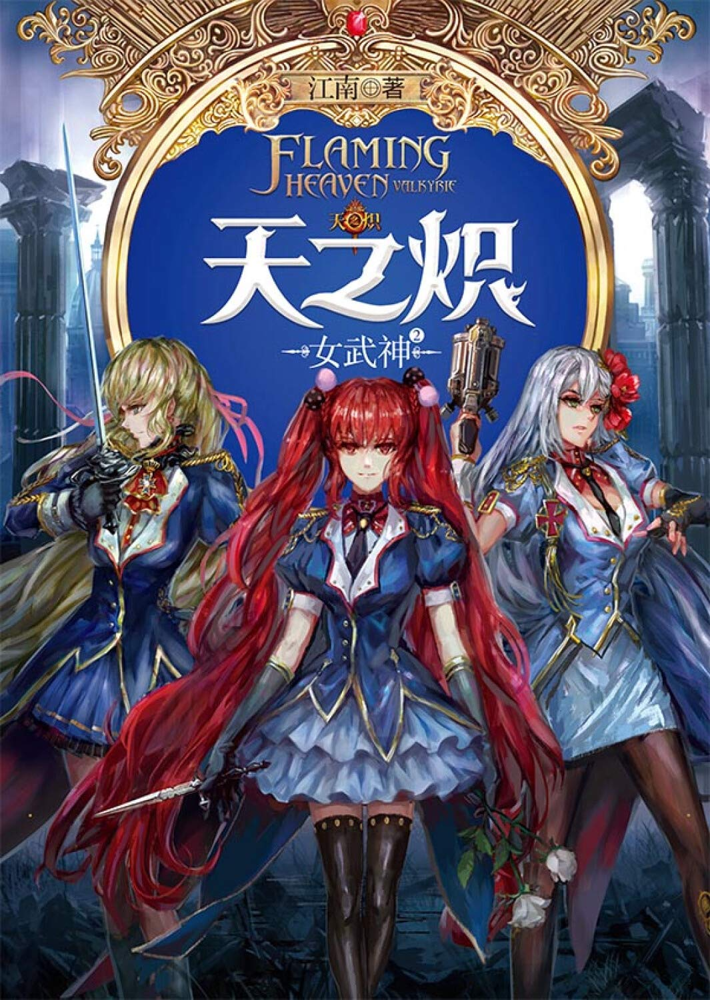

# 天之炽：女武神2

原罪机关秘密崛起，翡冷翠各势力暗潮涌动，这是一场关于普罗米修斯和炽天使的终极较量，神授骑士西泽尔能不能复兴炽天使的辉煌？“红龙”之名能否再次冲上云霄？

万国盛典，一触即发！

## 第一章 龙雀归来

自古以来，以阿尔卑斯山为界，地理学家把世界分成了东方和西方。

弥赛亚圣教兴起，机械文明绽放之后，西方便以教皇国为领袖，结成了坚固的联盟。

东方的霸主则是千年帝国“夏国”，夏皇君临天下，多数东方国家都是夏国的臣属国，通过对夏国纳贡，获得夏国的庇护。

在百年之前，夏国凭借超重骑兵和机械弩兵部队，完全压制了西方，西方诸国闻风而丧胆，只能扼守阿尔卑斯山天堑。但在机械文明兴盛的时代，东方落后了一步，在西方人的机动甲胄和战车部队的压制下节节后退。

这种局面直到某个人的出现才改观，那个人的名字是楚舜华，现任夏皇的哥哥，夏国的监国公爵。这个年仅25岁的年轻人以强绝的手腕震骇了夏国的权臣们，握住了东方的最高权力。

同时他还是卓越的军事家，在金伦加隧道的争夺战中——那是东西方有史以来最惨烈的会战之一——凭借古老的骑兵和弩兵战术，挡住了甲胄骑士们的轮番冲锋，最终炸毁了金伦加隧道，暂时地阻止了西方人通过铁路进攻东方的战略企图。

当然，那场胜利也是拜教皇国第一骑士、号称“骑士王”的龙德施泰特所赐，这位骑士领袖在关键时刻背叛了自己的国家，用神圣武器“圣枪装具·朗基努斯”攻击教皇的战车。

西方人敬畏地称他为“大夏龙雀”，龙雀是种传说中的鸟，凤凰的一种，凤凰中的最凶恶者。

星历1888年夏，世界的东方，夏国。

夕阳向着巍峨的王屋山坠落，平原之上大河奔流。

山路到这里就断绝了，骑兵们只能集体下马，牵着战马走完剩下的路。

夏国的战马是身高接近2.5米的异种战马“夔龙马”，配上沉重的铁甲，这种生物甚至能跟甲胄骑士略作对抗。在平原上它们的冲锋堪称“铁流”，走这样的山路却令它们痛苦不堪。

楚舜华的战马也是一匹夔龙马，名为“朱砂”。

朱砂走在最前面，它的臣民们也只有咬牙跟上。朱砂是马群中的王者，多数的夔龙马都是乌铁般的青黑色，但朱砂恰如其名，红如朱砂，奔行起来仿佛流火。

以朱砂的神骏，楚舜华从前线返回夏国的首都“洛邑”只需要不到十天的时间，可这十天的路程，楚舜华足足走了四个月，一路上经过很多属国和行省。

对于大夏龙雀的来访，属国君主和行省总督莫不战战兢兢。对于这位强权的公爵，东方人也持不同的观点，有人说他是天赐救星，也有人说楚舜华无父无君、功高震主、刚愎自用，早晚沦为乱臣贼子。

金伦加隧道的会战由楚舜华主导，调动了夏国的所有精锐，楚舜华若赢下这场仗，声威还会继续上升，若是失败，最好以身殉国。

决战前夜，夏国贵族中开了一场隐秘的赌局，赌楚舜华的生死，赌他死的人占了八成。

很多人都盼着龙雀的死。神话中说龙雀一旦起飞就再不降落，直到它死的那一天，巨大的身躯破云而落，坠落在苍茫大海上，激起滔天的狂潮。楚舜华十六岁开始掌权，已经翱翔了接近十年，也该坠落了。

可谁曾料想楚舜华赢了，拼着血肉之躯挡住了西方的钢铁部队。

所以楚舜华带着随身的百骑精锐经过各属国和行省时，君主和总督都做出了正确的决定，他们亲自带领仪仗队，以盛大的仪式欢迎这位归国的英雄。

楚舜华人还在千里之外，消息却通过电报不断地传回帝都洛阳，譬如某国君主盛赞楚舜华公爵真乃天将雄才，某位总督含泪拥抱公爵殿下，真乃皇朝的铁壁和长矛……国门为了楚舜华次第而开，万千百姓为英雄的到来而奔走相告。

帝都的贵族们原本还想降罪于楚舜华，说他穷兵黩武，打了一场没必要的战争，耗损了帝国的战力。可没等楚舜华还在路上，这场战争已经盖棺定论了，人人都说没有大夏龙雀，夏国已经亡了。

如此一来连楚舜华的政敌们也无法攻击他了。

楚舜华一路行来，路线很不确定，有时偏北，有时向南，谁也不知道他下一站会出现在那里，各地的行政长官都战战兢兢，生怕遭到公爵殿下的“突袭”。

此刻，这支骑兵队终于接近了帝都，穿越一片松林之后，再往前就是悬崖了，悬崖下就是河洛平原，洛阳坐落于此。

洛阳，这座城市曾被称作“中京”、“洛京”、“王京”等等，自古以来它就是东方的中心。直到前任夏皇，也就是楚舜华的父亲，把它改名为“洛阳”。

洛阳是个低调的名字，但那位皇帝偏偏喜欢低调的东西，他说有一天河会干、城会朽、人也会流散，无论它曾经有过多么显赫的名字。

作为皇帝，楚舜华的父亲并无巨大的成就，他平生所作所为，只有一件事震惊了整个东方，他跟星见相爱。

夏国也有自己的国教，这种宗教并无正式的名字，西方人通常称它为“巫教”。夏国皇室供奉巫女，巫女们观星、预言、守护夏国的国运。巫女的领袖被称为“星见”，星见的地位，从某种意义上说，甚至不逊于夏皇。

可一旦这个女人把自己献祭给命运，她就永远不能有情爱，必须终生保持处女之身。星见既是至高的，又是不详的，她是纯阴之女。

可夏皇爱上了星见，星见也爱上了夏皇，他们共同生下了楚舜华这个帝国长子。

这种惊世骇俗的行为引发了朝野动荡，在几乎所有大臣和皇室成员的弹劾下，皇帝选择了逊位。几个月后他病重而死，几乎是差不多的时候，星见也死在了太庙的井里。

根据巫教的规矩，犯错的巫女都会被投入枯井，在那里忏悔直到死去，永无开释的一天。

这对男女没有资格葬入皇室的墓地，所以他们葬在哪里始终是个谜。

此刻这个谜揭晓了，巨大的夕阳下是一片墓地，墓地里都是黑色的四方柱，大理石质地，仅仅是磨光和刻字，除此之外什么装饰都没有。墓地的中央，并立着两根最为高大的四方柱，上面雕刻着那位皇帝和他所爱星见的名字。

楚舜华点燃六支白檀香，吹灭之后，插了三支在父亲的墓碑前，三支在母亲的墓碑前。

他素来是西式军服，今天却穿了一身古服，白麻广袖，峨冠博带，宛若千年前的男子。

“父亲，母亲，这次儿子又是战胜归来。”他单膝跪下，“可惜太多人都没法跟我一起回来了。”

他的身后，骑兵们也单膝跪地。

他们中年纪最长的人追随楚舜华已经接近十年了，他们的很多朋友也埋葬在这里，很难想像的是楚舜华身居高位，直接效忠于他的人数以千计，可他竟然能记住每个人的名字。每当他失去一个人，他就在这里添加一根黑色的四方柱。

这里很难抵达，帝都中没有其他人知道这片墓地，而楚舜华自己只要略略仰头看向地平线上崔巍的王屋山，便能以目光遥祭他的父母和友人。

“我已经很疲倦了，”楚舜华又说，“但新时代，还很遥远啊。”

他极少流露出这样疲惫的神情，很多人甚至误以为他是不会疲惫的。

他擦尽了父母墓碑上的灰尘，转身来到另一根大理石方柱前。在这片墓地中，唯有这根方柱是用白色大理石磨制而成，上面一片空白，没有写名字。

楚舜华在这根方柱前也插下了三根线香，无风的天气，香烟笔直地上升，仿佛透过它能跟那远在天上的人说话。

下属们都猜测那根方柱代表某个女孩，某个能够配得上大夏龙雀的女孩，因为望向那根方柱的时候，楚舜华的目光总是很孤独。

这片墓地刚刚竣工的时候，就只有两根黑色方柱和一根白色方柱，那时候楚舜华刚刚踏上夏国的政治舞台。这么说来的话，龙雀在起飞之前，就已经失去了这一生中所有重要的人。

以楚舜华的身份，想他死的人固然不少，想跟他结亲的也不少。这些年不知多少人试图为他做媒，帝国名媛、四方公主的照片流水般送进公爵府，选美似的，楚舜华都以优雅的回信婉拒。

这次回国的路上，好几位公主亲自出面款待，席间或眉目传情，或奏乐奉酒。可她们脉脉含情的目光都如坠深渊，楚舜华喝酒、交谈、微笑，神凝气聚，巍然不动。

“真是迷惑人啊……”楚舜华轻声说着，弯下腰，把额头放在白色方柱的顶上。好像那晶莹而坚硬的女孩还坐在那里，双手抱膝，默默地看着他，跟他额头相抵。

骑兵们卸下马背上扛着的黑色方柱，把它们“种植”在墓园的周围，那是他们在金伦加会战中失去的友人。

楚舜华漫步在墓园中，手持一支短笛，吹着漫漫的长音。曲子并不哀伤，只是有些孤独。

晚霞铺天盖地地降下，在他的背影旁镀上了一层金边。

最后他来到朱砂的面前，解下它的面甲，轻轻地抚摸着这匹马王的额头。当年在战场上，一发子弹打穿了朱砂的脑颅，它幸运地活了下来，但额头上永远都带着一个可怕的弹洞。

朱砂这个名字让人想到温柔的女孩，可这匹战马凶猛得像是野兽，血红的眼睛叫人不寒而栗，唯有在楚舜华的面前它会流露出温顺的一面，不停地舔着主人的手。那是因为朱砂很喜欢吃糖，楚舜华经常都会捏着糖块喂它。

今天楚舜华的手心里没有糖，只有一柄锋利的小刀。

他用割开皮带，把朱砂身上的重甲一件件地卸了下来。最后是马鞍，马鞍下方藏着成排的银管，银管大约是手指粗细，每根银管都引出一根银线，每根银线都连着一枚银色的针头，针头深埋在朱砂的脊骨深处。

西方人一直对夔龙马很好奇，想知道夏国人是如何培育这种怪兽般的战马的，但繁育夔龙马的技术是夏国最高级别的军事机密，外人无从窥探。

其实秘密都在那些银管上，夔龙马那惊人的体力是靠马鞍中的兴奋剂提供的。兴奋剂令它们不知疲倦，一往直前，直到战死。

从某种意义上说，夔龙马也是战车，燃烧生命的战车。

“这些年辛苦你，”楚舜华拍拍朱砂的头，“是时候让你自由地奔跑了。”

可朱砂并没有离去的意思，它的习惯就是服从主人的命令。它仍旧舔着楚舜华的手，期待着那块并不存在的糖块。

楚舜华反手一刀，扎在朱砂的颈部，跟着横割。疼痛唤醒了这匹公马的凶性，它前蹄高高扬起，差点就要对着楚舜华踩下。但最后一刻，这匹畜生再度意识到那是它的主人，马蹄旁落，它缓缓地退后，瞪视着楚舜华，红色的马眼中透着迷茫和惊恐。

它不明白自己为何受伤害，它今天一直很驯服，它本该得到一块糖。

这时骑兵们已经卸下了其他夔龙马身上的铠甲，它们本能地聚集在朱砂背后。朱砂是它们的王。

楚舜华伸出手，立刻有人将一支连射铳递到他手上，这是金伦加会战中的战利品。连射铳吼叫起来，密集的子弹打在朱砂身前，泥土溅到两米多高。牲畜天生就害怕火焰和噪音，朱砂惊得跳起，狂奔着去向山坡的另一头。

连射铳始终压着马群射击，朱砂几次停步，却一次又一次地被驱逐。等到楚舜华打空了子弹，马群已经越过一条深沟，站在了另一片山坡上。战马和它们的主人隔着深沟对视，巨大的夕阳缓缓坠落。

冒烟的枪口仍旧指着朱砂，楚舜华的脸上全无表情。朱砂的眼睛里，迷茫被愤怒取代了，野性被激发出来，它大力地踩踏着地面，向楚舜华示威。然后它发出一声嘹亮的长嘶，带领它的族群掉头离去，晚霞之下它们的背脊仿佛起伏的群山。

“去远方吧，去人类无法捕获你的远方。”楚舜华扔下连射铳，“人类……都是些坏东西。”

“殿下，这是我们最后剩下的夔龙马了，赶走了它们，要建立新的马群可不容易。”骑兵队长说，“没有了夔龙马，我们拿什么跟西方人的铁傀儡抗衡。”

“你们全新的战马和刀剑已经在那座城市里准备好了，”楚舜华指向悬崖之下的帝都，“现在全速行军，太阳落山之前，我要入宫面君。”

风忽如其来，吹动他素白的长袍。

王屋之巅，白衣临世！

洛阳城中，通天宫，夕阳洒落在明堂的屋顶上。

夏国皇室历史悠久，在各个方面都遵循古制。皇宫名为通天宫，意思是皇权天授，权力通天；天子议事的地方叫作明堂，意思是兼听则明。

可随着时代的变化，明堂也做了改造，安装了电灯和蒸汽取暖的设备，这时候明堂里已经灯火通明。

年轻的夏皇端坐在金色的纱幕垂后，身穿红黑两色长袍的太监们围绕着他，拖着长长的袍摆，仿佛扭动尾巴的蛇。

“朕很忧虑。”夏皇缓缓地说。

紫檀镶金的宝座上坐着三个人，两个妙龄少女贴在夏皇身上，衣裙轻薄，露出来的腰腿光滑如玉，脚腕上的金铃叮当作响。

这些女孩子都是太监为夏皇选的，远比妃子们让他满意。大臣们已经数次警告太监们，不许在女色上放纵皇帝，但太监们总说夏皇年纪尚小，男欢女爱天经地义，还可以减轻政务繁忙带来的压力。

可今天这些女孩们显然不能令皇帝放松，夏皇靠在一个女孩身上，把玩着另一个女孩白嫩的双脚，但眉头紧锁。

夏皇楚昭华，12岁就继承皇位，今年他才22岁，就已经当了十年的皇帝。他继承了父母的容貌，面如冠玉，凤目生威，是书上说的“明君之相”。他也聪明过人，过目不忘，方方面面都有当个好皇帝的潜质。

“河清海晏，四海升平，不知陛下的忧虑从何而来？”太监首领小心翼翼地问。

“你说朕忧虑什么？”夏皇忽然抓起手边的水晶镇纸砸向他。

太监首领敏捷地闪过——这种事情夏皇不是第一次干了——镇纸砸中了后面的金丝珐琅八音盒，八音盒原本演奏着舒缓的舞曲，这下子机轴弯曲，只能奏出咔咔的噪音了。

“养兵千日，用在一时！要用到你们的时候，都往后躲了是吧？”夏皇怒吼，“问朕忧从何来？有那个人在一天，朕的皇位就一天不稳！朕不忧虑，朕不是傻子了么？”

太监们匍匐在夏皇的脚下，悄悄地相互递着眼神。

“令陛下忧心的事，就是臣等没办好的事！令陛下忧心的人，就是臣等的敌人！”最后还太监首领大着胆子说，“只是以那个人的威望，臣等虽有忠心，却仿佛蚍蜉之撼大树，无能为力啊！”

“威望？威望？他是臣子，朕是皇帝！他凭什么在朕面前摆威望？”夏皇咬牙切齿。

“他的威望都是陛下赐给的，本该随时都能收回来。可恨他掌握军队太久，手下名将太多，竟成尾大不掉之局！”一名太监做捶胸痛恨状。

“不光如此，他还染指国库！这些年他穷兵黩武，军费已经让国库不堪重负，可他又花费重金招募西方工匠，昼夜研究西人的机械技术。我看他是有不臣之心！”

“最可恨的是有些无知之徒还猛拍那人的马屁，说若不是那人在，我夏国的国门早已被攻破不说，陛下当年根本就坐不上皇位！”

太监们纷纷进言，都表现得义愤填膺，却始终没有一人敢提及“那人”的名字。而夏皇的眼神渐渐阴狠，右手原本还慢悠悠地抚摸着女孩的细腰，到最后竟然掐出一大片青紫来。

“看他在陛下面前飞扬跋扈，臣等恨啊！臣等忍得很苦啊！”太监领袖在皇帝面前连连叩首。

皇帝长叹一声，“世上又有谁比朕忍他忍得苦？他是朕的哥哥，统领着朕的军队，是西方人眼里的‘大夏龙雀’。西方人不怕朕，只怕大夏龙雀！你们可知道什么是龙雀？龙雀，乃是凤凰中最凶恶的一种，孤飞唳天，翼载长云！又有人说他是帝国长子，说他本该是帝国皇帝！还有人说，星见在他身上注入了幽暗之力，谁与他为敌，谁就要死……荒谬！荒谬！荒谬！”说到这里他再难遏制怒火，猛地起身，死死地攥着腰间的剑柄。

太监领袖近前一步，压低了声音，“陛下不必烦恼，大臣们都怕楚舜华，可陛下还有我们呢！臣等愿意为陛下分忧！”

皇帝吃惊地看向这个阉人，见那双总是善笑善媚的眼睛里竟透出一股锋芒来，就像一只想要捕猎狮子的狐狸。

“你？你一个在宫里伺候的下人，你凭什么为朕分忧？”皇帝冷笑。

“臣等虽然读书不多，身份低微，但臣等有忠心！”太监领袖目光灼灼，“请陛下看臣等的忠心可不可用！”

皇帝沉默了几秒钟，缓缓地坐回皇座上，挥手令两个少女离远点儿，“说来听听吧。”

太监干预朝政，本是夏国皇室的忌讳，现任夏皇并不昏庸，本不该纵容这种事，但他想要跟哥哥抗衡，手中就得有人。

太监也算是一支力量，相比那些正正经经的大臣，太监们确实“忠心”。他们也许贪污受贿，但他们绝对不希望皇权旁落，因为他们只能靠着皇帝往上爬。

太监们对了对眼神，这一刻终于到来了，他们谋划已久的事，可以讲出来了！

“陛下若想削弱楚舜华的权力，可以缓缓图之。”太监领袖凑近皇帝耳边，声音低如蚊呐，“楚舜华掌握军权已近十年，高级军官多半都是他的嫡系，所以楚舜华的地位稳如泰山。陛下宜先剪除他的羽翼！”

“愚蠢！哥哥何等精明，朕若是剪除他的羽翼，他怎么会放任不管？”

“剪除羽翼可未必是处罚啊！”太监领袖阴笑，“陛下可以借他们凯旋归来的机会，给他们加官进爵。高层军官再往上升，就不能留在帝都了，按照军规应该轮流去各个行省驻守……至于空出来的位置，就让那些忠心于陛下的人顶上吧。”

他从袖中摸出一份名单，秘密地递给皇帝，“这些都是军中忠于陛下的人，经常在臣等面前表达对楚舜华倒行逆施的愤恨，请陛下考察他们的资质，看是否可用。”

这就是太监们的真实用意。名单上的人都送过巨额的贿赂，希望在军中升职，但军队是楚舜华的地盘，唯有把楚舜华的嫡系都弄走，才有位置空出来。

“楚舜华不是龙雀么？有翅膀的才叫龙雀，没翅膀的那是走地鸡！”太监领袖仍沉浸在高谈阔论之中，却没有注意到夏皇的脸色已经变了。

“你好大的胆子！军队是我夏国的长城，你这是想撺掇我效仿昏君自毁长城么？”夏皇忽然拔出腰间的佩剑，抵在太监领袖的喉间，“你，不怕死么？”

太监们惊恐地匍匐下去，这个年轻自负的皇帝分明很好哄才对，他忌惮自己的哥哥也是大家都心知肚明的事，怎么会是这样的反应？难道算错了什么么？

思考了几秒钟之后，太监领袖做了个冒险的决定，他迎着剑锋扑了上去，狗一样趴在夏皇的膝盖上“陛下天纵英才！臣怎么敢教唆陛下？要说长城！帝国的长城是陛下才对！哪里轮得着楚舜华那个乱臣贼子！”

他这是豁出去了。他跟随夏皇时间很长，知道这个年轻人喜怒无常，经常会故作怒容来逼你说出心里的话，他赌夏皇刚才的话并非真心，而是要试探他的忠心。

“军队是忠于国家还是忠于陛下？军队是捍卫国家还是捍卫陛下？当然是先陛下而后国家！有陛下才有国家！可楚舜华手中的军队，虽然守得住国门，却不一定会守护陛下的皇座啊！”太监领袖就差声泪俱下了，“再有十天半个月，楚舜华就该还朝了。这是难得的良机，陛下错过这个良机，再想剪除他的羽翼就难了！”

“良机？”皇帝长眉一挑。

“这是楚舜华最虚弱的时候！他以前飞扬跋扈，那是有军队撑腰，但这次他损兵折将，所以才不敢立刻回国，而是沿途巡视各属国和行省。那些君主和总督为他歌功颂德，像迎接凯旋归来的英雄那样迎接他。如此一来他人未归来，舆论已经形成。但这恰恰暴露了他内心的虚弱！陛下不但不斥责他穷兵黩武，反而封赏他和他的手下，他还有什么可说？”

太监领袖再度呈上那份名单，“陛下！千载难逢的良机啊！把国家的军队……变成陛下的军队！”

皇帝凝视着太监领袖的眼睛，良久没有出声，然后懒懒地伸手，接过名单，随便扫了几眼，折叠之后收入口袋。

太监们相互使着眼色，脸上都透着欣喜，这次他们赌对了！有人说伴君如伴虎，这话果然不错，但在皇帝面前若能连续赌对几次，那也绝对是平步青云。

明堂里静悄悄的，皇帝抚摸着身边少女的腰肢，若有所思，这种情况下自然没人敢打搅。

表面上看起来皇帝仍旧是懒懒的，可心中却掀起了滔天大浪。

这些天他格外沉溺女色，就是因为他那天纵英武的哥哥要回来了。该怎么封赏哥哥呢？他想不出来。再高的封赏都是哥哥应得的，再进一步他就只有把屁股下这张皇座、背后这座通天宫和身边这些千娇百媚的女孩子们“禅让”给楚舜华了。

就是这样大家也不会太惊讶，很多人都会说帝国长子终于拿回了本该属于他的位置。

楚昭华是幸运的，但也是不幸的，任何人坐在这张皇座上，能得楚舜华这种天才辅佐，都是幸事，可最不幸的莫过于这个天才是你的哥哥！他也有继承这个国家的权力！

今天太监们为他解开了心结，左思右想这委实是一条妙计。

皇帝在心中推演着那一幕，楚舜华跪在明堂中央，他居高临下，委婉地斥责哥哥的过失，又怎么温言鼓励他，让他虽然不安，却又不会生出叛逆之心，再然后是大规模的封赏，让归国的将士们都为皇帝的恩典而欣喜，他们山呼万岁……

想着想着，连皇帝自己都没有意识到，一缕微笑出现在唇角……

这时地面忽然有节奏地震动起来，明堂也跟着摇晃，屋顶的琉璃吊灯颤颤巍巍。

“怎么回事？怎么回事？”皇帝猛地起身，神色紧张。

“怕是地震！快搀扶陛下去开阔处躲避！”太监领袖惊恐地大喊，“这明堂没准要塌！”

“混账！国之象征！怎么会塌？”皇帝一边怒吼，一边顺从了内臣的建议，由女孩们搀扶着起身，准备离开。

“报————”守候在明堂外的太监狂奔进来，神色惊惶如丧父兄。

“混账！”皇帝再度怒吼，“这是什么地方？容你这样放肆奔跑，奔丧么？世间名将，泰山崩于前而色不变、麋鹿兴于左而目不瞬！你们这些丧胆的小人，怎么能随朕建立伟业？说！”

太监整个身体趴伏在地，抖得像是筛糠，“公爵……公爵还朝！”

皇帝忽然听不见任何声音了，满耳都是那轰雷般的四个字，公爵还朝！公爵还朝！公爵还朝！

夏国的公爵远不止一位，但若是只说公爵而不言其名，那就只有那个人。

那个人这就回来了？怎么可能呢？分明下过命令，要求沿途的国家和行省随时通报他的行踪，最后一次接到情报是三天前，他还在差不多六百公里之外！难道他在三天里急行军了六百公里？

夏皇忽然明白了，他犯了错误，他以为自己能预判哥哥的作法，可哥哥从来就是个无法预判的人，时至今日都没有人能对他下结论，他到底是狡黠还是凶猛，到底是忠臣孝子还是逆臣贼子，到底是朋友还是敌人？

他高悬在天，仿佛天意，而天意不可测。

太监们在哆嗦，夏皇想怒斥这帮无胆之人，就得先止住自己的哆嗦，可他止不住。

第二名报信太监冲进了明堂，喘得上气不接下气，“公爵已过天华门……陛下！陛下快去迎接！”

一名在皇帝身边服侍的太监大步上前，狠狠地一掌打在报信太监的脸上，“说什么混账的话？楚舜华再怎么说也是臣子，臣子面君，反倒要陛下出迎？今天陛下就坐在明堂里，等他叩见！”

“对！陛下切不可出去迎接，那是屈尊降贵！听这动静他莫非带兵进宫？”又一名太监说，“陛下快下令让金吾卫包围明堂！”

太监领袖冷着脸上前，两脚踢开这两名内臣，“愚蠢！大军远征归来，陛下理应出迎！这通天宫是陛下的家，陛下在自家迎客有什么大不了的？这时候不敢出去见他，反倒显得陛下怕了他！况且……你们觉得明堂这样子能接见楚舜华么？”

太监们扭头四顾，恍然大悟。

皇室有着很森严的制度，后宫女性除皇后外不得踏入明堂、奇技淫巧之物不得进入明堂……但楚舜华出征之后，皇帝按着自己的性子，把什么东西都弄进来了，甚至允许那两个少女跟他同坐皇座……眼下这些都得搬走，立刻搬走！

皇帝在太监们的服侍下整衣，女孩们跌跌撞撞地往后门跑，其中一个没跑几步就崴了脚，痛得坐在地上起不来——西风东渐，后宫也流行起高跟鞋，可还没有熟练掌握。

“找人把她扛走！”太监领袖大吼。

“公爵已过神武门！”这是第三次通报。

夏皇深呼吸几次，在太监们的簇拥下大步走出明堂，他昂首挺胸走在前面，竭力表现出一位明君欢迎凯旋英雄的热情。太监们跟在后面，仿佛尾行的群蛇。

他们刚刚冲下台阶就呆住了，步步后退……他们想要尖叫，却无法呼吸。

夕阳将尽，残光铺满了明堂前的广场，朱砂色的宫门前弥漫着云一般的白汽，白汽中走出铁墙般的黑影，他们的步履那么沉重，形象那么狰狞，简直是古老画卷中走出来的恶鬼。他们的脸是银色的鬼面，全身笼罩着黑色的金属甲胄，行走时发出机械运转的微声，背后白汽弥漫。

居中的甲士们扛着朱红色的肩辇，身穿白色古服的年轻人端坐在云雾之上，他的眼帘低垂，神光内敛，但他的威仪覆盖了整个广场，直逼到明堂之前！

“哥哥……”皇帝的声音仿佛呻吟。

夏皇楚昭华终于从那场漫长的梦中醒来了，在那场梦里他是天下之主，端坐在东方之巅，任何不服从他的人都要在他的君威下灰飞烟灭；在那场梦里……他是没有哥哥的。

夕阳沉没，黑暗铺天盖地地降临，又仿佛是那传说中的凤中之皇振动遮天的巨翼，掠过这座帝王之都，把一切的光都隔绝。

肩辇停在了广场中央，那架肩辇还是夏皇赐予哥哥的。这是皇帝赐予臣子的最高礼遇，赐他“入朝乘辇，面君不拜”。

楚舜华接受了这件赐物，可还是步行入宫，跟所有人一样下跪，高呼万岁。这一度让楚昭华觉得哥哥在心里还是有些敬畏自己的。

但眼前的一切证明他错了，楚舜华一时不用那架肩辇，不代表他永远不会用……封在鞘中的剑，随时都能拔出来杀人。

第一名甲士在肩辇旁站定，第二名甲士跟着半跪在旁，楚舜华以他们的肩甲为台阶，拾级而下。他正衣冠，解佩剑，遥望着夏皇，目若朗星。

“铁傀儡！铁傀儡！他怎么会有铁傀儡？”太监们在心中嘶吼。

在夏国，楚舜华是最先锋的技术派，力主招募西方技师发展机械技术，弄得国库也吃不消。多数大臣都不能赞同，西方人开启机械时代已经有上百年，绝非轻易就能迎头赶上的。

夏国人也渴望拥有机动甲胄，但可以预见的未来是，即使投入重金，至少也要经过二十年，夏国才能制造出初代的机动甲胄。

要知道在政敌的环绕之下，楚舜华自己都未必能活过二十年，他都未必能见到那梦寐以求的初代甲胄。

但今天，这铁墙般的军团真的站在了他们面前，身高接近三米，腰间的弧形长刃就有两米长，这一刀扫下去，要砍落多少头颅？甲胄骑士们缓缓地扫视，目光所到之处，压得人膝盖都软了。

可笑太监们原本还以为这是楚舜华最虚弱的时候，因为他损失了风林火山四大军团……其实在那四大军团开赴战场的同时，这支全新的钢铁军团已经开始打造了吧？

“陛下，别来无恙。”楚舜华开口了，惊破了广场上的死寂。

“哥哥……哥哥……朕很是……想念哥哥。”楚昭华的声音在颤抖。

他本该奔上前去，和哥哥把臂相望，可这一步却怎么都踏不出去，在那黑色的钢铁森林中，楚舜华的白衣轻振，冷得就像正在降临的黑夜。

楚舜华缓步上前，来到皇帝面前，微微躬身，“这次出征，战死者四万七千，伤者两万一千。西方人已退，国门可以再保五年。五年中，陛下可以高枕无忧了。”

楚昭华勉强挤出笑容，“哥哥军威，天下无双！有哥哥保着夏国，我时时刻刻都能高枕无忧！眼见着……眼见着哥哥又建起了铁甲强兵，西方列强又怎敢染指我大夏？”

“机动甲胄‘鬼武者’初型，陛下现在看到的，就是我国的第一批骑士。从今往后，这天下将是骑士的战场！”楚舜华轻声说，“天佑我大夏，万世荣光！”

“天佑大夏！万世荣光！天佑大夏！万世荣光！”鬼武者们振臂高呼。他们的声音坚硬如铁，仿佛一场剑刃风暴正在广场上形成。

“天佑大夏！万世荣光！天佑大夏！万世荣光！”太监们和金吾卫们也跟着高呼。这种时候谁不加入便有叛国之嫌。

唯有楚氏兄弟并未加入这场高呼，楚舜华轻轻地拍了拍弟弟的肩膀，他的手很轻，可每拍一下就仿佛有万仞之山压在皇帝的肩上。

楚昭华稍微放下心来，看来哥哥带机动甲胄进宫不是为了逼宫，只是为了展示实力。暂时地他还能安坐在那张皇座上，不过从今往后，他再想动摇哥哥的地位就更难了，因为哥哥拥有了甲胄骑士！

虽然早就听说过机动甲胄的强大，可楚昭华一直很难想像这种东西，这世上难道真的存在那种人可以穿着它像骑兵那样高速战斗的机械？如今这种神奇的机械就站在他面前，如此地鲜活，如此地恐怖，简直是地狱和魔鬼的造物，是用来反攻天国的武装！

他害怕了，从心底深处害怕了，看向哥哥的眼神，也从看一个强大的乱臣贼子变成了看一个白衣飘飘的魔鬼！

“很少看见哥哥穿古衣，哥哥穿古衣，真是丰神俊朗呢！”兄弟俩携手同行，楚昭华尽量说些兄弟间的话，显得更加亲密。

“面君之前，我去祭了父母。”楚舜华淡淡地说。

“哥哥不仅是国之栋梁，还那么孝顺，弟弟真是望尘莫及。”楚昭华满嘴言不由衷的话，完全没顾得上想哥哥是去哪里祭的父母。父亲的墓在那里，他从来都不知道。

“没关系，只是拔拔草，擦擦墓碑的事，我去就好了。”楚舜华似乎带着一丝笑意，又像是根本没在笑。

太监们隔着几步跟在后面，相互对着眼神。计划彻底失败了，这种情况下想要剪除楚舜华的羽翼根本不可能，也就不会有位置空出来给那些行贿的人，能想到的善后方式就是把钱给人家退回去，想到这一点，太监领袖看向楚舜华背影的目光就越发地阴狠。

在明堂的台阶前，楚舜华忽然停下脚步，“我想陛下身边的人，应该换一换了。”

楚昭华脸色一变，“哥哥觉得我身边的人有问题？”

“太监终究是小人，同一批人用得太久，怕出奸佞。”楚舜华淡淡地说。

他扭头回望一眼，不是看向鬼武者，却是看向了金吾卫。鬼武者是军人，军人不合适在通天宫中动手。金吾卫首领犹豫了几秒钟，带着人疾步上前，将木然的太监们拖了下去。

太监们没有反抗，因为毫无意义。此时此刻，楚舜华投射在他们身上的影子便如漆黑的天幕。

楚昭华紧紧地抿着嘴唇。平日里就是这些太监围绕着他温暖着他，赞美他英明神武，也是这些人天南海北地找来合他胃口的少女，教会她们献媚的技巧再引荐给他，严冬腊月他觉得脚冷的时候，这些人甚至会毫不犹豫地解开衣襟把他的脚抱进怀里……

可能的话他不介意一辈子都跟这些太监混，可告别之期忽然就来了，从此以后这通天宫对他来说会变得更寒冷，更孤独。

“哥哥说得对！唯女子与小人者难养也！久用这帮人必出奸佞！这些人跟朕的时间太久，掌握了不少国家机密，朕这就下令处死他们！好让哥哥放心！”楚昭华忽然抬起头，眼神炯炯地看着哥哥，流露出孩子气的、欢欣鼓舞的神色。

他确实是聪明，一下子就想明白了这是怎么一回事，这群太监四处结党想要对付楚舜华，可楚舜华虽然远征，在帝都怎么会不留耳目呢？

这也是对他这个皇帝的警告。

既然再也用不得这帮人了，不如让他们用命为自己最后尽一次忠好了！楚昭华是这么想的，做大事不拘小节，若是杀了这几个太监能够换回哥哥的一点信任，那就是值得的！

楚舜华看了他一眼，摇了摇头，拉着他的手踏上台阶，“陛下，杀人是我的职责。为了这个国家，该杀的人和不该杀的人，我都帮你杀了。请不要轻言杀戮，你的手应该是干净的。双手血腥的人，永远不可能成为贤明的君主……”

台阶漫长，楚舜华的声音幽远而缥缈，明堂中灯火通明，鬼武者们的眼里，兄弟二人就像是登楼玩耍的孩子。

而那座汇聚着半个世界的权力的宫殿里，崴了脚的女孩子正掩着酥胸粉腿，跌跌撞撞地奔向后门，目睹太监们的下场，她是拼死也要离开那位公爵的视线的。

可楚舜华的眼里根本没有她，楚舜华的眼中只有明堂里的灯，灿烂如星海。

## 第二章 机械女皇的契约

世界的西方，教皇国，翡冷翠。

深夜，窗外秋雨不绝，教皇宫中，木炭在壁炉中毕毕剥剥地燃烧着。教皇隆·博尔吉亚端坐在桌前，高速地批阅着文件，镜片上偶尔闪过寒光。

书架的角落里，一扇暗门悄无声息地打开了，教皇厅厅长史宾赛走了进来，把一页纸放在了桌上。

那是一张速写，鬼武者的速写。鬼武者半跪在地，白衣飘飘的男人踏着它的肩膀走下肩辇。这根本就是千里之外，通天宫中，楚舜华觐见夏皇的那一幕的重现，鬼武者的细节和楚舜华的气宇都跃然纸上。

那是教皇国安插在通天宫的间谍画的，再辗转送来翡冷翠。照相机已经不是新玩意儿了，但毕竟体积不小，间谍没法随身携带，因此间谍往往都是不错的画家。

教皇拿起那张纸看了很久，“这就是东方式的甲胄么？”

“代号‘鬼武者’，性能不明。据可靠情报，光是楚舜华带进通天宫的鬼武者就有一百具之多，已经形成了初步的战斗力。”

“楚舜华是故意要让我们知道，他已经拥有了机动甲胄吧？”

“大夏龙雀是聪明人，懂得如何利用自己的影响力。他这样表演一番，世界各国都知道了，东方人也有了自己的机动甲胄。”

“你是懂技术的人，你怎么看？”

“不可思议的杰作，作为初代甲胄，设计非常合理。从形体上看，应该是那种速度极快、敏捷性极高的超机动甲胄。炽天骑士团现在的标准配置是第四代‘炽天铁骑’，火力动力强劲，但灵活性上很可能逊于鬼武者。”

“炽天使呢？”

“炽天使依然是究极武装，鬼武者无法跟那种东西相比。”

“真不可思议，东方人的初代甲胄就能跟我们的第四代炽天铁骑抗衡么？”

“楚舜华就是这样不可思议的人。此时此刻，枢机卿们正在开会讨论这件事。这注定是个不宁静的夜晚。”

“枢机会的老家伙们，他们想攻略东方的信心都源于机动甲胄，现在楚舜华得到了机动甲胄，他们就像是被夺走了玩具宝剑的孩子，立刻不安起来。”教皇说。

“这种情况之下他们必然会下令加速新一代机动武器的研究，力图在技术上压倒东方人。”史宾赛厅长说。

“新一代的机动武器？就那两种吧？”

“是的，一种是原罪机关正在开发的第三代普罗米修斯，一种密涅瓦机关正在开发的新型炽天使。”

“两边的进度怎么样？”

“原罪机关那边，听说进度很顺利，只是缺乏足够强大的试驾骑士，他们最强的骑士在马斯顿被西泽尔砍掉了脑袋。密涅瓦机关那边，同样缺乏试驾骑士，不过如果西泽尔恢复状态，速度会提起来。”

“明白了，西泽尔在做什么？”

“他刚刚召回了三名部下。”

“部下？”教皇微微皱眉。

“三名见习骑士，都曾担任他的助手，是当年他自己从训练营中选拔的。分别是阿方索，优秀的机械师和支援型骑士，同时还是个数学家；昆提良，优秀的冲锋型骑士；唐璜，优秀的刺客型骑士，也是个不错的间谍。他选这个三个人组成最初的团队，是很明智的，尤其是那个阿方索，是不可多得的人才。我会给他提供一些力所能及的帮助，但如圣座你希望的那样，不会太明显。”

“这种消息以后不必特别通报了，以西泽尔所受的培养，组织合适的团队是理所当然的。如果连这些都做不到，那他还有什么价值？”

“作为父亲不宜太过严苛吧？虽说他从小就接受最顶级的培养，但毕竟在马斯顿荒废了那么久，给他点时间，潜力自然会爆发出来。”

“真正的狮子，你把它放进荒原，它自然会杀出一条血路成王。如果因为搁置了一段时间就没精神了，那他仍然是个废物。我等着他踏着血路杀到我面前，要求我为他加冕，但他最好不要让我等太久。”

“明白了，博尔吉亚家的雄狮们只能在世界的巅峰会面，如果西泽尔不能凭自己的力量到达那里，那他就只有被放弃，”史宾赛厅长点了点头。

“通知佛朗哥那条老狗，还得再快点。他如果败给原罪机关，枢机会一定会设法推动一项议案，由原罪机关吞并密涅瓦机关。”教皇又看了一眼那张素描，看的却不是鬼武者，而是那个踏在鬼武者肩上的、白衣飘飘的东方男人。

“大夏龙雀楚舜华，”史宾赛厅长轻轻地叹了口气，“有人说那是您宿命中的敌人，西方有了铁之教皇，所以东方有了大夏龙雀。”

“不，他不是我的敌人……他是我儿子的敌人……”教皇将素描投入壁炉中，看着它化为灰烬。

也许是燃烧的灰呛进了喉咙，他忽然剧烈地咳嗽起来，那“空空”的声音在办公室里回荡，像是要把肺都给咳出来似的。他从口袋里抽出手帕捂住嘴，猩红色的丝沿着手帕的纤维慢慢延伸。

他扶着壁炉的上沿，用颤抖的手从怀里摸出一个小铁盒里，从中取出一枚绿色的药片吞进嘴里，然后猛灌了一大杯水下去。

这样过了好一会儿他才恢复平静，重又在办公桌边坐下，高速地批阅起文件里。整个过程里史宾赛厅长就在旁边站着，默默地看着这个男人，连伸手帮忙的意思都没有。

天边微微泛出了光亮，都灵圣教院，副校长办公室，白衣修女在茶壶中注入了琥珀色的红茶，然后退了下去，只留下迪亚哥副校长和四个来面试的年轻人。

都灵圣教院，是由弥赛亚圣教设立的高等学府，历史只有一百年左右。在机械时代开始之前，西方已经有诸多所君主设立的大学，跟夏国的“太学”差不多。它们中资格最老的竟然有五百年以上的历史，都灵圣教院在名牌大学中绝对是后来者。

但它才是世界学府的巅峰，无论学术还是地位。教皇国的半数高官都出自这所大学，有人开玩笑说教皇国的部长级会议简直就是“都灵圣教院校友会”。

对于寒门出身的孩子来说，拿到了都灵圣教院的学籍，就是拿到了上流社会的入场券。

寒门中要是出了一个都灵圣教院的学生，父母亲戚都会欢天喜地奔走相告，孩子有了出人头地的机会，就意味着整个家族都会受益。

即使对于名门贵族的孩子来说，都灵圣教院的学籍也是相当珍贵的，在这里他们能结交真正的社会精英，在未来的权力场上相互扶持。

迪亚哥是都灵圣教院中最年轻的副校长，身材依旧挺拔，银色头发和银色的水晶眼镜给他增添了一股浓郁的学者气息。

以他的身份，已经很少出来亲自面试学生了，但今天这次面试非得他亲自主持不可，因为面试者的身份太特殊了。

他翻着申请资料，偶尔抬头看一眼桌子对面的四个年轻人，单看外表的话，为首的男孩给他留下了不错的印象，黑色礼服，白衬衫，给人一种很干净的感觉。只是那对紫色瞳孔有点刺眼。

第二个大男孩也颇合这间学院的气质，白色的直发、不卑不亢，看上去像个年轻的修士。

但从第三个开始就出问题了，这位名叫唐璜的申请者脚蹬花花公子款的尖头皮鞋，身穿花花公子款的紧身小礼服，系着花花公子款的蕾丝领巾，连那头散漫的金发都是花花公子风格。

他以一个花枝招展的姿势靠在迪亚哥的沙发上，翘着二郎腿，顾盼生姿。考虑到这间学院里聚集着翡冷翠各大名门的小姐，把这种人放进学院，简直是把美艳的大灰狼放入羊圈。

至于最后那个身材彪悍得像是猎豹、智商却低得跟豪猪差不多的南部小子，迪亚哥都懒得说他了，从进门到现在，南部小子一直在吃茶几上的炸杏仁，好像炸杏仁在他们那里是很难得的高级食物。

他的生活得穷到什么地步啊？

不过从履历来看的话，倒是南部小子最没问题，曾是见习骑士，在炽天骑士团第一训练营呆过，训练营对他的评价不错，后来调去军部实习过一段时间……

这样的履历距离都灵圣教院那挑剔的标准还有十万八千里，但至少是个正常人。花花公子倒也还行，训练营的教官说他很不老实，“连教官都敢欺骗”，不过鉴于他主攻间谍科目，能把教官都骗了也算本事。

那个修士般的年轻人，军部对他的评价如下，“任何接收此人的单位都应当知晓其危险性，其人具备的机械和火药知识足够他组装出如下几类极度危险的武器：高性能红水银爆弹、‘独角兽’式远程狙击用来福枪、‘龙吼’式长程火炮、任何一种军用三联或五联装火铳……另此人不但具备装配如上武器之能力，亦具备熟练使用如上武器之能力，且具备一定程度的侦查和反侦察能力，决断力在同届见习骑士中居于前列。尽管目前并未觉察到他有这类动向，但如果他成为恐怖分子，潜力应当极其惊人……”

至于迪亚哥看着最顺眼的那个男孩……他的档案夹在一个黑色的档案袋里，上面烫印着黑天使的徽记……异端审判局用这种方式表达了他们对这个男孩的关注。

迪亚哥在心中长叹一声，放下申请资料，“坦白地说，你们都不适合这所学院。”

昆提良含着满嘴杏仁愣住了，瞪着眼睛说，“您还没有面试我们？怎么知道我们不适合？”

他们来这里面试是教皇厅的安排，史宾赛厅长说这间学院的学籍会对西泽尔有帮助，一个未来的上位者应该来都灵圣教院进修。

至于昆提良他们，“你们需要见识一下上流社会”，这是史宾赛厅长的原话。

昆提良没什么说的，西泽尔叫他干什么他就干什么，早起刷牙洗脸就来了。他没怎么上过学，在骑士训练营受过点基本教育，因为学院也跟训练营那样，会有一群人在沙土地上跑圈，教官在后面嘶吼。

可结果他看到了教堂般恢弘的建筑群和膝上跳跃的校服裙，无论男女，这里的学生都像珠宝玉石那样精美，他们抱着厚重的课本，在爬满常春藤的高墙下聊天，女孩的发梢在风中荡漾，男孩的领巾也在风中荡漾。

昆提良惊喜地问唐璜是不是进了都灵圣教院就可以像这样公然在大庭广众之下谈恋爱了？唐璜斜瞥他一眼说人家那是在讨论学术问题！当然你也可以边讨论学术问题边泡妞，这全看个人修为！

昆提良连连点头说那唐璜你可要教我！正当他非常期待就读这间学院并在大庭广众下谈恋爱的时候，迪亚哥校长明显地流露出拒绝之意，昆提良不由得傻了，他本想自己是走教皇厅的后门进来的，还能有什么问题？

其他三个人倒是保持了淡定，尤其西泽尔和阿方索，连眼睛都没眨一眨。

“可是给你写推荐信的人太强了，我不得不重新考虑，”迪亚哥苦笑着摇头，看向西泽尔，“我听人说你在这里上过学？”

“十五岁那年入学的，读了不到一年就转走了。”西泽尔说，“这是我第二次申请入学。”

“我还听说很多学生都不喜欢你。“

“我以前对人不太礼貌，这点我会改的。”

“不，你很礼貌，但是危险，你的老师说你‘就像一头野兽行走在森林中，还揣着手雷’。恕我直言，我知道你父亲是谁，但那张牌在都灵圣教院并不好用。”

“我知道，何况我还是个私生子。以前的毛病我都会改的，请给我一次机会。”

迪亚哥直视西泽尔的眼睛，沉默良久，“这些年在你身上发生了很多事吧？现在的你，看起来并不像一只危险的野兽。”

“长大了就觉得小时候做得不对了。”

迪亚哥点了点头，“你有这种觉悟很好。我很清楚你要来这里上学的目的，都灵圣教院，这本该是间学府，如今却是翡冷翠权力场的预演。未来的权力者们很多都在这里上学，他们拉帮结派，明争暗斗。你也是要加入权力场的人。”

“是的。”西泽尔轻声说。

“从某个角度来看，这所学院就像是这座城市的投影，矛盾无处不在。你有教皇厅的支持，但在这里，很多人的背后都有人，千万小心。”迪亚哥说，“在没搞清楚状态的时候，收敛爪牙是必要的。”

“谢谢。”西泽尔轻声说。

这是真诚的道谢，迪亚哥说的话早已超出了副校长和面试者的本分，他并非在威胁西泽尔，而是在提醒他保持警惕和暂时示弱。懂得隐忍才算是长大了，某个哲人说过这句话。

“不用谢我，你的推荐人，我欠过他很大的一个人情。这次算还他了。”迪亚哥在四份申请书的末尾处龙飞凤舞地签下名字。

西泽尔微微一怔，他的推荐人？谁是他的推荐人？史宾赛厅长么？迪亚哥说这句话似乎是故意暗示他那位推荐人的存在，如果是史宾赛厅长，那就不必暗示了，史宾赛厅长推荐他们是理所当然的事。

“你们的学籍档案很快就会建好。看履历，这几年你都在马斯顿王立机械学院就读，那也是一间不错的学院，机械学尤其出色。至于你的同伴们，阿方索先生我并不担心，唐璜先生你需要管着他一点，过于风骚在这间学园里是很招人恨的，至于昆提良先生……祝你好运。”迪亚哥把申请书交还给西泽尔，“本校的专业设置可能是全世界最丰富的，不知道你们对那些专业有兴趣。”

“数学和机械学。”阿方索早有准备。

“艺术。”唐璜微笑。

“体育……”昆提良磨蹭了好久才垂头丧气地说。

他对着一张写满“逻辑学”、“修辞学”、“古典艺术”的院系名单瞪了半天眼，终于意识到自己是来拖兄弟们后腿的了，有些专业的名字他都看不懂。

“很遗憾，体育是所有专业都必须学的辅佐课程，我们并没有单独的体育专业设置。”迪亚哥斟酌了片刻，“不如国际政治吧。”

“校长我连国际政治是什么都不知道……”昆提良哭丧着脸。

“你不用知道，你只需知道所谓国际政治都是政客们的扯淡就好了，相信我，这是本校所有专业中最好混的。”迪亚哥轻描淡写地说，“专供那些不学无术的贵族子弟混文凭用。”

“还有这样的专业？”昆提良喜出望外，“校长！我开始喜欢这间学院了！”

迪亚哥被噎得很苦，又不好说什么，只好冷着脸扛过去了。作为教育家，他当然不喜欢自己任职的学院中出现这种扯淡的专业，可在这个由贵族掌握的城市里，即使都灵圣教院也不得不做些自己不满意的事情。

“你呢？你的机械学成绩非常优秀，继续钻研机械学么？”迪亚哥最后看向西泽尔。

“不，我希望转向神学方向。”

“神学？”迪亚哥有些吃惊。

他自己就是主攻神学，西泽尔选择神学，他本该表示赞赏，但从西泽尔过去的成绩单看来，他对神学是完全没兴趣的。

教皇国以宗教立国，民众中信徒的比例极高，可西泽尔却像是少见的那种无信仰者。

“我有些疑惑不解的地方，希望神学能帮我解答。”西泽尔说。

迪亚哥点了点头，这倒是个很漂亮的回答，很多人钻研神学都是为了解答心中的困惑。

“那就这么定了，你们在外面稍等片刻，一会儿校务处的人会把校服送过来，还会安排一个学生带你们熟悉校园。”迪亚哥以这句话结束了面试。

西泽尔和阿方索他们一起走到门口，忽然留了一步，转过身来，“我知道迪亚哥校长您是翡冷翠最顶尖的神学大师之一，正好有这个机会，想问您一个关于神学的问题。”

门在他身后自动关闭了，办公室里只剩下迪亚哥和西泽尔，西泽尔的声音很低，似乎是不愿有别人听到。

“问吧。”迪亚哥点头。

“世上存在什么东西不可直视的么？假如直视……便会死。”

迪亚哥微微一惊，不由自主地坐直了。

这不该是一般人能问出来的神学问题，涉及到神学的某些隐秘分支，而迪亚哥所研究的神学，恰恰就是西泽尔所问的领域。

迪亚哥研究神是否真的存在，神以什么样的形式存在，以及人和神的关系。这种知识太过深奥，教廷是不会向传授给普通民众的。

他再度审视面前的男孩，难道这个男孩的阅读量如此之大，已经隐约触及到了宗教的本质？

他思考了片刻，最终还是决定回答这个问题，“从神学上说，确实存在不可直视的东西，比如极致的光。”

“什么是极致的光和暗呢？”西泽尔追问。

“神，神便是极致的光。”迪亚哥缓缓地说。

西泽尔缓缓地打了个寒战，他意识到自己触及了某种禁忌的东西，但还想不清楚。

他选择神学为专业，就是想要探究欧米茄的本质。那些出现在马斯顿的、神秘的甲胄骑士“欧米茄”，那些浑身燃烧着金色火焰，却又如恶魔的东西，直视它们的人都死了。

“神学上说，宇宙是一片黑暗，只有神的光芒照到的地方，才是亮的。神的御座位于宇宙深处炽热如太阳。天使们围绕神座歌唱，其中距离神座最近的那些天使就是炽天使，它们仅次于神，也是熊熊燃烧的。历史上炽天使曾若干次降临，但从未有人见过它们的真实形态，它们有六对羽翼，一对用来遮眼，一对用来遮脚，只有最后一对用来飞翔，那是因为它们的光太锐烈了，人类直视了便会死。”说到这里迪亚哥忽然警醒，截断了话头，“但这些不是你该了解的。”

“我以后的专业就是神学了，也不能了解么。”西泽尔说。

“不是不能了解，是还没到你了解的时候。天使学是神学的一个分支，很多天使学的内容都是从伪经中搜集出来的，只有在你能够明辨真伪之后，你才能研究伪经。”

“明白了，谢谢迪亚哥校长。”西泽尔微微鞠躬，退了出去。

“你们现在看到的是都灵圣教院的中央建筑，名为‘圣母光婴堂’，都灵圣教院就围绕这座教堂建起来的。”四个人由教务处派来的老生领着参观校园。

说是老生，其实比他们还小一些，是个名叫穆法兰的女生。

穆法兰个头不高但身材凸凹有致，一张清秀可人的脸蛋，校服裙下是一双红色的系带高跟鞋，鞋带上的金色铃铛随着行走叮当作响。

这是个寒门学生，都灵圣教院为天资聪颖但无钱缴纳学费的学生提供勤工俭学的机会，因此但凡是校务部派出来跑腿的，几乎必然是寒门学生。

可穆法兰也有穆法兰的骄傲，对校园中的大小建筑如数家珍，好像这是她家的城堡，她从小在这里长大。

他们从一座廊桥下经过，前方就是那座精美绝伦的圣母光婴堂，它用象牙色大理石包裹外墙，整体浮雕，通透玲珑。

整座校园都呈现出这种色调，好像是在一块巨大无比的象牙上雕刻出来的。楼与楼之间有走廊相连，有些走廊位于地面，有些走廊高悬在空中。

百年树龄的悬铃木种在目光所及的各个角落里，此时正值落叶季节，金黄色、手掌形状的枯叶旋转着坠落，把头顶的阳光切得纷纷碎碎。

“那座带尖塔的建筑是大图书馆，顾名思义是最大的图书馆，藏书包罗万象，很多都是孤本。”

“校园里有七间餐厅，提供不同风格的餐点。”

“钟楼上的那座机械钟号称世界上最精密的机械时钟，它能用200种以上的音乐报时，报时的时候会有玩偶从那扇门里出来沿着轨道移动。据说钟里有差不多一百个玩偶，我在都灵圣教院读书那么多年，还没看全那些玩偶。”

“前面那座白色屋顶的建筑是大课讲堂，都灵圣教院有上千门课程，但真正能称得上大课的却只有不到30门。大课既是入门课程，也是最经典的保留课程，比如机械学入门、神学入门、建筑学入门。”穆法兰说，“现在里面就在上课，我们可以进去感受一下氛围。”

穆法兰轻轻地推开门，巨大的阶梯式讲堂暴露在他们面前。讲坛位于最低处，听众席则是越往后排越高，穆法兰带着他们在最后排的空位上坐下。

西泽尔抬头看了一眼讲台，微微怔了一下。

“机械不是很多人想的那种‘零件组合’，它是一种生命，人类学会制造机械，是人类在历史上第一次按照自己的意愿制造生命。在那之前，制造生命是仅属于神的权能。”略带沙哑的女声在讲堂中回荡，学生们的笔在本子上划动，沙沙作响。

很难形容那位女老师的声音，它不符合普通人概念中的“好声音”，却自有一股魅力，就像是一张古艳的老琴，历历弦动。

女老师穿着一件色彩淋漓的真丝短旗袍，一头白色长发，巧克力色的肌肤似乎闪着晶莹的光，整个人喷薄着来自异域的女性魅力。

她穿一双尖而细的白色高跟鞋，行走间巧克力色的长腿隐现。隔得那么远依旧能闻见她的气息，唐璜抽了抽鼻子，猜想那是用麝香和龙涎香调制出来的某种特殊香料，价值不菲。

她的味道那么暖，衣着那么艳，却透着某种极寒的气场。她在讲台上自顾自地走来走去，高跟鞋滴答作响，男生们的视线就追着她的背影移动，可她偶尔扭头看向讲堂下方，所有人都低下头去奋笔疾书，笔尖擦着纸面沙沙作响。

这帮学生中不乏名门世家的子弟，有些人小小年纪已经算得上猎艳高手，但没有人敢跟她目光相接。

昆提良双手托腮，呆呆地听着那对他而言仿佛天书的课，这小子的心理年龄本来就偏小，摆出这个动作来简直只剩下十岁了。

“晚啦兄弟，你刚才选了国际政治专业，而这位老师教的是机械学。”唐璜摊摊手，“你跟她没什么交集，只有在大课讲堂上才能看到那双大长腿咯。”

“我才不是在看什么大长腿！我是忽然觉得机械还蛮有意思的！”唐璜涨红了脸争辩。

“什么？你居然不是在看大长腿？难道你这禽兽居然是盯着老师的臀部或者胸部看到现在？”唐璜神情严肃。

阿方索微微皱眉，全神贯注于老师所讲的内容。

在顶尖学府中，女老师并不罕见，但在一般人的概念里，教书育人和艳丽诱人是不沾边的两件事，老师就该道貌岸然神情严肃。若是某位老师过于美貌，身边的人反而要猜测她是否在学术上会逊色一些，靠色相得到了今日的地位。

但这位女老师教授的内容，阿方索无法不认真倾听，她讲的是机械的逻辑和哲学。

阿方索最初的老师，那位精通数学的老神父曾经说过，说教课有两种方法，一种自上而下，另一种自下而上。绝大多数老师采用的都是前一种授课方式，你要学习机械学，他们就告诉你什么是弹簧、什么是齿轮、什么是扭矩，等你积累了足够的名词和算式，你就可以自己动手制造一些小机械了。而采用后一种方式的老师，老神父说，十有八九都是骗子。

“为什么说他们是骗子呢？”阿方索当时问过这个问题。

“后一种方法，是高屋建瓴地传授一门学科最核心的真理，任何一种学术，研究到极致的时候都是一样的，那是一种美，一种哲学，恰如数学研究到极致就是美学，你会感受到数字的美，数字在这个世界中无处不在。但想要站在那种高度上讲课，你必须是绝顶的大师，可这个世界上又有多少真正的大师呢？所以我说采取后一种讲课方法的，多半都是模仿大师的骗子了。”老神父摸着阿方索的头顶说。

女老师采取的显然是后一种授课方式，她讲的其实只有一件事，那就是机械事实上是另外一种生命，它有着不逊于人类的潜力。

听这种课只需把自己放松，仰躺在座椅上幻想“机械的生命“为何物，阿方索真不知道那些走笔如飞的学生在记什么？记下来的东西终究还是别人讲的东西，领会的东西才是自己的。

穆法兰坐在离他们不远的座位上，正跟旁边那个男生低声说着什么。他们用的是一种很特殊的语言，连阿方索都听不懂。

但西泽尔听得懂，那是古拉丁文。古拉丁文是都灵圣教院的入门课程，因为这是一间教会学院，而古老的圣典都是古拉丁文写成的。西泽尔在这间学院呆过一年，但穆法兰并不知道。

“新来的家伙什么背景？”男生目不斜视地问。

“看不出来，也没搞到他们的档案，”穆法兰低声说，“看衣着举止应该不是什么大家族出来的，透着一股寒酸，只有那个唐璜穿得比较体面。”

“那是一只花孔雀，你被他迷住了？”男生的声音冷冷的。

“怎么会呢？”穆法兰露出娇嗔的模样，“还不是你要我去摸摸他们的底，否则谁愿意花时间在那种人身上？”

“他们如果没有背景，怎么能中途进入都灵圣教院？这可不是能量一般的人能做到的。”

“你觉得他们会对我们有用？”

“也许有用，也许有害。永远记着我跟你说的那句话，都灵圣教院的校园，就是未来翡冷翠的权力圈。有人会成为财政总长，有人会成为外交总长，有人会成为教皇。”男生慵懒地说，“有些人之间会成为盟友，有些人之间会成为敌人。总之小心点儿考察没错，他们没有流露出加入某个社团的意图么？”

“还没有给他们讲社团的事情，一会儿试探一下看看。”

“如果他们的背景够强，就拉进圣峰狮子会来，如果不够格，就让他们滚远点儿。”

“如果他们的背景够强，骷髅兄弟会也会对他们伸出橄榄枝吧？我可未必能说服他们。”穆法兰微微嘟嘴。

“那就用点魅力咯。”男生冷笑，“你那么漂亮，那只花孔雀应该对你想入非非吧？从那只花孔雀入手说服他们试试。有价值的人就值得我们下点本钱，别让骷髅兄弟会抢走。”

“我凭什么？”穆法兰的娇嗔转为愤怒，“我是你用来送人的礼物么？”

“某人不是自称我的女人么？既然是我的，我拿来送人有什么不可以？”男生挑着眉毛看穆法兰。

就在穆法兰的怒火即将突破上限的时候，男生“噗嗤”一声笑了，他笑起来那么优雅好看，甚至有点妩媚。

他悄悄地按在穆法兰的小手上，声音忽然变得格外温柔，“我怎么舍得我的小穆法兰呢？我不过是要你去试探试探他而已，那只花孔雀真敢对你有什么想法，我就把他的尾巴毛都拔下来！”

穆法兰转怒为喜，嗔怪地看了男生一眼，西泽尔清楚地看见在课桌之下，她踢掉那双带金色铃铛的红鞋，从赤裸的脚尖偷偷地蹭了蹭男生的小腿。

而在另一边，昆提良也在跟唐璜低声说话，他们也用了某种“密语”，但不是古拉丁文，而是南部方言，换句话说，昆提良的家乡话。

这伙男孩结伴当过匪类，自然得有点黑话、切口什么的，可他们又不是正经的匪类，无从学习那些正经的黑话，就把昆提良的家乡话拿出来用了，唐璜和阿方索虽然在翡冷翠长大，但都能说几句，西泽尔也不例外。

“我敢打赌那个叫穆法兰的妞儿正在跟那个男生说我们。”昆提良很有把握地说，“我在酒店当招待的时候，那些女孩背后说人坏话都是这副表情。”

“当然的咯，论起女人这方面的经验，你连给我提鞋都不配。”唐璜懒洋洋地说，“我说穆法兰和那个男生有一腿你信不信？”

“你怎么看出来的？他们只是并排坐而已。”

“穆法兰看那男生的表情带着明显的讨好，她是个寒门女生，而那个男生戴着家徽戒指，是贵族少爷。寒门女生要能结交上贵族少爷再嫁入豪门当然是好事了，可这世界上哪有那么多王子爱灰姑娘的好事？”唐璜满脸都是“这种事我见得多了”的表情，“我看那个男生也就是玩弄她而已，早晚把她一脚踹开。在这座城市里，始终都是上等人家的男孩娶上等人家的女孩，下等人家的男孩娶下等人家的女孩，乌龟娶乌龟，跳蚤娶跳蚤，屎壳郎一起滚粪球儿。”

“那穆法兰岂不是蛮可怜的？”昆提良一下子又站到穆法兰那边去了，分明不久之前他还觉着穆法兰在说他们的坏话，“我说唐璜你不是对穆法兰还有点意思么？你要英雄救美么？”

“你哪只眼睛看到我对穆法兰有意思？”唐璜斜着眼睛。

“你冲她的背影吹口哨。”

“拜托！那只是一种恭维好么？女孩子喜欢你对她们的背影吹口哨，虽然她们会流露出厌恶的表情。”唐璜漫不经心地说，“我是情圣不是色狼！”

“情圣和色狼有什么区别？”

唐璜挠了挠头，“这个问题你倒是问住我了……这么说吧，色狼的意思是只要女孩漂亮都不放过、捡到盘子里都是菜那种，情圣是只吃对自己胃口的菜！”

“那碧儿姐姐是对你胃口的菜吧？”

“混账！”唐璜一把把这头蛮牛的脑袋摁课桌上了，“西泽尔听得懂！”

“我知道老板听得懂。”蛮牛的脑袋被摁在课桌上，还咧嘴笑。

左边右边的人都在窃窃私语，西泽尔就这么听着，那双紫色的眸子里，空白一片。

他全都听得懂，穆法兰和那个男生所说的“圣峰狮子会”和“骷髅兄弟会”是都灵圣教院最负盛名的两大秘密社团。即使你混进了都灵圣教院，可如果你不是贵族子弟，没有过硬的背景，又不是漂亮的女孩，你根本就摸不到这种秘密社团的边。

如果你有利用价值，他们是一定会来邀请你的，你只能选择其中之一加入，这意味着你选择和某一群人当朋友，跟另一群人当对手。

翡冷翠的贵公子们从读大学开始就结党，组成了若干的秘密社团，圣峰狮子会和骷髅兄弟会是其中最大的两个组织，相互敌对。大学时代的好友在未来的权力场上也会相互助力，大学时代的仇恨没准也会绵延到今后的斗争中去。

在这座城市里，每个人都得投效某个势力，孤僻的孩子迟早被埋葬。

对于穆法兰，唐璜倒是以“专业素质”做出了准确的判断，秘密社团总会从寒门学生中吸收漂亮的女孩，她们既是社团的装饰物，必要的时候也是社团馈赠新成员的“礼物”。如果西泽尔被认定有足够的价值，社团领袖们自然会想办法让穆法兰心甘情愿地跟他交往。

她被派来带他们熟悉校园，本就是一种试探。就像当年在博尔吉亚家的晚宴上，家长们安排了明艳照人的贝罗尼卡坐在他身边。

穆法兰大概还以为自己真的是因为美貌或者温柔被那位贵公子看中了，可对贵公子们来说，漂亮女孩子就像野草，割掉一茬还有新的一茬，那是可以替换的资源，永远都不值得付出真心。

他们最后娶回家的妻子，一定是堂堂正正的贵族少女……就像那个叫隆·博尔吉亚的男人和那个叫琳琅的女人分明是真心相爱的，可隆还是娶了高高在上的、美第奇家的女儿，因为只有那种生来高贵的妻子才能在权力场上帮到他。

心口没来由地痛了起来，好像有条蛇在里面钻着，无声地咬噬，西泽尔不想呆下去了，起身想要离开。

离开的时候他低着头，额发垂下，遮住了面容。

“我说机械也可以是一种生命，我想你们中的绝大多数并不真的理解，只是在笔记本上抄写我说的话而已。”讲台上的女老师冷笑着说，“那就让你们见识一下机械所能达到的极致。”

她伸出手来，手心里是一只黄铜、白银、绿色晶石和蓝色孔雀石镶嵌的鸟儿，体型只是麻雀大小，精美得像是一件珠宝。

但随着她轻轻地拨动它的尾羽，那只金属鸟儿竟然鼓振起翅膀来，它振翅越来越快，最后轻盈地离开了女老师的掌心，发出“啾啾”的声音，满课堂地飞。

这真是机械技术的奇迹，要知道以这只鸟儿的体积，最小的动力核心都无法装载，那么它只是靠发条这类最基础的零件提供动力，却能飞出那么曼妙的轨迹，要不是提前看到它是指机械鸟儿，在场的人都会误以为是一只金丝雀误入了大课讲堂。

“抓到那只鸟儿的，奖励一个吻。”女老师云淡风轻地抛出了筹码。

这么说的时候她看似随意地轻轻摆动臀部，双手抱怀，自然而然地拗出一个美得叫人窒息的弧线来。

几秒钟后，男生们都站起身来，疯跑着追逐那只机械鸟，连片刻之前还跟穆法兰眉目传情的那名男生也不例外，单看这个场面就可以想见那位女老师在都灵圣教院的人气，和穆法兰这种还在学着装饰自己卖弄风情的女孩比起来，女老师简直已经到了收放自如的境界。男生们憧憬她也惧怕她，她可以用一个眼神吓退他们，也可以用一个眼神让他们在课堂上失态。

西泽尔也被那只机械鸟儿吸引了，他蓦然回首，看着那只金、翠、蓝三色的鸟儿在天空中飞舞，下面跑着山呼海涌的男生。

他默默地伸出手去，仿佛是宠物听到了主人的召唤，那只本不该有自我意识的机械鸟儿转过一个巨大的弧线，轻盈地降低高度，落在西泽尔的手心里。

男生们不约而同地皱眉，西泽尔连校服都没穿，显然是刚刚转入的学生被人带来熟悉校园气氛，那只傻鸟竟然落在他的手心里，这毫无疑问是犯了众怒的事，但碍于贵族风度，大家还不好把情绪暴露在脸上。

这个蠢货还不知道自己中了大奖吧？有人心里说。那个烟视媚行的女老师在这所学院可是一朵奇葩，多少人包括男老师对她想入非非，却不能近身哪怕一寸，今天居然会以一个吻为奖励，真是有点莫名其妙。

西泽尔默默地看着手中的机械鸟，微微抬眼，目光和女老师一触即分。

“累了，今天就讲到这里。”女老师低头收拾讲义，“西泽尔，我可是刚刚听说你没有选机械学当专业，而是选了神学，你那么想要躲着我走么？”

“不是的，薇若兰教授，只是忽然对神学有了兴趣。”西泽尔轻声说。

一片哗然，包括穆法兰，穆法兰并未将这位女老师的名字告诉西泽尔，唯一的解释是他们以前就认识。那语气也是故人重逢，一个初入都灵圣教院的转学生，怎么会跟学院里最传奇最热辣的女老师像老朋友一样说话？

“那晚上来我家，请你吃冰淇淋。”薇若兰头也不抬。

“是，薇若兰教授。”西泽尔轻轻地鞠躬，退出了大课讲堂。

所有人都处在石化的状态，脑海中只有冰淇淋冰淇淋和冰淇淋，包括西泽尔带来的三位见习骑士。

距离大课讲堂不远的办公室里，迪亚哥坐在上午的阳光中，饮着陈年的白兰地，再一次阅读那两份推荐信。

就是这两封推荐信令他不得不顶着某些压力接受这四个年轻人入学。

在正常人想来，既然是教皇厅推荐他们来都灵圣教院上学的，那么推荐信自然应该由那位深藏不露的教皇厅厅长史宾赛出具，如果由教皇本人出具也是合理的。

但教皇厅送来的推荐信出自两个看上起来跟这四个年轻人毫无关系的人，其中一封来自密涅瓦机关总长佛朗哥。

佛朗哥当然是响当当的大人物，虽然大家都说他有点疯疯癫癫，但有密涅瓦机关总长和现任枢机卿的双重光环，没人敢忽略他的推荐。

推荐信写得相当无耻，尤其关于西泽尔的部分，西泽尔被称为“旷世之逸才”和“令我为其才华哭泣的年轻人”——那副宠爱的嘴脸，简直叫人怀疑西泽尔不是教皇的私生子而是他的私生子。

不仅如此，他还赤裸裸地表示，如果都灵圣教院连这么优秀的学生都拒绝，他也没必要留在这里当兼职教授了。

这当然是致命的一刀，“教皇国首席机械师”在都灵圣教院兼职授课，这是都灵圣教院的一块招牌，但如今这块招牌拼着翻脸也要塞几个人进都灵圣教院。

而另一封推荐信，来自密涅瓦机关的副总长薇若兰。

薇若兰的推荐信根本不能称作推荐信，它写在一张狭窄的字条上，笔迹潦草。

“迪亚哥，我想这是我这一生中唯一一件需要拜托你帮忙的事了。”字条的末尾是烈焰般的唇印，唇红中应该是混了细碎的金粉，在阳光下星星点点。

就是这样一封推荐信，对迪亚哥来说比佛朗哥那封洋洋洒洒、百般夸饰、暗藏威胁的推荐信更有用，他无法拒绝，因为他答应过薇若兰会帮她一个忙，哪怕是要他赴汤蹈火。

可薇若兰轻易地用掉了这个珍贵的许诺，用在安排她的某个“弟弟“入学。

深夜，修缮中的坎特伯雷堡，三骑士围坐在壁炉边，喝着碧儿泡的红茶。

这种事很常见，他们中除了阿方索还保留着那处维修机械的小工坊，其他两人都是居无定所，因此他们聚会的场所要么是阿方索的小工坊，要么就是坎特伯雷堡。

碧儿也习惯了这些不速之客，经常是晚饭后就大大咧咧地来了，昆提良会帮她干点体力活，唐璜偶尔会给她带束花……

今天她照旧为骑士们沏了一壶红茶，将茶壶留在桌上，回自己屋里去了，并未觉察到这三个家伙的脸色有点奇怪。

他们把灯都熄了，在微弱的烛光下传递着一份文件，读着读着，脸色阴晴变化。

那是薇若兰的档案，上午在都灵圣教院，他们第一次和薇若兰见面，傍晚的时候，阿方索和唐璜已经把这个女人的历史查了个底儿掉，还透过阿方索在军部的朋友搞来了这女人的档案。

关于薇若兰，西泽尔什么都没说，所以三骑士就自己动手。他们从来都不是省油的灯。

读完那份档案，连阿方索都觉得不安，这女人的背景实在是太深了，深不可测。她身上的光环也太绚烂了，就像是剧毒蛇身上的花纹。

薇若兰，密涅瓦机关副总长，都灵圣教院中最年轻的女教授，翡冷翠社交场上最亮眼的名花之一，号称“吸血的机械女皇”。

她曾是都灵圣教院历史上最耀眼的机械天才之一，师从佛朗哥教授，是佛朗哥教授唯一的亲传弟子。

她十五岁就升入了都灵圣教院的最高学部“恒动天学宫”，五年之后她二十岁，以“机械类史上第一”的优异成绩毕业，进入密涅瓦机关，在几个月内夺走了老师的全部权力。

在佛朗哥管理密涅瓦机关的那段时间里，密涅瓦机关号称“天才的乐园”。佛朗哥个性散漫，手下人也跟他一起个性散漫。大家自行其是，自得其乐。

而薇若兰夺权之后，密涅瓦机关就号称“天才的地狱”，谁也别想逍遥自在，连续有多名年轻机械师因为无法忍受压力而吞枪自杀。即使是天才也不敢怠慢，稍微拖了后腿，薇若兰副总长的压力就从天而降，压得你喘不过气来。

但无可否认，薇若兰时代是密涅瓦机关重新崛起的时代，各种惊才绝艳的设计，无与伦比的高效率，全是出自薇若兰的暴君式管理。

至于佛朗哥，他对学生的夺权既无能为力，也不太想反抗的感觉。如今他仅仅保留着总长这个头衔，做做机械设计，混日子而已。

今年薇若兰也才二十五岁，可已经是机械王座上的女皇了，这当然是靠着她的师承和铁腕，但跟她的美貌和长袖善舞也分不开。

她是个混血儿，有着诱人的巧克力肤色和白色的头发，她知道自己很美，也知道如何利用这份优势，总穿着东方风格、色彩斑斓的短旗袍。

初看会觉得是奇装异服，但旗袍将她曼妙的身体、凸凹有致的胸腰臀腿勾勒得淋漓尽致，尤其那双巧克力色的长腿，无论是什么级别的晚宴，那双腿踏上红毯，就是熠熠生辉的。

靠着天生的本钱和特立独行的衣着风格，她很快就在翡冷翠的社交圈中打响了名气，各路贵公子像群星捧月那样捧着她。

即使在都灵圣教院里也不例外，她的课上基本是座无虚席，可真正听懂的人却不多，男生们都沉浸于她那曼妙的身材和诱惑的气质，把她当作偶像崇拜。

薇若兰周旋在各路年轻贵族之间，如鱼得水，她是贵族宴会上的宠儿，也是男人们酒后的话题，人们以能和她共舞为幸。

她熟练地应付着各种各样的追求者，有人说她有很多的情人，也有人说她很善于利用男人，从男人身上获得自己想要的各种支持。对暂时没有利用价值的人，她也保持着若即若离的关系——譬如迪亚哥，根据唐璜的情报，这为研究神学的副校长也曾是薇若兰追求者大队中的一员——没准哪天就会用到。

她还有位响当当的未婚夫，亚历山大·格里高利，这位格里高利家的贵公子最终战胜诸多的追求者把订婚戒指戴在了薇若兰的手指上，因为他太强太霸。

那对强势的男女最终走到一起也是理所当然。

令人惊讶的是订婚之后薇若兰依旧花枝招展地出入社交场所，完全没有因为跟亚历山大订婚而低调谨慎、名门淑媛起来，亚历山大也对此熟视无睹。

这样的女人到底怎么会跟西泽尔扯上关系？之前可压根没听西泽尔说起过啊！

昆提良看看唐璜，唐璜看看阿方索，阿方索神色凝重。西泽尔没有参与这场会议倒不是三骑士故意背着他，而是他已经被接走了。

傍晚的时候一辆黑色的豪华礼车在坎特伯雷堡的门前停下，身穿制服的司机彬彬有礼地说密涅瓦机关副总长大人有请西泽尔过去聊聊，西泽尔就面无表情地上了车。

“那个女人不会吃了西泽尔吧？”昆提良忧心忡忡。

“被那种女人吃掉也不是坏事，”唐璜沉吟，“如果可能的话这件苦差事就由我帮老板扛了！”

“别想些奇怪的事情！”阿方索低声呵斥，“你们以为密涅瓦机关副总长是什么级别的人物？她当然吃人，吃的却是人的价值，我还没想清楚，西泽尔身上有什么价值值得她吃。”

“西泽尔可是炽天使骑士！龙德施泰特之后他就是最强的炽天使骑士了！他当然有价值！”昆提良说。

“最强的炽天使骑士可未必，不要忘记还有李锡尼，‘猩红死神’李锡尼，龙德施泰特当年号称最强，是因为他从来没有被拿出来跟李锡尼比过。”唐璜说。

“炽天使骑士的身份当然是有价值的，问题是现在急于穿上甲胄的是西泽尔，他需要重建自己‘红龙’的地位，只有密涅瓦机关能帮助他实现这个目标。”阿方索说，“是他有求于薇若兰，而不是薇若兰有求于他才对。而且，根据密涅瓦机关的诊断，他的神经系统损坏得很厉害，他能否再度穿上炽天使都是问题……”

“我给你们新泡了一壶茶。”碧儿拖着茶盘从客厅那头走来。

三骑士瞬间完全噤声，整齐地起身，以骑士的礼节感谢女侍长为他们泡茶，并由唐璜殷勤地把她送出客厅。

碧儿不解地看着这三个神情诡异的年轻人，但既然男人们在谈些秘密的事，她也不便问得太多，只能老老实实地回自己的卧房去了。

她只知道密涅瓦机关的副总长今夜要跟西泽尔聊聊，却不知道那位副总长是何等斑斓的一朵妖花，全翡冷翠一多半的贵公子都渴望着能一亲芳泽，今晚她却请了一个没有身份的年轻人去自己的闺房里“吃冰淇淋”。

这种事当然不能告诉碧儿，无论怎么解释都有种送羊入虎口的感觉。

那个开车来接西泽尔的年轻人也是这么说的，“快点上车咯，副总长大人等着西泽尔殿下去吃冰淇淋呢！”

阿方索犹豫了片刻，直视唐璜的眼睛，“在你们那个行当里面，吃冰淇淋到底是什么意思？”

“什么叫我们这个行当？”唐璜像是屁股下面装了弹簧似的蹦起来，“我跟你一样是见习骑士！堂堂正正的骑士！别说的好像我从事着什么奇怪的行业似的！”

“我是严肃地问你这个问题，‘吃冰淇淋’到底是什么意思？”阿方索保持着那种有压力感的凝视。

唐璜愣了好一会儿，无奈地坐回原位，“怎么说呢……男女之间，根据关系的远近，吃冰淇淋可能暗示着各种不同的事……”

昆提良好奇地瞪大了眼睛，阿方索则示意他低声，以免碧儿在门外偷听。

此时此刻，西泽尔真的在跟薇若兰吃冰淇淋……他选了一盒香草的，薇若兰自己吃红莓味的。

隔墙传来隆隆的轰响，这间小屋似乎永远都在震颤，因为薇若兰的闺房就在密涅瓦机关本部里。

不知多少贵公子渴望得到薇若兰的地址，想一登闺房为幸，或者以成堆的鲜花淹没薇若兰的卧室，却没人想到，薇若兰一直都居住在这间地下工厂里。

这是西泽尔回翡冷翠之后第一次“拜访”密涅瓦机关，这里倒是没什么变化，“维苏威火山”依旧熊熊燃烧，管道中喷吐着高温蒸汽或者冷凝汽，纵横的轨道和列车将沉重的钢锭和成型的金属件运往不同的方向。但人员效率有着肉眼可见的提升，当年工程师们可是大口喝着啤酒干活的。

西泽尔打量着这间“闺房”，它简陋得令人惊讶，水泥地面，墙上满是弯曲的铜管和铁管，陈设一只手就能数得过来，一张黑色的铁架床，一个白瓷的洗面盆，巨大的工作台上散布着图纸和制图工具。角落里有个衣架，衣架上上挂着色彩斑斓的旗袍，下面摆着亮红色的过膝长靴，衣架旁是一面穿衣镜。

很难想像薇若兰就是在这种地方给自己描画眉毛涂抹红唇，穿上那些斑斓的衣饰，走出去颠倒众生。

一盏幽蓝色的灯位于高处，把这间屋子照得白中发蓝，那盏灯应该是用来表示这间机关的运转状况的，蓝色是正常，红色是不正常，蓝灯变红，薇若兰就得立刻出门处理问题。

薇若兰一直住在密涅瓦机关里，她是这间超级工厂的大脑，那些铁路和轨道像是神经系统，维苏威火山像是它的心脏，组合起来就是一个生命。

就像她在机械学入门的大课上说的。

除了那些华丽的衣饰，这间小屋里唯一的奢侈品是一台冰箱，一台手工制造的冰箱，用抛光的黄铜做门和外壳，闪闪发亮。冰箱里只有两种东西，冰淇淋和掺了果汁的酸奶。

冰箱在翡冷翠也算件奢侈品，只有很有钱的家庭才用得起，比礼车还要昂贵。不过这对机械女皇来说不是问题，即使这个世界上还没有冰箱，她要想吃冰淇淋，就可以让手下人发明出来。

只是这台奢侈的冰箱跟这件单调乏味甚至阴寒的房间实在是太不搭了，就像是密林深处女巫的糖果屋。

薇若兰坐在一张长长的靠椅上，双巧克力色的长腿毫不顾忌地翘在扶手上，埋头在冰淇淋盏里挖着，西泽尔坐在床边，因为机械女皇屋里没有椅子，她这里大概从来没有客人。

“慢慢吃，别着急，还有好些种口味的，”薇若兰曼妙地伸了个懒腰，又去冰箱里翻，“一会儿带你去见佛朗哥，他等不及要见你，但还得做点准备。”

“嗯。”西泽尔点点头。

“很简陋是不是？没办法啦，你也知道的，让我收拾屋子不如杀了我。”薇若兰耸耸肩。

“挺好的，我在马斯顿住的那间校舍跟这里很像，还要更乱一点，堆满了机械零件。不过好在有一扇斜窗，累的时候可以在那里看看星星。”

“这里可是地下120米深处，神的光辉都照不到的地方，在地狱里就不要仰望星空了，没用。”薇若兰放下冰淇淋，解开束发的卡子，自顾自地梳理起那头白色长发来。

西泽尔放下了银盏，“你要跟我说什么么？那就现在吧。”

“小西泽尔你还是跟以前那样聪明啊，可以前我请你吃冰淇淋的时候，你却不会觉得我是要跟你谈什么，那时候你还蛮喜欢吃冰淇淋的。”薇若兰低头一笑。

“现在我也蛮喜欢吃冰淇淋的，可那时候你还是‘炮火之兰’。”

“我自己都快忘了这个外号了。”薇若兰挑了挑眉毛。

是的，他们认识，而且是从小就认识。那年西泽尔才八岁，薇若兰十四岁。

当时西泽尔刚回翡冷翠不久，还在跟炽天使甲胄做磨合，佛朗哥带各种各样的专家来看他，准确地说，是来看这个人类和机械的融合体。其中就有薇若兰。

当时她还不是什么机械女皇，只是就读于都灵圣教院的天才女孩，巧克力色的皮肤和白发的马尾辫让她在人群里分外显眼，她称自己为“炮火之兰”。

她精通各种机械，但热爱的东西却是火炮，她自己那么漂亮又那么火爆，也像是一朵火光组成的兰花。

每次接驳实验完毕，西泽尔精疲力尽，浑身被汗水浸透，各路工程师一拥而上来见证奇迹，西泽尔躺在骑士舱里不能起身，觉得自己就像是被夹在金属实验台上的小白鼠。

人们看他的眼神也像是看一个怪物，一个七岁就能驱动炽天使的怪物，一个瘦弱的男孩在和机械结合之后却成了魔鬼……唯有薇若兰不，薇若兰摸摸他的额头再摸摸他的胳膊，还捏他的鼻子，摸着摸着她忽然笑了起来，说了句很奇怪的话，她说，“这个孩子是活的！”

十四岁的薇若兰没什么朋友，她不是不善于交流，而是天才的话总是不能被同龄人理解，所以她跟西泽尔的初相识是靠肢体接触，就像两只小野兽在丛林中相遇，彼此嗅来嗅去。

而八岁的西泽尔偏偏很想对人证明自己是活的，不是那种死活都无所谓的实验体。

他们开始漫无边际地聊天，薇若兰说自己的理想是造出一门射程十公里的超级巨炮，那时她会把这门炮架在一列火车上，沿着铁轨漫无边际地巡游，去看整个世界。

到了那时候，谁也不能阻挡她，否则她就在十公里外对那人发炮。

西泽尔嘴里不说什么，心里却觉得这个姐姐是个神经病，就算她拥有那种神奇的大炮也还是得沿着铁路线行走，沿着铁路线行走是看不到全世界的，铁轨虽然能去很多很多的地方，但终究还是有尽头的。

可西泽尔却会畅想那幅画面，架着巨炮的钢铁长龙翻山越岭，穿越油画般的秋季森林，女孩傲气地站在车顶，迎面而来的风吹起她白色的双马尾……

但那以后他们的生活轨道就错开了，西泽尔加入军部，以“红龙”之名迅速上升，被认定有机会接任炽天骑士团团长，薇若兰进入“恒动天学院”，号称“百年来机械类第一天才”。

西泽尔率领炽天使部队远征，号称“锡兰毁灭者”，而远征中使用的“龙吼”远程炮就是薇若兰改进的，一举增加了30%的射程和50%的精确度，那年她才18岁。

天才们彼此都能听到对方的故事，却极少见面。等到薇若兰从恒动天学宫毕业，进入密涅瓦机关执掌大权，西泽尔却已经被流放到马斯顿去了，空旷的实验场里，再也看不到那具苍红色的机动甲胄反复操演。

眼下西泽尔当然很需要故人的帮助，在这座城市里，掌握权力且能跟他算得上“朋友”的人，除了神经兮兮的佛朗哥就是薇若兰，但他没有主动来找薇若兰……因为他已经看不清如今的薇若兰了。

薇若兰变了，回到翡冷翠之后，西泽尔听说了她的的各种风流韵事，她是那么地妖娆美艳，却又那么神秘莫测。她变成一个权力者了，准确地说，一个权力吞噬者。

她在社交场上闪闪发亮，深得某些大人物的青睐，靠着这些人的支持，她得以飞黄腾达；她还是偶像级的人物，各国大使都以她能出席自己的晚宴为荣；有人说她有很多的情人，她利用那些男人，榨干他们的价值，再一脚踢出门外。

总之她巧妙地寻找跳板，一层层地往上跳，最终坐稳了机械女皇的宝座。佛朗哥算是她的第一块跳板，时至今日她还没废了这块跳板，并仍旧尊老师为密涅瓦机关名义上的头儿，已经是对老师的格外慈悲了。

至于那个想要架着大炮环游世界的女孩，已经被时间抹掉了。唯有坐在这间简陋的“闺房”里，西泽尔才能依稀感觉到“炮火之兰”的气息，似乎她那小小的身影还封存在这房间的某个角落里。

“小西泽尔也对我的风流韵事有兴趣？”薇若兰笑着交换双腿，两条长腿交叠出诱惑的曲线，“那些事里有的是真的，有的是假的，你想知道哪些是真的，可以直接问我，你跟其他人不一样，我会跟你说实话。”

“跟我无关的事情我就不问了。”西泽尔说，“姐姐有话，就跟我直说吧。”

“哟！小西泽尔从外面转了一圈回来，学会跟我谈判啦？”薇若兰笑眯眯地皱眉，“我们之间的信任度什么时候降到那么低的？你小时候还管我叫姐姐呢！”

“现在我也可以管你叫姐姐，我也不管那些人怎么说你……但你的未婚夫是格里高利家族的亚历山大·格里高利，这决定了我们之间再也不会有当初的信任度。”西泽尔抬起头，直视薇若兰那双曼妙的眼睛。

薇若兰微微一震，旋即收敛了所有表情，轻轻点头，“不错啊，小西泽尔，情报很准确。在马斯顿的三年并没有让你荒废掉，不愧是博尔吉亚家的剑。”

“亚历山大·格里高利，岂不是也是格里高利家的剑么？”

“没错，从枢机会手中保下你，是教皇、密涅瓦机关和我未婚夫亚历山大·格里高利的共同决断！”薇若兰仰起头，颈部的弧线姣好如天鹅，“亚历山大也愿意帮助你重获权力！”

亚历山大·格里高利，这是个闪亮的名字，闪亮到像是旭日初升。

教皇国的权力是由教会和贵族世家保持的，而贵族世家中又分不同的等级，最显赫的三大家族分别是格里高利家族、美第奇家族和西泽尔所属的博尔吉亚家族。

格里高利家族的家徽是一只双头狮鹫，又被称为狮鹫家族。

美第奇家族的家徽是蛇发女妖美杜莎，也被称作美杜莎家族。

而博尔吉亚家族的家徽是玫瑰，号称玫瑰家族。

相比美第奇家族和格里高利家族，博尔吉亚还要略逊一筹。

美第奇家族以银行业发家，掌握着西方世界的金融大权，他们开具的支票、铸造的金银币通行东西方，连夏国的高官都知道来自翡冷翠的“女人头金币”是响当当的硬通货。

但狮鹫仍旧能够力压美杜莎，因为格里高利家族把持着对西方来说最重要的资源——红水银。

有位经济学家说过一个笑话，如果格里高利家的家长忽然神经病发作下令炸毁全部的红水银矿井，那么西方世界便要停转，机械文明也许就结束了。

而薇若兰的未婚夫亚历山大·格里高利，则是狮鹫家族年轻一辈中的佼佼者，英俊、优雅、缜密、稳重，作为上位者的所有优点都汇聚在这个年轻人身上。

他也拥有骑士衔，战技在同届的骑士中高居第一。在服役于炽天骑士团的那段时间里，他曾三次出动，为国征战。虽说不像“锡兰毁灭者”那样名声显赫，但也是名正言顺的国家英雄。

他还很慷慨，热心于捐助艺术家，他家的艺术沙龙是全翡冷翠级别最高的，只是他还缺一个高贵美丽的夫人代他主持这个沙龙。

他的追随者们甚至启用了一个非常古老的称谓来称呼他，他们私下里叫他“少君”，意思是“未来的君主”。他们深信亚历山大会继承格里高利家族，成为世界未来的统治者之一。

这样的男人，却选择了混血儿薇若兰作为他的未婚妻，从此拥有红水银控制权的格里高利家族和掌握顶尖机械技术的密涅瓦机关结成盟友，这个婚约的份量不亚于阿黛尔下嫁查理曼王子。

“亚历山大很看好你，从你被放逐之前他就开始注意你了。”薇若兰交叠双腿，以手支颐，恢复了曼妙的姿态，“他说如果不是你被驱逐，那么未来能跟他竞争的人肯定是你。”

“可现在我已经不是当初那个人了，我连过去的十分之一都没有。”

“但你仍然是天赋骑士，瘸腿的狮子也是狮子，跟绵羊不是一个族类。你仍然有穿上甲胄的可能，甚至不排除你会成为新的……”薇若兰莞尔一笑，“骑士王！”

西泽尔微微一怔，“你们有办法？”

薇若兰似乎在暗示着某种机会，某种即使是他也为之怦然心动的机会。他当然想重新穿上炽天使甲胄，恢复“红龙“的身份，只有这样他才能废掉阿黛尔的婚约。

“在你回来之前，密涅瓦机关就开始了一项实验，”薇若兰说，“想找出办法降低神经接驳系统对骑士的侵蚀，最终的目的，则是造出全新一代的炽天使。”

“全新一代的……炽天使？”西泽尔不由得吞了一口寒气。

教皇向他解释过炽天使无法再造的原因，这些东西源自教团多年前在那个北方小岛的大发现，是某个史前文明的遗物，它的制造技术已经失落，它的材料也已经耗尽。

如今教团竟然要制造全新一代的炽天使？难道他们掘出了新的史前文明遗迹？

“我知道你在想什么，关于炽天使的来历，你知道的我也知道。”薇若兰双手抱怀，神色凝重起来，“没有新的发现，这次说是全新制造，其实是将旧有的甲胄部件重新拆解组合，利用新技术强化机能，弱化神经侵蚀。”

“超重武装·红龙改型。”西泽尔轻声说。

“猜得没错，”薇若兰点点头，“那就是新炽天使的实验机体，当时教皇需要一件能以一敌百的超级武装，我们就私下里给了他那件武装，我们也很乐意趁机实验那件武装的实战性能……可惜你最终失败了。”

“父亲和你们之间的合作真密切啊，可你们难道不怕得罪枢机会么？”

“密涅瓦机关从来都是特立独行的机关，枢机会拿我们没什么办法，而且也没有证据证明是我们提供了红龙改型，我们可以谎报说那玩意儿被偷了。”薇若兰耸耸肩。

“姐姐希望我做什么呢？”

“成为新炽天使的试驾骑士，你还是得回到骑士舱里去，只有在骑士舱里你才能证明自己。”

“可我已经不是过去那个红龙了，你也说过我的神经系统受损程度超过80%。我是个废物了，我现在只想阿黛尔能幸福。”

“别骗人了，小西泽尔，”薇若兰弯下腰，轻轻抚摸男孩的脸，“你也许孤单、脆弱，有时候还是个好哭鬼，但你内心深处藏着狮子，有人侵犯了你的领地，你就会扑过去咬断那人的喉咙！”

西泽尔保持沉默。

“上一次，那些人动了你妈妈，你简直要把翡冷翠都拆了，这一次，有人要动你妹妹，你会俯首帖耳地看着事情发生？你被释放后的第一件事就是召回了你之前的三个下属，那是三个亡命之徒，昆提良，那是一头全副武装的公牛，只要你一声令下，他会帮你冲开前方的任何障碍；唐璜，他会负责帮你杀人，那个人看起来是花花公子，但拿起武器就是个杀人厉鬼；至于阿方索，他简直太有用了，他简直就是个为战场而生的疯子！现在你需要的就是我们的帮助，我们能让你和你的人全副武装！”

“那么姐姐，你会怎么帮助我重返战场？”西泽尔抬起头来，凝视着那对琥珀色的瞳孔。

“摘下面具跟我说话了？很好。”薇若兰微笑，“眼下的局面对你很有利，首先，楚舜华造出了东方人的第一批机动甲胄‘鬼武者’，那东西可真是把枢机会里的老家伙们吓到了。他们迫不及待想要造出更先进的机动甲胄来压制鬼武者，新型炽天使当然是选择之一。为了对付楚舜华，重启你这种小家伙，他们是愿意的。其次，再过几个月，翡冷翠就要举办万国盛典，各国的首脑和使节会汇聚在这里，届时我们必须展示全新的武装，以重振教皇国的声威。”

“姐姐也懂政治和军事了，是亚历山大教你的吧？”

“是啊，他是我未婚夫嘛。”薇若兰还是微笑。

“那我能为亚历山大做些什么呢？成为他的跟班？”

“不，亚历山大希望你成为他的盟友。”

“盟友？”

“亚历山大是最有希望继承格里高利家的人，但他也有竞争者。格里高利是个大家族，有资格继承家主之位的人很多。”

西泽尔点了点头，贵族家庭的精英选拔制度他是了解的，毕竟他参加过博尔吉亚家的“家宴”。

“亚历山大自己是骑士，但最后却进了政界，毕竟政治是他最能发挥实力的领域。但这样一来他在军队中的势力就很单薄。他看好你，认为你必将成为军中的大人物，如果你答应，他就会动用他的资源，暗中帮助你。”

“为什么选我？以亚历山大的地位，格里高利家的宠儿，很多人都想成为他的盟友，甚至跟班都好。”

“因为我觉得小西泽尔很可爱啊，亚历山大当然应该听从他美丽的未婚妻的建议。”薇若兰张扬地笑着，凑近西泽尔的脸，鼻尖都快贴着鼻尖了，“姐姐是不是对你很好？”

“我们在谈交易，姐姐。”

薇若兰讨了个没趣，缩回那张沙发椅里去了，“因为无论你多么强大都不会和亚历山大构成真正的竞争……你是个私生子，你没有继承博尔吉亚家的资格。”

“我同意。”西泽尔点点头。

“你同意？”薇若兰没听明白。

“我接受亚历山大少君提出的条件，只要你们能把我送上战场，我愿意成为亚历山大少君的盟友，支持他，直到他继承格里高利家族。”西泽尔的声音轻而淡，没有任何起伏。

薇若兰沉默着端详这年轻人——或者大男孩——锋利的侧脸，他说话的风格和当年一样，哪怕接下来要答应的事情会令他送命，声音也还是那么地轻淡。

这男孩虽然瘦弱，可无奈你往他肩上加多大的份量他都不会皱眉，他就这么默默地扛着，蹒跚地往前走，直到坍塌下去。

“你知不知道这场交易对你意味着什么？”薇若兰轻声问，“你将成为众矢之的，亚历山大的竞争者们都会想你死在战场上……你给自己树的敌人已经太多了。”

“阿黛尔还在亚琛等我，她是我在这个世界上最后的亲人，我答应过她要去接她的，我没时间可供浪费。我知道我要付出的代价，但只要有人觉得我还有价值，对我就是好事。”

就在这时外面传来了小心的问询声，“薇若兰教授，佛朗哥教授和高级干部们已经等了半个小时了……”

“马上就到。”薇若兰站起身来。

西泽尔猜得没错，薇若兰请他吃冰淇淋，并不是因为佛朗哥教授还在做准备，而是要跟他谈一些私密的事，关于她那位炙手可热的未婚夫，关于交易条件。

果然是回到了翡冷翠啊，回到了这座一切皆可交易的罪恶之城……权力、地位、友情甚至爱情。

他也站起身来，向外走去，却被薇若兰拦住了。机械女皇歪着头看了他许久，冲他张开了双臂。

西泽尔怔住了。

“好啦，不要一脸活见鬼的样子。就算我不是你当初熟悉的小姐姐，可我毕竟是这个世界上不多的、了解你的人，来，跟姐姐拥抱一下，像以前那样。”

薇若兰摆着那个“等待拥抱”的姿势，既不靠近，也不远离。

她暗香浮动，她玲珑浮凸，你可以接受这个拥抱，也可以拒绝。你可以把它理解为交易达成的庆祝仪式，也可以把它理解为交易之外的小小温情。

你可以把她看作“炮火之兰”，也可以把她看作机械女皇。

两人相互凝视，静了几秒钟的时间，可这几秒钟显得格外漫长。最终西泽尔上前一步，和她相拥。薇若兰轻轻地拍着他的后背，揉着他的头发，恰如长姐般的温情。

不穿高跟鞋的时候她比西泽尔矮了一大截，但她显然不太满意这个身高差，使劲地踮着脚尖。

“瘦成这个样子了，这些年一定过得很辛苦吧，小西泽尔。”薇若兰把下颌放在西泽尔的肩上，“最难过的时候，有没有想到过姐姐啊？”

很长很长的沉默之后，西泽尔低声说，“有啊。”

拥抱还未结束，忽然有人推门进来。

虽然这个拥抱无甚特殊含义，两人还是闪电般弹开，冲进来的家伙不及闪避，一头撞进了薇若兰的胸口。

薇若兰一把揪住了对方的衣领，作势就要把那人扔到墙上去。她可不是那种体质孱弱的工程师，体能算得上彪悍。

“造反了么？”对方吓了一跳，“被不小心撞了一下胸口就殴打老师……这可不是我们密涅瓦机关的风格！”

来人头发散乱，浑身散发着雪茄烟、润滑油和烈酒混合起来的气味。这不能用“不修边幅”来形容了，而是“邋遢”，邋遢得叫人不敢相信那也是一位堂堂的枢机卿。

密涅瓦机关总长，佛朗哥教授，教皇国首席机械师，西泽尔的老熟人。

当年他就是这么邋遢的，几年不见邋遢程度还有所上升。但这也不是密涅瓦机关的风格，历史上的诸位总长都是奇伟的男子，直到佛朗哥这一代，这个优良的传承忽然中断了……

这个自称“致命美少年”的家伙登上了总长之位，从此枢机卿们便开始了一场噩梦。

在事关国计民生的讨论重要议题时，佛朗哥趴在会议桌上，嘴角流涎，发出惬意的鼾声；到了讨论对东方的战略时，他又精神抖擞地跳将起来，吐沫横飞地讲他的伟大构思。

直到今天这个伟大构思都是枢机卿之间经常讲的笑话，简单地来说，这个构思就是——解散十字禁卫军，把所有军费都拨给他搞研究，十年之内他一定能造出巨大的龙形机动傀儡，刀枪不入，万炮齐发，到时候只需把他的龙形机动傀儡扔到战场上去，喝着咖啡坐等东方被征服就完了！

按说前任总长也是冷酷犀利的汉子，不会选这种人当继承人，就算他非要选佛朗哥当继承人，枢机会也不会通过。可前任总长快咽气的时候，致意要跟枢机会中一言九鼎的几位大人物见个面，大人物们就去了。

前任总长喘息着说了一番话，他说不要以为技术日新月异，其实大发现时代的很多技术都没能传承下来，我们后辈无能，一直未能复兴那些古老的技术。我在生命的最后几年里研读早期的技术文献，越发感觉到前辈机械师的思想博大精深，我跟他们比就像是凡人在仰望神。我的学生很多，但也都是跟我一样的凡人，只有佛朗哥不同，他是能够越过所有现象直达本质的人，他可不是跟我学习啊！他是自己抵达了机械学的核心真理啊！你们一定要容忍他的缺点重用他啊！重现大发现时代的技术就看他的啦！

说完这番话前任总长就咽气了。

大人物们被这番话震惊了，当即拍板把总长之位连带着枢机卿的席位转给这位奇才。可委任书下达的时候，当时年方24岁的“致命美少年”正在酒吧里喝得烂醉，既无对老师之死的哀悼，亦无对自己未来的期待。

佛朗哥并未按照老师的期待，带领密涅瓦机关走向新的辉煌，他就任以来，基本上都泡在酒桶里。唯有在西泽尔和炽天使的项目上多花了点心思，可在“超重武装·红龙改型”被毁之后，他又泡回酒桶里去了。

“原来是我尊敬的老师啊，我还以为是来偷窥的呢！”薇若兰松开了手，冷冷地说。

“我偷窥你？我偷窥你？”佛朗哥愤愤地说，“我认识你的时候，你还是个乡下来的土气丫头呢！平胸！瘦得像把柴！我偷窥你？”

总长和副总长大人虽然是师生，但全无亲密友爱之情，这在翡冷翠的上流社会是人尽皆知的事。

“啊！西泽尔！我亲爱的小西泽尔，你终于又回到了我的怀抱！”佛朗哥转过身，大力地跟西泽尔拥抱。

西泽尔勉为其难地接受了这个拥抱……心里在说回到了您的怀抱？作为装进炽天使里的小白鼠么？

“聊什么呢？”佛朗哥搂着西泽尔的肩膀，好像他们是失散多年的兄弟，“别听这个女人对你胡说八道，她如今学会了色诱，很多有前途的年轻人被她迷得死去活来然后再一脚踢开！”

“我们吃点冰淇淋说会儿话。”西泽尔尴尬地解释。

“哦？有冰淇淋？那我也吃一个！”佛朗哥居然也是热爱甜食的人，扭头就往薇若兰的“闺房”里钻。

但一条巧克力色的长腿挡住了他，薇若兰靠在门边双手抱怀，抬腿踩在另一侧的门框上，“我的房间，没有我的邀请，任何人都不能进去！走吧，大家都等急了！”

她关上门，落了锁，自顾自地走向走廊尽头，西泽尔和佛朗哥并肩而立，望着她袅袅婷婷的背影。

“她变了……”佛朗哥摇头叹气。

西泽尔心里微微一动，原来连佛朗哥也觉得薇若兰变了……过去的时光，再也回不来了。

“变得可小气了！”佛朗哥恨恨地说，“霸着冰箱不给老师吃冰淇淋！这是学生的态度嘛？”

西泽尔的脸色僵硬了片刻，伸手示意说，“教授您先请。”

一路上佛朗哥都在喋喋不休，足以说明首席机械师对于没能吃到冰淇淋的怨念。

沿着细长的甬道，他们渐渐进入了密涅瓦机关的内部区域。

跟以熔岩之心为主体的外部区域相比，这里安静得就像坟墓，只有一眼望不到头的走廊。墙上漆着各种颜色的箭头，旁边标记着“第一静默区”、“中央圣所”等等外人难以揣摩的文字。

“这是哪里？”西泽尔问。密涅瓦机关也算是他的半个家了，他在这里完成了数以百计的神经接驳实验，经常在高处的铁架上对着维苏威火山吐口水，却从未抵达这个区域。

“这里是密涅瓦机关最初的基地，已经荒废很久了，”佛朗哥随口解释，“我刚刚叫人把这里清理出来，炽天使应该就是在这里被设计出来的，在这里复兴它再合适不过。”

“别听他胡说，没有人知道炽天使是在哪里设计出来的，就像没有人知道炽天使是谁设计的一样。”薇若兰冷冷地说，“那是个谜一样的时代，所有的资料都销毁了。”

她转动密码盘，打开了通道尽头的机械门。

空间忽然开阔起来，像是从蚂蚁洞一步踏入了神殿。大厅高度接近10米，长宽都在50米以上，地面上漆画着巨大的六翼猫头鹰，两侧悬挂着通天彻地的旗帜。

正前方是一幅壁画，色彩斑斓，场景壮阔，画的是甲胄骑士大战地狱恶魔。连射铳齐发，枪林弹雨，魔王撒旦身上冒出一股股的黑色血浆，骑士首领高高跃起，挥舞圣剑装具·Excalibur就要砍下魔王的脑袋。

“美不美？这艺术和科学的结合！这强大的冲击力！”佛朗哥大声说。

指望天才机械师同时具备优秀的艺术品位，就像指望绝世妖姬同时是贤妻良母那样不现实。

“之前这是一间废弃了近百年的仓库，但根据我的推测，它其实是个实验场，没准就是最初的炽天使实验场呢。”佛朗哥打了个响指，“小西泽尔，集中注意力哦！下面是见证奇迹的时刻……把旗给我升起来！”

大厅顶部传来齿轮转动的声音，那些垂直悬挂的长旗缓缓升起，藏在后面的黑影现身了。

西泽尔不由自主地后退半步，那些神魔般的黑影，仅仅是远远地看一眼轮廓，就好似闻到了浓郁的血腥气息。它们好像随时都会动起来，发出磨牙吮血的怒吼。

“现在你看见的就是整部机动甲胄的历史！是人类历史上最强兵器的……历史！”佛朗哥仰头灌了一口威士忌。

全都是机动甲胄，各式各样的机动甲胄，被固定在十字形的铁架上，就像战死魔王的躯壳被缚于十字架上。

“绝大部分都是原型机、试制版，”薇若兰语气淡然，“资料全都遗失了，我们清理仓库的时候发现了它们。佛朗哥很喜欢这些破玩意儿，就修修补补陈列在这里，算个博物馆吧，或者机动甲胄的墓地。”

佛朗哥领着西泽尔逐一欣赏他的收藏品，“超重型动力甲‘赫拉克勒斯之胄’，一门滑膛炮背在它的背后，可以当作移动炮台使用，拆除炮具后还能发起冲锋。”

“剑斗型甲胄‘刀剑狂徒’，最高速度、最高敏捷、最大程度地强化近身战属性，完全放弃了远程武器。这个已经出了能够实战的原型机，可惜能驾驭这东西的骑士太罕见了。”

“狙击型甲胄‘射手座’，原本构思是仿制朗基奴斯枪作为主武器，但遗憾的是朗基奴斯枪没能仿制成功，研制完毕的‘射手座’最终还是被放弃了。”

他这么说，西泽尔就这么听，一路走下来，仿佛机动甲胄上百年的历史缓缓地流过。

从某种意义上说，机动甲胄和驾驭它们的骑士是同样的命运，有多少曾号称“骑士王”的男孩，都已经被埋葬在国家公墓的角落里，再也无人记得。

他们停在了最后一具甲胄前，西泽尔忽然觉得心脏仿佛被一只冰寒的爪攥紧了……那狰狞而诡异的钢铁身躯，正是由世界之蟒号运送的神秘货物“欧米茄”！

如果不是欧米茄的出现，马斯顿王立机械学院也不会毁灭。这种能够引发神圣灾难的恐怖存在，在密涅瓦机关里竟然像是古董那样随便陈列，供人欣赏。

“小西泽尔你是识货的人啊！”佛朗哥兴奋起来，“这是我的镇馆之宝！”

“这东西……是从哪里找到的？”西泽尔的声音微微颤抖。

“当然是仓库里，我找到它的时候它可是堆破铜烂铁，但我慧眼识珠，一下子就看出这是件好定西！”佛朗哥指着甲胄边缘处的铭文给西泽尔看，“星历1769年，距今119年。这是迄今发现的最古老的机动甲胄，比炽天使还要古老！”

西泽尔轻轻地触摸那行铭文，没错，那是百年前的铭文，字体和格式都与今天的铭文不同。

巨大的信息量让他微微地眩晕，百年前的甲胄……比炽天使更加古老……神圣灾难……这些凌乱的线索仿佛就结成了一个茧，茧中藏着巨大的秘密。

那个雨夜，在马斯顿王立机械学院的教堂里，他接触了一个极大的秘密，为了保住那个秘密，教廷下令圣堂装甲师杀了所有的目击者，只有他和阿黛尔，因为是教皇的儿女而生还。

那个秘密到底是什么？到底是什么样的秘密，害死了所有人？

“搞不清它所用的金属是什么，总之非常优秀。”佛朗哥敲打着甲胄的外壳，发出“空空”的声音，“有些部件缺失了，我凭着想象力给它补上了，但不知道对不对。”

“119年前，教皇国还没有立国……对么？”西泽尔忽然问。

“没错，是大发现时代的遗物。”佛朗哥点头，“我猜这东西是炽天使的实验形态，看它的结构，人是穿不上的，应该只是用来做技术验证的。”

西泽尔沉默不语。作为教皇国的首席机械师，佛朗哥也对这东西一无所知，那么相关的图纸和资料必然也都遗失了，没人知道这东西的原貌。

但以佛朗哥的机械造诣，依然做出了某种错误的判断，人类确实穿不上这种甲胄，但有别的某种东西能够穿上它！这东西不是为了验证技术而存在的，而是实战武器！

“现在让我们来谈谈交易吧，小西泽尔！”佛朗哥忽然转过身来，目光炯炯。

西泽尔一怔，又是交易，今天这是第二次有人要跟他谈交易了。

“愿为您效劳，佛朗哥总长。”他微微躬身。

也许他应该高兴，在这座城市里，你想要得到任何东西，都得付出点什么。有人愿意跟他谈交易，至少说明他还有价值。

佛朗哥羞赧地搓了搓手，“不瞒你说，密涅瓦机关和我本人这几年都遭遇了些小麻烦。”

“嗯，我在听。”西泽尔对于这样的开场白觉得有些讶异。

密涅瓦机关能有什么麻烦？佛朗哥能有什么麻烦？他在这个国家里根本就是一尊神，各部门都有求于他，财政部希望他生产更多的高阶合金出口赚钱，十字禁卫军希望他能够制造出射程更远的火炮、威力更强的机动甲胄。

即使知道是他将红龙改型交给西泽尔并埋伏在半路提供补给，枢机会还是默默地忍了。因为缺了佛朗哥这尊神，这个国家很可能会运转不灵。

“我们很穷。”佛朗哥越发羞赧起来。

西泽尔以为自己听错了，“总长你刚才说……你们很穷？”

这话要是由教廷其他机关的总长说出来，都可以理解。各机关的费用都是由教廷从国家财政中划拨，今年多点、明年少点的事情时有发生，各大机关都得算着花。

可密涅瓦机关不同，它是国家的武装保证，教廷对密涅瓦机关的拨款从来都是最慷慨的，基本上就是要多少给多少。

“是啊，我刚上任的时候钱还是很够花的，那时候我买酒都是一把把一个酒厂一年的产量都买空……”

“我们如今的财政状况也跟你当年的大手大脚有很大关系，如果不是你当初造成的亏损，我们账面上的钱还能撑几年。”薇若兰冷冷地说。佛朗哥只得低下头去。

“可据我所知教廷从来不曾限制对密涅瓦机关的拨款。”西泽尔说。

他曾经作为教皇秘书熟悉政务，对于国家财政也略有了解。

“以前确实是这样的，但近十年来，枢机会开始逐步限制我们的经费了。但维持运转的费用并没有下降……说实话吧，亏空已经持续了好几年，为了开源节流，我都从喝威士忌改成喝啤酒了……还从生产线上弄了点高阶合金倒手出去赚钱。”佛朗哥苦恼地说。

“这是叛国罪，总长大人。不经过枢机会的许可贩卖高阶合金，最严重的情况下，您可以被判处死刑。”西泽尔提醒他。

“什么？那帮混蛋不给我拨款还想判我死刑？”佛朗哥吃了一惊，立刻流露出疯狗嘴脸来，“信不信我咬死他们全家？”

“不过您是教皇国的首席机械师，我想他们会从宽处理，何况他们还不知道。”西泽尔又说。

“可我不太确定自己还是不是教皇国的首席机械师了，”佛朗哥叹气，“记得新型普罗米修斯么？那些空降在马斯顿的巨型机动傀儡。”

西泽尔沉默了几秒钟，“当然记得，那确实是殿堂级的机械，您的作品么？”

他本能地不喜欢普罗米修斯，但机械本身是没有错的，理性地评价，圣堂装甲师驾驭的普罗米修斯们委实是令人惊艳的人形决战兵器，甚至能够压制炽天使。

只有龙德施泰特那种超越常理的究极骑士能够对抗它们，但龙德施泰特已经死了，世间再没有骑士王。

“那可不是我设计的，跟密涅瓦机关没关系。“佛朗哥唉声叹气，“你听说过原罪机关么？”

“没有。”西泽尔怔住了。

“不奇怪，我也是不久之前才知道‘原罪’这个名字的，可那个机关已经秘密存在了很久。就是他们造出了新型普罗米修斯，”佛朗哥神色凝重起来，“那是新型炽天使的竞争对手！”

“高层准备用普罗米修斯取代炽天使？”西泽尔大概明白了。

“没错，普罗米修斯项目已经持续了十年以上，十五年里那个原罪机关不断地吃掉原本属于我们的预算！那帮不要脸的小贱人！”佛朗哥龇牙咧嘴，满脸凶相，不像首席机械师，倒像流氓。

不过说起来，在他还是前任总长的得意门生，被看作教廷的希望时，他也并未自惜身份，基本都是过着喝醉酒打群架的日子。

“普罗米修斯真的能胜过炽天使？”西泽尔轻声问。

“可笑！那种破玩意儿怎么能胜过炽天使？它给炽天使提鞋都不配！”佛朗哥勃然大怒，可几秒钟后他就怂了，脑袋耷拉下来，“好吧，但教廷觉得普罗米修斯才是未来。”

“可炽天使已经上百年没有更新换代了啊！寿命上百岁的老家伙当然打不过年轻小伙子！”佛朗哥看起来很是丧气。

这番话其实已经暴露了他的底牌，普罗米修斯序列正在超越炽天使序列，成为新的战争宠儿。炽天使老旧了，虽然它们曾经是奇迹。

西泽尔点了点头，没说话，一切都已经清楚了，多说下去只是废话。

随着最后的骑士王龙德施泰特的意外叛变，百年历史的决战兵器“炽天使”已经接近终结了，这种会直接损害骑士神经系统的武器原本就有着致命的缺陷。而教廷早就在筹备新一代的决战兵器，巨型机动傀儡“普罗米修斯”。

“普罗米修斯”的开发计划是交给新的技术部门“原罪机关”来执行的，密涅瓦机关想要绝地反击，重建自己的地位，就必须完成新型炽天使的设计制造。

在这种情况下，他和密涅瓦机关的立场是完全一致的，胜过普罗米修斯，炽天使将重新崛起，密涅瓦机关也才能存活下去。

“想要造出新型的炽天使，我们必须有天赋骑士的协助、白月和黑龙都已经陨落，我们所剩的天赋骑士只有你。”薇若兰低声说，“我们需要你，你也需要我们。”

“原罪机关的蠢货们以为没有了龙德施泰特，我们就没有能够跟普罗米修斯对抗的人选……愚蠢！最初被内定为骑士王的，根本就不是龙德施泰特！”佛朗哥大声说。

西泽尔心中微微一震。

“至今为止我们都无法解释当年的那场对比实验！”佛朗哥眼睛锃亮，“那一天，我们从地狱里放出了名为红龙的魔鬼！那个魔鬼，才是究极的骑士！”

西泽尔点了点头。

原来一切都早有安排，各方早已就开发他的价值达成了共识。教皇要重启他这个“武器”，佛朗哥需要借助他来战胜原罪机关，而薇若兰则是为了她那如日中天的未婚夫。

但他不介意自己被“重新开发”，当年他离开克里特岛，就是献出自己作为工具，从父亲那里换取了让母亲和妹妹回翡冷翠生活的机会。他一直都是别人的工具，战争工具、夺权工具、杀人工具，他已经习惯了。

只要能从亚琛迎回阿黛尔，让她过上幸福的生活，他不介意再献出自己一次。

“看看你的新朋友。”佛朗哥大力击掌。

上方的黑暗中传来机械运转的声音，六只修长的机械臂从天而降，抓着暗金色的骨骼。

第一眼看去会误以为那东西真是某种古代巨人的骨骼，它具备人体骨骼的各种要素，脊椎、肩胛、腰椎……一应俱全，只不过整体比人类骨骼大出一号。但细看就会发现它其实是用金属打造的，密密麻麻的纯金电极沿着脊椎排列。

“这东西被称作骑士之骨，是炽天使的核心部分，也即是炽天使的骨骼。那些电极插入你的脊椎，读取神经信号，再传递给甲胄，从而把甲胄变成了你身体的一部分。神经接驳系统近百年都没有更新过了，它很有效，但也很危险，只有少数人能负荷它。我们正在研究的，就是如何降低它对骑士的反噬。”佛朗哥说，“如果成功，我们就能把甲胄穿在更多骑士的身上，比如你手下的三位见习骑士。这样一来，重建炽天使部队就轻而易举了。”

“但这必须通过反复的神经接驳实验，也就是说，我们得反复地把你送进骑士舱。”薇若兰说，“实验的强度，比你当年更高。”

“明白。”西泽尔点了点头，“可能没人比我更合适当这个实验体了。”

“你得再度忍受那种噩梦般的恐惧，”佛朗哥盯着他的眼睛，“进入……恐惧的最深处！这其中稍有不慎，你就会死在骑士舱里，我必须事先说明。”

“恐惧的最深处？”

“恐惧是一层层的，藏得越深的恐惧越巨大，当神经接驳系统启动的时候，恐惧会被一层层地唤醒。你得保持冷静，最终到达恐惧深渊的最底层！”佛朗哥说，“实验中所积累的数据，会帮我们制造出新一代低反噬的炽天使。”

“但没有实验记录说明有人曾经到达那里，佛朗哥教授所说的一切都还停留在理论层面，我们没法保证什么。所以尽管这个交易的回报丰厚，但你要想好，现在拒绝，还来得及。”薇若兰幽幽地说。

“我接受。”西泽尔仰望着那狰狞的骑士之骨，“我很高兴。”

“真的会死哦。”薇若兰笑。

“姐姐，你不是说很了解我的么？”西泽尔转头看着她，“你早就知道我会接受这个交易，无论代价是什么，对么？”

久久的沉默，然后薇若兰撇了撇嘴，这一撇嘴，她作为机械女皇的威严和肃杀之气都散去了，变得性感、慵懒而随意。

“说你是小孩子吧，你还不信，只有小孩子才会像你这样，在意什么，就死死地抓着不放手。”她这么说着，转身离去。

西泽尔默默地看着她的背影，忽然想起那天晚上，宝儿也说他像小孩子。

## 第三章 炽天使的重临

这个时候，翡冷翠郊外的山中，细雨绵绵。

黑色的礼车沿着山路驶来，层层的铁丝网门依次打开，最终礼车停在空旷的露台实验场上。一只带着白银装饰的黑色皮鞋踏在了微湿的地面上，一柄黑伞撑在了贵客的头顶。

主人已经等候在雨中了，他穿着一件风格古典的白色长袍，一枚银色的十字徽章充当长袍的纽扣，袍摆在风中轻盈地舞动，看起来不像是这个时代的人。

客人整理身上的礼服，走到主人面前，微微欠身，“路易吉·博尔吉亚，很有幸能见到原罪机关的总长。”

“我只是个开发人员而已，不是什么总长，但在这里我确实说了算。”主人这才慢慢地转过身来，路易吉这才发现主人戴着一张白银的面具，面具上镂空雕花，只露出一双湛蓝色、仿佛大海的眼睛。

路易吉微微心惊。银面具在翡冷翠是有特殊的象征意义的，枢机卿们才会佩戴银面具，站在他面前的人从声音判断非常年轻，却也跟枢机卿一样佩戴着纯银的面具。

他也是一位枢机卿么？或者说枢机会不希望他的身份为人所知，所以特别授予他佩戴银面具的资格？

但这些话路易吉不能问，这不是他有资格过问的事。他再度欠身，“非常荣幸。”

“如果我没记错的话，你是圣座的儿子，恒动天学院的高材生，神学方面的造诣跟迪亚哥校长不相上下，很多人都认为你有机会成为未来的教皇。”主人的语气里听不出任何尊重之意，“什么事劳烦你来到这荒芜的山中实验场呢？”

“为了见见普罗米修斯的开发者。”路易吉开门见山，“为了表达我们的敬意，同时希望跟您谈一桩交易。”

“你们能通过层层的介绍找到这里来，我很惊讶。”主人眺望着前方的黑暗，“但你是以什么身份来谈交易的呢？隆·博尔吉亚的儿子么？但根据我们的情报，你的父亲暗中支持的其实是新型炽天使。”

“首先，我父亲的立场并不代表博尔吉亚家的立场，这一点我想您也知道。其次，我不仅是博尔吉亚家的儿子，也是美第奇家的儿子，我的母亲出自美第奇家族。”路易吉微笑。

“这么说来你是代笔了美第奇家族？”

“是的，美第奇家族非常希望能有机会为普罗米修斯提供资金方面的支持。”

“我们没有这方面的需要，普罗米修斯是国家战略，所有拨款都通过枢机会。美第奇家族当然富可敌国，但我们并不需要你们的钱。”主人的声音还是淡淡的。

“您当然有足够的资金来完成普罗米修斯的开发，可谁会嫌钱多呢？枢机会当然期待普罗米修斯的崛起，但他们还未最终放弃炽天使，毕竟那是教廷荣耀的兵器，曾经创造出无数的经典战例。”路易吉恭恭敬敬地说，“美第奇家族的钱跟枢机会的拨款不同，我们把钱打到您的银行账户，您可以随意地使用，不用征求任何人的意见。有了这笔钱的助力，您可以从市场上采购更多的高阶合金和设备，彻底压过新型炽天使的开发进度。”

“美第奇家族为什么要这么做？”主人问，“就算你们有钱，也不必为了国家的军事战略烧钱吧？即使你们捐助了金钱，我们也不会把普罗米修斯的设计图或者样品交到你们手里。”

“这是一笔私人捐助，您可能也知道，我的母亲在美第奇家族中的地位很高，她有权从家族账目上划走很大的一笔钱。”

“这么说来我们实际的捐助者还不是美第奇家族，而是您的母亲，一位出自美第奇家族的贵夫人，是么？一位贵夫人不去赞助艺术和慈善，却来赞助武器开发，这未免不合常理。”

“因为我们有共同的敌人。”路易吉说，“那敌人的名字是西泽尔·博尔吉亚！”

“我听说这个名字，红龙，锡兰毁灭者，曾经和龙德施泰特并称的天赋骑士。但他已经废了不是么？根据我们的情报，他非但足足三年没有接触过机动甲胄，而且神经系统受损超过80%。他现在能否驱动炽天使都是问题，更别说挑战普罗米修斯。”

“可正是他在马斯顿杀死了你们最优秀的试驾骑士，以绝对的优势，正是因为他那鬼神般的表现，枢机会才给他留了一条生路。”路易吉的笑容中多了一丝恨意，“密涅瓦机关是要以西泽尔为新型炽天使的试驾骑士。”

“那又怎么样？就算他曾经是狮子，如今也只是头瘸腿的狮子。您的母亲特别讨厌那只瘸腿的小狮子么？”

“那个叫琳琅的女人留下的一切，我母亲都讨厌。”

“真有趣，在这场普罗米修斯和炽天使的竞争中，圣座一家却截然分为两派。”主人说，“随便你们吧，如果你们愿意捐献资金，原罪机关也没什么理由不接受，但是别提什么额外的要求，我们不想谈什么交易。”

“很小的一个要求，可以么？”

主人不再回答，转身就要离去。

“请您留步，我们只是希望为普罗米修斯提供一位优秀的试驾骑士！”路易吉大声说，“如果他的素质不能令您满意，那么这个要求也作废！”

“试驾骑士是很危险的工作，你们要派一个人来送死？”主人停步回头。

“普罗米修斯和炽天使会有一场对抗，来决定谁才是未来的究极武器，对么？”路易吉的眼中含着锋芒，“如果可能，我们希望由我们给提供的试驾骑士，在那场对抗中砍下西泽尔的头！”

主人静静地看着路易吉的眼睛，过了很久才微微点头，“可以，这个要求我们可以满足。看起来你真的很恨你的私生弟弟，这对你可不好，你是学习神学的，想要成为未来的教皇，你应该怀着慈悲的心。”

“神可不只是慈悲，神也惩罚魔鬼。”路易吉说这句话的时候，无意中咬着牙齿，放出咯嘣的微响。

“请回吧。”主人说，“原罪机关的银行账户你们是知道的。”

“还有另一个小要求！”路易吉急忙说。

“原罪机关不喜欢一个又一个的小要求！”主人的声音越发寒冷。

“看在我远道而来的份上……能允许我看一眼那伟大的机械么？”路易吉鼓足了勇气，试探着问，“看一眼而已，让我知道什么是普罗米修斯。”

主人沉默了很久很久，“好奇心，有时候是会害死人的。”

路易吉忽然听见了风声，不是随着细雨而来的、萧瑟的山风，而是席卷世间一切的狂风，随着那风卷起，天空骤然变得雪亮！

他本能地想要闪避，虽然他根本看不见任何东西，但他意识到了危险的降临，简直就像是死神从天而降！

等他回过神来，一面钢铁的墙壁已经落在了他和主人之间。

他战战兢兢地仰头看去，看见了模糊的黑影，仿佛顶天立地，那照亮天空的强光是它的双眼，那从天而降的钢铁墙壁竟然是一柄重剑！世间从未有过如此巨大的剑，大到能切山断河！

“那是……那是……”路易吉的声音颤抖，他的心脏跳得简直想要突破胸腔。原来普罗米修斯一直就站在他们身边的黑暗里，只是它太过巨大，路易吉误以为那是一座施工用的铁架。

来之前他已经听说了这种机动傀儡的巨大，身高接近十米，重量无法判断，唯有最重型的火车或者飞艇能够运输它们，单体的普罗米修斯就能摧毁一支装备了战车和重炮的军队，等等等等……

可当这件究极武器在他面前隐约露出真容的时候他还是被吓坏了，简直就像是钢铁为躯的古老神祗从天空里弯下腰来，它的呼吸都会是席卷世界的狂风——如果它真能呼吸的话。

主人平静地踏上那只平坦在地面上的狰狞铁爪，被它带着腾空而起，再也不看路易吉一眼。

“既然你们有诚心，那就如你所愿用这柄剑，砍下你弟弟的头颅。”主人的声音从高空中传来，“但别因为捐助了金钱就以为能对原罪机关指手画脚，对炽天使的战争我们必将取胜，炽天使，那是早该被从历史中扫出去的垃圾！”

升降梯发出轰隆隆的响声，沿着滑轨沉入地层深处。

唐璜和昆提良对视一眼，彼此的神色都有些不安。阿方索仰望着上方漆黑的垂井，几百米长的钢索吊着这架升降梯，井中回荡着各种各样的声音，有的明显是机械运转的噪音，有的则像怪兽吼叫。

他们已经身在密涅瓦机关的“鹰巢”内部，对于唐璜和昆提良来说，这里只是“不可思议”和“大开眼界”而已，而对阿方索来说，这里几乎可以称作“圣地”。这是每个机械师都想要拜访的地方，它象征着机械技术的巅峰。

阿方索没想到自己那么容易就得到了邀请，傍晚的时候一辆黑色礼车停在都灵圣教院门口，直接把他们接入鹰巢。开车的是个年轻的、名叫塔拉夏的机械师，自称是副总长薇若兰的助手。

“你是想用目测那根钢索的长度来猜测我们在地下多深？”塔拉夏抱着胳膊靠在升降梯的一角，“不用麻烦啦，我可以直接告诉你，我们将要抵达的中央圣所在地面以下175米。”

“在地面以下175米开凿那么巨大的空间，这不是人类能做到的事，这个工程量足够修十条通往东方的铁路。”阿方索说。

“当然不是人类开凿的，这是天然的地下空穴，”塔拉夏说，“这附近的地底都是这样千疮百孔，没人能解释这种地貌的成因。”

“我以前以为这里只是研究机关，想不到还是超级工厂。”

“高等级的军事装备有1/3是在这里直接生产的，1/3是在这里生产核心零件，在其他工厂组装的。至于机动甲胄，我们的产量占到了60%。”塔拉夏的语气里不无得意，“即使同样的东西，其他工厂产出的品质跟我们的作品也有天壤之别。”

他特意用了“作品”这个词而不是“产品”，可见密涅瓦机关的机械师们委实是把机械当作艺术和美学来研究。

“这么机密的数据，告诉我们没关系么？”阿方索有些惊讶于塔拉夏的坦白。

“没什么，你们有权知道这些数据。密涅瓦机关已经将你们的保密级别统一提升到A级，从此你们就有了自由出入密涅瓦机关的权力。”塔拉夏将三枚黄铜铭牌抛给三位骑士，“少数禁忌空间除外。”

阿方索轻轻地抚摩着那枚铭牌，铭牌上是蚀刻的六翼猫头鹰，“为什么给予我们这么高的权限？”

“因为你们是西泽尔的人，西泽尔的人就是我们的人。”塔拉夏轻描淡写地说。

这时候升降梯到达了底层，钢铁闸门轰隆隆地打开，巨大的中央圣所呈现在三位见习骑士的面前。他们仰头看去，同时倒吸了一口冷气。

聚光灯的光从四面八方照来，汇聚在半空中那具暗金色的金属骨骼上，骨骼上垂下无数的电线，被那具骨骼包裹的人正是上半身赤裸的西泽尔，他低垂着头，闭着眼睛，像是在睡梦中。

穿着白色实验袍的工程师们活跃在周围，有些负责观察仪表读数，有些来往传递文件，有人在窃窃私语，绘图机的笔在纸上发出沙沙的声音。

“神经接驳实验，已经进行了差不多有两个月了，上面说也该让你们知道内情了。”塔拉夏说。

无人回答，三名骑士都默默地望着那高悬在半空中的男孩，既惊悸又有些悲伤。

这两个月来每晚都有一辆车停在坎特伯雷堡门口，接西泽尔去密涅瓦机关“喝茶”。西泽尔从不说明自己去密涅瓦机关是做什么，沉默地上车，沉默地回来。据碧儿说他回来总是在午夜之后，有时甚至凌晨，脸色苍白，疲惫得好像随时要倒下。

要是换作别人，唐璜一定会猜是被拉进密涅瓦机关，跟那位妖娆的机械女皇床上搏杀，乃至于累成狗，可西泽尔显然不是这种人，于是西泽尔去密涅瓦机关到底做了什么，越来越成为骑士们心头的一根尖刺。

直到今天，这个谜底终于揭开了，原来这项实验已经进行了两个月，两个月里西泽尔是唯一的小白鼠。这男孩总是对献祭自己的某件东西来达成某项目的毫不犹豫。

唐璜微微咬牙，他的袖管里其实藏着一柄刺杀短剑，他的心里有个念头一闪而过，那就是持剑突进控制住实验的负责人，逼这帮疯子把西泽尔放下来。

但阿方索及时地握住了他的手腕，“西泽尔是自愿的。”

唐璜瞬间泄了气，其实他何尝不知道西泽尔是自愿的，但看见朋友被那样吊在半空中，被机械和电缆包裹，肋骨清晰的胸口随着呼吸起伏，像是半人半机械的怪物，换作谁都会控制不住怒气。

“没错，他是自愿的，他不自愿没人能逼他。”耳边传来略微沙哑的女声，接着是清脆悦耳的脚步声。

三名骑士同时转向声音传来的方向，首先看到的是一条修长玉腿，准确地说是巧克力色，穿着尖而细的白色高跟鞋，再往上看是一件色彩淋漓的真丝短旗袍，一瞬间就让这个肃杀的实验场变得活色生香起来。

密涅瓦机关副总长，薇若兰，仅从那特殊的沙哑声线就能听出来。

但今天她出场的模样和在大课讲堂里有着巨大的区别，半边身体仍旧是那样妖娆性感，而半边身体被骨架般的暗金色机械包裹，从脚跟直到面部。

面具覆盖了她的半边面孔，面具上安装了类似微型望远镜的义眼，她扫视的时候，镜头四下转动，仿佛寻觅目标的毒蛇。

女体的细腻柔软和机械的坚硬狰狞以她的身体中线为界，微妙地融合在一起，有种令人窒息的美感和压力感。这大概才是机械女王的完整形态吧，让人心生爱慕却又不敢靠近。

“教授！”昆提良和唐璜同声说。

“副总长大人。”阿方索微微欠身。

唐璜和昆提良用的称呼倒也没错，但阿方索的称谓无疑更加准确，这女人的核心身份，还是密涅瓦机关的首脑，权力场中人。那个象牙塔里的薇若兰教授，只是她跟世人玩的一个游戏。

“收好你袖子里的那支短剑，别轻易拿出来，我知道你是训练营中最优秀的刺客型骑士，但在密涅瓦机关里，那种小技巧没用。”薇若兰冷冷地说，“男孩子要听话。”

“那就是神经接驳系统么？”阿方索走进铁栏杆，遥望着那具暗金色的金属骨骼，目光有些迷离，“我从某些文献上看到过这种技术，还以为停留在构想阶段，想不到它真的已经投入了使用。”

“岂止投入使用，已经使用了上百年。你们现在看到的，就是炽天使的秘密，利用神经接驳系统直接把人类和机械结合在一起的究极技术。”薇若兰面具上的微型望远镜自动调整焦距，锁定了金属骨骼中的男孩。

“神经电流强度47.5，第四神经回路接驳。接驳失败，启动二次接驳。四号接入端复位，很好，相位稳定……”佛朗哥一边抽烟一边下达命令。

各路精英都服从他的指挥，从机械师到研究神经系统的专家，从医生到杂役。各种黄铜机械闪闪发亮，无数的仪表指针闪动，组成巨大的仪表矩阵。

他们所在的是一处高台，地面上一个人都没有，全部的操作都通过电路和悬挂西泽尔的机械臂完成。

“非得那样子对他么？这也太惨了。”昆提良心中还是很不忍。

“你们从来都不知道自己的老板是什么东西对么？”薇若兰冷冷地说，“天赋骑士是个好听的说法，更准确地说他们是怪物，是能够和神经接驳系统融合的怪物，只有他们这种人能穿上炽天使甲胄。他身上的东西叫‘骑士之骨’，是炽天使甲胄的骨骼，虽然还没有安装装甲板和其他附件，但基础系统都完整的，那是一件危险的暴力机器。如果西泽尔失控，正面接触他的人都会是死路一条，而失控又是他的常态。”

“12分钟，他已经在骑士之骨里坚持了12分钟，这是全新的记录！”医生的声音里流露出兴奋之情，“状态还很稳定，给他肾上腺素加一支胎盘蛋白！”

西泽尔的背后，带注射器的机械臂缓缓地降下，针头准确地刺入他颈部的静脉，将两种药剂注入。

药物反应令西泽尔的眼皮微动，同时骑士之骨的利爪也微动，就像沉睡的猛兽即将苏醒。

“教授，西泽尔是在冥想么？”唐璜问。

“可以这么说，也可以说他睡着了，在这种状态下他和神经接驳系统能最大程度地融合。”薇若兰说，“我们需要观测他在这种情况下的反应，有了这些数据的帮助，我们才能造出新一代的低反噬炽天使。”

“我看过的文献说，神经接驳会带来惊人的痛苦，一般人是无法忍受那种酷刑般的痛苦的。”阿方索说。

“但他可以，他根本就是为了炽天使而生的。”薇若兰说。

“老板真棒！”昆提良真心诚意地说，“老板看起来好欺负，原来是纯正的爷们！”

薇若兰微微摇头，“跟巅峰时代的他相比，这根本不算什么，当年他穿着类似的甲胄毁灭了锡兰。如今的他只配做个实验小白鼠。”

“神经系统的损伤超过80%，如今的他只有当年的20%。”佛朗哥灌了一口酒，走过来和他们并肩而立，“如果没有奇迹的话，他只怕没法成为骑士王了。”

“实验不是很成功么？”昆提良懵了。

“从实验的角度来说很成功，但拆除外接的系统，他根本没法控制住机动甲胄。”薇若兰的声音还是冷冷的，“他的价值仅限于帮我们降低神经接驳系统的反噬，造出来之后可能只有穿在别人身上了。”

“穿在我们身上么？”阿方索的语气很淡然。

“不想试试么？我想西泽尔也很希望他花费心血制造出来的甲胄穿在他的骑士们身上。”薇若兰的语气也很淡然，“那东西的威力会让你们满意的，就像战神附体。”

“求之不得。”

“不愧是西泽尔选择的人，亡命之徒是你们最好的注解。”薇若兰继续云淡风轻。

“甲胄的话可以定制么？给昆提良设计的那件要重型一些，这家伙除了冲锋就什么都不会了，至于给唐璜的，则要轻量化到极致。”阿方索也云淡风轻。

昆提良立刻点头，唐璜却赶紧打断，“喂喂！阿方索你是亡命之徒没问题，可别把你的兄弟们都拖进火坑啊！穿那种甲胄可能会死人的好么？我还有美好的人生要去过，还有很多美少女等着我去爱她们！我有必要这么想不开么？”

“那你是想要退出？”阿方索回头看着这只危险的花孔雀。

唐璜立刻没声儿了，沉默了很久他耸了耸肩，“至少要让我决定自己甲胄的风格好么？轻量化什么的当然是需要的，但最重要的是要给我白色搭配金色的涂装！我要我的甲胄是最好看的。”

阿方索无声地笑笑。他们都是这种人，只要对上正确的人，把命交出去之前都不太犹豫，唐璜有时会小小地犹豫一下，但一个绝世的刺客，学会了握最锋利的剑，又怎么会甘心把余生花在女孩的怀里？

医生走到他们背后，“实验是否到此终止？12分钟已经是目前的纪录了，再继续下去的话他的身体未必能承受得住。”

佛朗哥面露犹豫，今天的实验进度出奇地顺利，西泽尔在骑士之骨里呆得越久，越能获得宝贵的数据，他的神经电流强度被完整地记录下来，每个波动都弥足珍贵。

就此放弃有点可惜，也许今夜西泽尔就能抵达理论上的恐惧深渊，彻底克服神经接驳系统的副作用。但医生的意见也不是没有道理，那么宝贵的实验体，玩得太猛可能就玩废了。

“继续，不是很顺利么？为什么不能继续？”薇若兰说。

她站在高台的最前沿，怀抱双手，雪白的长发和旗袍摆都在换气机的风中飘动，背影妖娆得令人窒息。面对机械女皇医生立刻紧张起来，显然这里的“话事人”是薇若兰而不是佛朗哥，佛朗哥只能算是实验的负责人。

“这样不好吧？”佛朗哥搓着手，“我们也不必急于一时。”

“据说新型普罗米修斯的开发进度还在加速，已经到了最后的测试阶段，可我们连一具完整的机体都没能拿出来。”薇若兰冷冷地说，“我下属的组很快就能完成新武器系统的研发，可我们却没有一名骑士能够测试那些武器，你跟我说不急于一时？”

佛朗哥立刻语塞了。

原罪机关那边的实验进度在不断地报给枢机会，作为枢机卿，虽然是枢机会中的边缘人，佛朗哥多少也能打听到一些。这两个月来新型普罗米修斯的进度堪称一日千里，炽天使这边只能说是勉力追赶。

至于薇若兰自己带领的实验组，那个组负责开发新一代的炽天使武器，武器雏形已经开始试制，但因为没有机体，无法装载实验。

“白月一开始的表现也很好，可不知怎么忽然就崩溃了……”医生小心地提醒。

在西泽尔之前，新型炽天使的试驾骑士是代号“白月”的蒂兰，那个温柔的女孩根本不像骑士，却能近乎完美地克服神经接驳系统带来的恐惧。密涅瓦机关上下没有人不喜欢她，可在一夜之间她就变成了植物人，这让所有人都平添了罪恶感。

也是那个意外事件导致龙德施泰特的叛变，从那以后工程师们格外小心，医生更是战战兢兢不敢有丝毫马虎。

“他如果跟女孩子一样柔弱，那要他还有什么用？”薇若兰皱了皱眉，“我说继续，听明白了么？”

医生心中生出了微微的寒意，薇若兰果然如传说中的那样，是踩着男人的尸骨飞黄腾达的女妖。即使是对自幼相识的西泽尔，她也毫不容情。双方既然约定了交易，她就要把西泽尔的一切价值压榨干净。

“跟女妖做交易，总有一天把命搭上吧？”医生心想，但薇若兰已经下令，实验就必须继续。他用征询的目光看了一眼佛朗哥，佛朗哥耸了耸肩。

神经电流的强度进一步提升，西泽尔的身体轻微抽搐起来，绘图机出来的曲线也如冬眠醒来的蛇那样，扭曲起来。

西泽尔对外界没有感知，他穿行在一场层层叠叠的梦里，梦中到处都是恐怖之物。

每一次的电流刺激都会改变他的梦境，让他在恐惧中潜得更深。电流强度的提升将他送入了新一层的梦境，在这个梦里，他涉水而行。

赤红色的水，无边无际，缓缓地翻着波涛，水渐渐没过腰际。他不记得自己从何时开始跋涉了，也不知跋涉了多久，这场跋涉好像是无休无止的，无处可以休憩，目光所及之处甚至没有一块礁石。

前方隐约出现了火光，像是有座灯塔。伴随火光而来的还有歌声，细碎的海浪声中，女人幽幽地唱着一首摇篮曲。

西泽尔加快了步伐，有灯塔就有岛屿，有岛屿就能休息，他要在自己耗尽体力之前登上那座岛。

他抵达那光源的时候，才发现并没有岛屿也没有灯塔，那是一支燃烧的十字架，插在水中，生锈的铁链将一个女人捆在十字架上。那个女人在唱歌。

女人低着头，长发垂落，美丽的眼睛透过缝隙看着西泽尔。

“你来看妈妈了么？西泽尔。”女人轻柔地说，“妈妈一直在等你。”

“不，你不是我妈妈，我妈妈已经死了。”西泽尔说。

“可我那么爱你啊，我怎么会不是你妈妈？”女人的脸美得像是繁樱，可她的身体是那么地恐惧，从头颅以下，她被烧得只剩焦黑的骨骼，细细的颈骨弯曲着，艰难地支撑着头颅。

“来，拥抱妈妈吧，拥抱妈妈你就能得到平静。”女人又说。

她确实张开了怀抱，她也没法不张开怀抱，因为铁钉从腕骨之间穿过，把她钉死在十字架上。恐惧悄无声息地滋长着，像是树的影子那样纠缠在一起，西泽尔开始怕了，他看不下去了，他得离开这里。

“你不是我妈妈！我妈妈已经死了！”他强忍着恐惧，坚持说道。

他绕过了燃烧的十字架，继续往前走。前方又是一片黑暗了，女人还在唱歌，他走得很远了，歌声还萦绕不去。

水越来越深，快要漫到胸口，再往前走没准会没顶。但他终于松了一口气，因为站在这里转身看去，已经看不到火光了，他终于摆脱了那个女人。

这里很黑很寂静，只有他一个人。谁更恐怖？是极致的孤独还是魔鬼？他说不清楚。

“别怕，无论你去哪里，我们都在一起。”有人在他耳边轻声说，“妈妈爱你啊。”

他缓缓地扭过头来，肩上一匹缎子般细滑的黑发，那女人的头颅正靠在他的肩膀上。她微笑着，嘴唇是鲜红的，像是有鲜红的露水要从上面滴落。

他没有真的逃脱，因为他正背着那具十字架，背着火焰，背着一具焦黑的骷髅，背着他母亲的头颅。

“西泽尔，就是因为你的无能，妈妈被烧死了啊，”骷髅说，“西泽尔，就是因为你的怯懦，所有你爱的人都死了啊。”

所有读数表都疯转起来，绘图机里出来的已经不是曲线了，而是狂暴的折线，绘图针发疯般抖动。

“神经电流强度急剧上升！血压上升……血压已经突破上限！心跳频率达到每分钟240次！体温43度……出现崩溃前兆……见鬼！这是崩溃前兆！”医疗组长大吼。

同样的事情也发生在前任试驾骑士“白月”的身上，可又跟白月那次的情况很不同，白月那次崩溃，神经电流忽然衰减，读数表平稳地归零，他们把白月抢救出来的时候，白月已经是植物人了，再没苏醒过。

但这次，指针疯狂地转动，像是暴走的钟表。

“强制降温！强制降温！降压药！给他注射降压药！”

西泽尔仍旧处在半昏迷的状态，但剧烈地抽搐着，他挣扎起来，似乎是想摆脱骑士之骨的束缚，那些抓起他的机械臂摇晃起来。

注射针剂用的机械臂已经降了下来，但毫无用处，它无法对准。寒冷的水雾喷洒在西泽尔身上，试图帮助他降温，但水雾落在高温的身体上竟然蒸发出了层层白雾。

所有人都高速地行动起来，试图想办法中断这次实验，但类似的情况没有发生过，急切之间他们也不知道该怎么处理。

“切断神经电流！把实验体和骑士之骨剥离！”有人高呼，“再晚就来不及了！”

“不能！”佛朗哥发疯似地翻开绘图机里出来的卷纸，“那可能会导致他猝死！这……这不是崩溃，这是……狂化状态！他竟然还能狂化？”

“狂化？”医疗组长从未听说过这个名词，几年之后，密涅瓦机关的医疗组长换了新人，他没有参与过西泽尔当年的实验。

“他强行取得了骑士之骨的控制权，这种事情只会发生在天赋骑士的身上！”佛朗哥大吼，“可是见鬼……他的神经系统受损程度超过80%！这样还能狂化？”

“我们该怎么办？我们该怎么办？”医疗组长急得快疯了。

就在这时，西泽尔忽然动了，他举起了手臂，带着骑士之骨的手臂，轻而易举地掰弯了锁住他脖子的那支机械臂，接下来他挥手为刀，斩断了和其他机械臂之间的连接。

他笔直地下坠，坠地的瞬间发出轰然巨响。从那么高的地方坠落下来，很少有人能维持平衡，何况身上还套着沉重的骑士之骨，但西泽尔稳稳地以双脚落地，略略下蹲就卸去了冲击力，那具骑士之骨在他身上根本不显重量，像是他身体的一部分。

所有人都惊呆了。这种情况是他们曾经猜想过的，但这也是他们猜想过的最糟糕的情况，实验体挣脱了束缚，而且还带着骑士之骨！

骑士之骨是甲胄的核心骨架，它虽然没有安装装甲板和武器，但单凭力量就能撕裂钢铁！

西泽尔缓缓地环顾四周，此刻在人们眼里他就像是从地狱里逃出来的魔神，谁也无法预判他下一步的举动。

“出动骑士！制服他！”有人大吼。

高台上共有四部机动甲胄，可以在几十秒内武装出四名甲胄骑士来。这是密涅瓦机关为了应对极端情况做的准备。工程师中有人应该是受过骑士训练的，撕裂实验服就奔向那些甲胄。

“连射铳！连射铳！”有人想了起来。

高台上装有四部连射铳，带着长长的弹链，弹幕的威力应该可以挡住西泽尔。有人立刻跌跌撞撞地奔了过去，可还没跑出几步就被人抓住后领丢在一旁。

出手的是昆提良，以蛮牛的力量，不带武器的情况下打工程师他也能打十个。阿方索的机械臂中探出枪口，指着那些想要接近连射铳的工程师，“别乱动，好好做你的活儿！”

这时候唐璜已经把那四名想要武装的工程师都踩在脚下了，短剑把他们的皮带都挑断，裤子直接滑落到膝盖部位。

“做你们擅长的事，剩下的工作交给我们。”唐璜冷冷地说。

昆提良踩进了钢铁的凹槽，干脆利索地拍下旁边的红色按钮。大型的机械圆盘从上方降下，同时还有机械臂从周围的环形深槽中探出，机动甲胄的各种部件带着轰然巨响贴合在昆提良身上。

骑士全身上下的关节缓缓地收紧，喷发出浓密的白色蒸汽。昆提良深深地呼吸，难以压抑那种激动的心情，多年之后他重又穿上了这东西，穿上了这东西，世界在他眼里就不再是坚不可摧的，一切的障碍，他都会冲开！

唐璜稍晚于他武装完毕，昆提良选了最重的那具甲胄，而唐璜选了最轻的，他用钢铁利爪从腿部的武器槽中勾出轻巧的短剑，旋转之后握紧。

“你挡住老板，我来瘫痪那具甲胄！”唐璜说。

“知道！”昆提良大吼，从训练营的那段时光开始，他就总是跟唐璜配合，几年之后感觉默契还在。

这时候唯有他们能阻止西泽尔并且避免伤害他了，骑士之骨上没有安装装甲板，连射铳如果发射的话，西泽尔有极大的可能中枪，所以骑士们断然采取了行动。

工程师们惊恐地看着这些年轻人，他们中又有人能操作机动甲胄，但昆提良和唐璜武装起来的身姿自然而然地带着镇静而强大的气息，骑士的杀机透过钢铁震慑了在场的人。

这无疑是一帮年轻的暴徒，他们怎么把这样一群年轻暴徒引进了密涅瓦机关呢？尤其是在这种要命的时候，怎么能让他们乱来？可是没人敢动，他们轻易地被这群暴徒控制了局面。

“小伙子们不错嘛！”佛朗哥咬着牙说，“有我年轻时候的五分风采！控制住他！切断能源！要快！这种状态会进一步损害他的神经系统！”

这时候西泽尔正在实验场中暴走，他获得控制权后并未像当初狂化那样，急于寻找攻击目标，而是贴着墙壁狂奔，像是从地狱中逃出来的亡魂。他那是想要逃走，工程师们都看出来了。

他们这才明白，西泽尔并未完全清醒，意识仍在梦中，行为模式也还是梦境中的行为模式。梦中的他很恐惧，所以才挣脱了机械臂的控制，想要逃走。

佛朗哥不同意给他断电也是这个原因，在噩梦中强行拔电，很难确定会对神经系统造成什么样的损害，而西泽尔是他们眼下唯一的试驾骑士，密涅瓦机关唯一的希望。

昆提良落地的声音简直像是地动山摇，他吼叫着猛砸双拳，“来吧！老板！给我看看你的真本事！”

之前他跟随西泽尔，但从未有机会和西泽尔在训练场上相遇，炽天使骑士跟普通骑士几乎不会同场训练，这次有这样的机会，蛮牛心里竟然很是激动。

唐璜穿着那具漆黑的甲胄，轻盈地落在昆提良肩头，双手的刺杀刃带着冷冽的寒光，“别说蠢话！快！”

西泽尔觉察了这边的动静，忽然结束了暴走，缓缓地转过身来，眼中似乎有紫光的流过，只是这一眼，昆提良那份“竞技”的心思就被压制了。

那沉默的压力仿佛海潮，把他和唐璜都淹没了。骑士之骨远比全副武装的骑士要矮，直到昆提良那具重型甲胄的胸部，但西泽尔此刻流露出的压迫力，好像他才是掌握进攻权的人。

有那么几个瞬间，昆提良甚至怀疑那套着一具金属骨骼的人是不是西泽尔，那种恐怖的眼神，纯然是个陌生人……连是不是人类都值得怀疑。

但他立刻就压下了这种疑惑和恐惧，对冲锋骑士来说，最大的敌人就是疑惑和恐惧，他们被训练为无所畏惧的军人，前面是山他们也冲过去，前面是海他们也冲过去，前面是炮弹他们还是冲过去。

昆提良大踏步地冲上前去，每一步都地动山摇，同时唐璜轻盈地起跳，离开了他的肩膀，他的甲胄是漆黑的，实验场里原本就黑暗，人们竟然难以看清他消失在哪里了，好像从跳起的那个瞬间，他就化作了一缕黑烟。

所有人的目光都聚焦在昆提良身上，用钢铁武装起来的蛮牛狂风般逼近西泽尔，不用武器，而是一记重拳砸下。那是惊天动地的一拳，昆提良没有留手，以他的脑子也能想明白，自己跟炽天使骑士的差距，即使只是炽天使的骨骼他也不敢放松。

可他的拳竟然砸不下去，巨拳被西泽尔凌空托住，那画面就像一具骷髅轻而易举地托起了巨神的惩罚之拳。

昆提良大惊，想要收回拳头发动下一轮进攻，可他的拳头竟然收不回来了，西泽尔的手猛地收紧，锁住了他的手腕。

昆提良只能跟西泽尔角力，但这具重型甲胄的关节在西泽尔的力量下竟然显得那么软弱，昆提良清楚地听见关节开裂的微声……下一刻，他的左臂生生地折断！好在普通甲胄不是神经接驳，否则昆提良应该会被痛晕过去，

仅仅是炽天使的骨骼就爆发出如此惊人的力量，高台上的工程师们都看呆了，他们中有不少人也是初次见识到炽天使的实战威力。

西泽尔鬼影般突进，锁住了昆提良的咽喉，顶着他直冲到墙壁边缘，狂风暴雨般的重击接踵而来，那种野兽般的攻击模式看得人目眦欲裂，他们终于理解了佛朗哥说的话，当年他们从地狱中……放出了魔鬼！

昆提良浑身冒着电火花，流着润滑液，只能靠着完好的那只手臂遮挡面部。自以为无论什么障碍都能冲开的冲锋骑士，在炽天使的手中只是个人形靶子！

昆提良的眼眶开裂，血渗进眼睛里，视野一片血红，可他竟然大笑起来，“老板你真行！老板我没有看错你……唐璜！再不动手我就要死了！”

漆黑的影子忽然出现在西泽尔背后，就像一阵风卷来，刺杀刃带着两道银光刺向西泽尔的后背，那是能源包所在的位置。骑士之骨没有装甲，能源包整个暴露在外，切断管道西泽尔就会失去动力，唐璜的目标就锁定在那里。

昆提良确实是个人形靶子，他其实是以被攻击为唐璜争取最佳的进攻机会。

可唐璜的视野里忽然出现了那对紫色的瞳孔，紫色的瞳孔静静地看着他，唐璜惊恐地想要后退，他分明是攻击西泽尔的后背，怎么会看见西泽尔的眼睛。

只有高台上的人才能看清那一刻发生的事，西泽尔一秒钟前还在暴击昆提良，一秒钟后却忽然转过身来，唐璜的出没像是鬼影，炽天使……同样是鬼影！

刺杀刃坠落，唐璜却起在空中，他根本没有退后的机会，西泽尔的利爪锁住了他的喉咙，把他慢慢地举了起来。穿着骑士之骨的西泽尔远比全副武装的唐璜矮，他伸直了手臂唐璜的双脚还在地面上，但唐璜无力挣扎，西泽尔的手已经捏碎了他的颈部护甲。

轻型甲胄虽然有着敏捷性的优势，但毕竟太脆弱了。

“唐璜！”昆提良大吼，但他连站直了都做不到，西泽尔的暴击已经打断了他的双腿膝盖，他无力地跪在地上。

下一刻西泽尔就会捏碎唐璜的咽喉，这时候已经没人能救他们了，阿方索正狂奔向甲胄，但他已经来不及武装。

昆提良和唐璜还是对自己的配合太有信心了，但在绝对的暴力面前，所谓配合和精妙的战术，全无意义。

这时候高台上的人开枪了，密集的弹幕在西泽尔脚下留下了无数的孔洞，像是暴雨在沙滩上打过。开枪的是薇若兰，阿方索只想着要制服那些奔向连射铳的工程师，却忽略了还有一支连射铳握在薇若兰的手中。

西泽尔缓缓地抬起头来，他这才注意到那处高台，野兽般的本能令他意识到那高台上还有他的敌人，可能是比唐璜和昆提良更危险的敌人。

薇若兰也在高台上看着他，一手举着连射铳，一手擦燃了燃烧棒。

在黑暗的环境中，燃烧棒的光简直像是日光那么刺眼。薇若兰将那根燃烧棒高高举起，她整个人就像一支熊熊燃烧的火炬，或者熊熊燃烧的兰花。

所有人都被吓到了，心说副总长这是疯了么？这是要把西泽尔引上来么？能挡住西泽尔的只有甲胄骑士，唐璜和昆提良的状况再危险，他们毕竟还穿着甲胄，而他们呢，手无寸铁。

但在机械女皇的威压之下没人敢说话，人们只能摒住呼吸，看那魔神般的男孩像丢垃圾一样随手丢开唐璜，缓步接近高台。

他仰望着薇若兰，瞳孔中一片空白，脸上的表情时而狰狞如鬼，时而一片茫然。

所有人的心都抽紧了，西泽尔越来越近了……越来越近，带着那双足以撕裂钢铁的手，只有金属骨架的脚踩在地面上，发出令人牙酸的摩擦声。

西泽尔忽然加速起跳，在骑士之骨的帮助下他的弹跳力是那么惊人，一下子就落在薇若兰面前。刚刚武装完毕的阿方索冲了过来，但还没来得及举起武器就被西泽尔一拳正中胸口，整个人逆飞出去。

薇若兰举着燃烧棒站在他面前，西泽尔俯视着薇若兰，紫色的瞳孔中一片茫然。所有人都在想薇若兰就要死了，她虽然穿着那具机械助力的外骨骼，可那又怎么比得上唐璜和昆提良的甲胄？

机械女皇居然会做出这种愚蠢的行为，把自己送到魔鬼面前，她甚至没有再度开枪阻止西泽尔的逼近。

空白的紫瞳中忽然有了眼神，西泽尔慢慢地跪了下来。轻轻地抱住了薇若兰。

他说，“妈妈……我再也不逃走了……我再也不丢下了你了……”

他在昆提良和唐璜面前当然是矮小的，但在薇若兰面前他仍旧是高大的怪物，可此时此刻这个怪物轻轻地抱着薇若兰，把头放在她的肩上，像个孩子。

薇若兰也怔住了，她并未想到西泽尔会是这样的反应，她只是想用强光把西泽尔吸引过来，解除唐璜他们的危机，然后用另一只手中的电缆解决问题……外部电击能令骑士之骨瘫痪。

她本意是丢开这根燃烧棒，在西泽尔被燃烧棒引开注意力的瞬间，把电缆接在他身上。可现在西泽尔抱着她，她无处可逃，她要电击西泽尔，就只有连自己一起电击了。

她无声地笑了笑，谁都没有看见这个隐秘的笑容，然后她把裸露出来的线头接在了西泽尔身上。

微小的紫色电火花围绕了他们，两个人瞬间弹开，骑士之骨在电击下痉挛，西泽尔倒在地上，痛苦地翻滚，那惨状简直像把魔鬼扔到岩浆池子里去。

最后骑士之骨上的动力核心冒出了大量的烟雾，他彻底丧失了行动能力，微微地抽搐着，依旧睁着眼睛，望着漆黑的屋顶。

躺在他身边的，是晕过去的薇若兰。

西泽尔缓缓地睁开眼睛，视野里先是一片幽蓝色的光，接着是黑色的屋顶和盘曲的管道，最后是那头熟悉的白色长发。

他睡在薇若兰的床上，薇若兰守着他。

她的“闺房”就是这间小休息室，非常简陋，能坐能躺的东西就只有两样，床和靠椅。西泽尔睡床她就没处睡了，所以她把靠椅挪到了床边，披着羊毛毯子凑合着睡。

微冷的空气中弥漫着她常用的那种香水味，还有淡淡的酒味，入睡之前她想必是喝了不少的酒。

实验结束了么？成功还是失败？西泽尔记不得了。

最后的记忆是在那片赤红色的海水里奔逃，背着被烧死的母亲，接着他忽然就看到了光亮，那么温暖的白光，好像太阳出来了，他就跌跌撞撞地走了过去……朦胧的视野中，一个女人站在温暖的光晕里。

“你醒啦？”薇若兰也醒了过来。

西泽尔记得她当年睡得很死，地雷在耳边爆炸都未必能醒过来，睡姿也是非常地糟糕，双腿分开，四仰八叉；可如今她梦中的体态优雅，却再也睡不踏实了，西泽尔的呼吸声略大就吵醒了她。

“实验成功么？“西泽尔试着想要坐起来，这才觉得全身乏力，头痛得像是要裂开。

“出了点小问题，不过通过这次实验我们搜集到了很重要的数据，”薇若兰轻描淡写地说，“你破坏了些东西，那边正忙着修理，没人手照顾你，就把你挪到这边来了。我知道这里很简陋，比不上你家里有人服侍，忍忍吧。”

“碧儿还在家里等我。”西泽尔忽然想了起来。

碧儿对西泽尔常常深夜不归非常担心，可也只能在家中等候。每次西泽尔外出，碧儿都会搬把椅子坐在客厅里睡，这样西泽尔一推开那扇咿咿呀呀的门，她立刻就会惊醒。

“已经派人去通知她了，”薇若兰耸耸肩，“小时候怎么就没看出你是这种怜香惜玉的人呢？不过你那个女侍长倒确实是很漂亮没错。”

“现在是几点？”

薇若兰看了一眼腕表，“凌晨四点半，你已经睡了五个小时。怎么？现在回家？”

“如果不打搅的话，想在这里多休息一段时间。明早我还要去都灵圣教院上课，现在回去的话也睡不了几个小时了。”

“就睡这儿吧，但我在某些人那里的名声不太好，你在我这里过夜的话有人可能会说闲话，不介意吧？”话里透着几分大女孩对男女之事的无所谓，可又像是嘲笑。

西泽尔无力地笑笑，谁会传他跟薇若兰有私情？今天的他怎么配得上机械女皇？

薇若兰伸手把他身上的床单揭开，西泽尔略略有些吃惊，但也并没有太大惊小怪，薇若兰现在可不是那个搞怪的女孩，不会无缘无故地恶作剧。

“转过来背向上。”薇若兰示意他翻身，“你背后的伤口没有清理。”

她用棉球蘸着酒精清洗西泽尔背部的创口，那些都是硬金电极留下的，它们从脊椎的孔洞里插进去，直接读取神经信号。虽说电极只有头发丝粗细，但若不仔细处理伤口还是会感染。

因为频繁的实验，脊椎两侧都是紫黑色的淤血，西泽尔这几天坐下都不能靠在椅背上。好在薇若兰的手法很轻，蜻蜓点水般掠过每个针孔，只是微微地刺痛。

“真瘦啊，离开翡冷翠的时候像个小猴子，现在还是像个小猴子。长大了就该练练肌肉，男孩子应该稍微魁梧一些。”薇若兰漫不经心地说。

“嗯，知道了。”

“这样反复刺激脊椎也不是办法，有个一劳永逸的办法，把微小的黄金套管植入你的后背，以后电极从那些套管里走。手术过程比较痛苦，但之后就不会疼了。”薇若兰又说，“做么？”

“嗯，做吧。”

其实双方都清楚那种手术的痛苦，以密涅瓦机关的技术，黄金套管当然可以做得很细，但植入背脊后必须和纤细的神经相连，那等于直接触碰神经。虽说手术中可以用麻醉药，可术后的恢复期却会痛得要命。

但薇若兰和西泽尔之间的对话始终都是这样，大家都轻描淡写，好像什么都无所谓。

“在梦境中见到了什么？把你吓成那样。”薇若兰问。

这一次西泽尔沉默了很久，“我看到我妈妈。”

“你经常梦见你妈妈？”

“经常。”

“恋母情结是种病，得治。”

西泽尔没说话。要是别人说这话，他多半会有点怒火，可薇若兰说，他却知道她只是毒舌而已。薇若兰从小就有这个毛病，只是现在成了机械女皇了，轻易不露出这番嘴脸来。

两人再也无话，薇若兰继续帮他清洗创口。

“姐姐，你做的梦里，最恐怖的是什么？”西泽尔忽然问。

“我知道，但我不能告诉你。”薇若兰冷冷地说。

西泽尔点点头，不再说什么了。挨个清理创口是很耗时间的工作，完成的时候，他已经昏睡过去。薇若兰皱着眉把他翻了过来，盖上床单，想了想，又把自己的羊毛毯也盖在了他身上。

幽蓝色的灯光下，身穿金红色大丽花短旗袍的女孩睡在躺椅上，因为冷而蜷着腿，苍白的男孩睡在被单和羊毛毯中，安静肃穆，反差巨大，可又格外和谐。

“姐姐，我们还剩多少时间？”

“不超过三个月。三个月之后，万国盛典会在翡冷翠举行，各国使团都会以拜见你父亲的名义到来。金伦加会战之后，教皇国的绝对权威有所动摇，我们必须展示全新的机动武装来重建声威。”薇若兰轻声说，“普罗米修斯和炽天使的对抗战也会在那时进行，胜者将会是最终定型的未来武装。”

“明白了。”西泽尔就此沉默下去。

距离这间小休息室不远的房间里，则是一片鬼哭狼嚎。

“我说总长大人！你们机关养的这种人真叫大夫么？不叫屠夫么？”唐璜被三四个膀大腰圆的男人摁在病床上，帮助他矫正扭伤的关节，痛得眼泪都流出来了。

“妈妈妈妈的！对我你们也敢下这种狠手！我我我同意你的意见！他们确实是屠夫！”佛朗哥呼哧呼哧喘着粗气，大口给自己灌酒。他也是上身赤裸，被摁在旁边的病床上。

他扭伤得更厉害，大夫们借助了某种机械臂，看那只金属手在他后背上揉来揉去，肩部捆着绷带的昆提良哈哈大笑。蛮牛也受伤了，但对他来说受伤是常事，忍忍就好了，蛮牛一直都很耐疼。

“只是穿了一次普通甲胄就扭伤挫伤成这样，我们退步了。”阿方索坐在一旁，神情淡然地用酒精给自己的伤口消毒。

“妈的！强化训练！马上就给你们安排强化训练！我们需要更多的骑士！”佛朗哥高呼，“唉哟它捅我腰眼！谁他妈的设计的这玩意儿？这东西会要我命的！”

“是您亲自设计并监督制造的，总长大人。”一名大夫恭恭敬敬地回答。

## 第四章 中山之狼

初秋，东方，中山国。

中山是个小国家，地理上位于东西方的交界处，但奉夏国为宗主国，是大夏联邦的成员国之一。几百年前这里还是荒芜的山地，后来山中发现了金矿，移民从四方汇聚而来，最后形成了国家。

虽然它距离洛邑足有2000公里，但文化上却跟夏国一脉相承，有着“小夏国”的称号。

秋天是中山国最好的季节，山坡上一望无际的黄草，像是黄金羊毛织成的毯子。一场小型的宴会正在山坡上举行，溪水潺潺，白云悠悠，乐师们操着二十五弦琴和洞箫，演奏舒缓的圆舞曲，绝对的中西合璧。

一张木桌架在山坡上，仆人们把绯红色的生鱼、薄切的牛肉和冰过的米酒捧了上来，只有一主一客，相对饮酒。

今天是中山国君原诚设宴，为刚刚回国的外交大臣叶素理接风洗尘。

金伦加会战，原诚也算是声名鹊起。他带着冲锋队奇袭教皇，几乎得手，失败后高呼我乃中山国原诚，来此就是要杀教皇，惜乎一击不中！败军之将夫复何言？你们谁来杀我？

如此凛冽的汉子，鬼神般勇猛，又宁死不屈，战后东方各国都传颂着中山国主“忠勇豪侠”之名。

此刻国主穿一身白色衣裤，外加一双雪白的皮鞋，翘着二郎腿。西风东渐，夏国公卿们也都效仿西方人的衣着，原诚换上这身骚气的行头，俨然是西方的贵公子野营烤肉。

外交大臣也不逊色，老头子一身暗蓝色的花呢上衣，戴白色礼帽，系着漂亮的紫色丝绸围巾，小牛皮靴擦得闪闪发亮。君臣二人委实很般配。

“甲胄骑士真是可怕！机械的时代已经到来，今后光凭勇气和长枪是没法建功立业了！”原诚放下杯子，大声感慨。

“可不是么？国主要是跟我去西方游历一圈就明白了，机械的实际功用可远不止制造武器，翡冷翠的贵族人家，冬天用蒸汽取暖，夏天还有名为冰箱的东西可以储藏冰糕和水果，西方人用机械织布、烧砖和磨面，又快又好，机械可以强国啊！”叶素理也叹气，“可夏国的王公贵族还食古不化，觉得机械是奇技淫巧。”

“如果不是那位骑士王叛变，即使楚舜华天纵英才，金伦加会战也还是我们输。看来夏国的粗腿越来越靠不住了，不如改抱教皇国的粗腿如何？”原诚猛拍大腿。

这话说得中气十足，丝毫没有羞耻感。

金伦加一战后，不知多少作家和诗人赞美他是东方之栋梁。可回国没几个月他就想着投敌卖国了，转换之快尺度之大，跟战场上嘶吼“我乃中山国原诚”的那个男人判若两人。

若是别国的大臣，多半会为自己侍奉这样的君主觉得羞耻。但叶素理不，叶素理太清楚原诚的为人了。

原诚其实是个篡国者。

他本来是个大商人，贩卖麻布往来于东方各国之间。一个偶然的机会，他和当时的中山国主搭上了关系，得到了独家的黄金出口权。从那以后原诚的商队就改贩黄金了，并且建立了自己的武装，以免半途遭到抢劫。

他赚了很多很多的钱，可是越来越不开心。

他跟叶素理讲过当年的心路历程，他说，“我当商人当得越久就越明白，世上只有两种人，掌权的和不掌权的。商人和最下等的人民一样，是不掌权的，上到君主，下到收税的官吏都能欺负你，你只能靠贿赂让他们暂时满意，才能获得方便。男人大丈夫不该过这样的生活，所以我决定要掌权，我要变成掌权的人。我得篡夺一个国家，中山国我看就很好！”

当年那位中山国主和他以朋友相称，给了他很多方便，但也问他索要了很多东西，按照原诚的话说，“应付那个男人应付了很多年，总是对他卑躬屈膝，想想还是把他杀掉我会开心些。”

原诚是那种想做就做的人，经过几年的苦心经营，他果然联合了中山国的大臣们杀死了国君，把这个小国据为己有。

有正义感的人士都非常不耻原诚的为人，他们私下里议论说当年原诚为了获得前任国主的信任，甚至不惜进献自己美貌的妻子！

可没人能否认在原诚的统治下中山国这几年越来越有起色，国君的宝座虽然来路不正，却被他坐得越来越稳。于是鄙夷他的人越发地鄙夷他，忌惮他的人也越发忌惮他。

长袖善舞和不要脸一直都是原诚的治国策略，被骂得太狠了他就耍起无赖来说，“我本来就是个商人嘛！商人重利轻义，你们难道不知道么？我们商人也没想着青史留名，你们再骂我我就把你们杀掉！”

于是骂他的声音就会暂时地低落下去，因为他说杀就真杀，并不是说着玩的。

在金加仑会战中他被十字禁卫军捕获，很多人都觉得他会慷慨殉国，可第三天原诚自己就回来了，因为他跟十字禁卫军元帅安东尼将军认真地讲了个道理。

他说，你看，我虽然试图在战场上刺杀教皇，可没有得手，教皇连根毛都没少。我在东方君主中只是个小人物，我要是楚舜华你们杀了我还能振奋民心，杀了我只能说教皇国虐待战俘不敬英雄。

安东尼将军被他说得愣住了，但也不得不承认是这个道理。

原诚继续说，我们中山国国小力微，但有金矿，虽然还蛮有钱的，你们允许我用黄金自赎怎么样？

安东尼将军说可以，那就请你的使者送黄金来吧。

原诚说，不然，你可以去调查我的背景，我是篡国得位的，国内有很多反对派，他们巴不得我死呢，我的儿女们还小，我死了我的大臣们就把国家给霸占了，你们一两黄金都拿不到。

安东尼将军最后被他逗笑了，说那原诚先生你觉得我们怎么办才好呢？

原诚这才说，我看不如这样，我签字画押，说明我愿意支付300公斤黄金赎命钱，你们放我回去，我一旦回国就筹钱送来。

安东尼将军说你要是一去不回，我们去哪里找你呢？你我双方是敌对关系，又不能上法庭，难道我们堂堂教皇国为了300公斤黄金再进攻中山国一次？

原诚说我好歹堂堂君主，一条命还不值300公斤黄金么？我虽然不要脸，可如今已经是东方的英雄，怎么会为了300公斤黄金损名声？你们还握着我的欠条呢。

安东尼将军一笑说，我从军那么多年没有见过原诚先生这样的真小人，我很想知道真小人的做法，您回去吧。就这样原诚还得到了一辆十字禁卫军赠送的斯泰因重机，他骑着那辆机车，一溜烟回了自己的军营。

不过事后他真的从国库中调出了300公斤黄金送往翡冷翠，换回了那张欠条。安东尼将军觉得有趣，回赠了一支精美的猎枪给他。

作为夹在东西方之间的小国，就像是天平上的微小筹码，若不是原诚这种鲜廉寡耻的人，真未必守得住。当然，这也多亏了叶素理的帮衬。

叶素理的名声不在原诚之下，并称为“君臣双花”，但不是什么好花，而是鲜廉寡耻之花。

叶素理原本名声很好，出身于东方的大贵族家，又是有名的隐士，多国君主都想请他出仕。他住在夏国南方的某个小镇，每天早晨起来，门前河上满眼都是首尾相连的船，都是名门望族的使节，来拜访或者拉拢他。

叶素理因为隐居闻名，又被这名声拖累，实在受不了了，就跑到山里，出家当了僧侣。结果门前排满了拜佛的香客，原本不起眼的山中小寺陡然间变作天下闻名的巨刹，厨房的僧侣改用铁锹炒菜，供给那些进山瞻仰叶素理先生风采的香客们。

叶素理越发郁闷，想自己有朝一日死了，一定会被寺里的和尚们做成肉身佛一类的东西贴上金箔，供人参观上一千年。

他痛定思痛，觉得唯一能改变自己人生的办法就是把自己的名声搞臭，只要他不再是令人赞赏的隐士，大家也就不会苍蝇般围着他转。

于是他游历各国，暗中找机会，最后他来到遥远的中山国，原诚设宴款待他，厚着脸皮说，“我看叶先生你过得也不容易，不如来中山国辅佐我吧。”

叶素理说我一路来到这里，七个国家要给我总理大臣或者外交大臣的职位，都开了很好的条件，您又要给我开什么条件呢？

原诚说，“条件没什么特别，不过先生当了一辈子君子，一直没有机会试试当真正的小人吧？难道不遗憾么？我靠篡位得国，大家都知道我是个小人，可在小人的国家中，有时候比在君子的国家中，真实的性情还要多些，你说对不对？”

叶素理哈哈大笑说，“既然话说得那么明了，就不恭敬不如从命啦！”其实在去赴宴之前他就有意留在中山国了，君臣喝了杯酒，就狼狈为奸了。

叶素理出仕中山国的消息震动了夏国，有正义感的人都对他破口大骂。但果然如叶素理所预料的，大家都以说起他的名字为耻，自然也就不会有人来拜访他。

他每日公务繁忙，可应酬却少多了，这样他反而能在午后喝一杯茶，小憩片刻，偷空感味一个隐士的人生。

叶素理并未追随原诚参与金伦加会战，那时他正在西方游历，足足一年半的长期游历。

很难想像一个外交大臣能以“我觉得我需要去西方走走”这样的理由一跑一年半，但叶素理就是能做到甩手就走，领着原诚的薪水满世界乱跑，原诚也不管他。

他回国的第一件事就是赴原诚的宴，君臣二人聊着西方见闻，其乐融融。

其实早在两年前，这对君臣就动起了“要不要投靠西方”的念头。但那时原诚还不太确定，就派了叶素理出去，用他的眼睛帮原诚看看西方。

可笑的是虽然怀着这种不忠不义的念头，原诚还是成了金伦加会战中除了楚舜华外最大的英雄，因为他是个人来疯，上了战场就不由自主地勇猛，看着教皇的座驾在前，就忍不住想要去刺杀一下，看看能否改变世界。

“这次我周游各国，已经帮国主做了些铺垫，在西方各国搞定了一些人脉。”叶素理说。

“你居然能结交到西方的大人物？我可是听说他们都不太看得起东方人。”原诚的眼睛亮了。

“靠送礼啊！我一路上向各国政要许诺了来自东方的好礼，这几天就把礼物办了给他们送过去。”叶素理心算了一下，“既然是国礼，手面太小肯定说不过去，国主请拨给我两百公斤黄金，我派人去置办。”

“两百……两百斤黄金？”原诚愣了一下，勃然大怒，“我自己的命也才值三百公斤黄金！”

仆人们哆哆嗦嗦地跪了一地，好像是他们做错了什么事。

“没你们的事，弹琴的继续弹琴，倒酒的继续倒酒，待我壮壮胆说服君上。”叶素理神色自若地吩咐。

“叶素理！”原诚脸上的青筋好似一条怒龙要破皮而出，“别以为靠着厚脸皮就能在我这里蒙混过关！你怎敢动用国库，许诺这么重的礼物给别国？”

“我都是以国主您的名义答应人家的，可不好反悔。”

“当年的我得把前面那座山一样多的麻布卖到洛邑去才能赚两百斤黄金！”原诚咆哮。

“冲您这份小气也就能卖个麻布。”叶素理嘟哝。

话音未落原诚已经抓起了酒壶，下一步就要把这东西在叶素理的脑袋上扣得粉碎。

叶素理淡定地饮尽杯中酒，把空杯子递向原诚。一方杀气纵横如猛虎，一方寂静如老僧禅定。原诚高举酒壶，叶素理端着杯子，雕塑般沉默着。

片刻之后，原诚动了，在叶素理空了的杯子里斟满了酒。即将血溅五步的局面就这么微妙地缓和下来，君臣之间又回复了往日的和睦。仆从们面面相觑。

“看什么？做好你们自己的事！”原诚眼睛一瞪，“我们讨论国家大事，你们这些下人怎么能懂我们的深意？”

他转回来面向叶素理，“愿意出手送那么大的礼，肯定有理由，你也是个不愿意亏本的人，说来听听。”

多数人初接触原诚的时候，都会觉得他喜怒无常而且斤斤计较，商人本性，重财轻义。但叶素理懂得他的君主，原诚确实是个商人，但不是普通人以为的那种商人。

他是个大商人，大商人都是赌徒。

原诚虽然抠门，却能为篡国而赌上一切乃至于生命，他那番横眉立目，只是要警告叶素理，他的钱都要花在该花的地方。

“敢问国主的理想是什么？”叶素理忽然正襟危坐。

“我哪有那种高尚的东西？”原诚哼哼，“不是跟你说过么？我不喜欢被人支配我的人生，所以要夺权，就篡夺了这个国家。”

“今时今日，国主觉得自己的人生不用听人支配了么？”

原诚沉默了片刻，“虽说能支配我的人变少了，可还是被人支配着。”

“是啊，过去能支配你的人是收税的官员，是中山国主，现在能支配你的人是夏皇、是洛邑的大贵族、是楚舜华。你从商人那个阶层摆脱出来，升到了君主的阶层，可还有阶层比你更高的人，他们仍在支配你的人生。”叶素理缓缓地说，“早知道这样，是不是干脆别篡国算了？当商人的话，你现在没准过得更开心，可以喝着天南海北的名酒，坐拥天南海北的女人，还不用像现在这样承担君主的义务。只要你忘记你的人生其实还是受人支配的，你就可以过得很快活。”

“这种狗屁话怎么是叶素理会说出来的？”原诚斜眼看着叶素理，“我就算醉死在女人怀里，也不会甘心被人操纵我的人生！”

叶素理点了点头，“你这种人呢，历史上有很多种称呼，有叫狂徒的、有叫逆贼的、也有叫野心家的，生来就是要提着枪上战场的，即使明知道杀完这一场还有下一场，永远没个尽头，可还是会杀下去……不，是杀上去！杀到天下的顶层去！”

“天下的顶层么？听起来很豪迈，我喜欢！”

“您想当天下之主，”叶素理缓缓地说，“或者换个西方人的说法，世界之王。”

天下之主、世界之王，何等沉重的称谓，即使夏皇和翡冷翠教皇也不敢轻易使用，可从叶素理嘴里吐出来，却是如此地轻描淡写。

“是有这个想法，只是怎么爬到那个位置上去还没想好。”原诚倒也坦白。

“不过您可要想好了，即使有一天您真的成了天下之主也未必会自由自在，仍然会受制于您的人民。没有人能彻底支配自己的人生。”叶素理凝视着原诚的眼睛，“想明白了这一点，你还要往那个位置爬么？”

“要啊。虽然只是个小国君主，可就像有人说不想当元帅的士兵不是好士兵，不想制霸天下的君主也不能算是好君主吧？”原诚耸耸肩，“我也许会死在爬往世界之巅的路上，不过那一路上……都会很好玩！”

“哈哈哈哈，好！”叶素理忽然大笑起来，大力鼓掌，“跟我想的一样！我当初投奔你，就是觉得你是这样有狼子野心的家伙，跟你一起往那个位置爬，一定会很好玩！”

“我说你他妈的……以前真的是个隐士么？原诚瞪着叶素理，“我要是真当了天下之主就得把你这种隐士都杀掉，留着你们会天下大乱的！”

“我啊，”叶素理回复了平静，“想要改变这个世界，可又没有办法改变，所以才去当隐士的。”

“你想改变这个世界？”原诚有些惊讶。

“这个世界，是个糟透了的世界啊。圣人说‘庖有肥肉，厩有肥马，民有饥色，野有饿莩，是率兽而食人也。’我们所处的就是率兽食人的世界。”

“没懂。”原诚老老实实地承认。

他是篡国之后才开始学习传统文化的，以便摆脱商人的气质，不过直到目前为止还是入门阶段，成语都经常用错。

“圣人的意思是，如果君主的厨房里有肥肉，马厩里有骏马，可人民面有饥色，旷野中有冻饿而死的人，那么君主就是在率领野兽吃人。”叶素理耐心地给他解释，“你如果去洛邑看看就会明白，那是东方最繁华的城市，大贵族们住在飞檐斗拱的高楼里，冬天用铜管输送蒸汽来供热，夏天从冰窖里抽取凉气来降温，吃的是驼峰、猩唇、熊掌和豹胎，供他们玩弄的女人用最好的丝绸缝制衣服，还要加上最华丽的刺绣，很多刺绣女工一直绣到瞎眼，几年才能绣出一件裙子。而在高墙的夹缝里，乞丐饿得奄奄一息，一场冬雪下下来，城里会死好些穷人。这就是率兽食人的世界，而想要礼聘我的君主，就是想我帮他们维护这样的世界。”

“所以你想改变这个世界？”原诚耸耸肩，“真没想到你是这么有正义感的人，我简直要仰视你，觉得没法跟你共事了。”

叶素理不理他的风凉话，继续说了下去，“我一直找的，是一个想要打散这个世界之后重建的人。我几乎以为我找不到了，可忽然我遇见你。你天生就是一个要把世界打散的人，你这种人，在平安的时代被称作奸雄。”

“可我得事先说好啊，我可不是为了缔造什么平安的时代而想把世界打散的，我就是不甘心被人支配，而且我希望轰轰烈烈地过我的一生，我可以死，但不能蝇营狗苟一辈子。”

“没关系，我早就知道国主您是个坏人了，但只有你这种人，才能改变这个率兽食人的时代！”

原诚沉默了很久，举起一杯酒饮尽，“好啊！打散这个时代重建，听起来是跟成为天下之主一样好玩的事情！不过你说了那么多，能不能回过头来给我解释一下，到底为什么要花着我的钱满世界给西方人送礼？”

“别急，我还没说完。不久之前，楚舜华刚刚公布了夏国的第一代机动甲胄‘鬼武者’，这个消息国主已经知道了吧？”

“废话！何止知道，妒忌得眼都红了！真没想到楚舜华悄无声息地造出了那种了不起的东西！”

“敢问楚舜华为什么要在这个时间放出鬼武者？”

“金伦加会战之后，谁都看得出机械技术对于军力的影响，未来的战场必然是机动甲胄的战场，楚舜华当然要大力发展机械技术。”

“说得不错，但没那么简单。“叶素理缓缓地说，“金伦加会战后，夏国的统治已经不稳，楚舜华是急于展示军力，来稳定国家内部。而西方那边，教皇国也遭受了重创，三个月之后，教皇国就要举办万国盛典，各国都要派遣使团前往翡冷翠万国，盛典期间，教皇国会展示最新的机动武器。也是要借展示军力来稳定国家。”

“哦。”原诚若有所思。

“但武力是无法彻底稳定一个国家的，东西方的巨龙都遭遇了危机，世界随时可能陷入混乱的战争。这是野心家的时代，是群狼的时代，也是国君您的时代……错过了这个时代，恐怕要再过百年，才有您这种野心家崛起的机会。时不我待！”

原诚忽然静住了，所有表情都从他脸上剥离，他眺望着连绵的高群山，眼中流动着瑰丽的光。

谁都知道他在畅想，畅想那血与火的未来，他将在那个时代拔剑而起，杀奔更高的位置，他这个卖麻出身的商贩已经突破了命运的限制成了一国之君，但他还不满足，他所期盼的东西……也许就像楚舜华仰望明堂灯火时想到的东西一样。

“妈的！原来你根本不是想要投奔西方人，你是想借乱世崛起！”原诚猛拍桌子。

“国君您也不是会去给教皇国当狗的人吧？您不是我也不是。”

“少废话！直说你的计划！说说在那个时代到来之前，你想怎么办？”

“首先，获得机动甲胄！”叶素理目光炯炯，“您刚才说的，未来的战场必然是甲胄骑士的战场！”

“说得倒容易！”原诚有点沮丧，“楚舜华刚刚造出鬼武者，连皇帝都未必知道技术细节，他又怎么会把关键技术泄露给我们？”

“东方式的机动甲胄求不得，就往西方去求啊！我们何不借着万国盛典的机会，讨好讨好教皇国呢？”叶素理贼笑，“要是得到西方人的技术，哪怕是次一等的，我们仿造一下，涂点怪异的花纹，加点没用的装饰，起个东方式的名字，就说是自己开发的好啦！”

原诚怔了几秒钟，猛拍桌子大笑起来，“贱人！叶素理你真是好一个贱人！要是搞出来不如就叫阿修罗吧！”

“东西都没搞到手，不忙着起名字吧？”叶素理微笑。

“继续说继续说！”

“能够改变未来战场的武器，花多少钱得到都是值得的！我之所以在西方各国大肆送礼，无非想要一张万国盛典的入场券而已。”叶素理慢悠悠地说，“想要颠覆这个时代，就当先强大起来嘛！”

“计划倒是不错，可我们这种小国跑去万国盛典上讨好，教皇国能买我们的账么？”原诚眉开眼笑，提起酒壶给叶素理斟酒。他高兴起来就全无国主的威严，确实是有点贱兮兮的。

“我们虽然是小国，可地处东西方之间，算是战略要地。教皇国也缺我们这样的盟友，我们凑上去，想必不会被打脸。”叶素理压低了声音，“此外我还准备送教皇国一份大大的礼，就是不知道他们敢不敢收。”

“又送礼？”原诚疑惑地把头凑了过去，听取叶素理的低语。

他的表情先是沉凝，再是愤怒，最后呆若木鸡。叶素理自顾自地讲完了，低下头喝酒吃肉，任凭原诚自己翻来覆去地想。

“这个礼物可不是我想送就能送的，你也知道我就一个……她虽然很不乖，可不代表对我可有可无啊！”难得原诚这种人也会犹豫不决。

“舍不得孩子套不着狼，古今同此理也！”叶素理意味深长地说，“何况就国君您那宝贝，在东方可不一定处理得掉啊！”

“非要嫁出去？我留着自己逗着玩不行么？切！”

“她已经长大了，该有自己的人生，不能是国君您衣带上的玉坠子吧？而且以我的观察，她应该不会拒绝这种安排的，她的血管里，流着国君您的血啊！”

## 第五章 古洛诺斯的阴影

深秋，深夜，翡冷翠郊外的山中。

黑色的重型车辆沿着崎岖的山路行驶。山路的一侧是如墙壁般矗立的岩石，另一侧则是深不见底的悬崖。

密涅瓦机关总长佛朗哥亲自充当司机，探头探脑地看着路，薇若兰坐在副驾驶座上，夹着二郎腿，曲线玲珑，面无表情。后排则塞了西泽尔和他的三位骑士，挤得像是沙丁鱼罐头。再后面是沉重的货箱。

“昆提良，把你的胸肌挪开！”唐璜恼火地说，“它挤在我脸上让我无法呼吸了！”

“我倒也很想把它放在后备箱里……”昆提良无可奈何地说。

“我说你们能不能安静点儿？”佛朗哥不停地转过身来吹胡子瞪眼，“这是一次秘密的侦查！秘密的！别以为原罪机关那帮人是蠢货，他们一定会在周围布置警戒哨，一旦我们被发现，演习就会取消！”

“妈的！现在的年轻人越来越靠不住了！如果我还是当初那个致命的美少年，我要你们这帮蠢货干什么？从设计机动甲胄到驾驶它们打断普罗米修斯的腿，我一个人全做了！”他恨恨地转回头来，仰头灌了一口威士忌，紧握着方向盘，继续找路。

“总长大人你已经喝了半升威士忌了，安全驾驶您大概没有学过吧？”唐璜看着车窗外刀削般的悬崖。这种深夜行车委实略惊悚，尤其是你的司机是个酒醉的疯子时。

“对！勇敢的年轻人就要像我这样！喝着威士忌去把敌人打趴下！原罪机关的小贱人们！佛朗哥来找你们啦！你们还不知道吧哈哈哈哈！”总长大人豪笑着踩下油门，全然忘记了片刻之前他还要求唐璜和昆提良安静点儿。

从夏末到深秋，神经接驳实验已经进行到了第四个月，进度不能说没有，但是经历过西泽尔的那次失控之后，密涅瓦机关不敢再增加实验强度。

根据积累下来的实验数据，佛朗哥亲自动手改进神经接驳系统以图降低反噬，但迄今为止仍未造出原型机来。如今的密涅瓦机关连红龙改型那样的实验用机体都拿不出来。

而万国盛典明天就要开幕了，各国使团都已经抵达翡冷翠，新炽天使和新型普罗米修斯的对抗测试很快就会启动。

普罗米修斯的进度继续高歌猛进，以“秘银之鬼”彼得罗夫设计的为第一代，西泽尔在马斯顿见到的是第二代，如今的普罗米修斯已经是第三代，第二代机体已经可以和龙德施泰特那种级别的炽天使骑士对抗，简直不敢想像第三代该是何等的威力。

阿方索他们干着急也使不上力气，他们还在做最初级的训练，他们曾经驾驭过普通的机动甲胄，但那跟炽天使不是一个概念，他们得重新训练。

在低反噬版本的炽天使造出来前也没人敢给他们穿上炽天使甲胄，当年西泽尔那批少年骑士无不是百中选一，最后还都落得变成植物人的下场。

今晚他们结束了都灵圣教院的基础课程赶往密涅瓦机关，却被通知今晚的训练临时取消。

“我们已经探听到了原罪机关的实验场所在地！今夜他们正准备测试第三代普罗米修斯！我们去打他们个措手不及！”佛朗哥杀气腾腾地宣布。

说这话的时候他穿了一身黑色风衣，外加黑色面罩，打扮得像个潜行者，可因为薇若兰的存在，这番伪装毫无意义，机械女皇仍是自己的着装风格，只不过把短旗袍换成了长旗袍，在旗袍外披了一件米色的风衣，妖妖娆娆万分醒目。

开始佛朗哥对薇若兰的衣着很不满意，说嘿嘿！你要搞清楚！这可是秘密行动！你为什么要穿得好像出席舞会？

薇若兰冷冷地说我们密涅瓦机关的人在翡冷翠行动，没必要怕谁知道，滚到你的驾驶位上！开车！

佛朗哥为学生这种毫无理由的霸气倾倒，就不再说什么了。

这时候他们已经离开城市边界超过半小时了，山路崎岖陡峭，如果不是这辆重型车辆的轮胎上捆了防滑的铁链，也许早就滑到山沟里去了。

“我说原罪机关真的会把实验场放在这边么？他们可怎么把普罗米修斯运过来？”昆提良趴在车窗上往外看去，不知何时外面下起了蒙蒙细雨，视野之内只有一片白茫茫的水花。

“放心吧！我的情报不会出错的！”佛朗哥摇下车窗，“呸”的一声吐掉嘴里的雪茄烟头，“我亲自来踩过点！”

“踩点这个词听起来很专业啊总长大人！”唐璜不失时机地赞美，“您真的一直是机械师么？我还以为您在阿非利加的师团中当过间谍呢！”

“哈哈哈哈，被你看出来了！你们这些年轻人怎么可能知道我年轻时那丰富多彩的经历？哈哈哈哈，那时我是何等致命的美男子啊！就像唐璜你现在这样……”佛朗哥果然上当，再度开始宣讲自己“致命美男子”的时代。

薇若兰面无表情地把橡胶耳塞塞进耳朵里，蜷缩在车座上阖眼入睡，从侧面看去，她的睫毛长而浓密，因为是白色的，仿佛盖着一层细雪。

西泽尔把车窗打开一道缝，深深地吸了一口外面透进来的冷空气，直觉得凉得脑神经都微微疼痛起来。

四个月的实验后他不得不承认自己离“骑士王”越来越远了，凭着在马斯顿一怒毁灭整队普罗米修斯的战绩，他一度自信还能再度穿上炽天使甲胄，去亚琛迎回阿黛尔。

但现实是残酷的，可能真像薇若兰判断的那样，他的神经系统受损超过80%，如今他只剩下当初的20%，这20%甚至不够他穿上甲胄如正常人那样活动。

其实他活下来本身就是个奇迹，他原本应该死在马斯顿的才对。

薇若兰和佛朗哥都暗示过他，很可能他就只能充当新型炽天使的实验体了，即使他们能够如期造出新型炽天使，并赢得跟普罗米修斯的对抗，最后也是用来武装阿方索他们。

西泽尔相信阿方索，也相信唐璜和昆提良，他选择的同伴能够贯彻他的计划，在战场上所向披靡，把阻挡他们的每个人都打倒，可有些事，还是想用自己的手来解决……有些人，还是想要自己杀……

他沉默地看着自己的手，想着它是一只金属利爪，曾有多少鲜血从那只利爪上滴下来，他厌恶鲜血，却又希望在上面涂抹某些人的血。

眼下的情况已经很危急了吧？因为他的退步，炽天使远远地落后于普罗米修斯了，虽然佛朗哥什么都不说，每日里还在怒骂原罪机关的小贱人，说他们死的那天都不知道自己怎么死的。

但西泽尔知道佛朗哥已经急了，如果不是这样，他也不会以机关总长的身份来做这种间谍的勾当，他急于要知道对手的进度。

这辆车里的每个人其实都心急如焚才对，包括那个看起来完全没把这事放在心上的薇若兰，炽天使的成功，关系到的可是她的名誉和地位，还有她那如日中天的未婚夫。

礼车在湿润的地面上侧滑，艰难地停在了悬崖边。

“就是这里了！”佛朗哥压低了声音宣布，同时关闭了车灯。

“总长大人你肯定？”唐璜率先跳下车。

今晚是他表现的场合，所以他也是全副武装，黑色潜行作战服，外罩可以防弹的钢丝马甲，手臂里藏着攀援用的铁钩，背后交叉捆着弧形的薄剑。凭着这身装备他可以去世界上绝大多数地方。

西泽尔和阿方索也都换上了军便服，虽说他们还没正式恢复军籍，但军服以前发得太多，在家中衣箱里找找总是有的，只不过当年的尺码今天穿起来略小。

至于昆提良，他居然穿着都灵圣教院的校服，这可怜的家伙连初等院的进度都跟不上，不得不天天补课，下课之后校服都没换就直奔密涅瓦机关和他的兄弟们碰头。

好在佛朗哥给他找了一件黑色的橡胶雨披，否则这个校服男子就太过醒目了。

他们所在的位置是一道裂谷的边缘，裂谷中填满沙沙的雨声，翡冷翠郊外的山区中尽是这样的裂谷，裂谷和裂谷相平行，从高处看仿佛是神用铁犁在大地上犁出来的痕迹。

“可笑的年轻人！”佛朗哥走了过来。

看他那身装备完全没法相信这是教皇国最高研究机构的负责人，他在衣服外面捆满了皮带，皮带上挂满了结实的金属扣，手中提着形状古怪的枪械，背后背着细长的气罐。

“不是说过了么？原罪机关那帮小贱人就算再没脑子，也会在实验场附近布置警戒哨的，我要是直接停车在实验场门口然后走进去，那叫偷窥么？那叫公务拜访好么？”佛朗哥指着旁边的峭壁，“我们得爬过去！”

“我去！”昆提良傻眼了，“总长大人！有这种安排为什么不早说啊？你以为我们是猴子么？”

“你们不是见习骑士么？这么一座小山都爬不上去，将来怎么在战场上碾压敌人？”佛朗哥神气活现地说着，举起手中的枪械，对准高处发射。

枪声只是“砰”的闷响，那是高压气流的爆破声，一支锋利的箭状物射向天空，旋转着打开了倒钩，落下来的时候勾在了岩石的缝隙中。接着固定在皮带上的强力弹簧发动，生生地提着佛朗哥离开地面。

他手脚并用地向上攀爬，在提升装具的帮助下显得游刃有余。不得不说作为研究人员，在他这个年纪能有这样的体魄，还是得拜他年轻时候混迹街头打架斗殴那段生活所赐。

山崖确实很高，即使有提升装具的帮助，每爬十几米也得停下来略作休息，佛朗哥休息了三次这才扭头往下看去，想看看这帮年轻人满脸无奈的表情……可他吓得一哆嗦，差点脱手掉下去。

南部小子那张呆滞的脸就在他脚下。

“混账！你怎么爬上来的？”佛朗哥傻眼了。

“就是……爬上来了啊。”昆提良没有理解佛朗哥的意思，绕过他继续往上爬，不需要什么提升装具也不像不远处的唐璜那样借助铁钩，就是那么简简单单地……往上爬。

有着足够强的肌肉作为后盾，他确实不需要什么工具辅助，佛朗哥当然不会知道，这小子可是十岁就能徒手爬上灯塔顶的怪物少年。

“总长大人你不知道，他确实就是个猴子。”唐璜也神色轻松地超过了佛朗哥，还不忘帮总长大人检查了一下索具。

阿方索对于这种无聊的竞争毫无兴趣，那帮人忙于炫耀各自的技术时他一直在调整自己的右臂，他的右臂外套着伪装用的黄铜假肢，机件打开就是攀登工具。

他的力量不如昆提良，灵活不如唐璜，但靠着这条右臂爬到悬崖顶倒也毫无问题。

西泽尔就只能仰头等待了，阿方索是说自己爬到顶部后会垂下一根钢丝索给他。可他忽然听到背后传来动力核心运转的呜呜声，一根绳索套住了他，带着他笔直地上升。

他迎着细雨看向上方，白色的旗袍摆在风中飞舞，那双巧克力色的矫健长腿竟然踩着悬崖，违反物理定律地往上走去。

从佛朗哥到昆提良，所有人都惊叹地看着这一幕，全身笼罩在金属外骨骼里的薇若兰一步步地走上悬崖，她每走一步，外骨骼的尖爪都会抓进石缝里去，双动力核心的支持让她行动自如，白色的长发在风雨中展开。

“我说唐璜，不是说凡你见过的漂亮妞儿都没有能从你手心里逃脱的么？可你已经见了副总长大人好几次了，怎么没见你动手啊？”和唐璜并肩休息的时候，昆提良忽然想起了这一出。

唐璜翻翻白眼，表示懒得理这个神经病，而后忽然发力，跳跃般在岩石间行进，抢在薇若兰之前抵达了悬崖顶部。

他小心地探头往下望去，缓缓地打了个寒战。

悬崖后是另一道裂谷，裂谷深处有依稀的灯光闪动，浓密的白色蒸汽从裂谷里往上涌。这种寒冷的雨夜，裂谷底部出现这样的高热反应，只有两个解释，要么裂谷底部有座活火山，要么裂谷底部是巨大的人工热源。

那是一座巨型蒸汽站，毫无疑问。佛朗哥的情报是准确的，这种级别的蒸汽站，可以给整个社区供热，也可以驱动十米级别的机动傀儡！

“先别露头！”唐璜压低了声音。

“怎么了？”昆提良只落后他两个身位，正仰头观望。

“警戒哨，这里漫山遍野都是警戒哨。”唐璜低声说，“首先，副总长大人，你得把你那具外骨骼的动力输出调到最小，它的蒸汽排放最可能暴露我们的位置。”

“然后是摘下我们身上所有可能反光的东西，这些都是危险的；最后，我们得感谢这场雨，如果这是个星夜，我们很可能就得去跟原罪机关的警卫们谈谈了。”唐璜调整了背后的弧形薄剑，“即使是个雨夜也得做好和他们谈谈的准备，这里的防御不亚于教皇厅！”

他的语气全不是平日里吊儿郎当的模样，当年最优秀的刺客型骑士，当然不只是善于用甜言蜜语刺中女孩的心房，夜行、突击、谍报都是他的长项。

他们以岩石为遮挡往下望去，可什么都看不清楚，偶尔能听到蒸汽云中传来沉重的金属脚步声，想来是甲胄骑士在巡逻。

“妈的！原罪机关的小贱人！居然用老子造的机动甲胄当警卫，有种用你们自己的普罗米修斯当警卫啊？”佛朗哥恶狠狠地咒骂。

但这无济于事，他只是受命生产机动甲胄，完工之后那东西就归教廷和军队控制了。

“这真是普罗米修斯的实验场？为什么要放在山沟里？”昆提良还有些疑惑。

“为了保密，枢机会是想用普罗米修斯重铸教皇国的地位，所以它的所有细节都是绝密。注意那边反光的地方，应该是一条铁路，他们为此还特别修了一条铁路。”唐璜低声说。

“妈的！他们花的都是本来属于我们的钱！”佛朗哥简直悲愤了，“看看这帮小贱人花钱的派头！我呢？我只有把废弃的仓库收拾出来当开发基地！不行！下次枢机会开会的时候我还是得咬死那帮老东西！”

“嘘！”阿方索忽然发出警告。

就在这个时候，一阵疾风扫开了裂谷底部的蒸汽云，实验场的全貌忽然就出现在他们的眼皮底下。

“那是……”阿方索深吸了一口冷气。

“没错，”薇若兰低声说，“原罪机关的‘行刑地’实验场，第三代的普罗米修斯就是在这里诞生的！”

那魁伟的、嶙峋的、仿佛通天铁塔般的黑色巨人沉默地站在裂谷底部的平台上，几十条钢缆帮助这个庞然大物保持平衡。

为了尽可能地减轻重量，它不像机动甲胄那样是实心的，而是大量使用了镂空骨架，浓密的白色蒸汽在骨架间流窜，看起来像是某种古代巨人的骨骸。

机械扶梯围绕在它身边，身穿黑色橡胶服，肩上带有血红色十字徽章的工程师们上下忙碌，为它做最后的检查。

西泽尔记得那血红色的十字记号，圣堂装甲师的军服上也是这样的徽记，他们抓着钢缆从天而降的时候，便如成百上千的血红色十字被从天空里掷向人间。

看来这种血红色十字徽章专门用于教廷直接控制的秘密部门，圣堂装甲师和原罪机关，某种意义上说是个整体。

“妈的妈的妈的！”佛朗哥小声地咒骂，“真下血本啊！高阶合金做的内骨架，电控加机械传动双重控制，还用上了最新型的‘暴龙’级动力核心……这么花原本属于我的钱你们不肉痛么小贱人！”

作为顶级机械师，他只需要看外形就能猜出第三代普罗米修斯的工艺水准，那是一件机械杰作，比之前他们见过的任何一具普罗米修斯都精细，当然，伴随工艺的上升，耗资也是令人咋舌的。

即使枢机会的拨款偏向原罪机关，这种海量花钱的方式也太惊人了。

要不是密涅瓦机关仍旧掌握着超级熔炉“维苏威火山”和与它配套的高阶合金冶炼工厂，简直没什么能拿出来跟原罪机关抗衡的东西。

“全身上下有至少十六个武器挂载点，武器组合多到不可思议，以重火力武器为主。”薇若兰低声说，“它满负荷火力发射的时候，会是万炮齐发般的效果。”

西泽尔深呼吸以保持镇定。这时候再回想金伦加会战，如果不是龙德施泰特意外反叛，如果那些第二代的普罗米修斯乘坐火车如期抵达战场，那么即便是楚舜华也别想力挽狂澜。

巨型机动傀儡能在万炮齐发的同时大步推进，夏国最重的火炮也无法对它们造成致命伤，更别说那些骑着夔龙马的重铠武士了。

如果世上真有胜利女神的话，最后她还是偏心了楚舜华，从这个角度说，大夏龙雀……真是被命运眷顾的禁忌之子。

“它的重心比较高，缺陷应该是在腿部。”阿方索思考了很久才发表意见，“这么高的东西如果倒地，爬起来需要花不少的时间，至少15秒……不！30秒！”

“30秒内我已经可以把骑士从骑士舱里揪出来了。”唐璜说。

“那好！把它打倒的事情就包在我身上了！”昆提良显得信心十足。

西泽尔看了一眼这俩货，不得不说，有人就是天生乐观，他们还在惊叹第三代普罗米修斯是何等强大的时候，这俩货已经开始考虑如何痛扁它了，不过估计很对佛朗哥的胃口。

“真是性感的男孩子们！我很欣赏！”果然，佛朗哥一扫沮丧之情，眉开眼笑地竖起大拇指。

“你怎么把它打倒？”薇若兰冷冷地说，“常规的机动甲胄不到3米高，而那东西的高度绝对超过9米，就算它的膝盖是弱点，可膝盖也有接近3米高了，比你穿上机动甲胄还高。”

“我先冲锋到它附近，然后把火力集中在它的膝盖上！”南部小子以他有限的脑容量想了想说。

“冲锋型甲胄着重强化外壳，我们没法给你带上足够火力的枪械。”

“那我……我跳起来打它的膝盖！”

薇若兰愣了一下，忽然想到穿着机动甲胄的南部小子蹦起来猛打普罗米修斯的膝盖，就像童话里那个发誓要打败为非作歹的巨人然后迎娶公主的小家伙……她忽然就不想跟昆提良讨论这个战术的可实现程度了，而是拉动嘴角，盈盈地一笑。

只有西泽尔注意到这个短暂的笑容，好像那个梳着两条马尾辫的“火炮之兰”穿越时空回到了他的面前。

“妈的！好像打不到它的膝盖了！”昆提良忽然说。

一辆大型拖车把巨型的利刃拖到了普罗米修斯的身旁，起重机吊起那柄利刃把它送到普罗米修斯的手边，那是一件透着地狱气息的武器，长度大约六米，刀身最宽的地方接近一米，刀刃反曲而且带锯齿，末端带有尖利的破甲钩。

昆提良抬头望高处看了看，想像了一下六米长的巨型武器要是插在自己面前该什么感觉，那简直是一面高墙。当那柄武器被挥舞开来的时候，他蹦得再高也打不中普罗米修斯的膝盖。

很显然普罗米修斯的设计师已经意识到这方面的弱点了，所以在强化火力的同时，依然给普罗米修斯配上了传统的巨刃。

普罗米修斯的胸膛中传出隐隐的雷鸣声，一直静止的巨型傀儡动了起来，旋转手腕，握住了巨刃的柄，机械手掌心的各种卡槽和剑柄上的卡槽一一吻合，巨手猛地收紧！

随着机动傀儡划出开天辟地般的刀弧，平台周围的灯光骤然提升了几个级别的亮度，钢缆如同释放的琴弦般脱离，实验员们飞奔着撤离。

机械心脏高速地运转着，滚滚的蒸汽云平铺着散开，那顶天立地般的巨型傀儡仰首夜空，发出了火车汽笛般的咆哮声！

“第三代普罗米修斯·古洛诺斯，第118次试运转，30秒内开启，请迅速撤离实验场！请迅速撤离实验场！”警报声回荡，刺眼的红光照亮了裂谷的底部。

起重机带着火炮和连射铳从天而降，逐一扣合在普罗米修斯的肩部和手臂，整个过程严丝合缝。普罗米修斯提着巨刃跨出了第一步，那是惊天动地的一步，地面在它的脚下开裂，每个关节都喷出乳白色的蒸汽流。

“古洛诺斯？”昆提良低声问。

“在旧罗马时代的神话中，它是天空之王，”阿方索低声说，“应该是第三代普罗米修斯的特别版，意味着它比量产的第三代普罗米修斯更强大。”

古洛诺斯缓步走向前方，前方是满目疮痍的靶场，纵横交错的燃烧痕迹说明这道裂谷已经被古洛诺斯的炮火清洗了无数次。

“试驾骑士请注意，靶场将在10秒钟内开启，请以最快的速度消灭所有目标。”寒冷的声音通过扩音喇叭，在裂谷中央回荡。

“那是普罗米修斯的设计师么？听起来是个年轻的小贱人啊！”佛朗哥探头探脑，如果不是唐璜及时地把他摁了回去没准就被警戒哨发现了。

靶场前的铁丝网门缓缓打开，古洛诺斯大步踏入，幽灵般的黑影出现在山谷的各个角落里，它们也和古洛诺斯一样，背后带着缥缈的白色蒸汽。

“6、5、4、3、2、1……古洛诺斯！出击！”

第一发空爆弹离开了古洛诺斯的肩炮，带着笔直的白色轨迹，命中了冲在最前方的黑影。

火光炸开，黑影被冲击波震得倒飞出去，整个山谷被照亮了，黑影们的真实身份也暴露出来了。

铍青铜装甲板包裹的厚重身躯、胸口的火焰徽章、双肩处的翼状突起……所有特征都是那么地熟悉，那些竟然是“炽天铁骑IV型”，炽天骑士团如今的主力甲胄！

除了高度机密的炽天使，教皇国也生产不采用神经接驳系统的普通型机动甲胄，就是目前装备炽天骑士团的“炽天铁骑IV型”。

它曾被认为是全世界最先进的机动甲胄，各国君主都渴望着从教皇国那里获得这种甲胄的生产技术，而教皇国则严格地管控着，不令图纸外流，只将少数成品甲胄作为国礼赠送给最亲密的盟国。

当初新罗马帝国的查士丁尼皇帝得到了一具“炽天铁骑IV型”，惊喜地说那简直就是得到了十座城市。

如今这些价值连城的甲胄，却只配充当古洛诺斯的靶子。

“把我造的甲胄当作靶子来打？”佛朗哥神色狰狞，额头上青筋直跳，“小贱人们这是自寻死路啊！”

“炽天铁骑IV型”是佛朗哥改进后的作品，虽然背地里佛朗哥也说那跟炽天使相比算不得什么杰作，可当他的面毁掉他的作品就跟打他儿子没什么区别。

即使是不成器的笨儿子，父亲也是不会允许别人来揍的。

“任何东西，只要落后于这个时代了，也就没有存在的意义了。”薇若兰低声说，“注意看，古洛诺斯确实是强势碾压！”

战斗瞬间就进入了白热化的程度，数十名甲胄骑士以狼群战术围攻古洛诺斯，古洛诺斯万炮齐发，装在肩部、胸口和两臂的火力点喷吐着数尺长的枪焰，同时锁定数个目标开火，右手那柄巨刃还切割空气，发出嗡嗡的巨声。

甲胄骑士们根本无法突破古洛诺斯的火力网，那真真正正就是一张网，古洛诺斯每次大幅度地挥舞手臂，抛出的都是一片弹幕，中间还夹杂着熊熊烈焰。

对于甲胄骑士，这种喷火设计倒还不致命，靠着甲胄的保护，他们能够快速通过燃烧区域，但对于传统的步兵，古洛诺斯两臂的火焰喷射器是远比枪炮杀伤力更大的武器。

难怪山谷的地面上大片大片的燃烧痕迹，想来古洛诺斯的试运转已经非常地频繁了，这些天来它把靶场烧了又烧。

“这种情况下你能冲到它身边么？”阿方索问。

在脑海中反复模拟了冲锋过程后，昆提良摇了摇头。

“从背后潜行逼近，然后对骑士本体一击必杀呢？”阿方索转向唐璜。

“它能同时锁定四到五个目标开火，无论目标位于前方、两侧或者背后，换句话说它是没有死角的，没有死角的敌人怎么可能潜行接近它？”唐璜也摇头，“你呢？你有办法远距离攻击它么？”

阿方索思索了片刻，“凭目前的武器，不可能。”

“你呢西泽尔，”薇若兰目不转睛地看着下方的古洛诺斯，那魁伟的身影仿佛带着火焰舞蹈的巨神，“如果给你一具炽天使，你能打倒它么？”

“即使是当初的我也未必，但龙德施泰特应该可以，他的战技最全面，从正面突破，最高的速度，穿透它的弹幕和剑圈……对付炽天使的话，真正有威慑力的武器是那柄巨剑，如果被炽天使突破了剑圈，就是古洛诺斯失败。”

“听到了么佛朗哥？看来我们要强化新一代炽天使的速度了。”薇若兰淡淡地说。

“还得有柄究极锋利的剑，像圣剑装具·Excalibur那么锋利的，好一下砍开普罗米修斯的心脏！当年我们怎么砍开它的第一代原型机的心脏，今天我们照样这么看开古洛诺斯的心脏！”佛朗哥歪眉斜眼外加咬牙切齿。

“我会准备好剑，像Excalibur那样的不太可能，不过足够把它的每根骨头都砍断。”薇若兰说，“走吧，该看的都看了，没必要在这里呆下去了。”

这时候靶场里几乎没有甲胄骑士能够站立了，身上冒着硝烟的甲胄骑士们尸体般躺在古洛诺斯周围。

古洛诺斯并未使用实战弹药而是用了薄壳弹，这种弹头在触及机动甲胄表面的时候就会崩溃，碎片也很少，只是把一股冲击力传递过去，按理不会真正伤及甲胄中的骑士，但古洛诺斯所装配的枪炮都是超大口径的，光凭冲击力就足够让甲胄骑士们脑震荡。

谁也不知道靶子骑士们受了多重的伤，眼下医疗组是不敢冲进靶场里去的，古洛诺斯所在之处就是战场，试驾骑士若是不经意地扣动扳机，即使是薄壳弹也足够把医疗组烧成灰烬。

烈火仍在熊熊燃烧，山谷都被照红了，古洛诺斯大步踏过骑士们的“尸堆”，身影投射在漆黑的山岩上，搜寻着最后的几个靶子。

西泽尔按下“蜘蛛巢”侧面的按钮，结束了计时，4分27秒，一架普罗米修斯，大约30架炽天铁骑，炽天铁骑完败。

眼前这一幕让他想起马斯顿王立机械学院的教堂，那一夜，圣堂装甲师的普罗米修斯也是这样，如巨人般跨越尸堆，寻找最后的幸存者，补枪，枪火闪灭，鲜血溅在机械的巨足上……

“喂！注意它要动用的那件武器！”阿方索忽然说。

最后一个靶子进入了古洛诺斯的视野，那名骑士可能是太过害怕，始终藏在战壕中没有露面，但随着古洛诺斯的脚步声逼近，他再也藏不住了，跃出战壕全速撤向靶场的另一边。

动力核心全速运转，出力暴增到常态下的三倍，靶子骑士以骏马般的高速脱离靶场。按照军部的规定，只有在靶场内才能攻击目标，只要他脱离靶场，古洛诺斯就不能再攻击他。

古洛诺斯站住了，背后的炮座缓缓地升起……它的背后扛着一门“龙吼”火炮！那是十字禁卫军标配的长程火炮，它被设计出来根本不是为了对人发射，而是对战车对战舰，对坚固的永久性堡垒！

“他疯了！那种火炮的冲击波都能杀死甲胄里的人！”昆提良嘶声吼叫。

他不认识那名骑士，但这一刻在昆提良看来穿着机动甲胄的就是他的伙伴，如果他也穿着机动甲胄，绝对会冲下去跟那架普罗米修斯玩命。

“他没疯，他就是想杀了那家伙，”唐璜的脸微微抽动，“你没听西泽尔说么？圣堂装甲师里无一例外都是贵族，那个试驾骑士毫无疑问也是贵族，他在靶场内部惩罚一名想要临阵脱逃的军人，根本不会有人处罚他，甚至无损他的名誉。”

“他还有机会，只要足够快。”阿方索低声说，“龙吼是长程火炮，它的弹道是抛物线，用来平射的话必须重新调整，只要他能抢在古洛诺斯调整完炮座之前脱离靶场！”

巨大的古洛诺斯半跪下来，低下了沉重的钢铁头颅，颈椎部分从中断开，整个头颅向下滑到胸部，隐藏在头颅下方的骑士舱缓缓地升起，龙吼炮向前翻转，那名普罗米修斯骑士恰好位于炮管后方。

阿方索脸色一变，普罗米修斯骑士竟然是准备手动调整弹道，这是最快的方式！

西泽尔的脸色也变了，因为他看清了普罗米修斯骑士的侧脸，那张年轻的、还残留着孩子气的侧脸……那是他同父异母的弟弟胡安·博尔吉亚！

“别总是拉着阿黛尔的手，没用！总有一天我会把你拖在我的马后面拖死，就像拖猎狗一样，然后阿黛尔就是哥哥的了。”胡安当年对西泽尔说出这句话的时候，只有区区九岁。

胡安所说的哥哥当然不是西泽尔，而是路易吉·博尔吉亚，只有他和路易吉才是教皇婚生的儿子，是被博尔吉亚家族所承认的博尔吉亚。

而西泽尔，只是教皇不知道从哪个角落里捡回来的野狗。教皇试图把西泽尔培养成猎犬，但他本质还是野狗。

拖死一条猎狗虽然是有些残忍，但出去打猎的时候不少人真的试着这么玩过，他们自己骑着马狂跑，把狗绳系在马鞍的挂钩上。有些猎犬能撑下来，有些猎犬跑到最后精疲力尽，就被拖死了。那也没什么，只能说明那条猎犬不够好。

胡安说那句话的时候还舔着手中那支颜色鲜艳的棒棒糖，谁也没法判断那是句不恰当的玩笑，或者他真的这么想了。

西泽尔回复的方式非常直接，他抓住那支棒棒糖捅进胡安嘴里，然后捏着他的嘴，强迫他把碎糖块连着血都吞到肚里去。

出乎胡安的意料，家长们对此并未流露出什么愤怒的情绪，他一个嫡出的儿子，母亲是堂堂美第奇家的女儿，被一个私生子打得满嘴冒血，家长们却只淡淡地说，“这不过是孩子之间的小口角。”

西泽尔却很清楚家长们为何是这样的反应，贵族家中，血统当然被看重，能力也同样被看重，当时他是军部的新星，刚刚在家族晚宴中展现出可怖的能力，家族当然愿意多给他一点机会。

几个月后，在一场新年晚宴上，他再度见到了胡安。西泽尔穿着笔挺的军服，肩上垂下红色绶带，胡安的目光恨恨地追逐着他的背影。

一位博尔吉亚家的长辈，大概是堂叔之类的人，是个出名的和事佬，觉得博尔吉亚家的男孩们在公众场合相互流露敌意，对家族的名誉也不利，便把西泽尔和胡安叫到角落里，递给他们一人一根牙签让他们掰断。

然后堂叔又拿出小小的一捆牙签说，“你们谁又能掰断这捆牙签呢？”

接着他语重心长地说，“这是个古老的东方谚语，兄弟同心，其利断金。我们博尔吉亚家有很多优秀的男孩，团结起来可以做成很多事，就像给每人一根牙签，大家轻松地就能掰断一捆牙签，可你们若是力气不往一处使，任何人都是不能独立掰断一捆牙签的。”

这时西泽尔忽然伸手，拿过那捆牙签，拔出腰间的军官佩剑！佩剑寒光一闪，牙签散落一地。

“我没有兄弟，我只有一个妹妹，所以无论多少牙签，我都得自己弄断，我习惯了。”他对堂叔微微欠身，然后转向胡安，“想把我拖在马后拖死这类话，以后你也可以继续说，反正你做不到。但关系到阿黛尔的话，如果你还想说，就别手里拿着东西来找我说，到时候无论你手里拿着的是牙刷还是叉子什么的，你都会吃下去的。”

他转身离去，背后是胡安稚嫩而尖利的吼叫，“骑士了不起么？有一天我也会当上骑士！比你强十倍一百倍的骑士！”

时过境迁，胡安真的当上了骑士，却是普罗米修斯的骑士，如他所愿，如今他所驾驭的东西比西泽尔强出十倍百倍。

这也证实了那条关于圣堂装甲师的传言，这支军队有着浓厚的贵族情结，只吸收贵族军人，连试驾骑士都是胡安·博尔吉亚这种堂堂的贵公子。

甲胄骑士的背影落入了胡安的瞄准镜，根据准星龙吼炮在做最后的微调，这个十六岁男孩咬着槽牙，笑得很愉快。

昆提良怒火中烧，吼声那是我的兄弟，起身就要往下冲，合唐璜和阿方索两人之力才勉强拉住了这条蛮牛。佛朗哥满嘴脏话，把普罗米修斯的八代祖宗都问候到了。

弹道调整完毕，炮弹推进膛中，但胡安还想再等等，等着那名骑士接近边界……胡安很喜欢打猎，这就是打猎的乐趣，在猎物即将脱离射程的时候再开枪，猎物应声倒地，赢得所有人的喝彩。

只要我锁定你的背影，你就绝对逃不掉！那种把别人的命掌握在手里的感觉好极了！

薇若兰忽然站了起来，几秒钟内周围山头上的警戒哨都发现了这个入侵者，她实在是太显眼了，白衣白发，被古铜色的异形机械缠绕着。

她从背后抽出了武器，巨大的连射铳，除了甲胄骑士用的增强型连射铳——那根本就不是设计给人类持握的——这是在场所有人见过的最大的连射铳了。银色枪身，巨大的轮状弹鼓，薇若兰在外骨骼的帮助下，竟然能单手持握。

“雷霆牙！”阿方索认出了那件武器。

那是教皇国历史上最失败的武器设计之一，当时军部希望密涅瓦机关能够设计出一种步兵可以持握的连射铳，威力要大，成本要低，操作要容易，最好能够每个士兵配备一件。

这样的话步兵团就能抛出恐怖的弹幕，对上没有机动甲胄的东方军团，岂不是绝杀？根本不需要昂贵且补给困难的甲胄骑士。

薇若兰受命主持研发，只用了三个月就拿出了试制版，它果然非常强力，发射的时候与其说是一支枪不如说是一门火炮，观看试射的军官们都脸色苍白，觉得自己置身于电闪雷鸣的雨云里，所以它被叫做雷霆牙。

但它的缺点也是显而易见的，后座力惊人，重量也惊人，生产成本更是惊人，要是用它来武装整个十字禁卫军，教皇国只怕得破产。

设计者对于威力的过分追求，使得这东西从诞生之日起就是一个怪物，从此量产计划作废，设计图被束之高阁，只有极少数的试制品作为武器收藏家的藏品。没想到薇若兰把这东西带出来了。

“准确地说，暴力增强型雷霆牙。”薇若兰淡淡地说。

她把连射铳指向下方的古洛诺斯，想都没想就开枪，雷霆牙抛出的弹幕，密集程度竟然不在古洛诺斯的弹幕之下。

但她距离靶场实在太远了，雷霆牙以暴力闻名，准头上有缺陷，她抛出的弹幕根本没可能命中古洛诺斯，更别说胡安了，只不过在岩石地面上溅起了一大片火光，就像急雨打在沙滩上。

但这支枪实在是太拉风了，枪口焰奇长无比，枪声奇大无比，从小到大，副总长大人一直钟爱的都是大口径和高破坏力的武器，对于静音和稳定性这方面一直不太看重。

警报声席卷整个裂谷，长程来复枪的子弹从四面八方射来，西泽尔低头前最后一眼看见胡安连同骑士舱一起沉入古洛诺斯的胸腔中，龙吼炮向着背后滑动，头颅复位，古洛诺斯再度起身，以刺耳的汽笛声代替了咆哮。

与此同时，那一名靶子骑士脱离了靶场边界。

薇若兰解开了外骨骼上的锁扣，雷霆牙脱离之后沿着山坡翻滚而下，边滚边散发出浓密的粉红色蒸汽。

正要顺着山侧小路扑上来的卫士们全都愣住了，然后全体扑倒，那种标志性的粉红色对于研究机关的人来说都太熟悉了，那是……红水银的蒸汽！既是机械革命的驱动力，也是最危险的爆炸品！

雷霆牙没有滚到裂谷底部就爆炸了，烈焰、狂风和震耳欲聋的声波横扫整个试验场，连头顶的夜空都有那么一刹那被照成炽白色。

“你你你你……你炸了原罪机关的试验场？”佛朗哥惊呆了。

“是啊！既然来了，也被发现了，不如顺带炸一下，虽说伤不到他们的核心设施，不过整修也会拖慢他们的进度。”薇若兰理了理凌乱的头发，“现在还等什么？我们回家。”

重装车在山路上狂奔，后面一片灯光和一片震耳的引擎声，数十辆斯泰因重机尾随在后，枪声连续不断，好在这辆车的外壳应该是防弹的。回家显然不是那名容易的事。

唐璜取代了佛朗哥掌握方向盘，因为经常带名媛们飙车，所以驾驶技术也是满分。如果不是他，这辆车早就若干次滑下山崖了。

“我说副总长大人！”唐璜一边甩动方向盘一边喊，“怎么说开枪就开枪啊？给个准备时间好么？至少我能先把车发动起来等着你们。”

“集中精神开你的车！要我说副总长大人那枪开得漂亮！原罪机关那帮人想骑在骑士头上拉屎，就等着吃子弹吧！”昆提良忙着在座位底下和各处摸索，“我说这辆车上没有别的武器了么？”

“如果我没看错的话？试驾骑士是胡安殿下吧？”阿方索面无表情。

“是。”西泽尔也面无表情。

“见鬼！可别在这里被集体活捉啊！《密涅瓦机关总长私闯原罪机关实验场遭逮捕》，这种报纸头条我可不想上！”佛朗哥红着眼睛大吼。

“放心！他们是秘密机关，对外连名字都不能公布的，想必不敢让您上头条。”唐璜也大吼。

“秘密机关更糟糕！反正他们做的一切都是秘密的，在这里把密涅瓦机关的总长和副总长处决掉也不是不可能的吧？相信我，那帮小贱人有枢机会撑腰，什么卑鄙的事儿都做得出来！”

“我说总长大人你自己不就是枢机卿么？你在枢机会混了那么多年，怎么就一点地位都没有呢？”

“妈的！那帮老混蛋怎能容忍我这种奇伟的男子？他们私下里扶持原罪机关就是要打压我！”佛朗哥也开始四下里找武器，“你说我怎么就百密一疏呢？你说我怎么就没开坦克来呢？”

“什么是坦克？”昆提良问。这种时候还能保持好奇心的人也只有神经简单的他了。

“一种新型战车，履带式行进，加厚装甲，加载了近程炮和连射铳，还在研发阶段。”前排的薇若兰代替佛朗哥回答了。

“我还没问你发什么疯呢！你出手救什么人？”佛朗哥折腾半天没找到武器，呼哧呼哧喘着粗气，“你可不是那种会出手去救流浪猫猫狗狗的人啊！你不是那种‘管他死多少人我这高跟鞋都要踩过你们的头盖骨踏上王座’的女王嘛？说真心话我总担心某一天你会给我的威士忌里面下点无色无味的毒药，那样你可就是密涅瓦机关的一号人物啦！不过也许你现在已经是一号人物了妈的！”

西泽尔有点想纠正他说薇若兰小时候就是那种会跳下车去把流浪猫猫狗狗从街中央抱起来的人，还给断腿的狗做过辅助走路的机械支架。

不过如今说这个已经没意义了，以薇若兰如今的做事风格，一将功成万骨枯，要说她会对无关的人懂恻隐之心，连西泽尔也不信。当时每个人心中都闪过念头要救那个靶子骑士，可谁知最后出手去做的人却是最不可能做这件事的薇若兰。

“那不是他们的靶子，”薇若兰冷冷地说，“那是我安插进去的人！他的工作就是近距离观察普罗米修斯的战斗方式，在那个人回来跟我说清楚他知道的全部情报之前，我是不会让他死的。”

“你早就把人安插进去了？”佛朗哥惊讶地瞪大了眼睛，“我还以为是我先发现了这个实验场。”

“只凭远处观摩得来的数据是不准确的，当然得有人渗透进去搞到那些关键的数据，关键的数据……小数点后面的数字都不能错！”

阿方索点了点头，薇若兰说得没错，譬如续航时间和速度上限这样的核心数据，只有内部的人才能知道，而任何一个关键数据出错，战场上都是生死差别。

难怪那名靶子骑士始终呆在战壕里，他其实是在近距离观察古洛诺斯，他本应冒着受伤的危险被古洛诺斯击中，那就什么事情都没有，可今夜古洛诺斯的表现太过疯狂，那名间谍受了惊吓，从而想要逃出靶场。

“可你怎么做到的？原罪机关的门在哪里我都没能摸到。”佛朗哥问。

薇若兰沉默了几秒钟，“我也摸不到他们的门，但亚历山大有办法。”

西泽尔微微一怔，明白了。在他答应薇若兰提出的交易时，亚历山大已经悄无声息地介入了这场炽天使对普罗米修斯的竞争。

那个如日中天的年轻人，格里高利家最尊贵的少爷，把赌注下在了未婚妻这边，自然会全力以赴地想办法帮薇若兰刺探情报。

就像胡安成为古洛诺斯的试驾骑士，想必是博尔吉亚家的势力在背后运作。博尔吉亚家真正在意的已经不是他这个炽天使骑士了，而是第三代普罗米修斯，对西泽尔的支持更像是教皇个人的意思。

教皇跟自己的家族也很疏远，他不亲近任何势力，是翡冷翠的孤家寡人。

“你怎么总在附近转圈。”阿方索吼着问。

他看得出，唐璜其实并没有脱离实验场很远，而是带着那群斯泰因重机在山里没完没了地兜圈子。

“跑山路的话，机车比这种载重车辆灵活太多。”唐璜皱眉，“这附近的山路狭窄，只能容纳一辆车通过，在这里我还能跟他们玩玩车技，如果驶入比较宽阔的山路，我们就会被群狼战术吞掉！”

“总这样也不是办法。”阿方索说。

“不知道副总长大人还有没有多余的炸弹？”唐璜扭头看了薇若兰一眼。

“后备箱里还有一支备用的雷霆牙，不过是没有加料的。”薇若兰说。

“加料？什么加料？”昆提良问。

“就是没有改造成炸弹，正常的雷霆牙。”阿方索代替薇若兰回答了，他很熟悉“加料”这个词，也做过很多加料的武器。

“对着原罪机关的人扫射总不太好吧？”昆提良有点犹豫，“名义上还是友军。”

“不用扫射他们，”唐璜说，“我们来的路上有座木结构的小桥，还记得么？以雷霆牙的威力，拆掉那座桥该没有问题吧？”

“没问题。”薇若兰点头。

“那就麻烦副总长大人您瞄得准一些，我一开过那座桥，您就立刻射击！”唐璜猛踩油门。

“喂！你！”薇若兰指指昆提良。

“到！教授！啊不，副总长大人！”昆提良立刻昂首提胸，可后排空间本就有限，他一挺胸就把佛朗哥的脸挤到玻璃上去了。

“和我互换座位！”薇若兰说着就从前排的两个座椅之间往后爬。

她从男孩们的膝盖上爬过，那件用东方的顶级丝绸裁剪的、寒凉如水的旗袍拂过他们的皮肤，可她自己又是温暖的，让人有种想拥抱的冲动。

连阿方索这种禁欲派都在心里承认，这个女人能够横扫翡冷翠不是没有理由的，在这个时尚之都，美貌方面跟薇若兰并驾齐驱的女人并不在少数，但很少有女人能把性感和力量结合得如此完美。

她的美就像烈酒，就像刀锋，笔直地冲到你面前，她自己是寒冷的，可面对她你不由得就会觉得热。

“学生居然在我身上爬，居然这样色诱老师！好罪孽好罪孽！”佛朗哥高兴地哼哼。

薇若兰一拳打在他的小腹上，总长大人立刻捂着肚子弯下腰去，说不出话来了。

后排座椅下方有一道暗门，薇若兰打开暗门，从里面拉出金属滑轨，滑轨上躺着一支新的雷霆牙。这种暴力玩意儿她好像随时随地就能抽出来。

“阿方索！扶住我的肩膀，用你那条机械手臂！我控制不住雷霆牙的后座力！”她将雷霆牙扛在肩上，撩开长发，把橡胶耳塞塞进耳朵里。

上车之前她脱掉了那身外骨骼，这时只有用自身的力量来操纵雷霆牙，她平时的霸气都靠高跟鞋撑着，现在甩脱了鞋子，扛着沉重的雷霆牙，就显得太过娇小了一点。

不过她自己改造的武器，她应该是最合适的射手，阿方索也就没有提议说要接替她。

车厢顶部又翻开了一扇暗门，薇若兰赤脚站在座椅上，从暗门中钻了出去，阿方索也钻了出去，用套着机械手臂的右手环过薇若兰的脖子，帮她固定住雷霆牙。

前方就是那座小桥了，唐璜再度猛踩油门，和斯泰因重机之间拉开了距离。小桥上都是积水，载重车驶过的时候溅起了两道水墙。

“到达安全地带！”唐璜大吼，那一刻他的后轮刚刚离开桥面。

雷霆牙咆哮起来，黄铜弹壳像是爆米花那样喷向天空，如果不是阿方索的协助，薇若兰会在开枪的第一瞬间被后座力弹出去。暴风雨般的子弹贯穿桥面，打断了下方的拱形梁，在追兵赶到之前，整座桥垮塌之后坠入了深谷。

“漂亮！”昆提良大吼。

载重车在山道上飘逸地转弯，追兵们在桥边急刹，阿方索和薇若兰一齐跌回车里。阿方索的机械臂上出现了裂纹，薇若兰却已经双眼翻白昏死过去了。

西泽尔急忙检查她的呼吸和心跳，都没有太大的问题，可当他拉开薇若兰的风衣时，才看到肩膀全是青紫的。最后几枪开枪的姿势没有控制好，薇若兰骨折了，雷霆牙是支太过暴力的武器。

西泽尔正找医疗箱，忽然听见佛朗哥呻吟着说，“妈的！那帮小贱人有完没完啊！”

西泽尔扭头看去，光柱照得周围一片仿佛白昼，扛着射灯的是钢铁巨塔般的古洛诺斯，这架致命的机械正大步起跳，越过了深渊，以猛兽般的高速逼了上来。

当年那笨拙的机械傀儡，发展到这一代终于获得了跟甲胄骑士不相上下的灵活性，它不仅可以是战场上的钢铁堡垒，也可以扮演凶残的追杀者。看它那迈步狂奔的姿态，听着它震动整个山谷的脚步声，就叫人不寒而栗。

“昆提良！”阿方索大吼，“还记得射击是怎么回事么？打它的骑士舱！”

机械臂断裂，他的肩膀也脱臼了，在这种状态下他跟薇若兰都废掉了，唐璜在开车，狙击古洛诺斯的任务自然而然地落在昆提良身上。

他们手中只有一支雷霆牙，唯一可能奏效的战术，就是以一次精准的射击命中它的要害，但在高速地行驶中，昆提良真能打中么？他三年都没摸过任何枪炮了。

昆提良咬牙抓起雷霆牙，但一只苍白的手按在了雷霆牙的枪击上。那是西泽尔的手，西泽尔盯着昆提良的眼睛，“胡安毕竟是我弟弟。”

昆提良心这才想起了自己要瞄准的人是胡安，以雷霆牙的威力，打死打残的可能性都有，他当然不在乎要对博尔吉亚家的男孩开枪，既然对方想杀他，骑士舱里装着枢机卿他都照打不误。

可西泽尔不同，他跟胡安毕竟是有血缘关系的兄弟。

“那怎么办？那小子是想要我们的命！”昆提良急得直挠头。

西泽尔艰难地转身，把薇若兰放在佛朗哥的怀里，转身抓过雷霆牙，“既然是我弟弟，当然是轮到我开枪。”

“那我能做什么？”昆提良傻眼了。

西泽尔将雷霆牙扛在肩上，把薇若兰用过的胶塞塞进耳朵里，“系好安全带。”

重装车以极大的锐角过弯，轮胎和地面摩擦，发出刺耳的锐声。

这个动作帮他们躲过了古洛诺斯发射的炮弹，后视镜里可以清楚地看见炮弹带出的烟迹擦着车尾掠过，钻进山谷后撞击岩壁，发生了剧烈的爆炸，火花溅落点燃了红松林。

“喔！喔！喔！”唐璜兴奋地尖叫。

这种亡命之徒罕有死里逃生的后怕，反倒是觉得自己的车技又进了一步。

但几秒钟之后，钢铁巨手就扒住了峭壁的边缘，接着古洛诺斯巨大的身影闪现。它借助峭壁减速，滑动着通过转弯处，钢铁巨足在路面上犁出深深的痕迹，为了减速还踩弯了山道边用于防止坠崖的铁柱。

“这也可以？”唐璜看着也有点心惊胆战，古洛诺斯骑士的技术说得上炉火纯青。

他本以为这次惊险的过弯可以把古洛诺斯甩脱几百米，可古洛诺斯竟然利用峭壁来减速，山在它眼里跟一堵矮墙差不多。

古洛诺斯再度发力追了上来，安装在它头部的射灯始终锁定礼车，反光镜里一片刺眼的惨白，唐璜连前方的路都看不清。

弹幕又覆盖过来，好在古洛诺斯是在高速移动中扫射，准头比较差，唐璜又总是飘着S形的弧线前进，没有一颗子弹真正命中，只有一颗子弹打掉了后视镜。

“打得好！”唐璜大吼，后视镜没了古洛诺斯的射灯就不会干扰他看路了，所以他说打得好。

但他说这句话的时候完全没有想，自己的脑袋距离那个后视镜也就是不到半米的距离。

“还有几公里就要离开山区路段了！一旦到了开阔空间，我们没有任何机会躲过它的连射铳！”阿方索说。

“那就在山区路段内解决它，”西泽尔打开雷霆牙的保险，“准备好了么唐璜？”

“那得看老板你说的是心理上还是生理上了。”唐璜舔了舔牙齿。

“心理上和生理上？”西泽尔有点懵。

“生理上的准备是100%，至于心理……我一定得活下去！还有那么多没我活不下去的妞儿呢！”唐璜恶狠狠地打方向盘，“胡安少爷，老鹰抓小鸡的游戏玩够没有？是时候玩点男人的游戏了！”

重装车划着巨大的圆弧减速，溅起泼天的水花，最后猛地一震，停在了山道中央，车头直指狂奔而来的古洛诺斯。

古洛诺斯仍在扫射，子弹在车身上擦出闪亮的火花，可唐璜动都不动。昆提良整理了一下安全带，还有自己的发型……阿方索和佛朗哥一左一右抱紧薇若兰，阿方索用安全带把三个人捆在了一起。

“威士忌还剩点么？”唐璜问。

佛朗哥恋恋不舍地摸出个酒瓶子丢到前排去，唐璜头也不回，稳稳地接住，一口把残酒全都灌了下去。

他再度发动引擎，挂着空档，一脚一脚地轰着油门，重装车如同野兽般吼叫，但还是原地不动。

对面的古洛诺斯急刹车，而后缓缓地站直了。满负荷运转到现在，它胸膛中的机械心脏发出轰隆隆的巨响。暴雨正快速地帮它冷却机体，届时它将再度回复到完美的状态。

“要应战么？老板，你这个弟弟还有点胆子啊！”唐璜的唇角带着一丝笑，那些迷恋他的名媛可不曾见他这么笑过，介乎狼和狐狸之间。

“他当年跟我说他要成为比我更强的骑士，这个念头一直支撑着他吧？”

“喔！一心想要胜过哥哥的弟弟么？听起来还蛮有上进心蛮萌的。”

“嗯，他还说如果他胜过我，他就把我想拖猎犬那样在马后面拖死。”西泽尔缓缓地拉开雷霆牙的枪机。

“哈哈！那对不起啦只好送你去死了！萌货弟弟，因为你……说错了台词！”唐璜松开手闸，猛地把油门踩到底，胶胎摩擦地面发出刺鼻的糊味。半秒钟后，重装车如脱缰的野马般冲了出去。

几乎就在同时，古洛诺斯巨大的身躯向前倾斜，眼看着就要砸在地上的时候，它的双腿猛地发力，在路面上踩出了一个大坑，如箭般弹射出去。

它奔跑的动作大开大阖，边跑身上的部件边脱落，连射铳、滑膛炮、机射矛枪、甚至它背后那门龙吼巨炮，古洛诺斯正以摆脱所有外置武器的方式来为自己减重，它进入了机动度最高的状态，唯一的武器就是手中的钢铁巨刃，切割雨幕发出宏大的风声。

重装车对机动傀儡，但其实是骑士之间的决斗，就像薇若兰问起的时候西泽尔所说，胜负只取决于一点，能不能突破古洛诺斯的剑圈，那巨大的、转动起来仿佛开天辟地的剑圈！

“快点！快点！快点！”唐璜握着方向盘大吼。

但在湿滑的路面上，礼车的速度已经达到了极限，轮胎在地面上打滑，他的速度再也加不上去了。而路面对古洛诺斯来说根本不是问题，它是两足行进的，每一脚踩下去都是一个凹陷。

“快点！快点！快点！”唐璜意识到危机了，路面限制了他的发挥，而古洛诺斯的剑圈就在前方不远处了。

“方向盘的红色扳手！扳它！”佛朗哥忽然大吼起来。

唐璜根本没时间想，下意识地照做了。扳手被扳下去的那一刻，感觉就像是你骑着马，拿匕首在马屁股上猛扎了一刀，礼车尾管中喷出了青蓝色的火焰，速度瞬间就提了上去，炮弹般射向古洛诺斯。

“这……这是什么秘密设备？”唐璜兴奋地尖叫。

“是逃命的设备！爽么？爽么？爽么？”佛朗哥不知从哪里又摸出了一瓶酒来，正仰头猛灌。

“如果能活着回去，车借我玩几天行么总长大人？”

“问这种问题对总长大人是种侮辱好么？这种小机械设备在密涅瓦机关算屁？我送你们一台！随便开！”佛朗哥大吼，“姑娘们会因为这辆车爱死你的！”

这一刻，重装车和古洛诺斯迎面相遇！以古洛诺斯的高度，攻击重装车就像人持剑砍一条撞上来的小狗，所以巨刃从上方近乎笔直地落下，它太大太重，简直像是神的铡刀从天空里砸下来。

唐璜死死地盯着古洛诺斯手中的巨刃，必须闪过它的刀锋！必须闪过它的刀锋！必须闪过！他是刺客，先学背刺，然后就是闪避反击！

可古洛诺斯忽然打开了射灯，整个夜空都变成了炽白色，唐璜的眼睛瞬间就被强光刺伤了。西泽尔三年不见胡安，胡安已经是很有经验的骑士了，能把身边的一切用作武器，这一次他用在唐璜身上的是光！

视野中，古洛诺斯就像创世的巨神那样俯身下来，它的眼睛就像中午的太阳那样刺眼，它的刀像是钢铁墙壁，这一刻的视觉震撼真是要人命的……但唐璜看不见，唐璜的视野里一片白茫茫。

“往左，方向盘打到底。”寒冷的声音在唐璜耳边响起。

西泽尔，那是西泽尔在说话。

唐璜毫不犹豫地把方向盘打到底，车辆旋转侧滑。

时间在所有人的眼睛里都变慢了，昆提良看见的是车从刀刃下闪过，然后巨刃贴着车的侧面砍进了地面；阿方索看见的是佛朗哥闭着眼睛狂灌威士忌，半个酒瓶位于车身之外，于是那刀落下来的时候，酒瓶碎裂，琥珀色的酒浆飞溅。

薇若兰也睁开了眼睛，她看见的是面无表情的西泽尔，静静地坐在车后座上，紧握雷霆牙，巨刃的风卷起了他的额发……

什么样究极的培养令他能够像这样完全无视死亡？或许他能成为顶级骑士的真正原因并非是他驾驭炽天使的天赋，而是这种无视死亡、仿佛对世间什么东西都不太在意的心境。

薇若兰忽然想西泽尔还有很多事是她并不了解的，她所知所见的，其实是西泽尔最温暖最孩子气的一面。

重装车以极其惊险的姿态闪过斩击，旋转之后继续向前，想从古洛诺斯的两腿间穿过。古洛诺斯的连续斩击生生中断，因为它不可能砍自己的脚，于是它抬脚踩向礼车……

“老板！打它！”昆提良大吼。

雷霆牙剧烈地震动，子弹脱离枪口的时候爆出两尺长的烈焰，狂风暴雨般的子弹打在了古洛诺斯的膝盖弯处，古洛诺斯的身躯不受控制地向前扑倒。

它犯了最严重的错误，它竟然抬脚去踩礼车，这时候它只靠一条腿站着！

无论第三代普罗米修斯的设计师是何等的技术天才，都没法完全克服灵活性的问题，普罗米修斯能跑能跳，但像耍杂技那样单腿站立对它而言实在是勉为其难，这时有人猛击了它的膝盖弯……

胡安作为试驾骑士来说也许很优秀了，但要说了解这架机体，他还不如佛朗哥。

“引它抬腿”，这是佛朗哥对西泽尔说的。不愧是机械领域最强悍的老流氓。佛朗哥只看了普罗米修斯的一次演习，就抓住了它的一个弱点。

古洛诺斯在倒下之前正健步冲锋，带着巨大的惯性，而它面前的又恰恰是一条下坡的山道，所以它扑倒之后继续向前滑去，滑向前方的悬崖！

生死关头古洛诺斯低下了头，整个骑士舱弹出，这边骑士舱刚刚落地，那边钢铁巨人的身躯滑下了悬崖，撞击悬崖底部的时候发出震天动地的巨响。

胡安·博尔吉亚的腿骨折了，这让他无法从骑士舱里爬出来，骑士舱是高阶合金制造的，非常沉重，胡安只能拖着它爬行在雨中，边爬边高喊我是教皇的儿子！我是教皇的儿子！

他并不清楚这些侵入者的身份，但无论对方是什么人，总该对翡冷翠教皇保有一点敬畏之情，胡安喊出自己身份的意思是你们想好了！你们敢伤害我，后果是你们承受不了的！

重装车调转车头，缓缓地开了回来，车头几乎撞上了骑士舱才停下，雪亮的车灯照得胡安根本睁不开眼睛。车后座上的某个人走下车来，提着沉重的连射铳，缓步走到胡安的面前。

“我是教皇的儿子！我说我是教皇的儿子你听见了么？我姓博尔吉亚！”胡安嘶哑地吼叫着。

他不知道这帮人是怎么回事？难道他们还没弄明白自己的意思么？他不是普普通通的试驾骑士，他是博尔吉亚家珍贵的男孩，他的父亲是翡冷翠教皇！这些人要是敢动他一根手指头，异端审判局的那帮杀神追杀他们到世界尽头！

可这帮人在做什么呢？他们在喝酒……雨中夹杂着浓烈的威士忌味，那帮人正就着一瓶威士忌，你灌一口我灌一口，欢快地尖叫着，手舞足蹈，应该是在庆祝他们靠着一支连射铳就把古洛诺斯给打趴下了……

没有加入庆典的只有面前的这个人，他站在车灯照不到的黑暗里，几乎和黑暗融为一体。

“我是……我是……”胡安大口地喘息着，他想着要不要换一种语言给这些家伙讲清楚自己的身份，莫非这些家伙是外国间谍？不懂翡冷翠的官方语言？怎么可能有人听见翡冷翠教皇之名无动于衷呢？

他说不下去了，因为连射铳的枪管塞住了他的嘴，浓重的硝烟味直冲进来，这个养尊处优的男孩终于流下泪来，半是恐惧，半是因为那烟味太呛人了。

对方就这样举着连射铳，默默地看着他，既不说话，也不开枪。

恐惧感随着时间的流逝而飙升，胡安控制不住地哆嗦起来，他想忍住，博尔吉亚家的男孩是不能在枪口下示弱的，可就是忍不住，真正令他恐惧的还不是那支连射铳，而是某个模糊的记忆……

好像是在什么时候，他曾经尝到过类似的恐惧，嘴巴整个被填满，完全发不出声音来，呛人的血味和甜味混合着往胃里流……

但他想不起来了，当年他太小了，说过的话做过的事，丢在脑后的很多，时至今日，留存在脑海里的只剩那份恐惧。

西泽尔默默地收回雷霆牙，返回车上。重装车倒出一段距离后猛地加速，从骑士舱边高速擦过，胡安僵硬地躺在雨里，瑟瑟发抖，直到后面追来的重机部队发现了他。

“多亏老板的枪法，否则我们真完蛋了。”唐璜如释重负。

“还有底牌没露呢。”佛朗哥懒懒地说着，拍下一枚按钮，重装车的后箱弹开，里面是那具用于实验的骑士之骨。

“原本的计划是用这东西跟普罗米修斯玩玩。”佛朗哥耸耸肩，“可惜对手太弱！”

## 第六章 忍冬之女

这个时候，翡冷翠城中，教廷区前，扎着数以百计的白色帐篷，帐篷里灯火通明。

教廷区是教廷和核心机关驻地，翡冷翠没有城墙，教廷区却有城墙，它被坚硬的白石城墙所包围。城墙周围是一片开阔地，平民是不可以在这个区域建设房屋的，扎帐篷也不允许，但今夜例外，今夜在这里扎帐篷的是各国使团。

还有几个小时就天亮了，西方各国的盛会“万国盛典”也将于太阳升起的时候开始。

所谓“万国盛典”，是机械艺术和外交的盛会，通常每隔十年在翡冷翠举办一次。各国使团从四面八方汇聚过来，觐见教皇，商讨盟约，盛典期间还会举办很多博览会和拍卖会。

在那名目繁多的活动中，参会者可以认识高高在上的权力者和倾国倾城的名媛，品尝美酒拍买艺术品，还能参观匪夷所思的新型机械展。

利维坦级的飞艇就是在上一届万国盛典中展出的，巨鲸般的飞艇带着同样巨大的阴影降临在教皇宫的上空，对于当时广场上的人来说，天空都被遮蔽了，黑暗铺天盖地地降临，仿佛末日。有人害怕得惊叫起来，更多的人惊骇得无法发出声音。

但下一刻，利维坦级飞艇上垂下了数以百计的长旗，长旗上绘着各国的国徽，漫天飞舞花瓣，辉煌的礼乐从天而降，人们这才转忧为喜，万众欢呼伟大的飞行时代的到来。

那震撼人心的场景被画家绘制下来，至今悬挂在教皇宫的墙上。

某位大使曾这样赞叹万国盛典，“每一届万国盛典，都像是历史又翻过了旧的一页，迎来全新的一页。”

按照历年的规矩，万国盛典以觐见教皇开始，但教廷区早晨开门夜间闭门，外人不得在入夜后出入，所以使团都会在万国盛典开幕的前一晚在教廷区门前扎下帐篷，举办联谊酒会，太阳升起的时候，集体步行前往教皇厅。

此刻副使们正为觐见教皇做最后的准备，整理大使的礼服，检查国书，至于大使们，则端着香槟，聊着天，跟别国大使闲聊，顺便交换点政治情报。

某人在人群里显得格外惹眼。他穿着一件蓝色的羊绒外套，鼻梁上夹着银框的单片眼镜，手中把玩着石楠木的烟斗，还戴着一顶缎面礼帽。

这身价值不菲，单那颗鸽血红的宝石戒指就能换一辆豪华礼车，在场的大使多半都是贵族，都不穷，可面对这个浑身上下都闪着金币之光的老家伙，还是觉得自己有点寒酸。

最令人惊讶的是，老家伙居然是个东方人。一个东方人，怎么混进万国盛典里来的？

以前偶尔也有东方国家的使团来参加万国盛典，可锡兰战争之后，东西方之间剑拔弩张，这种时候某个东方国家派使团来参加万国盛典，恐怕有“投敌”之嫌。

“中山国大使叶素理，幸会幸会。”老家伙潇洒地自报家门。

中山国？大使们多半有些懵，大夏联邦中小国众多，西方人很难记住，但有几个人还是想起了那位“忠勇豪侠”的中山国主来……原诚在金伦加战役中的表现，实在是太风骚了。

“中山国的使者来觐见教皇？国书里可别是塞着一枚炸弹吧？”有人开玩笑说。

“怎么会呢？就像你们西方人说的，没有永恒的朋友，也没有永恒的敌人，永恒不变的是我们的利益嘛。”叶素理打着哈哈。

“不知道贵国在教皇国想要实现什么样的利益呢？”有人问

“带着学习的心，先来看看，世界上永远不缺利益，只是缺乏发现利益的眼睛。”叶素理吐着烟圈。

“看叶大使浑身上下金光闪闪，没有一样东西不合礼仪，简直就是出身在翡冷翠的贵族，还有什么可学习的？”

“这身衣服是我的好友哈巴东伯爵帮忙置办的，去年我在他位于香波的城堡跟米谢林以及诺顿两位爵士品尝新酒，他那位曾为皇室服务的裁缝正好也在，就为我做了这身衣服。”

叶素理侃侃而谈，把所有人都说懵了，虽然口音还不甚标准，但他谈及的人名的事情，显然是混迹西方上流社会很多年。

“来点煤油，把我靴子上的银扣子擦亮一些！我说你们这些笨蛋，到你们卖力的时候了！觐见圣座可不能差了礼数！”有人在旁边呵斥随从。

那是拜占庭帝国的使节，名叫卢瑟，位阶是侯爵，二十六岁，在这群资深大使里简直就是个孩子。这是他第一次出使，凡事都拽着架子，聊天必说起自己的家世，生怕被人看低。

可越是这样大家就越是看低他，大使里很多人都曾是优秀的军官，甚至王牌骑士，亲眼见过血腥战场。这种人你跟他摆架子聊家世，他只会带着石刻般的笑容听着，不置一词。

眼下他故作姿态地呵斥随从，几位德高望重的大使都微微皱眉，而叶素理眉峰微微一挑，缓步来到卢瑟侯爵身边。

“煤油可擦不亮银子啊，来点氨水吧。如果卢瑟侯爵没有带着的话，我的帐篷里倒是有的，这就让他们去取来。”叶素理慢悠悠地说。

卢瑟惊讶地回头，看见了这个衣冠楚楚的东方老人，他微微笑着，俨然是位亲切的长者。

卢瑟跟西方人一样，对东方人怀着排斥的心理，但对方笑得如此亲切，他若是冷着脸就显得没有家教了，便也矜持地微笑致意。

“卢瑟先生莫不是忘了我？去年在哈巴东伯爵的酒会上，我们还碰过杯呢！”叶素理亲切地说

“我们见过？”卢瑟惊讶地瞪大了眼睛，“你这样一位……特别的东方长者，我要是见过一定有印象的啊！”

“岂止见过！我们还喝着克里奈村的好酒，讨论过葡萄的收成呢！您忘了么？这可叫我不知怎么放这张老脸了！”叶素理显得颇为沮丧。

卢瑟忽然记了起来，可不是么？去年在那位以酿酒而闻名的哈巴东伯爵的城堡里，他在美女们的环绕下喝多了，还穿着全套礼服从二楼跳进了游泳池……

大概是那时候结识了这个老家伙吧？难怪记不得了，这种事经常发生，最后跟哪个女孩表白他都记不得，何况跟他讨论葡萄收成的老头子。

“真是太意外了能在这里遇见您！”卢瑟赶紧张开双臂拥抱叶素理，大家都是哈巴东伯爵的贵宾，必须给面子，“您……这个您……”

“叶素理，中山国外交大臣，我们东方人的名字不好记，侯爵您不记得很正常。”叶素理也热情地回抱卢瑟，“哪像您，年纪轻轻就当上了拜占庭大师，别人要奋斗一生才能达到的高度，您二十五岁就达到了。我们想忘了您都做不到。”

“您太夸奖我了，什么大使，不过是为皇帝陛下送信的苦差事，可总要有人为国分忧不是么？”在叶素理的吹捧下，卢瑟醺醺然，像是灌下了最好的葡萄酒，但嘴里还要谦虚谦虚。

“我也是为君主分忧啊，我们国君很想能在教皇面前留下个好印象，就把我给派来了，可谁想到是这么大阵仗，真叫人惶恐啊，连手脚都不知道该怎么放了。”叶素理叹气。

如今卢瑟跟叶素理已经算是朋友了，当然不能见死不救，他拍了拍胸口，“外交礼仪方面我倒还有些小小的心得，到时候您跟着我就可以了，我会提醒您的！”

“太好了，无言以表达我的感激，那我就一路跟着您了。”叶素理表现得受宠若惊，心里说解决了，果真这半大孩子是个没心机的主儿。

事实上他既不认识卢瑟也不认识那位哈巴东伯爵，但他确实参见过那场晚宴。哈巴东伯爵以善于酿酒著称，每年出新酒的时候都会举办盛大的品鉴会，贵族们从各地赶往哈巴东伯爵的城堡，在美女美酒的包围中度过醉醺醺的一夜。

叶素理当时正想混进这个圈子，但不得其门而入，就以烟火师的身份混进了哈巴东伯爵的家，目睹了卢瑟从二楼跃入游泳池的壮举，也知道了那个爱炫耀的年轻人是拜占庭皇帝面前的红人。

卢瑟能混上大使倒不是因为他的外交能力出众，而是他妈妈是前任拜占庭皇帝的情妇，卢瑟跟现任皇帝其实是同父异母的兄弟。

拜占庭皇帝查士丁尼七世鹰视狼顾，本不会重用这种脑袋里缺根筋的异母弟弟，但老皇帝临终前留下遗愿要他照顾这“流落在皇宫外“的一家子，查士丁尼七世也不得不提拔一下这个好玩的弟弟。

卢瑟这种“好朋友”恰恰符合叶素理的需要。在西方社交圈混了几年，叶素理深知你能否进入一个圈子，全看有没有人介绍。现在好了，他跟卢瑟伯爵成了“好朋友”，这傻小子将成为他敲开教皇国大门的第一块砖。

老家伙得意地心里哼着东方小曲儿，表面上还是情真意切地跟卢瑟侯爵聊着他们“相识”的那场宴会。

“您是怎么跟哈巴东伯爵认识的？那种场合东方朋友可不多”卢瑟好奇地问，但忽如其来的巨响打断了他的问话，也省得叶素理编谎话骗他了。

先是尖锐的摩擦声，然后是轰然巨响，还有火光，听声音感觉是一辆车在附近翻车了，还发生了爆炸。

可是教廷区附近，怎么会有人飙车？听那声音还不是普通的礼车，而是某种重型的……军用车辆。

几分钟后，轰隆隆的巨响逼近了，听上去是个机械化的师团！大使们面面相觑，所有人的脸色都有些不对。

全机械化的师团，西方各国都有几个，但都是军队的中坚，往往由君主直接指挥。教皇国的技术最先进，70%以上的师团已经完成了机械化，但那些师团纯粹用于对外战争，都应该远离首都驻扎，怎么会公然闯入圣城？

黑衣的军人们出现在人群中，他们微微鞠躬，向大使们表示歉意，拔出藏在军服下的轮转式火铳，涌向帐篷入口处。

负责保护使团的当然得是精锐中的精锐，那些都是异端审判局的执行官。

冲出帐篷的瞬间，连执行官们都惊呆了，数以百计的斯泰因重机正围绕着帐篷高速行驶，机械化的骑兵们穿清一色的白色军服，金属肩甲上漆着鲜红的十字架。

那场面简直就是一群白狼在狩猎。

“保护贵宾！”为首的执行官下令。

那支白色军服的部队名为“圣堂装甲师”，是直接效忠于枢机会的机密部队，异端审判局同样是效忠于枢机会的部队，双方从不联络，井水不犯河水。

圣堂装甲师这种重型部队，按理说没有特别授权根本不能踏入翡冷翠，更别说公然围困各国大使了。

大使们的卫士也按住了腰间的剑柄，原本融洽的气氛忽然间降至冰点。

“我代表国家几次参加万国盛典，这样的事情却还是第一次见到，圣座改了待客的礼节么？”一位德高望重的大使冷冷地问。

大使们的脸上都露出了怒意，这种军事行为无疑是违背外交礼节的，而且历史上，趁着外交活动把敌国大使集体屠杀的事件也不是完全没有过……只不过以他们和教皇国的亲密关系，似乎不至于要下那么狠的狠手。

“请您放心，各位在异端审判局负责的区域内。我们收到的命令是以剑与血保障诸位大使的安全，有我们在，诸位就绝对安全！”人群中响起一个寒冷的声音，冷得就像冰封的河面开裂。

所有人都把目光投向了那个说话的男人，他站在角落里，穿着一身几乎盖到脚面的黑色军服，衣领高高竖起，铸铁的钮扣扣得密不透风。他的胸前，挂着钢铁和纯银镶嵌而成的十字圣徽。

“原来是李锡尼副局长，没想到出动来保护我们的是教皇国的国家英雄。”还是那位首先发难的大使，但在这个散发着冰雪气息的年轻人面前，他也不得不微微点头致意，“可李锡尼副局长要怎么解释外面发生的事？”

“我无法解释，但无论是谁，只要他们敢于冲击大使们的驻地，我们都会开枪。”李锡尼淡淡地说。

“可外面那些穿白色军服的人，如果我没想错的话，是贵国军队序列中，是比你们异端审判局级别更高的圣堂装甲师吧？”某位大使说。

“我们接受到的命令中，并未包括不能对圣堂装甲师发动进攻。”李锡尼挥手，浓密的白色蒸汽如同帘子那样遮蔽了帐篷的入口处，隐藏在帐篷附近的两名甲胄骑士甩开黑色斗篷，巨神般的身影出现。

出动来保护使团的不只是异端审判局，还包括了炽天骑士团。

肩甲上的轮转式连射铳开始旋转，同时骑士们从左臂的盾牌中拔出了格斗短剑，甲胄内部发出轻微爆破的声音，迫于情况的异常，骑士们临时提升了甲胄的输出功率。

站在他们中间的是不着甲胄的李锡尼，但他比那些钢铁巨神般的骑士还要令人畏惧。大使们略略安心下来。

圣堂装甲师的高阶军官把重型机车停在远处，徒步接近帐篷区域。他们已经看到异端审判局的队列，也很清楚这支号称“黑天使”的军队是什么德性，当然不想在翡冷翠的核心区擦枪走火。

为首的是一位堂堂少将，左肩上用金线绣着一只飞鹰，鹰用羽翼包围着他的肩膀。和异端审判局军服那黑铁般的质感不同，圣堂装甲师的军服看起来高贵奢华。

“李锡尼副局长？”他明知故问。

李锡尼的军衔低于他，在这种情况下见面李锡尼本该主动敬礼，少将这是在点醒李锡尼，下级军官见到上级军官，当然应该恭恭敬敬地报上姓名。

“报上你的名字。”李锡尼根本没有回答他的问题。

少将一时气结。但这是异端审判局负责的区域，圣堂装甲师于情于理在这个区域是要吃亏点的，李锡尼军衔不高，但是国家英雄，职务已经升到了异端审判局副局长，即使自己是少将，在他面前也并没有太多的筹码可以耍官威。

“不用问我的名字，知道我是圣堂装甲师的少将就可以了。现在圣堂装甲师要求异端审判局的合作，我们要搜查这片帐篷。”少将冷着脸说。

“这里的每个人都享有外交豁免权，我想少将你很清楚他们为何聚集在这里，圣堂装甲师已经侵入了不该侵入的区域。”李锡尼说。

他的手藏在斗篷里，始终握着剑柄，每次风吹动那件斗篷，出现海水般的纹路，周围的人都会没来由地心惊一下。

“李锡尼，你要知道刚刚发生了什么事！圣堂装甲师负责守卫一处绝密区域，但就在不久之前，有人私自闯入，偷窥了国家的最高机密！”少将低吼，“他们的车刚刚在附近翻车爆炸，但车中空无一人。这个区域是外人禁入的，他们没有别的藏身地，唯一的可能就是，他们就藏在你们中间！你这是想要包庇罪犯么？”

“你知道这是什么级别的外交事件么？”李锡尼根本不理解这样的威胁，“你能承担后果么？”

“混蛋！你知道我们守卫的东西是什么！新型普罗米修斯！那是国家的最高机密！”少将靠近李锡尼的耳边，把声音压得极低，“别说搜查了，为了普罗米修斯，就算杀了这里的所有人灭口，事后我也不会受什么惩罚！信不信？”

“不信。”李锡尼说。

少将愣住了，眨巴着眼睛，不知道怎么接下去。

他还不知道李锡尼除了“猩红死神”的代号外，还有“谈话终结者”的绰号。李锡尼太寡言了，导致一般人跟他的谈话都很难进行下去。

“李锡尼副局长这次载誉归来，不知道有没有什么想跟大家说的？”

“没有。”

“副局长大人英俊潇洒又是国家英雄，翡冷翠的名媛们可有很多私下里钟情与您呢！”

“我不认识她们也不想认识。”

诸如此类。

“我说，大家都是军人，虽然隶属不同的部门，可凡事都得走程序。”又一名黑衣军官来到帐篷前，挠着凌乱的灰发，微笑，“圣堂装甲师直接受命于枢机会，那就去枢机会要一份搜查令好咯。”

十字禁卫军军部，情报科长贝隆，代号“无脸人”，可今晚他穿着异端审判局的军服。

“这种时候，谁有时间去申请搜查令？”少将愤怒之下，提高了声音，向着帐篷里的人高呼，“我知道你们在这里！你们逃不掉的！圣堂装甲师已经包围了这里！”

“别嚷嚷，圣堂装甲师要么拿出证据说入侵者就在这些帐篷里，要么就去申请搜查令。”贝隆耸耸肩，“这里距离教廷区也不远，你们怎么不怀疑他们逃进了教廷区，现在去搜索一下各位大人物的卧室呢？”

他露出微妙的笑容，“也许你们在那里会发现一些有趣的东西哦。”

少将瞠目结舌，他当然知道贝隆指的是什么，那些大人物的卧室里，当然会搜出不是妻子的美艳女人咯，上层的腐败是众所周知的事。

圣堂装甲师陷入了两难的局面，强行搜索必然会得罪各国使团，引发大规模的外交抗议，可那些入侵者毫无疑问就藏在这些帐篷里，难道就这么放过他们？

“好！你们要看搜查令！很好！那就老老实实地等着我的搜查令！”少将怒吼着后退，而后猛地转身，大步离去，“一只耗子也不许离开！任何人想要突破你们的防线，就对他开枪！”

他的部下们整齐地回应，从车下的挂架上抓起了轻型连射铳。夜风中的肃杀气息越发地凝重了，帐篷前的光明中，李锡尼依旧沉默得像是尊冰雕。

“普罗米修斯？”贝隆凑近李锡尼。

“密涅瓦机关和原罪机关之间的冲突，不关我们的事。”李锡尼低声说。

他们转身返回帐篷，帐篷里人声鼎沸。李锡尼和贝隆都有些惊讶，几分钟前他大使们还对圣堂装甲师的冒犯义愤填膺，此刻留在帐篷里的人却都带着欢畅的笑容，为人群中那位德高望重的先生举杯。

什么人能让这些德高望重的大使抛下外面发生的事情一齐举杯？

那位先生大约三四十岁，神情疲惫，衣着潦倒，浑身上下湿漉漉的，透着一股威士忌加烟草发霉的味道。

倒是他的女伴光彩夺目，白色的旗袍配白色高跟鞋，小麦色的大腿，皮肤像是最润泽的东方丝绸，她冷冷地环顾，大使们都鞠躬致意，也是避开她那凌厉的目光。

谁也不知道这对男女何时出现的，之前居然没有人觉察。那个男人且不论，女人无论出现在任何地方，应该都会像烈日或母豹那样亮眼。

“果然是藏在这里，”贝隆嘟哝，“第一次在社交场合见到薇若兰副总长，果然是冰里燃烧的玫瑰啊，难怪大家都说她一个媚眼可以让男人为她去死。”

“那女人是个肉食动物，你别成为她的猎物就好。”李锡尼扭头望向帐篷外。

一点灯光正横穿街道，那是少将正骑着重机前往教廷区，看起来圣堂装甲师是无论如何也要拿到搜查令，搜出这间帐篷里藏着的人。

“我说在这种场合你能不能不要像死了老公似的冷着脸？说起来你还没有结过婚也没有老公！”佛朗哥一边跟大家碰杯一边嘀咕。

他好算是是翡冷翠的头面人物，教皇国首席机械师，堂堂枢机卿，在原罪机关隐藏自身的前提下，他理所当然地被看作机械领域的神，大使们谁不想跟这种人结交呢？

薇若兰冷冷地皱眉，并不回答。她是翡冷翠社交界的一朵名花，能冷能媚，当然不会总是冷若冰山，可眼下她肩部骨折，刚才是借助了嗅盐才苏醒过来，此刻她强忍着剧烈的疼痛，额头上一层细密的汗珠。

他们是被一路追进翡冷翠的，在几乎无路可逃的情况下发现了这个帐篷区，唐璜直接把车点燃了炸掉，大家分头逃难。

以薇若兰和佛朗哥的身份，出现在这种场合没什么问题。就算圣堂装甲师冲进来搜查，也不敢让薇若兰把旗袍脱下来给他们验验身上的伤口。

阿方索也找到了解决办法，他在训练营某个朋友如今正在异端审判局服役。那个朋友从异端审判局的车里取了几身备用军服给三位骑士，此刻他们正以执行官的身份在附近巡逻。

唯一的问题是西泽尔，雷霆牙的后座力也伤到了他，他不仅扭伤了肌腱，还有不小的伤口，出血严重，衬衫都湿透了。这种情形下他独自前往帐篷区的深处躲避，然后再想办法。

危机尚未解除，几乎可以肯定圣堂装甲师会带着搜查令返回，他们跟原罪机关几乎是一体的，不会放任普罗米修斯的秘密外泄。

西泽尔该怎么逃出这个天罗地网呢？薇若兰高速地思考着，那些赞美她容貌的漂亮词句从耳边飘走，一点没听进去。

此时此刻，距离中央帐篷不远的地方，西泽尔正在黑暗中摸索。

中央帐篷是教皇厅安排给各国使团休息用的，各个使团也在周围扎了自己的帐篷，使团成员疲倦了可以在里面稍事休息。

多数帐篷都黑着灯，大使和随员们基本都在中央帐篷里把酒言欢，西泽尔选了一间最朴素的帐篷作为藏身地，应该是某个小国的使团扎下的。

各国都有自己的标志性颜色，比如拜占庭的天蓝和查理曼的深红，而这间帐篷是军绿色的，乍看上去跟军用帐篷没什么区别，质感颇为粗糙。

帐篷内部的空间倒是很大，但也很空旷，散布着各种各种军用物品，几把可以折叠的帆布椅子，一张办公桌，衣架上挂着一件绿色的军服。空气中弥漫着呛人的火药味，这间帐篷里似乎还储备着相当数量的弹药。

看起来这间帐篷的主人是位久经沙场的战士，可能是一位老军官，各种军需品在桌上摆放整齐，敌袭一来他随时都能全副武装投入作战。

西泽尔有些惊讶也有些喜悦，如果是老军人的帐篷，自然会有军用药箱，他果然找到了一个简易的立柜，打开立柜，白色的铁皮药箱就在面前。

就着缝隙里透进来的微光，箱子里的各种药剂都是叶尼塞文，西泽尔愣了一下，这竟然不是某个小国的帐篷，而是北方霸主叶尼塞王国的帐篷。

叶尼塞王国是占据了北方浩瀚冰原的超级大国，它的大部分国土按照地理划分属于东方，但首都却在西方，因此算是西方联盟的成员。

叶尼塞男人是天生的战士，叶尼塞女人则是天生的舞蹈家。他们将皇帝称为“沙皇”，沙皇的宫中据说用碧玉铺地，夜晚他睡在琥珀的小屋里。

在西方人看来叶尼塞是个出产蛮夷的地方，但又很神秘，跟其他国家格格不入。叶尼塞的王牌部队神怒骑士团是西方最顶尖的骑士团之一，身高超过三米以上的神怒骑士们挥舞着巨型的破甲锤和战斧，散发着粗犷而又恐怖的气息。

西泽尔并不懂叶尼塞文，但他仅凭味道就弄明白了那些药水的作用，按部就班地涂抹了止血和止痛的药剂之后，再把用于伤口收敛的药水抹在绷带上，一层层地缠绕在自己的肩部。

军用药物讲究效果，但不太考虑使用者的感受，每种药水抹上去都像烈火在灼烧伤口，西泽尔强忍着不发出一丝声音。

帐篷里一片死寂，只有那块怀表在桌上滴滴答答地走动。西泽尔忽然觉得有点不对劲，刚刚进入帐篷他就觉察到了这种异样，但偏偏理不清头绪。

时间一分一秒地流逝，怀表滴滴答答地走……

西泽尔忽然站起身来，来到桌前，几分钟前他刚刚摸过这张桌子上的各种物件，从火铳到望远镜，都摆得整整齐齐。

他深呼吸几次，闭上眼睛，再度触摸那些装备。他也是被作为指挥官培养的，从十三岁开始就熟悉这些东西，望远镜、火枪、指南针、作战地图、佩剑……他忽然摸了个空。这张桌子上没有佩剑，本该放置佩剑的地方，只剩下一个长长的空缺。

他下意识地低头。如果不是这个本能的应变动作，他的喉咙已经被刺穿了，持佩剑的人就站在他背后，剑锋指着他的后颈，就像等待捕猎的毒蛇。

那种不安感是因为刚才没摸到佩剑，这间帐篷里一直都有人，在他闯入的同时，帐篷的主人无声无息地取走了桌上的佩剑，隐入黑暗中。

西泽尔的格斗很差，没人期待他赤手空拳打倒敌人，他必须穿上炽天使甲胄，才是那个鬼神般的杀戮者，但这种时候当然不能束手就擒，低头的同时他用肘部撞向身后，要是得手的话这下子能让对方痛得发不出声音来。

黑暗中的对手提前预判了他的动作，闪过了。对方的那一剑刺得极其精准，剑术堪称一流，但空手格斗方面似乎跟西泽尔一样是基础级别。

有了基础判断之后，西泽尔就始终跟他贴身搏斗，双方像练习拳路那样你来我往，一板一眼。奇怪的是这种情况下对方本该高声呼喊，可他却跟西泽尔一样不发出任何声音。

西泽尔的肋部挨了一拳，但他借机也飞起一脚，踢中了对方握剑的手。佩剑脱手的瞬间，西泽尔猛扑出去，把对手摁在地上。

手指接触的地方温暖而细腻，那是皮肤之间的直接接触……西泽尔只愣了不到半秒钟，但那这半秒钟给了对方反击的机会，对手灵巧地挣脱出去，一把拾起跌落的佩剑。那柄剑亮得就像是一条纯银，在黑暗中也很容易辨认。

冰凉的剑锋贴着西泽尔的咽喉，握剑的手很稳，西泽尔不敢动了，他只要一动那柄剑就会割开他的咽喉，对此西泽尔毫不怀疑。

对手以脚尖在地面上一点，灯亮了。电线是贴着地面走的，电闸开关也在地下。西泽尔这才看清了自己的敌人，那是个女孩，年轻的女孩，对此他倒并不惊讶，触到对方肌肤的时候他心里已经有数了。

男人当然不会有那样的肌肤？温暖、细腻、柔软，就像是牛奶被加热后表面凝结的那层薄薄的酪。但她的气味可不像牛奶，而是某种微寒的花香。

她并非赤身裸体的，而是裹着一条白色浴巾，帐篷中间是一个行军浴桶，轻钢做骨架，防水帆布做成浴桶的形状，里面灌满热水，还飘着袅袅的白汽。

想来在西泽尔侵入这间帐篷前，女孩正独自沐浴，她被惊动了，以为是刺客接近，便悄无声息地起身，取了桌上的佩剑，在黑暗里等待刺客的到来。

很冷静的军人作风，像是军旅生活十几年的老兵做出来的事，可那只是个约莫二十岁的女孩，一头淡金色的长发，一张霜色的小脸，美得有些惊心动魄，但是表情太犟了，显得有点凶狠。

西泽尔努力不去看她的身体，但没法不注意到，她全身上下没有一丝赘肉，每根线条都是无数次的体能训练造就的。如果不是因为怕裹身的浴巾掉下来，她几下子就能制服西泽尔。

双方都沉默着，西泽尔不打算求饶，女孩也不想说什么威压的话，她的剑锁住了西泽尔的咽喉，这已经足够了，她稳定地控制着那柄剑，一分一分地沿着西泽尔的喉咙滑动。

这种威胁比什么话都有效，她的耐心用完，就会一剑刺入西泽尔的咽喉。她的身份还不清楚，但她既然有资格在叶尼塞大使的帐篷里沐浴，那么杀一个闯入她帐篷的小贼也绝对合理合法。

基于这样的原因她也毫无羞涩之意，虽然她的大部分肌肤都暴露在西泽尔眼里，反正西泽尔很快就是个死人了，死人会忘记他所见的一切。

剑锋挑开西泽尔的领巾，割裂衬衫的衣料，沿着白皙的胸骨留下细细的血线，越来越深……女孩眼中的杀机浓烈起来，就像蓄水，有那么几个瞬间，那水差点就破闸而出。

但她还是克制住了，这个始终保持沉默的男孩，居然通过摸索她的桌面就能意识到问题，避过了那致命的一剑，似乎很有点意思。

沉重的脚步声从外面进过，听起来是大队人马正涌入帐篷区，有人高呼着“这里是搜查令”，剑鞘撞击着长靴发出急促的声音。

原罪机关还是拿到了搜查令，这时候枢机卿们本该都入睡了，看来这个机关还真是枢机会的宠儿，垂垂暮年的枢机卿们会为了他们从温暖的被窝里爬出来，召开临时会议，以最快的速度颁下了搜查令，甚至不惜得罪各国使团。

女孩眼中的杀机最终敛去，她决定把这个贼交出去，而不是一剑刺穿他的心脏。西泽尔的眼里闪过了一丝不安，落到原罪机关手里，这是他最不希望的结果。

就在女孩张嘴想要呼喊的时候，一根银色的链子沿着剑锋划过。西泽尔总是贴身佩戴这根项链，如果不是女孩割开了衬衫的领口，项链也不会暴露出来。

并不多么珍贵的项链，用某种银色的合金制造，坠子是个套在圆环里的倒置五芒星。因为总是摩挲，它泛着晶亮的银光，被挑在剑尖上，缓慢地旋转着。

女孩一怔。她的眼睛是冰蓝色的，像是封冻的湖，即使在数次动起杀机的时候，那片湖泊也不曾泛起什么涟漪。但凝视那枚挂坠的时候，冰湖开裂，寒气外射，有那么一瞬间，西泽尔觉得女孩重新燃起了杀机，就要一剑刺入自己的咽喉。

“这项链是你的？”女孩终于开口了，声音有着和其年龄不符的高寒。

“我母亲的。”西泽尔说了实话。这也不是什么不能对外人道的秘密，这是母亲唯一的遗物，所以他才长年累月随身佩戴。

“这是叶尼塞王国的帐篷！公主殿下正在帐篷中沐浴！”帐篷外传来了低沉的吼声，“退后！不然开枪了！”

听起来是守卫帐篷的卫士和试图闯入的搜查者起了冲突，咔咔作响，一片武器上膛声。

公主殿下？西泽尔吃了一惊，难道说这个冰冷的、军人般严苛的女孩竟然是叶尼塞王国的公主？叶尼塞王室到底是什么样的家风，才会培养出这种公主来？

这时女孩近前一步，膝盖猛顶他的下颌，那膝盖软玉般柔美和细腻，但猛力一顶的滋味绝不好受，西泽尔仰倒在地，女孩跟着一脚踩在他胸口，低声说，“不准抬头！”

她用佩剑挑起衣架上的深绿色军服，披在自己肩上，佩剑又是横挥，把帐篷帘子掀起了一角。对于帐篷外的军人来说，那一幕让他们明白了什么是“惊艳”。

灯光从不大的缺口里泻出，眉目生寒的少女披着一件军绿色的衣服，军服下却只是一张白色的浴巾。她的手中握着佩剑，剑柄是叶尼塞王国的忍冬花纹。

那个缺口一瞬即逝，因为少女迅速地收回了佩剑。帐篷里传出了居高临下的声音，“在我们叶尼塞，闯入女孩沐浴之地的男人并不算犯错，但女孩也有权一剑刺穿他的心脏！现在，你们中勇敢的人可以进来了！”

搜查者们一阵胆寒，原来帐篷里真是叶尼塞公主在沐浴，而且公主殿下已经被惊扰了。

无人怀疑那女孩的身份，她就算不是叶尼塞公主，也是其他某国的公主，只有天长日久在权力中熏陶的人才会用那般寒冷的声音说话，这种人说话算话的，她说刺穿你的心脏，她也真的会做。

怀疑公主在帐篷里藏着贼，就好比怀疑公主的贞操，原罪机关的人也不敢存着这样的心思，他们以贵族的理解表达了歉意之后，转身扑向了其他帐篷。

脚步声去远之后，公主才松开了脚，头也不回地去往帐篷的角落里，摘下一件白色的礼服裙搭在自己身上，遮掩了身体，什么话也不说，凝视着西泽尔。

西泽尔慢慢地站起身来。他不知这位骄傲寒冷的公主为何要给他帮助，但他也不准备问。他转过身，想从自己潜入这间帐篷的那道缝隙离开。

“我们还会见面的。”他从缝隙中钻出的一刻，背后传来了冰一般的声音。

太阳升起的那一刻，青铜巨门轰然洞开，圣地对着世界各国的使团张开了怀抱。

白石城墙上，修女们唱起了轻烟般的圣歌，仆役们推着大卷的羊毛地毯前行，红毯逐步展开，形成了足长一千码的红色布道。

从这一刻起，“万国盛典“拉开了帷幕。

昨夜原罪机关特勤队包围使团的驻扎地，制造了一起不大不小的外交事件，阴影还未完全散去，但此刻大使们都流露出庄严肃穆的表情，打起各国皇家的旗帜，排成长队迤逦前行。

万国盛典总是以觐见教皇为开始，这既是外交活动，也是宗教仪式。如今弥赛亚圣教已经是通行西方世界的宗教信仰，即使各国君主心里未必多么虔诚，但大使们仍要代表国民对教皇献上敬意。

空气中都是白色的花瓣，大雪般纷飞，黑色的、装饰着黄金十字的大门次第敞开，门楣上雕刻着威严的六翼天使。

这是教皇宫，翡冷翠教皇的驻地，象征着神在人间的御座。

这座神圣的建筑由十几座白色尖塔组成，直刺天穹的主殿仿佛沉重的骑枪，骑枪的枪尖上是一座总共十六具的青铜巨钟，它摇摆着轰鸣，雷霆般威严。

“别左看右看，”卢瑟倒是个靠得住的朋友，既然答应了叶素理，就沿路提醒他，“这是朝圣的场合，左顾右盼会被看作对圣座的不尊重。”

“却不知这翡冷翠教皇是什么样的雄奇人物，卢瑟兄弟可曾见过么？”叶素理低声问。

“我也是第一次觐见圣座。教义上说呢，圣座是神在人间的代理人，实际上根本不是那么回事儿。圣座是枢机会选出来的执政官，受枢机会的控制，枢机会看谁顺眼就让谁坐坐教皇的宝座，看教皇不顺眼就叫他下台。觐见圣座就是件礼仪上的事，在翡冷翠想办成什么事儿，还得看那些枢机卿的眼色。”卢瑟小声说。

“那卢瑟兄弟跟枢机卿们熟么？”叶素理又问。

“在翡冷翠，最神秘的组织就是枢机会。按说枢机会当初就是弥赛亚圣教内部的议会，每个议员都是德高望重的修士，讨论的都是教廷的内部事务。可随着教皇国崛起，枢机会的权力也越来越大。如今他们的决议能够影响全世界，可没人知道他们的运作方式，也没人知道一共有多少位枢机卿。”卢瑟说到这里略有几分得意，“不过还是有些枢机卿的身份是对外公开的，我恰好跟其中的几位能够说得上话。万国盛典期间有各种外交活动，我找机会介绍您和他们认识。”

说着他们已经抵达了教皇宫的主殿，绯色的大理石铺满墙壁和地面，墙上悬挂着历任教皇的画像。

叶素理扫过那些画像，并未有一张脸给他留下深刻的印象。历代教皇都穿着一模一样的白袍，手持黄金铸造的圣杖，神情兼具威严和慈祥。果然都是枢机会选出来的代理人，相貌上都有相似之处。

队伍忽然停住了，在最后的门前，两位大使相互谦让起来，谁也不肯率先踏入主殿。

“这是怎么了？”叶素理探头探脑。

“纯粹谦让而已。觐见圣座这种事情，当然是排在前面的国家有面子。最早的时候为了争夺前面的位子，大使们闹得不可开交，还有私下里结怨甚至决斗的。后来为了避免尴尬和冲突，大家就形成了一种默契，觐见时的排位不按国力，而是按照大使的年资。德高望重的走在前面，我们这种新人走在后面。”卢瑟倒是无所谓，“其实早点晚点也没什么差别，不过是呈交一下国书，圣座对你说几句老套的祝福话而已。前面正谦让的那两位都是老骑士，一位是查理曼公国的大使，一位是维亚纳公国的大使，大家都要表现自己的骑士道嘛，所以就磨磨唧唧。”

“敢问卢瑟兄弟，骑士道又是什么呢？”

卢瑟倒是被问住了。自从机械驱动的骑士们主宰了战场，骑士道好像就成了最高的道德规范之一，名媛们都想嫁给谨守骑士道的贵族青年。

可到底什么是骑士道呢？没有人给出过一锤定音的结论。

“大概就是守礼、谦逊、勇敢、忠诚之类的吧？”卢瑟说，“每个骑士都有自己的骑士道。”

“这就是西方人的骑士道么？跟我想的可真不一样呢。”

“您以为的骑士道是什么？”

“骑士，无论骑在马上还是机械上，最终都要提剑杀人的。那么骑士道，就该是为了杀人而制订的规则，跟勇敢和忠诚或许还有些关系，跟守礼、谦逊又怎么关联得上呢？”叶素理说。

卢瑟一怔，隐约觉得这个东方老人说得有些道理，却又不敢完全赞同。

如果骑士是杀人的机器；骑士道是为了杀人而制订的规则，那么凭借骑士和骑士道建立起来的世界秩序，岂不是建立在杀人者的剑锋上么？

两位老骑士还在谦让，以他们的年纪，已经无法用骑士剑决一胜负了，只能彰显自己的骑士道，既然要谦逊，就要谦逊到底。

年富力强的中年大使和卢瑟这样的年轻人当然看不惯老年人们的迂腐，但在这种神圣的场合，他们也只能无奈地耸耸肩皱皱眉。

就在这个时候，队伍的后排，有人掀开了大氅上的兜帽。那袭怒放的长裙从每个人身边经过，所有人都闻见了凛冽的寒香，那种香味来自一种名叫“忍冬”的花，叶尼塞王朝的国花。

打破僵局的竟然是个不到二十岁的少女，淡金色的长发，海蓝色的眼瞳，华贵的深绿色礼服，腰间带剑。那双纤长却有力的双腿蹬着白色的高跟皮靴，踩出铿锵有力的节奏，她从两位老骑士之间笔直地穿过。率先踏入了教皇宫的主殿。

她的腰勒得极细，握剑的手极紧，眉目间带着慑人的威严，让人不敢亲近。可她又是那么地美丽，肤如凝脂，长发灿然生辉，让人不愿意挪开目光。

“这是谁家的姑娘啊？这么威风，那漂亮的靴子和长腿，就这么把骑士道踩在脚下了？”叶素理低声赞叹。

“还能是谁呐，叶尼塞的女武神啊！十五岁就能穿上机动甲胄的天才，世界上最骄傲的公主……瓦莲京娜！”卢瑟也是啧啧赞叹，既沉浸于少女的风姿，又诚实地流露出“这种女孩我还是远远地看看就好”的内心独白。

使团再度安静下来，两位迂腐的老骑士也不再来来回回地谦让，大家自然而然地排成队伍，扬起本国旗帜跟在瓦莲京娜身后。

主殿中的巨型管风琴轰鸣起来，叶素理的耳边，那琴声像巨雷像海潮，唯一一个能在琴声中破围而出的声音，就是叶尼塞女武神那清亮的脚步声，如同经验至深的铁匠将他的锤不徐不疾却又无比坚定地打在铁砧上。

大殿最前方金色的墙壁下，雕饰繁复的宝座上，那个钢铁般的男人缓缓地抬起了头来，危险的目光连有色的镜片都遮挡不住。

那是这一代的教皇么？叶素理悚然，回想墙壁上的那一连串画像，简直是白色的羊群中跳出了黑色的狮子。

此时此刻，翡冷翠郊外的山中。

搭载了绞盘的重型车辆正合力把古洛诺斯从山谷中拉上来，蒸汽机轰隆隆地吼叫，钢缆绷得像琴弦那么紧。

古洛诺斯的身高差不多有10米，而它摔下去的那座悬崖也不过十几米高，如果当时胡安意识到这一点，根本不用弹出骑士舱，凭古洛诺斯自己的力量也可以从悬崖下爬上来。

但黑夜中视野受限，加上不够成熟的心理素质，令胡安错失了良机。

主人站在一辆重型车辆的车顶，沉默地看着提升中的古洛诺斯，白银面具反射着阳光。而他身边的年轻人穿着优雅而轻缓的学士袍，领口刺绣着都灵圣教院的藤蔓纹章。

都灵圣教院的学员众多，但只有少数人有资格穿着这样的学士袍，是那些能够升入恒动天学宫的天才，而路易吉·博尔吉亚就是其中之一。

“胡安又给您添麻烦了。”路易吉显得非常恭敬。

“我理解你培养胡安，他也确实很努力。但努力虽然可以成就一个人，但人的最高成就仍然取决于天赋。”主人淡淡地说，“胡安·博尔吉亚和西泽尔·博尔吉亚的天赋差，昨晚我们都已经看到了。”

“已经确定了入侵者是西泽尔么？”路易吉问。

他们未能搜出任何入侵者，只找了那辆被丢弃在街边的车，烧得不成样子，里面是坐着一具冒着蒸汽的骑士之骨，也已经报废了。

“还能是谁呢？”主人似乎对此有着很大的把握。

“密涅瓦机关已经对您的进度感到恐惧了吧？”路易吉说，“所以才会做出这种冒险的事。”

“是啊，即使以佛朗哥的才华，要想追上古洛诺斯，时间也已经不够了。”主人说，“万国盛典期间，国家必然会对外界展示最新的机动武装，留给密涅瓦机关的时间，只剩下三个月了。”

“我回去会跟胡安好好说说，让他继续努力，绝不辜负大人的期望！能得到大人的扶持，是他的运气！”路易吉鞠躬。

“让他好好地休养就好了，他不可能辜负我，我对他也没有多少期望。我已经说过了，努力确实可以成就一个人，但人的最高成就让人取决于天赋，”主人眺望着远处的翡冷翠，“新的试驾骑士已经准备好了。”

“新的试驾骑士？”路易吉一愣。

主人没有回答这个问题，这时候风吹起了他的白袍，隐约露出其下用机械修补的、斑驳的身躯。

唐璜一脚踢开门，阿方索和昆提良扛着西泽尔踏入坎特伯雷堡。

“碧儿！碧儿！拿绷带和止血剂过来！快点！”唐璜大喊。

屋里收拾得一尘不染，地板光可鉴人，感觉碧儿刚刚收拾完屋子，却无人应声。

唐璜魅影般在屋子里移动，迅速地返回了中厅，摇了摇头，“见鬼！碧儿不在！难道出什么事了？”

这是很罕见的事，碧儿不是个很喜欢在外流连的女孩，何况现在还不到早晨七点钟，她能去哪里呢？

“别碧儿碧儿地叫个没完，姐姐对你横眉冷目的，并没有允许你直呼名字。”昆提良把西泽尔放在沙发上，“那是老板的女人，老板的女人我们要尊重！要叫丹缇小姐！”

“我需要一些止血的酊剂和绷带，还有光滑一些的木片，我可以做一个临时的夹板把他的肩膀固定住！”阿方索说。

西泽尔痛得直吸冷气，他自己做的简单包扎只能止血，肌肉和软骨的损伤只能暂时不管，其后和那个军人般的公主近身搏斗，伤口再度撕裂，撑到这时候已经很勉强了。

佛朗哥的本意是把他带回密涅瓦机关包扎，密涅瓦机关的医疗部在翡冷翠也是鼎鼎有名的，虽说被他们弄死的人和因他们而生还的人其实差不多多。

但西泽尔谢绝了这个建议，他想回家，回家他就安顿下来了，那些伤虽然疼痛但对他来说并不多可怕。多年过去了，他还是只有在坎特伯雷堡才能睡得安稳，这个他曾和母亲、妹妹同住过的建筑。

包扎进行到一半，前后门同时传来了急促的脚步声，阿方索一愣，这种时候如果原罪机关忽然找上门来他倒也不奇怪，但那两个脚步声明显都是由高跟鞋发出的，两个……飞快跑来的女孩子？

阿方索的机械手上探出枪口，唐璜悄无声息地藏于门后，昆提良一把拉开正门，门外是正摸钥匙的碧儿，她的腋下夹着一个牛皮纸的文件袋，面对阿方索手腕处那黑漆漆的枪管，她愣住了，接着她看到了沙发上光着背捆满纱布的西泽尔。

按说这种时候女侍长都该赶紧冲上去，怒斥骑士们没有管好西泽尔，可今天碧儿的神色有些呆滞，她举起手中的文件袋，“殿下……你的未婚妻……今早抵达翡冷翠了！”

“老板，想不到你已经是有家室的人啦，难为人家心里还想着你呢。”轻纱蒙面的女孩娇嗔着，摇晃着身体，好像下一刻就会瘫倒在西泽尔胸前。

碧儿铁青着脸站在旁边，既不愿拉下脸来阻止，也不想她继续跟西泽尔撒娇卖嗲，心里说就您的演技，还想载入史册？省省吧宝儿小姐！您最好的状态就是靠脸吃饭！表演只会给你减分！

演技如此之差容貌又如此出众的女演员，翡冷翠除了宝儿·拉瑟也找不出第二个了，碧儿进门后不久，这位戴着面纱的女演员也从后门冲了进来。

西泽尔“召回”她之后她就时不时地来坎特伯雷堡串门，跟阿方索他们的区别是，宝儿永远蒙着脸，走后门。阿方索他们还不知道宝儿的存在，碧儿却不能不知道，经常有个火辣性感的少女忽然出现在自家客厅里，西泽尔总得给出解释。

宝儿出现的时候三骑士就不能在场，碧儿只能赶快把那三个想听八卦的家伙送出门，只留下两个女孩来盘问西泽尔。

“我有……家室？”西泽尔也被吓到了。

他没有隐瞒自己婚史的意思，因为他并不认为自己有婚史这种东西，他离开翡冷翠那年才十六岁，不考虑骑士身份的话，根本就是个孩子。

“今早刚刚得到的消息，说老板你的未婚妻已经抵达翡冷翠，是位堂堂正正的公主，要娶你回国呢！”宝儿扮珠泪盈盈欲滴状，“我心乱如麻，就赶紧来报信啦！”

“宝儿别玩了，”西泽尔苦笑，“我根本不知道发生了什么，你们想问我什么，我完全答不上来。”

“恐怕宝儿小姐的消息是真的，刚才教皇厅的人赶来通知我的，说您的未婚妻已经抵达了翡冷翠，让我过去取一下资料。”碧儿把文件袋放在西泽尔面前，“也许要安排你们见个面。”

“见面什么的等会儿再说！先看未婚妻的照片！”宝儿抓过文件袋，把里面的东西全都倒在桌面上。

文件袋中是一纸婚书的影印件，上面写着西泽尔·博尔吉亚和瓦莲京娜·罗曼诺夫的名字，照片倒是有，却不是唐璜想像的婚龄少女，而是两个穿着礼服的半大孩子。

男孩自然是西泽尔，一身黑色的军装，血红色的领巾，小时候的他有点娃娃脸，但眼神寒冷。

女孩则穿着白色的公主裙，鼻头有几粒小小的雀斑，小脸绷得很紧，拒人千里之外的模样。照片的背景是某处辉煌的宫殿，尽是沉重的金色、古铜色、墨绿和酒红色，唯一亮眼的是她头发上那根粉色的丝带，给这张古板的照片增加了几分生气。

婚书右侧加盖某个巨大的印章，宝儿读不懂那上面的文字，但那无疑是某国的国玺。而婚书左侧，代表西泽尔的这一边，却只有一个歪歪斜斜的签名。

“小女孩看起来不是很好看啊！老板你有没有悔婚的想法？”宝儿眼睛亮晶晶的，“比我和碧儿姐姐都差很多呢！”

“看好了！那是叶尼塞王国的国玺！对方是北方大国叶尼塞的公主！”碧儿没好气地拿回婚书，“怎么能从一位堂堂公主的长相判断要不要悔婚？她长得好看或者不好看，都是叶尼塞的瑰宝！”

婚书庄严到要加盖国玺的地步，婚约的份量可想而知。西泽尔从碧儿手中接过那份影印件，手指微微颤抖着，扫过那个歪歪斜斜的签名。他完全忽略了那枚象征着国家威严的印章，只在意那个签名。

那是一个东方女人的签名，从那走形的笔划，他能想到那女人在别人的教唆下，茫然地伸出手来，握住钢笔在婚书上签名的那一刻。

“是我妈妈的签名。”西泽尔轻声说，解答了女孩们的困惑。

“婚约是您十三岁时定下的。当时叶尼塞王妃访问翡冷翠，而您又如日中天。叶尼塞王妃看中了您的潜力，亲自拜访您的母亲琳琅夫人，谈定了这场婚约。”碧儿说，“对方是公主身份，自然是按照国家礼仪加盖国玺，您从法律上来说只有母亲而没有父亲，所以签字确认的是您的母亲。”

“老板你妈妈不是……”宝儿指了指脑袋。

“是的，她是个傻子，这不是她做的决定，而是父亲做的决定，她只是负责签字而已。”

“但那个签字意义重大！”碧儿认真地说，“它为您锁定了一位强有力的妻子，在翡冷翠，妻族的帮助对于一个人的上升是非常重要的！”

她是真心为西泽尔高兴。

西泽尔的现状并不乐观，想要重夺昔日的地位困难重重，他沉寂得太久了，新一代的才俊们都在迎头赶上。光是博尔吉亚家内部，那些曾经和西泽尔一样接到家族晚宴请柬的男孩，很多都已经在自己的领域出人头地。

连胡安·博尔吉亚都成了新型普罗米修斯的试驾骑士，当然这件事碧儿并不知道，西泽尔和三骑士都没对她说起昨晚的冒险，只说训练强度有点大，导致西泽尔受了点轻伤，否则女侍长一定急疯了。

西泽尔需要盟友，可密涅瓦机关处在“自救”的状态，能做的有限，教皇厅的门也并不总对西泽尔敞开，至于那位隐形的支持者，格里高利家的亚历山大少君，只有在西泽尔表现出更大的价值时，他才会给予更多的帮助。

就在这时外援出现了，出人意料的强力外援——叶尼塞王国的堂堂王女，竟然是西泽尔的未婚妻！

“政治婚姻咯，”宝儿慵懒地靠在沙发一角，“老板你居然被人当做政治婚姻的工具诶！不恼火么？”

“当然是一场政治婚姻，但那又有什么？教皇家的男孩，他的婚约当然有政治意义。”碧儿严肃地说，“对方可是一位公主！”

眼下西泽尔很需要一个响亮的身份，私生子是没有身份的，但叶尼塞王国的女婿却是有身份的。西泽尔没有正式的贵族头衔，但只要迎娶了瓦莲京娜，为了女儿的婚事看起来体面，叶尼塞王国也会想办法给西泽尔弄到一个贵族头衔。

有了妻族的支持，那些暗地里想害西泽尔的人都得掂量掂量，坎特伯雷堡的复兴指日可待，西泽尔返回军队重整态势，废止阿黛尔的婚约，这些也都不是遥不可及的事了。

只有碧儿的父亲会不太开心，这个爱钱的老皮匠这段时间对西泽尔的态度大为改观，他听说西泽尔被送去都灵圣教院读书了，还有了一笔稳定的年金，还有几个翡冷翠上流社会的朋友，忽然觉得这个私生子没准真能重新变成上等人。

老家伙的态度立刻转变，暗示碧儿跟西泽尔相处的时候要“放得开一些”，趁着西泽尔还落魄，想办法把这私生子拴在自己的裙带上。

碧儿根本不理会父亲的暗示，她知道自己对西泽尔的作用是有限的，所能做的也只是照顾他的起居。她只是一枚卒子，卒子要冲到尽头才能成为皇后，但瓦莲京娜不同，她生为皇后！她才是能保着西泽尔冲锋陷阵的人！

如果西泽尔要娶什么人的话，那她一定是瓦莲京娜！而不是沙发另一侧那位娇滴滴的艳舞女郎！

“婚姻大事，难道真的不需要看看货再做决定么？”宝儿比个鬼脸，“她小时候就有雀斑，没准现在满脸大麻子！”

西泽尔没说话，但那个裹着毛巾持着利剑的女孩忽然浮现在他的脑海里……瞳光如雪，带着淡淡的忍冬香气，至于鼻子上的几粒雀斑，倒是几乎看不出来。

那是叶尼塞使团的帐篷，叶尼塞使团的帐篷里有个尊贵的少女，难怪她会忽然转念为他提供庇护，想必是认出了那枚母亲留下来的项链。

他的思绪并未在那女孩的身影上停滞很久，他想到的是另一个女人的侧影，如同繁樱般盛放的女人，静静地坐在窗前，眼中一片空白……

瓦莲京娜就像是一件礼物，隔着漫漫长的时空，由母亲交到自己手中。

“开玩笑的啦，来之前我就查过了那位瓦莲京娜公主的情报，据说是个冷美人，在各国公主中始终名列前茅。”宝儿伸个懒腰，“我当年也是学过间谍课的人，难道会匆匆忙忙就上门报信？我做了功课的。”

“谁说的？”碧儿有些诧异。

东西方的文化不同，东方贵族少女在出阁之前是避讳被外人看见容貌的，即使出行也要轻纱遮面或者乘车，西方少女却可以在十六岁之后出席各种社交舞会，自由地选择心上人。

但瓦莲京娜贵为一国公主，活动的圈子应该限于叶尼塞王宫的范围，有资格见她的人屈指可数，宝儿远在翡冷翠，居然认识某个曾经觐见过叶尼塞王女的高阶贵族？那这个艳舞女郎也太神通广大了。

“当然不是，不过总有些有门路的人能搞到照片。”宝儿眉飞色舞，“有个贵公子组成的联谊会，他们高价收集各国公主的照片，每年进行评点，排出名次。”

“真是一群低俗的纨绔子弟！”碧儿没好气地说。

“虽然是帮无聊的人，可排名倒还是可以参考的。公主们十五岁就进入评点的范畴，瓦莲京娜公主今年十九岁，被评点过五次，名次分别是3、2、6、9、13。”宝儿说。

碧儿微微一怔，心说难道这位公主是十六岁那年最美，后来越来越走下坡路么？

“我知道碧儿姐姐在想什么，”宝儿一笑露出两个虎牙，“公主评选不是只看相貌的，还看性格、才情、修养等等很多方面，十七岁那年，瓦莲京娜成了神怒骑士团的副团长，手下统领着七十二名功勋骑士。也就是说她十七岁就成了不讨人喜欢的男人婆，对绝大多数贵公子可说，既不可爱也不可娶。”

“好像确实是那种不太讨人喜欢的女孩。”西泽尔忽然说。

碧儿愣了一下，不知道西泽尔何出此言。她心里有点焦急，生怕西泽尔不喜欢瓦莲京娜，直接放弃这种完美的婚事。

可瓦莲京娜也许真说不上是可爱的女人，从小时候的照片就能看出来，小脸绷得紧紧的，可以想像她在面对摄影师的时候是何等地冷峻，小嘴微张，好像随时都会说出“拍完就滚出去”这样的话。

如今她更进一步，成了神怒骑士团的副团长，这固然能说明她的努力上进，但以一国公主之身却能穿上骑士甲胄，可以想见她的倔强简直像是城墙那样难以突破。

其实西泽尔并没贬低瓦莲京娜的意思，他只是就自己几个小时之前见的那个女孩，给出某种直观的评价。

“可这桩婚约对西泽尔肯定是有帮助的……”碧儿坚持。

“不用对这种事抱有太多的期待，对方这次来，也许是要结束婚约。”西泽尔轻声说。

“结束婚约？”碧儿愣住了。

“瓦莲京娜公主已经十九岁了，是可以结婚的年龄了，但这个婚约依然有效，对她来说是再次订婚的阻碍，”西泽尔说，“如果不解除既有婚约，就让公主另行选择结婚对象，会对叶尼塞王室的声誉有损。”

“她这次来，也许就是这个目的。”西泽尔站起身来，披上校服外衣，“时间差不多了，我还得去上学，唐璜他们还在等我。”

他当然知道能够迎娶一国公主对自己有着很大的帮助，但他曾经是教皇的秘书，是懂政治的人，也就比其他人更清楚政治婚姻的基础。

政治婚姻，基础就是政治，政治上有价值的人，才有资格缔结政治婚姻。而今时今日的他在政治上全无价值，难道渴望来自叶尼塞王女的感情和权力施舍么？

偏偏这时候，那女孩最后的话在他脑子里响起，“我们还会再见面的。”为什么还会见面呢？为了结束这场错误的婚约么？

外面忽然传来沉重的脚步声，碧儿和宝儿都在一瞬间反应，碧儿抽出那柄大口径短柄的火枪，自从西泽尔返回翡冷翠，女侍长就始终怀疑有人要对自家主人不利，于是枪不离身。

宝儿则是从裙下抽出了两柄锋利的飞刀，这种长度的武器很好藏在裙下，她的袜带上捆了至少十几柄。飞刀可以当作小型匕首刺戳也能投掷杀敌，堪称最优秀的随身武器。

宝儿一把抓住西泽尔的肩膀，想带他从后门离开。

西泽尔看着这两个忽然变得狠歹歹的女人，神情多少有点怪异。分明他才是杀人的刽子手、血腥的灭国者、疯狂的叛国者，可在他自己家里，他看起来倒像是要被女孩们保护的小白兔。

碧儿和宝儿这么判断也不是过分紧张，门外那些人穿着沉重军靴，听脚步声，至少有十个以上资深军人。那绝不是返回的三骑士，而且那些人都来势汹汹。

西泽尔摆了摆手，用目光示意宝儿躲进衣柜中去，再用目光示意碧儿去开门。

他不能确定这是不是原罪机关找上门来了，但原罪机关和圣堂装甲师是一体的，一旦出动，必然是精锐。他们从前门逼近，后门势必也会被封锁，窗户什么的都不例外。

那便只有直面危机，毕竟证据都被抹掉了，他们也没有被现场抓获，对方虽然是原罪机关，己方也是密涅瓦机关，未必没有缠斗的机会。

门被敲响了，碧儿整理长裙和头发，战战兢兢地打开门，尽量露出平静无事的笑容。

戎装带剑的美人静静地站在门前，像是一树怒放的花，可她又带着清新寒冷的忍冬香气，仿佛凛冬。

“叶尼塞王国，神怒骑士团，副团长瓦莲京娜。“美人面无表情地自我介绍，“我来这里，是看望我的未婚夫西泽尔·博尔吉亚。”

碧儿惊呆了，一时间竟然忘记了让出道路，那张照片上的女孩活生生地站在她面前，一头淡金色的长发照亮了门前的阴影，没有了雀斑和蕾丝公主裙，但那紧绷的小脸还依稀透着小时候的模样。

碧儿忽然明白了那些纨绔子弟对瓦莲京娜的态度，她不可爱不会讨好人但你无法忽略她的美，你恼恨地降低她的排名，因为她的美你无福消受。

她来自北方，那白雪皑皑的叶尼塞王国。

瓦莲京娜上下打量碧儿，“我来找我的未婚夫西泽尔·博尔吉亚，他住在这里么？”

她的背后站着整排的神怒骑士，都是经历过杀人场的老兵，熊虎一般的后背微微隆起，体魄惊人。碧儿刚从教皇厅回来，还未换上女侍长的制服，骑士们大约是惊讶于公主的未婚夫在家里藏着美貌的少女，目光中都带上了敌意。

碧儿心说各位军官你们误会了，真的会让你们勃然大怒的那个女人藏在衣橱里呢！但她实在太好奇了，根本无暇说话，认认真真地打量瓦莲京娜。

“碧儿，请公主进来吧。”西泽尔的声音从背后传来。

碧儿这才意识到自己的失礼，急忙闪在一旁，瓦莲京娜骤然看见了那个坐在晨光里喝着蜂蜜茶的年轻人。

他穿着都灵圣教院的校服，戴着金色的校徽，系着橘红色的领巾，端着茶杯的手那么素白，几乎分不出手和杯子之间的界限。面容还残留着一些孩子气，却又像大人似的安静。

瓦莲京娜和西泽尔对看了大约一秒钟，她摆了摆手，“你们在外面等着就好了。”

“是！”神怒骑士们集体躬身行礼，撤了出去。

神怒骑士们沉默地站在门前，仿佛十座威严的雕塑，只有风掀起他们军服上缀着铁饰的飘带，却不见他们的身躯挪动分毫。

路过的行人都吓得绕道而行，附近的孩子们好奇地趴在窗户上窥看，被母亲生拉硬拽地撵开，然后紧紧地锁上窗户。

连骑警都不敢靠近这条街，神怒骑士们身上散发着某种他们畏惧的气息，那是闯荡过腥风血雨的人才会具备的气息。坎特伯雷堡荒废日久，几乎沦落为寻常民宅，但今天它壁垒森严，坚不可摧。

碧儿把茶桌移到了露台上，西泽尔和瓦莲京娜对面而坐，喝着蜂蜜茶。宝儿隐藏在衣柜里，碧儿躲在厨房里，两个女孩的耳朵都竖着。

“昨天夜里像个小贼，今天才有点像我未婚夫的样子。”瓦莲京娜歪着头，一缕金色长发垂在她的肩上。阳光中，她那凝脂般的肌肤呈现出一种透明的质感。

原来她也不总是神怒骑士团副团长那张威严凛冽的面孔，坐下之后她就放松了很多，用靴跟敲打着地面，远眺当年用来种玫瑰的那片坡地，碧儿已经开始雇花匠恢复那个玫瑰园了。

“给你添麻烦了。”西泽尔说。

“如果我没猜错的话，是为了密涅瓦机关和原罪机关竞争的事吧，你是密涅瓦机关那边的人，新型机动甲胄的试驾骑士。”

“你真的听过很多和我有关的传闻。”西泽尔也在远眺，两人坐在桌子的两侧，相对喝茶，目光却没有交汇几次。

“毕竟是未婚夫嘛，关于你的事情我都有用心记。枢机会中的小黑山羊什么的。”

“那是过去的事了，昨晚没有你也许就没法脱身了。”

“帮忙未婚夫是我应该做的，何况在我沐浴的帐篷里抓到未婚夫，传出来总不是什么好听的事。”瓦莲京娜淡淡地说，“我身为叶尼塞王女、使团团长，可不能有那样的风言风语。”

“这个时候你应该在教皇宫觐见圣座吧？怎么会来这里？”

“我想抓紧时间来见你一面，就排在前面觐见了，出了教皇宫就来了这里。”

“我值得你那么关注么？”西泽尔瞟了一眼瓦莲京娜的侧脸，一丝细软的金发从她整齐的发束中跑了出来，在风中起伏。

他这才第一次打量这位戎装的女武神，发现这个冰霜少女的身上也有些女孩气的小装饰，比如那根束发的粉色丝带，跟婚书照片上的一模一样。

“我得验验货啊，还是小女孩的时候我就被告知有个未婚夫，那么多年来连真人都没见过。”瓦莲京娜说，“我今年十九岁了，作为王女还不结婚就有点太晚了，所以我来了。要么准备婚礼，要么废除婚约另找别人。”

西泽尔摇头，“当年那份婚约约定你会嫁给未来的炽天骑士团团长，现在坐在这里的是个普通人，这样的婚约对叶尼塞王国有意义么？”

“对叶尼塞王国有没有意义我不知道，但对我有意义。这是我母亲为我定下的婚事，她说我的未婚夫会是改变世界的男孩，让我将来见到他的时候一定要对他好些，不要任性。”瓦莲京娜轻声说，“如今她已经死了，我不远千里就是要来见她为我找的男孩。”

她忽然放下了手中的茶杯，“我已经见到了，就该走了。”

“既是初见也是告别么？”

“不，赶时间而已，下午我还有几个外事活动。”瓦莲京娜冷冷地说，“我来这里的主要目的是把请柬送给你，明晚叶尼塞大使馆会举办社交舞会，到场的都是头面人物。”

她把那张金色的请柬放在茶桌上，“作为叶尼塞王女，我是舞会上当然的女主人，既然未婚夫就在翡冷翠，不邀请的话会引人非议吧？”

西泽尔凝视着那张请柬，不置可否。

“请柬我送到了，来不来就随便你了。不用为我考虑，我都没问题。”瓦莲京娜起身出门，留下沉默的西泽尔独自坐在露台上，喝着一杯快要凉了的蜂蜜茶。

门外站着十一辆斯泰因重机，叶尼塞制造的版本，适合在冰雪路面上行驶。

瓦莲京娜走出大门，潇洒自如地跨上斯泰因重机，神怒骑士们以翼形编队尾随在后。机车群轰鸣着去向长街的尽头，瓦莲京娜的裙裾翻飞，从西泽尔的视野中消失了。

宝儿从衣柜了蹦了出来，和碧儿对视一眼，宝儿撇撇嘴说，“臭屁的女人！觉得自己是骑士就了不起啊？给老娘我武装起来，她还未必是我的对手呢！”

碧儿则忧心忡忡地看着西泽尔，没错，瓦莲京娜很好，甚至比预想中的还要好，美丽、英武、自强，没有贵族少女身上常见的那些臭毛病，委实是能陪西泽尔冲锋陷阵的女孩……可问题是如此强势的王女，西泽尔真的能驾驭么？

“我上学去了。”西泽尔起身出门，似乎并没把这件事放在心上。

“西泽尔你还没吃早饭呢！”碧儿跟在他后面说。

“可我要迟到了……”西泽尔挠挠头。

这时候远去的机车群中，一名骑士加速上前，和瓦莲京娜并排前进，低声问，“是个什么样的人？”

“看不透，”瓦莲京娜面无表情，重又变成了那个威风凛凛的女骑士，“但他想要成为我的丈夫，就必须对我坦白一切，我瓦莲京娜只会嫁给一种人，那种人被称作……盖世英雄！”

骑士低低地叹息了一声，他的声音极其的低沉和嘶哑，像是墓地上起落的乌鸦。

## 第七章 屠龙者圣乔治

万国盛典影响了每个翡冷翠人的生活，这个庆典堪称整个西方的狂欢，各国使馆的外墙上都垂下几十米长的旗帜，旗帜上是各国的徽章，有的是鸢尾花，有的是波斯菊，有的是双头的喷火龙。

道路两边也飘扬着各色旗帜，常常见到人群夹道欢迎某个车队。城市中央的空地上用铁架和玻璃搭建了一座奇迹般的建筑，像是透明的金字塔，各国使团都带来了本国最先进的技术，在那里展出，各家贵族都带着女眷前往观赏，道路经常堵塞不通。

这项盛典已经有几十年的历史了，自从西方进入机械的时代，每隔十年各国都会向翡冷翠派出使团，带着本国最新的机械作品，举办展览，相互交流。教皇国也会摆出主人的态势，殷切地招待盟友们。

但这只是万国盛典的表象，表象之下，各种势力对撞，各种交易达成。使团之间频繁地接触，各使团和教皇国的各大部门也频繁开会，要在几个月内确定未来十年西方各国的势力格局。

今次的万国盛典尤其微妙，在金伦加会战中，用机械武装起来的十字禁卫军败给了还骑着马拿着劣质火枪的东方人，这令教皇国的声望大大减退，此前教皇国还向各国借贷了巨款用于战争，眼下东方的土地一寸未得，借款却该偿还了，使团还有催债的责任。

正是为此教皇国才急于展示新的机动武器，以巩固自己的地位，而各国使团却想借此抬高本国的地位，以免总被看作教皇国的追随者。

都灵圣教院也被卷入了这场狂欢中，各国使团都带来了本国的知名学者，学者们来到翡冷翠，当然不能不拜访都灵圣教院，于是每天都有学术活动，对热爱知识的学生来说，每天都是饕餮盛宴。

对热爱社交的学生来说，也经常有盛大的交流会和舞会举办，提供免费吃喝，还有机会结交大人物。

这些并未影响到西泽尔的生活，他没有贵族头衔，也就不会有人邀请他参加各种活动，他按时地上学下学，在喧闹的人群里像个被遗忘的影子。

三骑士过得都比他有滋有味，阿方索忙于参加各种机械学和数学的讲座，唐璜在交流会上被很多女孩垂青，因为应付不过来而不得不求助于昆提良，昆提良才懒得帮他应付女人，昆提良也参加交流会，靠吃免费食物增重了好几公斤！

西泽尔并未去赴叶尼塞使馆的舞会，瓦莲京娜也没有派人来问，据说在那场舞会上公主殿下明艳照人，在社交圈引起了轰动，她跟各路贵公子跳舞，谈吐优雅动人，并不像传说中的那样、是个浑身机油味的女汉子。

婚约的事情有些消息灵通的家伙已经知道了，可谁也不信堂堂叶尼塞王女会履行婚约，那个地位卑贱的未婚夫甚至都没有出现舞会就是明证。瓦莲京娜的追求者团队在几天内就成形了，各路公子都跃跃欲试，仿佛在狼群中投入了一块美好的鲜肉。

碧儿急得愁眉苦脸，西泽尔也急，急的却不是一件事，而是普罗米修斯和炽天使的实战测试之日已经临近了，好不容易控制住了骑士之骨，却因为他受伤而无法继续训练。

升降梯轰隆隆地下降，直至地底深处，西泽尔旋转密码锁，蒸汽流喷涌，机械闸门轰然洞开。

那道闸门后面就是中央圣所，新型炽天使的地下实验场。他的身体差不多恢复了，是时候继续甲胄测试了。

今夜鹰巢里的气氛说得上是热火朝天，西泽尔经过维苏威火山的时候，机械师和锻造师匆忙地在各自的工作台上忙碌，高压炉开闸的时候喷出几米长的火舌，新式合金铸造的甲胄部件烧得白热耀眼，再迅速地投入油中冷却。

看起来在西泽尔养伤的这段时间里佛朗哥可没闲着，这家伙看起来真是憋了一股劲儿要打败原罪机关。

闸门打开，西泽尔忽然愣住了，就在他的正前方，一具魔龙遗骸般的甲胄端坐在绵密的白色蒸汽中，像是随时都会活过来。

佛朗哥正带着他的机械师们，围着那具甲胄忙碌，甲胄身上连满电极，随着佛朗哥不断地开合电闸，甲胄会发出低沉的声音，甚至手指弯曲，倒像是某种活的东西。

“这是？”西泽尔的目光中也流露出惊叹之意。

他是甲胄骑士，面对外形如此强大的甲胄，冷静如他也还是会着迷，就像优秀的骑士看见纯血骏马会着迷那样。

“你的甲胄！”佛朗哥灌了一口威士忌，“老子为这玩意儿已经加班三夜没合眼了！”

西泽尔围着那具全新的甲胄行走，目光扫过它的每个细节，坚厚的盾形肩铠和双层设计的臂铠，鱼鳞式的腹铠和带十字形透视孔的头盔，看起来不亚于李锡尼那件威震诸国的猩红死神。

它的左肩上用东方文字写着“红龙”二字，也不知道佛朗哥从哪里找来那么懂东方书法的人，字迹苍劲有力，像是鬼神之符。

“新的红龙！”佛朗哥大声说，“威猛吧？是要灭掉那帮小贱人的态势吧？”

西泽尔伸出手，轻轻地抚摸甲胄的面部，声音微微颤抖，“真像黑龙啊。”

黑龙，那既是龙德施泰特的代号，也是龙德施泰特所用甲胄的代号，正如西泽尔是红龙，他曾经用过的甲胄也叫红龙。

这具甲胄虽然格外魁伟，但西泽尔仍能看出是龙德施泰特那具甲胄的翻版，虽然此刻它呈现出更加绚丽的乌金和藏红色，而黑龙是深黯如夜的。

佛朗哥显得有点丧气，“废话！设计全新甲胄哪有那么容易！时间不够用了，就在黑龙的基础上做改进咯，不过配合全新的神经接驳系统，反噬肯定是降下来了，威力嘛也还不错，外形更是威猛！展出的时候那帮不懂行的家伙一定会尖叫的！”

“没想到它那么快就完工了。”西泽尔说。

“其实设计早就做完了，只是需要搭配新的神经接驳系统，”佛朗哥说，“看了普罗米修斯之后我心里就更有数了，趁着你休息的几天完成最后的调试。”

“什么时候能测试？”

“听说你的未婚妻来翡冷翠了？”佛朗哥没有回答西泽尔的问题，而是八卦起来，“听说可是个大美人，小西泽尔你很有艳福哦。”

“我不觉得她是准备来结婚的。”

“搞定那种女人当然不容易，神怒骑士团的副团长，啧啧，一个公主，本可以过养尊处优的生活，为什么要追求极致的武力呢？”佛朗哥龇牙，“你要娶的不仅是个身体穿着甲胄的女人，还是个心里也穿着甲胄的女人。”

“是啊，她的心里穿着甲胄。”西泽尔想了想，点点头。

“穿着甲胄的女人，赤手空拳是没法征服她的。这样的话，穿上甲胄怎么样？”佛朗哥拉开狂王的胸铠，回头看着西泽尔，“现在就能测试，要不要试试？”

西泽尔微微一怔，这就来了么？他终于要再一次穿上甲胄，不是骑士之骨，而是完整的机动甲胄，新的……红龙！

这当然是个诱人的邀请，他渴望这一天已经渴望了很久，可他真能做到么？抵达了恐惧底层，通过了神经接驳系统的考验，这并不意外着他就能驱动完整版的甲胄，他只剩当初的20%了，20%的红龙……

甲胄静静地坐在那里，魁伟的身躯上流动着乌金色的光芒，十字形的眼洞中一片漆黑，它是崭新的，却又是古老的，仿佛千年之前被封印的恶魔，只要你握住它的手，它就会睁开眼睛，向你发出沉寂了千年的狂吼。

“好的。”西泽尔把手按在甲胄的手上。

“我就知道你不会拒绝，你是火中取栗的人。”佛朗哥得意地一笑。

“火中取栗的人？”

“查理曼谚语，说猴子眼馋主人在火中烤的栗子，就劝诱猫去把那些栗子扒出来，猫扒出了栗子，却烫伤了爪子，栗子反倒被猴子吃了。查理曼公国的人说某人是火中取栗的人，是说那种被人利用、冒了险却一无所得的人。”

“在教授眼里我是这种人？”西泽尔问，佛朗哥给出的可委实不是什么好评语。

“但用在你身上就不是那个意思了，你看起来很乖，但赌性很重，不在乎冒险，如果火里烤的东西真是你在乎的，就算把手烤焦，你也会伸手进去抓住。”

西泽尔诧异地看了佛朗哥一眼，这个老家伙今天表现得就像个哲人，不过佛朗哥一直就是这样，平日里疯疯癫癫，偶尔又有一两句锋利如针。

“换了任何人，如果就只有那个一个栗子，都会伸手进火里去紧紧握着。”西泽尔轻声说。

“那就准备坐上荆棘丛生的王座吧，两手空空的小西泽尔。”佛朗哥拍拍他的肩膀，忽然放声大喊，“各部门准备！就是现在！”

他一脚踢开电闸，螳螂手臂般的机械组从上方降下，锁住了西泽尔的双臂，将他整个人拉伸成十字形。另一组机械臂则从红龙端坐的金属座椅背后探出，快速地拆解了这具甲胄。

“新版海格力斯之架！能以最快的速度武装你！”佛朗哥说着拔出一柄利刃，轻描淡写地切开了西泽尔的上衣，看不出这老家伙还是个用刀高手，碎片纷坠，却完全没有伤到西泽尔的皮肉。

那张异形的座椅忽然展开，像是一只钢铁十字架，西泽尔被机械臂束缚在十字架上，骑士之骨从背后笼罩过来。

他听见金属扣合的声音、螺栓旋紧的声音，骑士之骨像条坚硬的蛇那样贴在他的脊柱上，数以百计的硬金电极贯入他的身体。

他当然会痛，但他已经习惯了这种疼痛，所以既不挣扎也无表情，就像一位君王等候着奴仆为自己披挂。

“完美！完美！”佛朗哥鼓掌。

随着越来越多的部件被锁定在西泽尔的身体上，佛朗哥构想中的新型红龙逐步成形，那是高度接近3米的庞然大物，直立的时候和马熊的高度相当。而在人类面前，它简直就是恶魔，挣脱封印的恶魔。

西泽尔仰望上方，机械臂带着面甲从天而降，仿佛加冕。

他陷入了绝对的黑暗中，电流涌入脊椎，各种抽象的画面在脑海中闪灭……以十倍速度旋转的钟表、十字架上钉满了流血的玫瑰花、被缚的女孩……这是神经接驳带来的副作用，他已经经历过很多次了，撑过去就好。

噩梦中断，神智骤然被拉回现实世界，西泽尔觉得自己的意志进入了钢铁内部。佛朗哥则清楚地看见漆黑的眼孔中，一双寒冷的眼睛缓缓睁开。

“好极了！好极了！我就知道它必定会接受你！因为它是红龙，你也是！”佛朗哥兴奋地狂吼，谁也不知道他在兴奋个什么劲儿，说的好像都是胡话，“走吧！红龙！让我们去……战场！”

他踩踏电闸，头顶的圆形通道骤然打开，光明泻下，钢铁底座带着端坐其上的红龙，缓缓地上升。

底座载着红龙抵达中央实验场，这个实验场位于中央圣所的正上方，当年西泽尔第一次穿上炽天使甲胄就是在中央实验场。一切依稀是当年的模样，只是看起来很久不曾投入使用了。

当年在中央实验场里，多少男孩强忍着痛苦穿上炽天使甲胄，以血肉和机械融合，成百上千次地训练、战斗，支撑起了那个炽天使主宰战场的时代。如今这个国家的炽天使骑士只剩区区几人了，那个轰轰烈烈的时代，好像忽然就过去了。

但今天这里再度热闹起来，数以百计的工程师们汇聚过来，惊叹着远观，但不敢靠近。

佛朗哥得意洋洋地坐在那巨大座位的扶手上，斜靠着红龙，喝着烈酒，眼睛像是着火那样亮。

工程师们都为这架新炽天使贡献了力量，有的负责金属工艺，有的负责精密零件，但这也是他们第一次见到成品，最终的产品是这神魔般的东西，他们自己都被惊到了，有种创造了历史的感觉。

西泽尔缓缓地握拳，测试手部的关节，神经接驳系统运转正常，他的知觉延伸到钢铁躯干的末端。

“闪开！闪开！”佛朗哥挥手，“给我们的小宝贝让出一条路来！”

工程师们立刻撤到了实验场的边缘，把中央的空地留给西泽尔。

“站起身来！慢一点！试着掌握平衡！”佛朗哥跳了下去，在红龙的前方引导。

西泽尔用双手撑住作为的扶手，缓缓地起身，腰腹部和膝盖的关节润滑得很好，摩擦的声音带着丝滑的感觉。

骑士之骨穿在身上要更加地轻灵，挂载了其他系统和装甲板之后它就相当地沉重了，跟中世纪武士穿着沉重的铁甲行走差不多，但直到现在为止，他还能控制住这具甲胄。

“好极了！好极了！走两步！试着走两步！”佛朗哥大声说。

西泽尔缓步前进，每成功地踏稳一步，工程师们都为他欢呼。他有点无奈，当初他第一次穿上炽天使甲胄，就能如野兽般搏杀，在发狂的状态下差点逼死黑龙，如今他只剩当年的20%潜力了，站稳走路都有人给他叫好。

“来！踢个球！”佛朗哥丢出一个软木球。

事出突然，西泽尔下意识地反应，抬脚飞踢，软木球尖啸着飞了出去，竟然把实验场旁边的铁栏杆打断了。

“好极了！反应速度不错！武器套装！有什么武器套装处在可以使用的状态？”佛朗哥转身问自己的副手们。

“武器库锁着，得有枢机会的命令才能打开，只有短刀组‘闪虎’处在可以使用的状态。”一名副手回答。

“该死的！我们造出来的东西，枢机会却要管我怎么用！”佛朗哥骂骂咧咧，“那就把‘闪虎’拿过来！”

封装在武器箱中的“闪虎”被悬架吊到了在西泽尔面前。那是一对短刀，刃口带着粗大的锯齿，刀刃末端有虎形的雕刻，是最基本的机甲武器，类似于步兵的防身小刀。西泽尔握住刀柄，静静地端详这对他曾经很熟悉的武器。

佛朗哥招了招手，另一名副手捧着满满一筐的软木球来到他身边。

“来玩我们的老游戏。”佛朗哥抓起一颗球，缓缓地退了出去。

所有人都摒住了呼吸，佛朗哥掂了掂木球，用足力气砸向红龙的面部。

刀光闪灭，软木球无声无息地化为两半，西泽尔再挥一刀，软木球在飞行中化为四半。十字形的刀光残留在空气中，那是炽天骑士团的十字切，当年那个名叫何塞·托雷斯的骑士教会了他这种精巧的切斩法。

“热身结束！正式开始！”佛朗哥抓起软木球，劈头盖脸地砸向西泽尔。

西泽尔站立不动，闪虎带出流转的弧光，切开一个又一个软木球，越到后来，这个动作越是行云流水，完全不着痕迹。

佛朗哥看起来靠不住，但毕竟是或者曾经是教皇国的首席机械师，西泽尔深知他每一步测试的用意，踢球是为了测试平衡性，踢球的瞬间红龙就必须单腿站立，切割木球则是为了判断他的反应速度。

这两者都是最基本的测试，但惟有通过基本测试，这具甲胄才有进一步强化的价值。

刀弧越来越密集，最后交织在一起，像是绵密的网，那些软木球撞在网上纷纷粉碎，碎木屑像是爆炸开来似的，四下弥漫。副手们也帮着佛朗哥一起丢，但没有一颗软木球能突破西泽尔的刀网，空气中无数的飞行轨迹，西泽尔准确地将那些轨迹一一切断。

工程师们拥抱欢呼，他们竟然造出了如此优秀的东西！这东西简直就是机械的神明！

事实上在今天之前，密涅瓦机关的士气已经低到了一个很可怕的程度，原罪机关的压力压得他们抬不起头来，对方造出的可是十米级别的超级机动傀儡，那该是什么样的奇迹啊，可他们连测试版的机体都没有。

但随着第一台新型炽天使走下装配线，他们的信心又回来了。

在机械的历史上，只有这间机关真正造出过改写战场规则的武器，它的名字是炽天使，它和骑士组合在一起，书写了“机械降神”的奇迹！原罪机关只是他们的跟屁虫而已！

最后一枚软木球在刀刃上炸裂，闪虎在西泽尔手中缓缓地转动一圈，收进了腿甲侧面的凹槽中去，这个动作带着无尽的寂寥，仿佛绝世的剑手横扫战场之后，擦拭剑上的鲜血，把剑纳入鞘中。

欢呼声响彻中央实验场，每个人都兴奋得发了疯。人们双手高举过顶，彼此击掌，紧紧地拥抱在一起。

西泽尔大口呼吸，好让自己那鼓点般的心跳平静下来，眩晕感一阵接一阵，大脑里像是有一根危险的血管在猛跳，随时都会炸裂似的。

他知道人们在欢呼什么，但佛朗哥反倒淡定下来了，满脸无所谓的样子。在场的人中只有他、佛朗哥和少数参加过当年炽天使测试的人清楚，这具甲胄只是徒具令人惊怖的外形……

跟当年的“超重武装·红龙改型”相比，它只是个蹒跚学步的孩子！原地站立挥舞闪虎，这叫什么成功？当年的他可是能在高速的闪动中，以野兽般的动作发起攻击的。

在战场上他要面对的也不是软木球，而是弹雨、弩箭雨和炮弹雨。

那天夜里他仅穿着骑士之骨就打倒了普罗米修斯，并不说明骑士之骨就胜过了普罗米修斯，而是他在战斗经验上高出胡安太多，胡安也没想到车里会忽然跳出个装甲怪物，轻敌了。如果是正面对抗的话，以这具甲胄，他会被普罗米修斯完美压制。

不过如今的他，只剩20%潜力的他，也只能驾驭这种“伪·炽天使“了吧。

佛朗哥当然不会真的为这种结果兴奋，他可是见过巅峰的人，见过巅峰的人怎么会为伪品惊喜呢？他开始时兴奋地大呼小叫，无非是要鼓励士气而已。

激烈的心跳慢慢地平复下来了，西泽尔有些走神。

眼前这一幕有几分熟悉，让他想起马斯顿王立机械学院的那场测试，穿着校服的男孩女孩围绕着他，他穿着教学甲胄，教务长庞加莱把无数的苹果砸向他，他把它们切碎。

飞溅的苹果汁混合着雨水落下来，雨里带着芬芳的酸甜味，人群中有骄傲的拜伦少爷和永远贵族腔调的法比奥少爷，还有那个腿儿长长腰儿也长长的安妮……她的眼睛里闪动着异样的光彩，伞上的雨水滑下来打湿了校服裙都不觉察。

如今他们都不在了，连带着那座校园。如今回想起来那个好像人人都在欺负他的校园确实他这一生中难得的安乐窝，可他再也回不去了，人生真是吊诡，好像无论他逃得多远，最终都会回到这座罪恶的城市。

尖利的蜂鸣声响彻了中央实验场，像是成千上万夜枭同声嘶叫。

“入侵！入侵！入侵！”卫士们从四面八方闪出，高举各式枪械。固定在高处的连射铳开始旋转，弹药被押进蜂窝状的多孔枪膛

人们惊讶地看向四面八方，眼中透着“不信”的神色。竟然有人敢侵入密涅瓦机关？竟然有人能侵入密涅瓦机关？这里可是教皇国最核心的机械研究所，保安力度不亚于教皇厅。

教皇国立国以来，密涅瓦机关遭受入侵的记录只有区区三次，异端审判局和炽天骑士团都在第一时间出动驰援，但在执行官和骑士们赶到之前，工程师们就用雏形状态下的新式武器把入侵者抹杀干净了。

据说执行官和骑士们都不愿意看那些入侵者们的尸体，实在是太惨烈了……用某一任炽天骑士团团长的话说，“那地方根本不需要我们保护，因为那里根本就是地狱！”

是谁那么不要命？他闯入了哪个部门？他会怎么死？所有人都在思考类似的问题。

此时此刻，通往维苏威火山的机械阀门被打开了，刺眼的火光射了出来。

这条通道直通维苏威火山的底层，上方是熊熊燃烧的高温火焰和流动的合金溶液，底层是提供活力的、精密的机械系统。

各国的顶尖机械师都眼红这座超级融绿，因为超级熔炉对锻造超级金属真的是太有利了，而超级金属才能衍生出包括机动甲胄在内的毁灭武器。

没人知道谁建设了维苏威火山，也没有人能复制它，而维苏威火山真正的秘密就藏在底层，那个被称为“熔岩之心“的地方。

漆黑的人影站在阀门前，黑色的兜帽飘拂在他的脸前，兜帽之下的眼睛里，映出熊熊燃烧的烈火。

“我们在天的父，愿你的名被尊为圣，愿你的国来临，愿你的旨意承行于地，如在天上一样。”他在胸前划着十字，轻声地念出圣言。

他踏入熔岩之心，阀门在身后轰然落下。

“向异端审判局传信！派那个人来！所有人都给我呆在中央试验场！封锁所有通道！所有通道落闸，闸门过电！”中央实验场里，佛朗哥神经质地咆哮，谁也不知道他在紧张什么。

“开启三号燃烧门！派人进去，现在在熔岩之心里活动的人都是敌人！卫士有权直接格杀！”佛朗哥想了一会儿后又开始暴跳。

“总长，你确信对方的目标是熔岩之心？”副手不解。

“废话！是你懂还是我懂！快去快去！”佛朗哥根本不想解释。

黑影在狭长的通道中狂奔，身体热得好像随时会燃烧起来。他没有石棉服，但严格的训练让他能用意志抵抗高温，高温还有个副作用，令他的肌肉力量大幅提升。

熔岩之心并非火海，而是由无数通风管道组成的燃烧系统，位于台伯河下游的蒸汽轮机把大量的空气抽进熔岩之心，燃烧之后的高温废气再用管道输送回去，黑影正奔跑在迷宫般的通风管道里。

时间非常有限，他很清楚，此刻甲胄骑士和执行官正在赶来的路上，退路随时可能被切断，他必须抓紧时间。

他可能死在这里，但这没什么，每个生命都是有价值的，即使牺牲也要发出光亮，这是导师说的，他铭记在心。

他手中有一份画在石棉布上的地图，这份地图是从某个曾在密涅瓦机关工作过的杂役手中流出的，记录了蛛网般的管道，但地图不够准确，管道比地图上显示的复杂很多倍。

应该是那名杂役记错了。这不难理解，即使穿着石棉服在这种高温环境中活动，人的神智很难说是正常的，吸进肺里的每口空气都是火，大脑因为高温而混乱，连他都受影响，杂役又怎么能幸免？

他出现了幻觉，耳边呼呼掠过的火风中似乎掺杂着女人的哭泣声，眼前的通道也变得扭曲，背后隐约传来轻飘飘的脚步声，似乎有什么东西在尾随他，可每当他停下脚步扭头看向背后，尾随的脚步声也就此消失。

他经过了一处燃烧点，锈迹斑驳的铁围栏围着这个巨大的炉心，熊熊烈焰从直径大约30尺的同心圆环中喷吐出来，废弃的金属件在火焰中化为融化的铁水，沿着圆环中的凹槽流走，铁水泛着灿烂的金色。

这无疑是机械学上的奇迹，可目睹这伟大的一幕，却根本无法让人生出“欣喜”或者“赞叹”这种感情，有的只是“恐惧”。对于究极力量的恐惧，这种东西……根本不像是人类该制造、该持有的东西。

他四下扫视，注意到地面上有厚厚的积灰，那是炉灰，燃烧中必然产生的东西。

拭去最表面的炉灰，下面是坚硬的炭化层。他意识到自己已经接近目的地了，根据那名杂役的讲述，熔岩之心中有些区域是从不打扫的。但熔炉底层怎么会有从不打扫的区域呢？炉灰中含有微量的炭粉，长期积攒下来会形成炭化层，被炉火引燃的话可能会发生意外。合理的解释就是，那个区域中隐藏着某项秘密。

他拾起一根钢钎去刺炭化层，足足半尺长的尖端刺了进去，炭化层的厚度接近半尺。一台熔炉要燃烧多久才能攒下那么厚的炭化层？一百年？几百年？也许熔岩之心的来历并不像教皇国对外解释的那样，它的历史甚至长于教皇国本身。

他应该很接近自己要找的东西了，可那到底是个什么东西，他也没有绝对的把握。

导师说那东西既可能是某种机械也可能是某种生物，甚至机械和生物的混合体。圣典上关于它的记载虚无缥缈，但可以确定的是那东西被炽热的光所包围，绝对不能直视。

究竟在哪里呢？他四下扫视，周围全都是管道和阀门，阀门开合，黄铜管道吐出浓密的白色蒸汽。蒸汽云进入燃烧点，焰柱略微降低。

这一刻，他看见了焰柱后方的黑铁大门，十二尺高的巨门，本该很容易发现，但它也被厚厚的炭化层覆盖，隐在了金属壁里。熔岩之心的建造者真是聪明，把门藏在了火焰中。

那是一扇令人敬畏的门，沉重的古式机械围绕着它，重重叠叠的铁质封条把整扇门都给覆盖了，每个封条上都刻有神秘的圣徽。

那些圣徽如今已经没什么人知道了，它们只记载在最古老的圣典中，那些圣典用失传的古代文字书写。圣徽的作用是，向神和神的使者们借力。

用东方人的话说，那些都是封印，以免那扇门背后的什么东西逃逸。长达上百年的时间里，旧的封印从不拆除，新的封印又用融化的锡粘合上去。

他很接近那个秘密了，但再也无法前进半步，因为重新开启那扇门的可能性已经被彻底斩断，钢水沿着门缝灌进去，把巨门彻底焊死在铁壁上。

黑影轻轻地叹息一声，转过身来。

披着石棉罩袍的卫士们把他包围了，卫士们端着沉重的枪械，这些密涅瓦机关自制的武器有多么恐怖，谁用谁知道。黑影缓缓地举起双臂，手中空空如也，敢于入侵密涅瓦机关，他竟然是赤手空拳的。

卫士们缓步逼近，佛朗哥的命令是格杀勿论，但在对方完全没有反击能力的情况下，卫士长生出了要活捉的想法。

入侵者缓缓地后仰。他就站在高台的边缘，后面是几十尺高的高台，下面是翻滚着火焰的喷火口。

他掉下去了，消失在卫士们的眼睛里。卫士长惊呆了，入侵者自杀了？他难道只是要来这里看一眼，为了看这一眼他连死都不怕？

卫士长匆忙地奔向高台的边缘，往下看去，仿佛漆黑的深渊里流动着岩浆，掉进去的人连骨头都会被烧成炭吧？

“去个人告诉教授……”他扭头说。

话没说完，他眼前的世界忽然变成了血红色。他愣住了，张了张嘴还想说话，却没能发出任何声音，只是吐出了满嘴的血块。

他身后的同伴看清了那一幕，黑影从夜枭般下方射了上来，他和首领擦肩而过的瞬间，首领的喉间迸射出大片的血花，涂满了他自己的脸和眼睛。

入侵者稳稳地落地，挥舞双手的银色长鞭，把靠得最近的两名卫士逼退。银鞭撕裂了卫士的面罩，从额头到下颌留下了蜈蚣般的伤痕，鲜血喷涌而出。他们连挣扎的时间都没有，入侵者俯身拔出他们腰间的制式短刀，切开了他们的咽喉。

那对银鞭其实是某种金属制成的弹簧，末端是三叉的铁钩，下坠的瞬间，入侵者从袖中投出这对铁钩，钩住了高台的边缘，利用它弹射回来，一举杀死了曾是十字禁卫军上校的卫士长。

从未混过军队见过杀场的佛朗哥反而是对的，卫士长一见到入侵者就开枪，佛朗哥的命令，从某种意义上是为了保护卫士们而下达的。

“闪开！”一名勇敢的卫士吼叫着抖开了枪上的防尘罩。他距离入侵者最远，还来得及射击。

原本要上前合击的卫士们立刻退后。他们基本都是军队出来的精英，配合默契，只需一个眼神。

密集的火光覆盖了入侵者，没人任何凡人的身躯能够扛住那样的射击。

但下一个瞬间，入侵者已经扣住了那支连射铳。他丢出卫士长的尸体作为盾牌，瞬间靠近开枪的卫士，带着那支连射铳旋转，周围的卫士纷纷被中枪。

端着连射铳的卫士知道自己已经没有机会了，在最后一刻扯断了弹链，他不能让一支弹药充足的新式火铳落进入侵者的手里。下一刻就有一柄直刃短刀刺进了他的咽喉，入侵者漠无表情地松手，任卫士的尸体滑落在地。

幸存的卫士们纷纷拔出了格斗剑和手铳。他们怒吼着，从四面八方扑向入侵者，入侵者也默默地拔出了格斗镰。

大片的血雾向着上方喷涌，黑影在白衣之间高速穿梭，他念诵着神圣的词句，声音却嘶哑得像是荒野上的孤狼，“那一日神怒了，便遣狮子入城，杀尽那些愚昧的人！”

片刻之后，入侵者抬起脚，把最后一名卫士踢下高台，看着他在熊熊烈焰中化为炭一般的骨骸，惨叫声还在诺大的空间中回荡。

黑衣军人们大踏步地来到佛朗哥的面前，胸口的黑天使军徽说明他异端审判局高级执行官的身份，“尊敬的佛朗哥枢机卿殿下，贝隆向您报到。如您所见我们已经赶到了，所有出入口都处在我们的控制中。”

他的身后，全副武装的执行官们并肩而立，如同生铁铸造的城墙。

“无脸人”贝隆，甲胄骑士，前炽天骑士团成员，如今已经退役转入其他部门。

他出现在马斯顿的时候还是军部的特务，但因为在给西泽尔作证这件事情上支持了李锡尼，结果在军部眼里成了异端审判局派来的卧底，这两个部门素来有嫌隙。

贝隆倒也不含糊，干脆打报告要求调入异端审判局，就这样他脱下了十字禁卫军的军服，换了异端审判局的军服。

“原来是小贝隆！神啊！真是太好了！你们可算来了！”佛朗哥如释重负，热情地跟贝隆拥抱。

贝隆和佛朗哥认识，他当骑士那阵子来过密涅瓦机关，由佛朗哥亲自帮他调试甲胄，这是高阶骑士特有的待遇。

“李锡尼呢？我们的猩红死神呢？我们的国家英雄在哪里？”佛朗哥松开了贝隆，伸长脖子向他背后看去。

“因为各国使团的来访，李锡尼副局长全权负责防卫工作，这个时候还在教皇宫的酒会上，”贝隆说，“他得晚点到，不过请枢机卿大人放心，我们都会抓住那个入侵者，他的下场会很惨，被我们异端审判局抓住，那可真不如现在就哭着堵您的枪眼儿呐！”

贝隆自认是个有幽默感的人，经常拿异端审判局开玩笑，把它形容成魔窟一类的地方。

不过他的那些手下倒是很有力地支持了那句话，训练有素的军人们从背后拔出各种重型枪械，铁水般分散开来，边走边上膛，绝对是人挡杀人神挡杀神的劲旅。

可佛朗哥听完这句话重又回到了暴躁不安的状态，“该死！该死！送信的人怎么说的？必须得李锡尼来！必须他亲自来！”

“喔，在您看来副局长那么强力么，”贝隆有些尴尬，“他是很酷不假了，可我和很多同事也有骑士头衔，不是混饭的。”

“你完全没明白！”佛朗哥急得团团转，“是！我知道你也是骑士！可问题是不穿甲胄的时候你能比一般的战士强多少？”

贝隆愣住了。没有甲胄的支持他们当然只是普通人，可他们来这里是要制服入侵者，不是打一场甲胄骑士战争啊。

“你们这帮甲胄骑士的臭毛病，个个都觉得自己是万人敌，可一旦和甲胄分离，你们就什么都不是！”佛朗哥气哼哼的，“所以我才需要李锡尼，那家伙才有自行动用甲胄的权力！我要的是穿着甲胄的李锡尼！”

贝隆大概明白了两件事，首先，佛朗哥觉得入侵者极其可怕，可怕到人类无法对付的地步；其次，佛朗哥需要的不是异端审判局副局长李锡尼，而是战场怪物李锡尼。

李锡尼一直以来扮演的角色都是刺客，他虽然曾在炽天骑士团服役，但根本不对炽天骑士团团长汇报，他执行那些最隐秘的任务，穿着甲胄去刺杀那些几乎不可能刺杀的敌军将领。

他黑暗里来黑暗里去，没多少人跟他配合过，典型的孤狼型暗杀者，这是“猩红死神”这个代号的由来。直到他退役的那一天，死神才从幕后现身，转入异端审判局担任副局长。

他解除甲胄露出那头灿烂的金发和那张完美无瑕的面孔，人们才惊叹说死神最致命的地方还不是那八支合称“八足龙”的枪械，而是美貌……

在教皇国有极少数的人有资格号称国家英雄，李锡尼是其一，他是国家级别的刺客。他有权力不经批准动用自己的甲胄，贝隆想要武装起来就得层层审批。

入侵者到底是什么人，需要请动死神来处理？佛朗哥似乎知道些什么，可贝隆无权过问。

他挥了挥手，执行官们分散开来，端着来复枪奔向每个有利的射击点。

“消息已经送过去了，副局长一定会赶到，在他赶到之前，我们就会竭尽全力守住这里。”贝隆的神色凝重起来，“此外，希望能获准使用我的甲胄‘陆行战舰’，它应该是被封存在这里。”

贝隆昔日使用的甲胄名为“陆行战舰”，是火力输出者，比李锡尼的“猩红死神”还要魁伟，堪称巨神中的巨神。三年前“陆行战舰”被封存入库，至今也没有适合它的新晋骑士。

“确实是封存在这里没错，”佛朗哥急得猛挠头，“可现在怎么去拿？所有通道都封锁了！”

“那就借那个东西用用吧？”贝隆瞥了一眼角落里的新制红龙，“新制成的甲胄么？性能方面还过得去吧？”

他有些惊讶于那具甲胄的外形，并不非常魁梧，但结构异于普通甲胄，倒像是……那具差点要他命的黑龙！

“你穿不上那东西！”佛朗哥皱眉，“那东西不是每个人都能玩的玩具！”

忽然间地动山摇，佛朗哥一个趔趄摔倒在地，以贝隆的平衡性也打了个趔趄。感觉上像是地震，但未免也太巧合了。

“握紧你们手里的家伙！”贝隆大吼，这种时候务必严肃军纪。

死守这里就可以，从地图上看，想从熔岩之心里逃脱，必须经过中央实验场，这里是所有通道的交汇处。

“这是……这是……”佛朗哥脸色惨白，“怎么可能？”

他似乎预感到某件要命的事情即将发生，偏偏他紧张得连话也说不利索。

震动接二连三地传来，贝隆快速检查自己的枪械，环顾周围。难道这震动是入侵者造成的？什么样的武器才能造成这种震动？难道说那帮家伙带着重加农炮那样的武器？那未免太荒诞了！

他猛地扭头看向侧方墙壁，似乎有沉重的脚步声从墙壁背后传出……下一刻，锋利的钢铁之锥洞穿了墙壁，贴墙站立的一名工程师被它擦了一下，半边身体都被割裂！

那是何等霸道的近战武器，用它来对付人类，就像用战锤去锤击小猫！

“骑枪297！”贝隆大吼。

他只需看上一眼，就能辨别出那巨锥是骑枪297的末端。那是密涅瓦机关制造的最沉重的几种制式骑枪之一，重达297磅，只有重型骑士才能端起，所以代号“骑枪297”。

骑枪297连续地洞穿墙壁，制造出越来越大的洞口，接下来一只白色的铁手扒开了洞口的边缘，手甲上镶嵌着黄金的十字徽。

人们惊呼着逃散，佛朗哥和贝隆却逆着人流迎上一步，想用自己的眼睛真真切切地看清那东西。

巨神般的白色身影站在弥漫的灰尘中，它是那么地庄严和高傲，简直就是天使在人世间的化身、神权的代行者！

屠龙者·圣乔治！

黑龙和红龙都只能算是后起之秀，在那之前，“屠龙者圣乔治”才是炽天骑士团的象征。

这可不是马斯顿机甲格斗场里那具拼凑起来的所谓屠龙者，这曾是炽天骑士团团长的专用武装，每当那魁伟的白色身影出现在战场的硝烟中，敌人就会像退潮那样溃散。

它是炽天使的原型机之一，被制造出来已经超过一百年，体型远比今天的甲胄来得巨大，骑士与其说是穿着它，比如说是乘坐在其中。

这是一具畸形的古式甲胄，但时至今日，它仍可以说是最强的炽天使之一。它不仅强悍，而续航力超强。

强大的性能伴随着苛刻的标准，屠龙者圣乔治对骑士的精神反噬十倍于其他炽天使，唯有怪物级别的骑士才能承受它带来的压力。所以它最终被封存入库，四十年以上没有动用了。

入侵者竟然驱动了封存的屠龙者，难怪佛朗哥说只有李锡尼赶来才管用，贝隆觉得自己的脑袋有平时三个大，亏他刚才还说要挡住这家伙。

执行官们手中的枪械和高处的连射铳一起开火，弹幕立刻笼罩了屠龙者。屠龙者身上溅出密集的火花，金属撞击的声音震耳欲聋。

“闪开！闪开！”贝隆大吼。

弹幕能压制那玩意儿么？开什么玩笑？当年在世界之蟒号列车里，他和庞加莱两名精英骑士合力都没能挡住黑龙！

但已经完了，一位执行官显然是认为弹幕已经压制了这个怪物，从隐蔽物后面探头出来射击。屠龙者微微下蹲，忽然起跳，落地的时候，骑枪297洞穿隐蔽物，刺穿了那名执行官的胸膛。

屠龙者一手高举骑枪，一手抓着尸体举向天空，这无疑是在向异端审判局挑衅，贝隆暴怒，但是无能为力。

屠龙者丢下尸体，一脚踩了上去，接着固定在它左臂的大口径连射铳开始转动，弹链从弹药舱中滚出……贝隆扑在佛朗哥教授的身上，把他撞进角落里。

如果他晚哪怕半秒钟，屠龙者的扫射就要了佛朗哥的命。其他人就没那么幸运了，被击中的人纷纷爆炸，胸口中弹的人从胸部炸开，胳膊中弹的人胳膊炸断。

屠龙者一边开枪一边挥舞骑枪，看起来是想借着人们逃难的混乱冲出密涅瓦机关，执行官们勇敢地开枪，可他们的子弹对屠龙者而言无用，但凡被屠龙者看上一眼的执行官，下一刻就会粉身碎骨。

“他妈的炽天骑士团怎么还不来？国家养了一批什么样的废物！”贝隆愤怒地吼叫。他实在太想有个甲胄骑士在场了，这样至少能够阻挡屠龙者一下，不让它这样肆意屠杀。

他扭头看向新制红龙，想着也许最好的办法就是不管佛朗哥的意见，把里面的骑士揪出来，然后自己穿上那具甲胄。

可那名骑士不在角落里，原本扎在墙上的“闪虎”也不见了，地面上两道深深的脚印，说明某一个瞬间骑士做出了非常高速的移动。

贝隆吃了一惊，冒险探出头去，那个深红色的身影正无声无息地站在屠龙者背后，双手提着闪虎，黑色的眼孔中似乎有冷光闪过。

贝隆忽然从隐蔽物后跃起，连连开火。执行官们惊讶于长官何以做出这种类似自杀的行为，纷纷开火响应。就在这一刻，闪虎划出了刺眼的刀光，锐利的尖啸声被枪声掩盖了。

这就是贝隆的目的，他知道那名骑士想要使用刺杀战术，那他就想办法创造机会。

闪虎斩中了屠龙者的后颈，但就在被击中的前一刻，屠龙者微微向前俯身，闪虎击中了，但是没有砍实，屠龙者靠着后颈的硬甲挡住了这一击。

屠龙者根本不管身后的红龙，而是闪电般突进，它的正前方是一个工程师的女助手，那女孩站在一台废弃的小型蒸汽机旁边，恐惧得几乎要哭出来。

贝隆开枪的瞬间，她觉得自己抓住了一个机会，闪身出来想要逃走，但这让屠龙者盯上了她。屠龙者伸手按着她的头顶，居高临下地看着她的眼睛。

那是个眼瞳明亮的女孩，眼睛里清楚地映出伟岸的屠龙者和它身后的红龙，就是那双眼睛暴露了红龙的位置，屠龙者中的骑士竟然敏锐到能够捕捉瞳孔中反射的敌影！

金属巨手慢慢地下沉，“咔擦”的折断声，女孩软瘫下去。屠龙者压断了她的颈椎，这才转过身来，面对沉默的红龙。

“红龙么……真是……宿命的……相逢啊！”屠龙者第一次说话，它扔掉骑枪297，拔出了背后的大型格斗剑。

屠龙者拖着剑围绕红龙行走，剑锋在钢铁地面上割出一连串的火花。

它的两肋下方喷吐着稀薄的青色火焰，就像一对淡青色的羽翼，这是机械核心极速运转的痕迹，300%的超标输出，甚至更高。

恐怖的气息如潮水那样扑面而来，西泽尔缓慢地呼吸，让自己的心跳恢复平稳。

他知道自己已经失去了唯一的机会，但现在能够拖住屠龙者的只有他，他必须站在这里，顶住那崇山峻岭般的压迫力。

“如果是当年的红龙，那一刀也许已经把我割喉了吧？”屠龙者低沉而惋惜地说，“可惜啊，可惜，西泽尔殿下。”

西泽尔微微战栗。

他身上的甲胄是全新的，对方不可能凭借甲胄的外形猜出他的身份，但屠龙者在第一时间就喊出了他的代号，现在连名字也喊出来了。

他本以为这个世界上记得他的人已经不多了，原本他的档案就是秘密的，在他被逐出翡冷翠的那一天，那份秘密档案也被销毁，三年来教廷竭力掩盖他横扫翡冷翠的“红色恶魔”事件，如今被世人记住的只有身份不明的锡兰毁灭者才对。

原来仍然有人记着他，记着那个曾经犯下重罪的男孩。

“西泽尔么？原来是那个小家伙！”贝隆一下子放心了。

他亲眼见过西泽尔在马斯顿王立机械学院的作为，那横扫火焰和敌人的杀戮意志连他这种精英骑士也看得心惊胆战，有这种死神在场他还怕什么？屠龙者只能怨自己运气太衰！

“糟……糟了！”佛朗哥却是脸色惨白。

“糟什么？”贝隆不解，“那小家伙难道不是你们的秘密武器么？他发起火儿来一个师团都拦不住，你还能不知道？”

“屁！那是当年的他！现在的他连你都比不上！”佛朗哥急得直跳脚，“而且那具甲胄刚刚做出来，根本连调试都没做完！”

“有这么惨？”贝隆也是脸色煞白。

“几分钟前他刚刚学会穿着那具甲胄走路……还学会了玩玩小刀切几个木球……”

“武器系统呢？你给它装备了什么武器？”

“切木球的那柄小刀……”

“可惜！”屠龙者忽然化作了白色的闪电，尾音在高速的闪击中被拖得很长很长，仿佛大提琴的余韵。

龙牙剑横斩，灼眼的剑弧足长十米！屠龙者在一瞬间跨越了十米的距离，攻势完全地笼罩了西泽尔。

西泽尔轻轻地跃起，这对甲胄骑士来说是个匪夷所思的动作，甲胄骑士本该是燃烧红水银的钢铁怪物，在战场上它们轰隆隆地推进，挥斩、扫射、碾压，但西泽尔这一跃，轻盈得就像蝴蝶离开花枝。

闪虎的双刃和龙牙剑一触，巨大的力量将西泽尔震退十米！

“完了！”这个念头瞬间闪现在贝隆的脑海里。

他很清楚，“平衡”对甲胄骑士来说太重要了，在战场上一旦你失去平衡，所有的动作也会随之走形，要是摔倒那就更糟糕了，起身对甲胄骑士来说绝非易事，摔倒的甲胄骑士如果没有同伴的援护，就只能任对手宰割。

屠龙者两肋下的青色火焰再度喷射，他高举巨剑，想要在西泽尔倒地的几秒钟里给他致命的重击。

但暗金色的风扑面而来，直刺屠龙者的双眼！西泽尔在倒飞的过程中射出了闪虎，甲胄骑士的掷刀，能够洞穿一匹穿着铁甲的骏马，即使是屠龙者这种怪物也不能无视。

屠龙者侧身闪避，但第一柄闪虎刚刚擦着面甲过去，第二柄闪虎就到了！左右手双重掷刀，西泽尔竟然在失去平衡的情况下使用了这种复杂的技巧。

这一次屠龙者连闪避的机会都没有，闪虎和头部装甲碰撞，发出洪钟般的巨声，闪虎立刻折断，刀柄旋转着飞了出去，半截刀刃插在屠龙者的额心……深深地插了进去！

屠龙者静默了片刻，松开了握剑的手，从额头上拔下了那截断刀，扭曲的刀锋上带着一丝鲜血……西泽尔把所有的胜算都赌在了第二记掷刀上，第二刀的洞穿力是第一刀的几倍，终于打穿了屠龙者看似坚不可摧的装甲。

细细的血线出现在那个裂口中，骑士受伤了。但屠龙者再次站直了，两肋下喷出青色的火焰，闪虎还是未能完全贯穿，近乎完美的战略，但还是失败了，换来的结果是屠龙者十倍的愤怒。

屠龙者背后的装甲裂开，露出藏在其下的无数剑柄！屠龙者和其他炽天使不同，它体积巨大，能将武器架置于体内。在它横扫战场的年代里，它曾经有过“六翼炽天使”这样的绰号，因为它能不断地从体内拔出利刃，恰如天使的六翼展开。

屠龙者从背后拔出两支直剑，就在所有人都以为他要用那对剑挥砍的时候，他脱手将双剑掷出！

双手掷刀，他要以同样的战术终结西泽尔！

这只是开始，它们刚刚脱手，屠龙者就拔出了两柄弧形刀，又是一齐掷出。

再往后是两支略短的战矛，接下来是两柄断头斧，其中某些武器是那么地古意，如今的甲胄骑士早已不配置了，屠龙者握着它们，就像神话图卷中走出来的恶魔。

西泽尔竭尽所能地移动，那些锋利的武器纷纷插入他背后的铁墙，火花四射，声如雷霆。

失去了唯一的武器，他只有防御或者闪避。他的心脏剧烈地跳动，竭尽所能地把血液送到肢体的末端，神经系统高度活化，驱动着这具全新的甲胄。它太新了，简直是个刚刚学会走路的孩子，却要面对屠龙者这般恐怖的怪物。

好在西泽尔足够敏捷，而屠龙者正在高速地消耗它的武器库，这样到最后它还是只能跟红龙近身战，一个打一个逃的话，没准能坚持到猩红死神赶来。

最后两件武器是弯曲的蛇形剑，用不知名的红色金属铸造，它们在空气中飞行着、抖动着，真的像是两条红色的活蛇。

这一次西泽尔无法以轻盈的姿势闪避，他双臂外拨，用手臂装甲和剑身碰撞。

“闪开！”贝隆忽然大吼。

西泽尔一怔，忽然意识到自己犯了错误，屠龙者的投掷战术分明不奏效，为什么还要不断地投掷直到武器库被掷空？

此刻红龙紧贴墙壁，周围如林木般密集的武器已经限制了它的活动，敏捷性无法发挥，屠龙者拔起地下的龙牙剑，白色闪电般射向墙壁。

不仅如此它还喷射出巨大的火幕，这台机动甲胄不单能把数量惊人的武器置于体内，还能储存数倍的红水银，将红水银喷射点燃，威力强于任何军用的火焰喷射器。

火焰如墙般推来，西泽尔避无可避。龙牙剑轻而易举地贯穿了红龙，将它双脚悬空钉死在铁墙上，巨大的铁手锁住了它的咽喉。

甲胄中的西泽尔也受了伤，巨剑穿透机甲的左胸，同时斩断了西泽尔的几根肋骨，鲜血和墨绿色的润滑液体一起涌出，剧痛令神经接驳纷纷中断。

他失去对甲胄的控制权了，即使控制权还在也没用，在屠龙者的暴力下，他根本就像一只被在掌心里的小鸟。

“可惜，今天是红龙陨落之日。”屠龙者发出轰然的巨声。

他并无意立刻杀死西泽尔，而是抓下了西泽尔的面甲，凝视着那张消瘦苍白的脸，缓慢地加力。西泽尔奋力想要掰开那双手，但颈部护甲正缓慢地变形，变形的护甲压迫着他的喉骨，他渐渐地不能呼吸了。

全身的肌肉都因窒息而失控，眼球暴突似乎要脱离眼眶，血液在体内横冲直撞，大脑麻痹，人仿佛正在沉入无底深渊。

“怎么办？想想办法！”贝隆抓着佛朗哥的领子怒吼，“这是你们密涅瓦机关的地盘！你们难道就没点能拿得出手的武器？”

“那就是我们最强的武器。”佛朗哥指向正在死去的西泽尔。

“说点有用的！总长！枢机卿！”贝隆急得要发疯。

“我的意思是，最强的武器，藏在他身体里！”佛朗哥的表情不像是开玩笑，“但前提是得有人过去把电缆给他接上！”

贝隆不解地看着地下的黑色电缆，刚才西泽尔试图偷袭屠龙者的时候从这些电缆上脱离了，原本它们应该牢牢地固定在甲胄背部。

“电缆有什么用？机动甲胄又不是用电驱动的！”

“通过电缆我们可以远距离控制它，”佛朗哥艰难地咽了一口吐沫，“接上电缆我们就能激活‘不朽之王’模式！”

“什么是不朽之王模式？”

“来不及跟你解释！”佛朗哥忽然怒了，反过来大吼，“你只需要知道那具甲胄藏有一个超级模式！只有激活那个超级模式我们才有机会！否则西泽尔死了，我们也都会死！现在叫人去接上这些电缆！”

“你真的不是开玩笑么？”看着那巨人般的屠龙者，连贝隆都心惊胆战。

开什么玩笑？让活生生的人冲过去给机动甲胄接上电缆？就算屠龙者把内置的武器库丢完了，它还有随身枪啊！安装在手腕底部，用于随机应变的随身枪，甲胄都有这种设备。

那种枪对甲胄骑士来说可能根本就是挠挠痒，可对于缺乏防护的人来说，却是一击必死。

从他们的藏身处冲到西泽尔身边，足有几十米远，路程上只要挨一枪就会爆成一团认不出来的血肉，屠龙者的随身枪，口径应该大得可怕，说是门小炮也没问题。

“那个不朽之王模式真的会管用？”贝隆开始脱衣服，“这种事还是我去好了，叫手下人去送死，自己躲在安全的地方，这种事我做不来。”

“我怎么知道？但那是我们唯一的机会……这个要命的时候你脱什么衣服？”佛朗哥呆呆地看着这个渐渐只剩长裤背心的男子。

“枢机卿大人，你知道这身异端审判局的军服有多重么？”贝隆苦笑，“我跑得慢一点就会死得快一点！”

话还没说完他已经发力冲了出去，这家伙代号“无脸人”，一直都是名鬼鬼祟祟的间谍，冲锋陷阵轮不到他，可这时候骤然恢复了骑士本色，跑起来如同一头横冲直撞的犀牛。

屠龙者调转手臂，枪口从手腕下方露出，果然是随身枪。它连续射击，子弹威力惊人，打在墙上，墙上都会坍塌一大块，打在钢铁上，钢铁都会裂开。

果然速度才是保命的要诀，贝隆接连避开子弹，其间好几次，他能感觉子弹擦着他的后背过去，高速的风像要把皮肤撕裂。

他狂奔到电缆边，抱起来就要往西泽尔那边去，忽然心说不好！他和佛朗哥都忽略了一个严重的问题，就是那根铜芯电缆异常地沉重，抱在怀里仿佛一条死去的巨蟒。

抱着这东西他怎么闪避屠龙者的枪击？他刚跑了一步就发现了问题，这时候屠龙者已经瞄准完毕，随身枪吐出一尺长的枪火，大口径子弹飞旋着射向贝隆。

果然是送死的活儿啊！贝隆没法再闪避了，只能闭上眼睛。

金属碎裂般的轰然巨响，硝烟味中忽然透出浓烈醉人的龙麝香气，有人一脚把贝隆踢飞，正面挡住了那颗子弹。

贝隆懵了，什么人能够正面抵挡屠龙者的枪弹？就算是个生铁铸造的人形也被打裂了！但那个人真的就生生地挡下了屠龙者的子弹，硝烟和火光中她的旗袍飞起，巧克力色的长腿绷出肌肉的线条。

密涅瓦机关副总长，薇若兰！谁也不知道这女人是什么时候到场的，这时候她分明应该在教皇宫中跟各国大使晚宴！

这朵翡冷翠社交界的妖花，贝隆倒也耳闻过，几天前还有幸见过一面，绝世娇娃或者妖姬，无论何时何地都是长袜高跟鞋，异国风情的旗袍上如同泼了彩墨，樱唇黛目，火焰红唇，引人遐想连篇。

但此时此刻，她就像是女武神一般不可逼视。

机械外骨骼罩住了半边身体，像机动甲胄那样喷吐着大量的蒸汽，帮助她握紧那面巨盾。光滑如镜面的巨盾，用完美合金打造，即使是屠龙者的重型子弹，也只是在上面留下了一道划痕。

当年西泽尔驾驭的那部“超重武装·红龙改型”也正是靠着这样一面盾牌挡住了万炮齐发，此刻这面盾牌虽然比当初那面要小，但构造和质地却完全相同。

“拿起那根电缆！”薇若兰低吼，“跟我走！”

贝隆被机械女皇的气场完全压制，老老实实地抱起电缆跟着她，硝烟弥漫，香气袭人，薇若兰用盾牌顶住了屠龙者的一轮又一轮射击。

屠龙者的弹匣打空了，转而喷射火焰，它的设计就是可以从手臂中喷出红水银蒸汽，再用电火花点燃。薇若兰依旧用盾牌抵挡火焰，但高温火焰下这面几乎完美的盾牌开始出问题了。

金属几乎无法抵御高温，上千度的火焰喷射到盾牌上，盾牌另一侧的薇若兰也得承受上百度的高温气流，而在最炎热的沙漠正午，气温也不会超过100度。

贝隆觉得自己整个人都在干燥开裂，皮肤赤红，痛得像是要从毛孔中挤出血来。而薇若兰却没有发出任何声音，仍推动着那面盾牌，顶着火焰前行。

“别试了！我们冲过去也没用！”贝隆低头看了一眼电缆那精密的接口，“我们要怎么在屠龙者身边把这玩意儿给小家伙接上？它一拳就可以把我们两个打成肉酱！”

“是男人就闭嘴！”机械女皇的声音在高温下仍旧带着一股冰气。

那头雪白的长发在火风中舞动，每根发丝的边缘都带着火光。

红龙的双手还掰着屠龙者那只巨大的铁手，但西泽尔已经出现了幻觉。

很像一场梦，破碎的、恐惧的梦，重重叠叠的梦，他从一个梦境逃往另一个梦境，恐惧之事、恐惧之物如影随行。

他经过了焚烧的教堂，马斯顿王立机械学院的教堂，教堂里满是血迹，泼洒开来仿佛写意的画儿。

他看见安妮跪坐在那里，双眼已经烧成了浑圆的炭球，他看见法比奥坐在那辆火车旁，嘴里叼着那柄钥匙，不远处拜伦背后中枪，正处在将要倒地前的最后一瞬。

时间是静止的，一切的悲伤都凝结在这个时间点，只有他默默地移动着，像是重访旧地的孤魂。

他又经过了锡兰的战场，那些死去的锡兰战士再度从夕阳下爬起身来，他已经屠杀了他们千百遍，却无法把他们真正杀死。那些尸体站在夕阳下，歪着脑袋，由他们那被长矛贯穿的王带领，缓缓地向他走来。

他还经过了台伯河上的那座大桥，他怀中搂抱着燃烧的十字架，十字架上捆着他的母亲。

那焦黑的女人轻声说，“放下吧西泽尔，放下吧，只要我知道这世界上曾有过我的儿子，我就心满意足。”

他使劲地跑，可他的甲胄渐渐地僵硬，他就要迈不动步子了，后面追逐的恶鬼越来越近。

他很清楚自己在发梦，类似的事情他不止一次地经历过，在神经接驳实验中，当进入他身体的电流强度越来越大，对神经系统的刺激超过他的承受范畴，这些噩梦就会降临。

此刻他的状态极其的虚弱，濒临死亡，根本不需要外界的刺激就进入了这种错乱的状态。

在又一重的梦境中，西泽尔身处未知的巨大建筑里，不知形状的恶灵在追逐他。恶灵们磨砺着带锯齿的金属爪，抽着鼻子，在空中搜寻西泽尔的味道。

他的后背贴着墙，墙对面就是无数的恶灵，双方在黑暗中玩着捉迷藏的游戏。

他没有穿甲胄，只是个穿着睡衣的瘦弱男孩。这才是他心底最深处的自己么？原来离了那些金属外壳，他仍然只是那个手中握着石块的克里特少年。

他忍不住了，他得逃走，留在这里迟早会被那些恶灵抓住吃掉，他向着前方的走廊狂奔而去。

他的背后，墙壁层层崩塌，恶灵们听到了他的脚步声，挥舞着金属利爪追来。长长的白色走廊里，西泽尔撞开一重又一重的白色大门，背后的恶灵越来越近。

它们中有背负着长矛的锡兰王、有他死去的朋友、甚至包括他的母亲琳琅夫人和浑身鲜血的何塞哥哥……

西泽尔觉得自己就要死了，他精疲力尽了，也许这就是他的结局吧，他曾向恶魔借力，终究被恶魔吞噬。也许在初次穿上甲胄的时候他就该死了，但心底的恐惧和愤怒帮助他撑了下来，帮助他掌握了巨大的力量。可在心底深处，他还是那个会恐惧孩子。

金属利爪就要插进他的背心了，这时他撞开了最后一扇门……忽然间世界安静了，五色的光从四面八方照来，钟表在墙壁上滴滴答答。

门在背后合拢，把恶灵们拒之门外。前方是个巨大的房间，房间里摆放着一张红色帷幕的大床，阳光斜斜地洒下，床帘掀开一角，床上睡着红裙的少女。

原来最后一重梦境发生在圣女塔里，他终于又回到了圣女塔，在那天的下午，他见到了生命中第一个让他悸动的女孩，苏伽罗。

恶灵们不甘地嘶吼着，但它们终究不敢侵入这里，这间沉睡着苏伽罗的空间，仿佛永恒的圣地。

西泽尔蹑手蹑脚地走近床边，端详着那堪比莲花的容颜……他终于不怕了，心中满是平静。这是所谓的恐怖底层么？跟佛朗哥说的并不太相似。恐怖深渊的底层，竟然是这样温暖的画面。

他在床边坐了下来，沐浴在温暖的阳光中，昏昏欲睡，平安喜乐。

薇若兰和贝隆已经逼近到距离西泽尔十米开外。

薇若兰的右手中，雷霆牙的蜂巢式枪管已经旋转起来，看样子她是准备射击屠龙者，给贝隆创造一个机会去给西泽尔把电缆接上。

贝隆苦笑起来，冲过去接电缆是要命的活儿，可在这个忽然化身武神的机械女皇面前，“无脸人”怎能畏畏缩缩？

说起来这也是他一次缩头缩脑地跟在女人屁股后面冲锋，蛮好奇这女人怎么回事，真的不怕热么？他可是热得恨不得把皮都扒下来。

“插进去之后向右拧转！”薇若兰下达命令。

“没问题！大人！”贝隆深吸一口灼热的空气，豹子一样下蹲，猛蹬地面冲出了盾牌笼罩的范围。

这时他听见了风的尖啸，红蛇一般的影子在空气中急速颤动着，割裂了明亮的火光。

屠龙者的蛇形剑！屠龙者拔出了插在墙上的蛇形剑挥手掷来！蛇形剑的速度不亚于子弹，但比子弹更加锋利和沉重，贝隆面对着它，就像是面对天剑斩落！

薇若兰刚刚将雷霆牙架在盾牌上方准备射击，此刻只得放弃，提盾遮护在贝隆面前。

完美合金铸造的盾牌对完美合金铸造了蛇形剑，贝隆回过神来的时候，才意识到自己脸上溅满了鲜血，剑锋穿透了盾牌，刺进了薇若兰的身体。

那可怕的伤口不知道有多深，也许切开的不止她的肋骨还有内脏。贝隆心中怒吼说不不不不不不不！他倒不是被这妖女迷住了，而是他素来都讨厌自己被女人保护，那是他作为骑士的无能和耻辱。

他不管了！死就死好了！他抢过薇若兰手中的巨盾，就要往前冲。

可他连两秒钟都没能坚持，盾牌烫得令人无法忍受。它的表层已经烧成了赤红色，难怪无法挡住蛇形剑，即使是完美合金在灼烧之后也会变软。

那女人怎么可能一路上持着这样一面盾牌？贝隆还没想明白这个问题，就被横扫的美腿踢翻了。今天真是撞了邪了，他大名鼎鼎的“无脸人”，两次被一个女人救，又两次被同一个女人踹翻。

薇若兰站在那里，半边身体化作血红色，一条腿也染成血红了，白色的高跟鞋也化作了血红色……半身妖艳，半身鲜血。

她把雷霆牙的枪口点在地面上用来支撑自己，否则随时都会倒下。

她那白色的长发已经烧焦了大半，旗袍上也是处处烧痕，脸上满是红色的水泡，几近毁容，但那双琥珀色的瞳孔里闪着刀剑般的锐光，咄咄逼人。

贝隆不得不佩服，不愧是号称“机械女皇”的女人，到了这种地步还能保持着母老虎下山般的威势。

“混蛋！是睡觉的时候么？”她怒吼，“你妹妹还在亚琛等你去接他不是么？你想她接到你的死亡通知书么？你不是还有很多仇人没杀么？你怎么能容忍他们活在这个世界上继续幸福？你不是许诺了你的兄弟们未来么？你死了他们就还得回去过狗一样的生活！”

她骂人的声势是那么地骇人，让贝隆想起年幼时那位漂亮的女老师，怒吼说你不好好学习对得起辛勤工作送你来上学的父母么？骂得贝隆这种混蛋也不得不低下头去。

“没有人保护的女孩会很惨，每个男人都会想欺负她，”薇若兰继续怒骂，“她悲伤的时候只能去教堂找神父情愫，伤心的时候没有可以回去的家……而那个许诺过要保护她的哥哥永远都不会来！”

屠龙者仍旧死死地锁定着西泽尔，但扭头看向薇若兰，这一幕感觉有点滑稽，两名甲胄骑士战斗，旁边一个女老师破口大骂。

贝隆强撑着爬了起来，挡在薇若兰前面，这次无论如何都不能沦落到被女人保护的境地了，就算屠龙者开枪也先打穿他贝隆的心脏吧……他妈的骑士要是连女人都不能保护，过去的战友都会来你的坟头上撒尿啊！

“我们不是有交易么？你是我的棋子，要帮我把敌人都扫平……”薇若兰最后说，“最讨厌……不守信诺的男人……”

这句话她说得很轻柔，轻柔到只有贝隆听清楚了，说这句话的时候她眼中的凶光骤然散去，就像一个……无助的小孩。

她向后倒去，轻盈得像片树叶，贝隆急忙转身去接，结果被这片树叶狠狠地压在地上了。薇若兰确实不重，可她还穿着那身带机械助力的外骨骼。

贝隆被这女人压在身下，根本爬不起来，心说老子今天真是撞了鬼了，这下子就算屠龙者开枪也还是薇若兰挡在他面前中枪。

苏伽罗缓缓地睁开了眼睛，那双淡色的眼睛，瞳仁近乎白色，却又有着曼妙的眼神。

“你又来啦？”她轻声说。

西泽尔没有立刻回答，因为他听见隔墙有个女人在怒骂，那气势汹汹的劲儿，听起来可真不温婉贤淑。

那是薇若兰的声音，薇若兰怎么来了他的梦里？

“你想走了么？”苏伽罗又问。

“走？去哪里？”西泽尔很茫然。

他很想留在这里，但薇若兰叫他走，可是去哪里呢？在这个恐怖的世界上，只有这间屋子是安全的，门外就是长着金属利爪的恶灵们。

“去找那些你舍不得的人啊。”苏伽罗轻声说，“有人等着你呢。”

“我保护不了他们，”西泽尔看着自己的手，手心里都是鲜红的痕迹，那是渗进掌缝中的鲜血，“我想要保护的人都死了。”

“这是你心里的懦弱啊，你是个洋葱般的孩子。”

“洋葱？”

“洋葱一样的孩子，一层层的，剥开那颗心，一层是勇气，一层是怯懦。可最里面是什么呢？只有你自己知道。”

薇若兰的话说得越发不堪了，西泽尔坐立不安起来，心中涌起焦灼的情绪，手指不自觉地屈伸。他不知道现实中那具新制甲胄的手指也在不断地屈伸着，仿佛要寻找什么扳机抠下。

是啊阿黛尔，他留在这里阿黛尔可怎么办呢？阿黛尔找不到他会不会哭？阿黛尔从小就害怕自己一个人，虽然她平日里是那么个天不怕地不怕的少女，但是前提是有哥哥在她身边。

还有阿方索、唐璜和昆提良，那些骑士还期待着他呢，他们要做去很大的事业，他们的敌人都要被打倒。

还有薇若兰，他答应了姐姐要做她的骑士，保着她去往权力的巅峰，她说她最讨厌……不守信诺的男人。

“以后再来吧，”苏伽罗轻声说，“你还没做好来这里的准备……出门得说出密码，密码是……”

她抬起头来，在西泽尔的耳边吹气如兰。

“真是激动人心的演讲，”屠龙者从墙上拔下另一柄蛇形剑，“但是，永别了，薇若兰教授。”

他就要掷出那柄蛇形剑了，结局已经注定，那根能够唤醒超级模式的电缆距离西泽尔还剩十米，他们失败了，除非神从天空里伸下手来帮他接上。

贝隆尽力地想要表现得英勇一点，但被一个伤痕累累的女人压在身下而死，他就算神情坚毅地高呼“我为国家尽忠我光荣”也没有说服力。

西泽尔站在了那扇白色、绘有金合欢花的门前，门把手是拧不开的，门背后传出了古奥的声音。

那绝不是恶灵发出的，西泽尔知道，他是这扇门的守门人。

“我问汝名。”守门人的声音弥散开来，有如洪钟。

“Rex，RexImmortalis。”西泽尔回答，那是苏伽罗在他耳边说出的低语。

“遵命！不朽之王！”那看不见的守门人恭敬地说。

大门轰然中开，门外无数齿轮飞旋，巨大的机械发出震耳欲聋的声音，又像是管风琴奏响了灭世的音乐，阳光从齿轮的缝隙中透进来，将梦境摧枯拉朽地毁去。

他的身体破碎，每一根神经都在仿佛在熔炉中燃烧，他如同毁灭……而又如获新生！

蛇形剑飞旋着从薇若兰和贝隆身边扫过，最后一刻，屠龙者失去了准头。

仿佛有一柄红色的巨斧破土而出，自下而上割裂了他的腹甲到胸甲。那是西泽尔用腿发出的攻击，当年他也曾用这一招重创占优势的“断剑”。

屠龙者想要退后，却没能做到，因为西泽尔的铁手从裂缝中伸了进去，狠狠地抓住了屠龙者体内的什么东西。下一刻，西泽尔抬腿将屠龙者踢了出去，但一颗结构复杂的机械心脏却留在了他的掌心。

所有人都惊呆了，几秒钟前这个男孩还处在死亡的边缘，此刻他静静地站在那里，端详着手中那颗还在运转的机械心脏，便如恶魔端详摘来的人心。

西泽尔轻轻合拢铁手，将这件精密的机械捏碎。

他的肋下喷出了淡蓝色的火焰，恰如屠龙者在超功率爆发时喷出的那种羽翼般的烈火，他的火焰末端带着红色，霞光般变幻不定。

“Rex……Immortalis！”佛朗哥嘶哑地吼叫，状若疯癫，“怎么会这样？他还没有接上电缆！他怎么能自行打开不朽之王模式的开关？”

“什么是不朽之王模式？”一名工程师呆呆地问。

“我可以告诉你，但我告诉你的结果是你得进监狱！带着那个秘密死在监狱里，一辈子都不会再看见阳光！”佛朗哥喃喃地说，“知道那个秘密的人，都没有善终！”

西泽尔低头看着自己的手，他的手是一双机械利爪，旋转时发出咝咝的摩擦声，反射彻寒的光。他试着踏上一步，钢铁的脚趾尖落地的时候他似乎都有触感。

他曾无数次穿上机动甲胄，但从未像今天这样，他觉得机械彻底融入了他的血肉，或者他的血肉彻底地融入了机械。

这具甲胄完完全全变成了他身体的一部分，他一个念头轻轻爆开，甲胄就会做出相应的动作。

甲胄不再是他的负担，甲胄就是他，他就是甲胄。

他努力地回想刚才发生了什么。在噩梦的底层，他见到了苏伽罗，那么宁静那么美好的苏伽罗，苏伽罗给了他开门的密码，他打开了一扇禁忌的门。

那一刻仿佛有岩浆般滚烫的液体从背脊注入，大脑忽然恢复了神智，濒死状况下疯狂跳动的心脏也恢复了正常，他骤然惊醒，第一眼看见的就是屠龙者对薇若兰掷剑，于是他不假思索地用腿部发出了斩击。

他无数次穿上炽天使甲胄，以前那些插入背脊的黄金电极就像是吸血鬼的牙齿，贪婪地吸取着他的生命，他越是奋力驱动炽天使，自己就越虚弱。但今天，电极却反过来把生命注入了他的身体，让他仿佛浴火重生。

跟当年的狂化状态不同，他清楚地知道自己在哪里，在做什么。他慢慢地抬起头来，屠龙者下意识地后退一步。那一刻炽天使的眼孔中仿佛有火光一闪，如同猛兽开眼。

“这才是‘红龙’的真实状态么？”屠龙者发出低沉的声音，“很好，很好，很好！”

它连说了三个“很好”，语调平滑得像是一条直线，听不出是真的赞许还是语气阴狠。

它伸出利爪从破损的伤口处探入，掐断了几处管道，那种墨绿色的润滑液便不再渗出。

排气管再度喷出了青蓝色的火焰，这件古老的甲胄有四个动力核心，或者说四颗机械心脏，西泽尔毁掉的只是其中之一，此刻剩下的三颗机械心脏在红水银的热力驱动下极限运转，屠龙者看起来非但没有变得虚弱反而更加狂暴。

它拔出了最后的武器，那柄插在地上的超重型龙牙剑，划出的剑弧就像死神的镰刀。

西泽尔盯着那道逼近的死亡之弧，屠龙者的动作在他的眼睛里变慢了许多，他的各种知觉都变得敏锐起来，甚至能听清屠龙者的三颗机械心脏发出了不和谐的噪音——它们本该是四颗协同发力，被毁掉一颗之后，当然会造成不协调。

最后一刻，西泽尔侧身闪避，剑锋在红龙的装甲板上扫出了火花，但只是一道浅浅的伤痕。

红龙猛拍背后的墙壁，插在墙上的武器震动着坠落，它抓住了其中的两支短矛。

屠龙者用的短矛也是超规格的，握在西泽尔的手中就是长矛。长矛的光在空气中高速地闪灭，仿佛群蛇离巢，没有人能看清西泽尔进攻的手法，感觉一瞬间里他就刺击了无数次。

屠龙者的装甲上出现了好几处孔洞，但还未能正面贯穿装甲。西泽尔在几秒钟里就刺完了这一轮，矛头随即报废，紧接着是一对直剑被西泽尔握在了手中，他行云流水地斩切起来，面对比他雄伟太多的屠龙者，他竟然采用了攻势。

屠龙者也没有一昧地躲闪，它纵横挥舞龙牙剑。切入西泽尔的剑光之中，武器带着震耳欲聋的巨声碰撞，无数火花下坠，每颗火花都是红热的钢屑。片刻之后，龙牙剑和直剑的刃部都是翻卷和残缺。

骑士们不断地更换武器再将他们变成废铁，巨大的实验场中回荡着金属轰鸣，幸存的人们只能掩住耳朵，否则耳膜就会撕裂般地痛。

贝隆费尽力气才把昏死过去的薇若兰拖到一根柱子后面，佛朗哥立刻就抱着脑袋冲了过来，带来了某种白色的油膏。他用油膏厚厚地抹在薇若兰身上，把所有燎伤起泡的地方都遮住了。

“幸亏他妈的没有灼伤什么敏感部位，要是烧伤了你说我是给不给她抹药呢？”佛朗哥脱下自己的实验袍帮学生遮住，旗袍烧毁了一小半，之前薇若兰的状态着实有点不体面。

“以前听说总长大人跟副总长大人的关系很不好，没想到关键时刻总长大人还是在乎学生。”贝隆探头看向外面的恶战，骑士们高速地闪动，感觉实验场里到处都是刀光剑影。在这种状态下佛朗哥敢于横穿实验场送烫伤药来，确实是有几分勇气的。

“毁容了怎么跟格里高利家交待？”佛朗哥一瞪眼，“这女人已经算是格里高利家的东西了啊！没有亚历山大少君的支持，密涅瓦机关下个月就要破产！”

“总长大人的意思是密涅瓦机关能够运转到今天全靠副总长大人的美色撑着？”贝隆苦笑。

佛朗哥的老脸有点挂不住，“为了科学进步有时候连生命都得奉献何况是美色？你们军人怎么会懂我们科学家的世界？”

话没说完密集的弹雨就打裂了这根柱子，子弹的威力之强，贯入钢筋混凝土之后还不算完，人躲在柱子这边，却能清楚地感觉到子弹旋转着往里钻，灰尘漫天而起。

红龙和屠龙者已经毁掉了几乎全部的冷兵器，屠龙者重新捡起刚才丢下的连射铳，对准红龙抛出了弹幕，而红龙以高速的闪动避过了绝大多数子弹，遭殃的是实验场周围的器材和掩体。

“我得增补多少预算才能修好这些东西啊！”佛朗哥眼都绿了，“我们的副局长大人什么时候能赶过来？”

“派人去通知他的时候他正陪同圣座出席招待会，还得回仓库去取甲胄。”贝隆说，“我们现在还需要他么？我看有你的小家伙在，那个贼今天是别想逃出密涅瓦机关了。”

“我俩谁是机械师？那台机甲是我俩谁造的？”佛朗哥翻着白眼。

“当然是您了。”贝隆不解。

“那我告诉你一个糟糕的事实，开启不朽之王模式之后，西泽尔的战斗力确实会大幅提升，但人固然可以突破极限，机甲本身却仍有极限，”佛朗哥深吸了一口气，“那具甲胄的极限……就要到了！”

“什么极限？”贝隆一惊。

“因为还在实验阶段，所以燃料舱很小，再有不超过半分钟它的红水银就该耗竭了。”

“你说什么？”贝隆傻眼了。

“就像一辆快没油的车，司机再怎么勇猛，半分钟后它就跑不动了！”佛朗哥叹了口气，“要是猩红死神半分钟内还不赶到，我们还是只有死路一条！”

就在这时，红龙狠狠地抱住了屠龙者，嘶吼着冲向前方，想把它砸在墙上。双方都没有了武器，只能愚蠢地扭打，但那种扭打委实是让人胆寒的，每一击都能洞穿钢铁。

屠龙者以重拳猛击西泽尔的小腹，连贝隆都不敢想像跟着一层装甲板被那种级别的重拳打中的效果。

西泽尔当然也承受不住，他开始吐血，大口大口的鲜血，骑士舱里满是血的甜腥味。但在不朽之王模式下，他的痛感被削弱了，他觉得自己从内到外地燃烧着，力量还是一波一波地涌上来。

他也知道燃料就要耗竭，屠龙者的优势正随时间而增长，那具古式甲胄的体积太大，还远未到枯竭的时候。西泽尔如果倒下，在场的所有人都得死，包括重伤昏迷的薇若兰。

那女人今天怎么了？那么地玩命。据说她是去参加教皇宫的晚宴了，应该是香风阵阵地跟各国来使应酬才对，怎么忽然出现在密涅瓦机关里？

他不能想下去了，时间不容他思考，他忍受着被屠龙者殴打的剧痛，顶着它冲破一层又一层的墙壁。

“打开闸门！”他放声咆哮。

在场只有佛朗哥听懂了他的意思，总长大人狂奔出去，一脚踩下了一道电闸。

屠龙者背后的黑暗中忽然出现了一道闪光的缝隙，缝隙越来越大，裂缝中传出尖锐的汽笛声！那是一道钢铁闸门！闸门的背后是运输重型装备的地下铁路！他们刚才经过的是实验场的卸货通道！

西泽尔熟悉这个实验场，他之所以采用近身扭打的战术，就是要把屠龙者拖上列车！

“关闭闸门！”西泽尔将屠龙者顶死在了货运车厢里。

佛朗哥再度踩下电闸，钢铁闸门轰然合拢，在屠龙者来得及摆脱西泽尔冲出那道闸门前，列车已经拉着汽笛加速，轰隆隆地冲入隧道。

密涅瓦机关的正上方是一座废弃的火车站，此刻车站微微震颤着，砂砾在铁轨上跳动。

狂风忽如其来，列车冲出地表，拉着刺耳的汽笛。密涅瓦机关的货运列车并不一直在地表之下行驶，经过上升坡道后，它们会驶入地面轨道，去向各自的目的地。

列车中间的货舱里，屠龙者举起数吨重的钢锭砸在西泽尔身上，西泽尔交叉双臂格挡，但那双强有力的机械臂这一次未能撑住，关节忽然松懈，钢锭狠狠地砸中了西泽尔的胸口，装甲板塌陷下去。

西泽尔眼前一黑，慢慢地跪倒。甲胄发出咝咝的尾声，那是最后的蒸汽流通过管道的声音，那样微弱的蒸汽流已经不够支撑他站直了。

他耗尽了燃料，只能任屠龙者宰割。

双方都损坏得不成样子，冒着电火花，流着润滑液，但屠龙者还是仗着持久的续航力撑到了最后。

屠龙者本可以轻松地拧断西泽尔的脖子，却异常轻柔地弯下腰来，摘去了西泽尔的面甲，默默地端详那张满是血污的脸。西泽尔也回看屠龙者，紫色的瞳孔里不惊不怒。

“真没想到红龙是这样的人。”屠龙者发出轰隆隆的声音，不知是用某种特殊装备改变了声音，还是说屠龙者本身的扩音系统效果失真，听起来不像人声，更像机械的噪音。

“你觉得红龙是什么样的人？”西泽尔反问。

“你不是要去亚琛迎回你妹妹么？难道不该以活下去为第一目标么？为什么要牺牲自己去救那些人呢？”

西泽尔微微一怔，没想到这名入侵者对他的事情知道得那么多。真是可笑，今时今日，他身上的光环早已消退，大部分人都对他抱以轻蔑和嘲讽的态度，却有某个不明身份的敌人藏在暗处，悄悄地关注着他。

“我当然想要活下去，”西泽尔吐出一口粘稠的血来，“但有些事我还是做不到。”

失去动力之后他根本站不起来，只能跪坐在那里，像是东方某个被称作“扶桑”的古国的传统。在那里，武士战败之后就会像这样坐着，一刀插入自己的小腹，再由协助他的武士在背后挥刀砍下头来。

西泽尔当然不准备切开自己的腹部，但屠龙者确实有意砍下他的头来。屠龙者绕到他背后，巨大的铁手轻轻按在他的头顶。

“有底线的英雄还不是真正的英雄。”列车轰隆隆地前进着，屠龙者似乎很有兴趣跟西泽尔在生命的最后说上两句。

“原来英雄是可以没有底线的。”

“英雄当然是没有底线的，所谓英雄，是那种举着火把前行的人，终要走出这黑暗的世界。在人类中只有极少数人可以被冠以英雄之名，他们也可以被称为‘王’，他们的价值是亿万庸人加起来都不能比的，他们是人类的火种。”

“为了自己的目的不择手段么？”

“当然，英雄的路也是死亡的路，英雄可以牺牲盟友，也可以牺牲无辜者，只要他最终登上了王座，就是这个世界的福祉。你是有机会成为英雄的人，但你要突破限制。”

“我只希望我妹妹能够过上幸福的生活。”西泽尔轻声说，“英雄什么的，我从没有想过。我只是个骑士，一个失败的骑士。”

“你不也曾像英雄那样横扫一切么？带着你的母亲，穿着那具超重型的甲胄，一路踏着骑士们的残骸前进，只差一线就能改变悲剧。那一夜你杀了多少人？那些人是有罪的么？不，他们没有罪，他们只是受命阻挡你的军人。但你杀死了他们，为了你的母亲。”屠龙者缓缓地说，“你可曾停下来为他们哀悼么？不，你没有，你抱起母亲踩过他们的尸骸，继续冲锋。那时候的你就像一个英雄，为达目的不择手段，那时候的你才是完美的你，是我渴望与之相逢的红龙。”

西泽尔缓缓地打了个寒战，这名对手知道的未免太多了，简直像是站在他背后的幽灵。

他是谁？藏在屠龙者甲胄里的人是谁？西泽尔努力地想，去想不出自己生活中有过这样的人。

“你退步了，”屠龙者的感叹仿佛来自过去的友人，“你失去了狂徒般的勇气，所以你变弱了。回想那个毁灭了锡兰的红龙，他是红色的恶魔，是闯入这个世界的死神，所有与他为敌的人都要死，如果是那个红龙，我也会畏惧吧？”

“那不是勇气，是疯狂。”西泽尔轻声说。

他的眼前再度浮现起锡兰的战场，他拖着沉重的脚步，踏过满广场的尸骸，缓慢地登上台阶。当时分明是一个早晨，可在他的记忆里总像是残阳如血。山原上开满了春天的花，血渗入泥土，花在风中摇曳。

从那一刻起他开始畏惧暴力了，原来暴力在自己的手里会造成那般恐怖的后果，而在那之前，他只想紧紧地握住石头，任何人伤害他和他的家人，他就狠狠地砸过去。

“有什么遗言么红龙？”屠龙者的手腕上弹出由三片利刃组成的机械斩首刀，斩首刀旋转起来，化作圆盘形的银光，“我可以带给你的妹妹。”

“我不会给遗言交待给一个疯子，也不想一个疯子靠近我妹妹。”

屠龙者发出低沉的笑声，像是嘲讽又像是自嘲，他轻轻地按压西泽尔的头顶，斩首刀缓缓递了过去，“尝试一下死亡吧，无能为力的死亡。你没有听过那句著名的话么？人类的痛苦，全都源自对自己无能为力的愤怒，你愤怒么？你痛苦么？”

西泽尔听着斩首刀发出的、呜呜的风声，缓缓地闭上了眼睛。

“你已经被瞄准。”这时候，巨大的声音席卷而过。

屠龙者骤然警觉，扭头四顾。可他看不到任何人，火车轰隆隆地前行，铁路两边都是荒地，几百米外才是黑压压的树林。

“你已经被瞄准。”那不曾露面的敌人发出了第二次警告。

“猩红……死神！”屠龙者缓缓地说。

“你已经被瞄准。”猩红死神发出了第三次警告，三次警告的声音全无变化，便如死亡的倒计时。

异端审判局副局长李锡尼，前炽天使骑士，可能是翡冷翠地位最高的炽天使骑士，有人说他比龙德施泰特还要可怕，但他们很难相比，因为龙德施泰特崛起的时候他早已离开了炽天使阵营，成为了国家秘密机关的头目。

佛朗哥一直等待的就是这个人，此刻他终于来了，却不知道人在何处，只是隔空发出了死亡威胁。

相信这种威胁么？那可真是蠢透了，周围几百米内空无一人，就算李锡尼手中握着一支大威力的枪，在几百米的距离上也未必打得中屠龙者，这列火车在高速的行进中，李锡尼和屠龙者的相对位置随时在变化。

可屠龙者相信了，他在第三次死亡威胁下达之前就中断了斩首，一脚把西泽尔踢下火车，自己调头奔向列车尾部。屠龙者的动力核心全速运转，那羽翼般的青蓝色火焰再度出现在它的肋下。

西泽尔在铁轨上翻滚，只觉得天旋地转，好在甲胄还保护着他。

有那么几个瞬间，他看见前方轨道的尽头升腾起浓密的蒸汽，蒸汽中屹立着巨大的身影，那身影扛着巨大的枪械，那枪械蒸腾出的白色蒸汽比黑影本身产生的蒸汽还浓烈！

圣枪装具·朗基努斯！

黑影开枪了，枪弹的轨迹是炽热的火流，直射列车的车头。火流在黑夜中是那么地明亮，简直像是开天辟地的第一道光。朗基努斯的子弹贯穿了一节又一节的车厢，引发连环爆炸。

在屠龙者逃到最后一节车厢的时候，火流终于抵达了，他和那节车厢一起化作了熊熊烈焰。

凭着惯性，燃烧的火车残骸继续行进了大约两公里，最后还差几十米停在了猩红死神的面前，李锡尼默默地卸下肩上的长枪，把这件滚烫的武器交给旁边等候的工程师们，工程师立刻把它封入装满干冰的大型铁箱中，扛上工程车辆带走。

一枪之威，两公里外灭敌，那几近于“杀神”的威力，真不知这种枪械是如何构想出来的。

李锡尼却没有任何兴奋或者得意的神色，他从腰间的武器挂架上抽出“八足龙”中的两支，缓步走到列车的末端车厢。白色的巨型甲胄在车厢里熊熊燃烧，骑士舱从胸部打开，里面空无一人。

## 第八章 远东公主的使者

西泽尔缓缓地睁开眼睛，窗外阳光正浓，屋里弥漫着冷香。身穿墨绿色军服、却系着粉色发带的女孩站在窗边，目光越过林立的教堂的尖顶。

“瓦莲京娜？”他不解地问。

墨绿军衣、粉色发带和忍冬香味，这些都是瓦莲京娜的个人标记，可瓦莲京娜怎么会出现在他的卧室里？

他的记忆有点混乱，一思考就头疼，好半天他才记起密涅瓦机关被入侵的事，最后的记忆是自己从火车上跌落，看见火流切开了夜幕。

“未婚夫重伤住院，我完全不闻不问的话，对我的公众形象也不好吧？”瓦莲京娜转过身来，冰雕玉琢的脸上没什么表情，“在你我解除婚约之前，我们都是未婚夫妻，所以我推掉了今天的外交活动，来这里陪伴我的未婚夫直到醒来。”

“你不对外公布的话根本不会有人知道那纸婚约存在，连我自己都不知道。”西泽尔环顾四周，“这是哪里？”

“市中心的圣母慈悲医院，密涅瓦机关受损很严重，所以你被转到了这所医院来治疗。”瓦莲京娜在床边坐下，伸手试试他额头的温度，“至于那纸婚约，我没什么可隐瞒的，就算你不娶我，我瓦莲京娜·罗曼诺夫也不会因曾经订婚又被抛弃而嫁不出去。”

“你是觉得我会撕毁婚约？”西泽尔一愣。

他一个没有身份的私生子，如今穷途末路无权无势，对方是堂堂的大国王女，神怒骑士团副团长，按说他巴结还来不及，怎么会主动拒绝？

“换作别人的话，当然不会主动撕毁婚约，我虽然不可爱，但也算得上漂亮，神怒骑士团副团长的身份对多数人来说有点太沉重，但是考虑到我另一个身份是叶尼塞王女，他们还是会忍的。”瓦莲京娜收回了手，“但你是西泽尔·博尔吉亚，你是曾经拒绝博尔吉亚家的男孩，那这个世界上也没谁你不能拒绝了。”

“关于我的事你知道得真多。”西泽尔苦笑。

“你那位漂亮的女侍长跟我说的，教皇厅又安排我们见了个面。我有认真地听。关于结婚对象，我觉得有必要了解得更深。”瓦莲京娜说，“可别因为我说你可以拒绝我就盛气凌人，我也可以拒绝你，我们之间是对等的。”

西泽尔倒被她的坦白弄得有点说不出话来，只得无力地笑笑。他活动了一下手脚，居然没有骨折，身上的几处疼痛都是擦伤。真不可思议，他和屠龙者之间那样以死相搏，却能全身而退。

屠龙者其实是占尽优势的，只是一直没下杀手，大概是想看看他这个“红龙“的极限吧，却不想最后被他拉上了火车。

“你是炽天使骑士，你驾驭的甲胄是炽天使。”瓦莲京娜的眼睛中淬出寒芒来。

“你知道炽天使？”西泽尔警觉地看着她。

瓦莲京娜点点头，“炽天使的存在对于绝大多数人都是秘密，但以叶尼塞的国家情报网，我们也不会一无所知。炽天骑士团中其实有两种骑士，普通骑士和炽天使骑士，后者非常稀少，而且只有极少数的人能穿上那种名为炽天使甲胄的机械，没错吧？”

“我不能回答。”西泽尔说。

“那听着就好了。”瓦莲京娜倒也不以为意，“在几年之前，两名优秀的炽天使骑士被看作教皇国的新星，代号分别是‘红龙’和‘黑龙’。他们被称作‘天赋骑士’，能够把炽天使甲胄的威力发挥到极致，教皇国期待着以这两个天赋骑士为核心组件新的炽天使部队。但意外出现了，红龙因为叛国罪被逐出了翡冷翠，据说在某个雨夜，翡冷翠的市民亲眼看见无数的甲胄骑士在城里追杀一名超重型骑士，那名超重型骑士的表现简直像是恶魔。”

西泽尔继续沉默。

“只剩下黑龙了，那个乖孩子顺利地登上了炽天骑士团团长的宝座，号称‘骑士王’。但在金伦加会战中，乖孩子也叛国了，把枪口对准了教皇。”瓦莲京娜接着说了下去，“他还杀死了自己的全部队友。百年历史的炽天使部队再度走到了尽头，在迫不得已的情况下，教廷召回了红龙，作为新型炽天使的试驾骑士，只有天赋骑士才能充当试驾骑士。而那种新式武器，应该会在这次万国盛典上公布给各国使团。”

瓦莲京娜沉默了片刻，“我只是没有想到我的未婚夫就是红龙，你被驱逐之后关于你的档案都被销毁了，以我们的情报网也只知道有红龙，却不知道红龙的真实名字。”

“你想问我什么？”西泽尔问。

“只是忽然对你更好奇了。”瓦莲京娜难得地一笑，越是她这种寒冷的人，笑起来越美，仿佛冰河乍破，流水潺潺。

“知道婚约对象曾经是灭国的刽子手和叛国者，不该是‘好奇’这种情绪吧？你应该恐惧或者厌弃。”西泽尔轻声说。

“如果对方只是叶尼塞的王女，娇弱得连剑柄都握不住，那恐惧或者厌弃都是对的，但对方还是神怒骑士团的团长。”瓦莲京娜说，“我之所以能够成为神怒骑士团的团长，并不只因为我是叶尼塞王女。”

她忽然站起身来，披上大氅，“你已经醒了，作为未婚妻的看护职责也该告一段落了，我还有不少外事活动要参加，就此告辞。前次给了你请柬，邀请你在叶尼塞使馆的舞会上当我的舞伴，没来连个招呼都不打，下次见面的话，不如在实验场穿着甲胄打一打，估计你的兴趣还浓郁一些吧？”

说完她就走了，只留下满病房的忍冬香气。西泽尔默默地看着天花板，忽然想起这女孩第一次来他家也是这样，忽如其来，忽然离去，让你无从拒绝，也无从挽留。

瓦莲京娜前脚出门，佛朗哥后脚就带着三骑士冲进来了，显然是在病房外埋伏了很久。

“谢天谢地你还活着！”佛朗哥摸摸西泽尔的脉搏，长长地出了口气。

“教授，不用摸脉搏也能看出我活着吧？我睁眼看着你呢。”西泽尔苦笑。

“可我看你未婚妻出去的时候面无表情，活像死了老公的模样。”佛朗哥说。

“姐姐还好么？”西泽尔问。

“她当然好！她好极了！她现在住的病房比你应该高级多了，亚历山大少君第一时间赶到密涅瓦机关接走了她。”佛朗哥恨恨地说，“妈的都没有人关心本总长也受了伤！”

“教授你也受伤了？”西泽尔只得问候一句，虽然看起来佛朗哥神完气足的模样。

佛朗哥把一只脚翘在病床上，脱下袜子来，“看！我当时为了冲过去给她抹烫伤药膏，磨掉了老茧！”

“那可真要……好好地治疗一下啊。”西泽尔委婉地说，“老茧……这么重要的东西。”

三骑士都是一身都灵圣教院的校服，站在佛朗哥背后翻着白眼。

“好消息是你通过了极限情况下的测试，现在我可以说我们成功地降低了神经接驳系统的反噬！此时此刻新型炽天使已经开工组装，第一批一共五架试制版机体。”佛朗哥把图纸在西泽尔面前摊开，“代号‘红龙’，你的机体，基本上跟当年红龙改型的区别不大，武器系统做了强化，仍然有超重武装和剑舞者两种形态；代号‘所罗门王’，阿方索的机体，这也是一台重型机体，因为携带了维修设备，这是一台支援型甲胄，武器方面，远程狙击为主；代号‘奥古斯都’，这台机体在所有试制版中是最重的，给昆提良使用，强化装甲和动力，奥古斯都的话，大概能够正面对抗普罗米修斯一段时间。”

“跟普罗米修斯角力？”西泽尔觉得有些不可思议。

“是的，不过只是一段时间，奥古斯都撑不了太久。它的主要作用是给唐璜的‘蔷薇之鬼’争取时间。那是一架超轻型的刺客甲胄，攻击目标是普罗米修斯的骑士舱！”佛朗哥得意洋洋。

“第五台甲胄呢？”

“那是最终的定型版，各项性能最完美最全面，但没有什么特殊优势，用于对外界展出。”

西泽尔点了点头，“来得及么？对抗测试没多久了吧？”

“还有一个月，一个月虽然紧张了点，但密涅瓦机关全力以赴的话，没什么做不到的。”佛朗哥说，“帮我痛揍原罪机关的小贱人们，千万不要手下留情！”

“那个入侵者，到底是在找什么？”西泽尔问。

那个窃取了屠龙者的入侵者，应该是在被发现的情况下，迫不得已要借助屠龙者来突围，那么他最初潜入密涅瓦机关的目的是什么呢？

“他侵入了维苏威火山的内部，那里有一扇被锁死的门。”佛朗哥鬼鬼祟祟地说，“委实说我也没进去过，那扇门从几十年前就锁起来了，上面还焊了各种铁质封条，再加上圣徽圣印。但那应该就是入侵者的目标，他在那里停留了很久。”

“一扇锁死的门？”

“骷髅地，我们管那里叫骷髅地。”佛朗哥说，“里面据说堆满了炽天使甲胄的残骸。”

“甲胄残骸为什么要封锁起来？”

“因为……有些灵异的传闻，你能想像甲胄在没有骑士的情况下自行活动么？”

西泽尔一愣，他当然能够想像，他甚至亲眼见过！在马斯顿王立机械学院的教堂里，他无比地渴望着暴力，却又濒临死亡的时候，龙德施泰特的甲胄竟然自行从尸体上解脱，步行到他身边，将他吞噬进去。

时至今日那一幕还像是噩梦，西泽尔自己都很难确定那是不是幻觉。

“少数炽天使甲胄身上出现过这种异象，就像是被鬼魂附身了，所以前代的总长就把它们都锁死在那扇门里了。”佛朗哥说，“不过这些都是传闻，我也没亲历过。”

他把一枚樱红色的信封抵给西泽尔，“一封寄给你的请柬，你的女侍长转交给我，让我带给你。”

西泽尔打开那枚东方风格的信封，请柬表面用墨笔画着樱树下端坐的女孩，扶着青色的直剑，旁边写着墨笔小字，

“北方有佳人。绝世而独立。

一顾倾人城。再顾倾人国。

宁不知倾城与倾国。佳人难再得。”

西泽尔学过一些东方文字，所以能看懂这首小诗，翻过那张请柬，竟然是某个东方小国邀请他出席在都灵圣教院内部举办的晚宴。

都灵圣教院，东方图书馆。

这里有着翡冷翠最完整的东方文献搜集，从散文诗歌到刀剑冶炼术，应有尽有，甚至夏国皇室的家谱这里都有一份影印件，有些文本甚至在东方都很罕见了。

在机械时代之前，西方在东方绚丽的文明前瞠目结舌，有过那么一个阶段，西方人不遗余力地学习东方，东方的一切都被看作是最好的。这些书籍就是在那个时期高价从东方买回的。

时至今日“东方学”作为一门学科已经不那么热门了，东方图书馆里的珍贵藏书也无人问津，当年西泽尔还蛮喜欢偷闲来这里度过一个下午，暂时避开繁杂的事务，沉浸在纸墨的香气中。

今天图书馆外悬挂着十几米的长旗，一面接着一面，把外墙都遮住了，那些旗帜是紫色的，中心是白色的狼头图案。

“中山之狼”。

这是东方小国中山国的国徽，如此的安排意味着今天中山国的使团包下了都灵圣教院中的这间图书馆举办活动，类似的活动最近很频繁。

西泽尔走上台阶，向门前穿着东方式礼服的侍者展示请柬，之后步入大厅，一场盛大的宴会正在布置中。他到得早了一些。

他最终还是决定接受邀请来看看热闹，首先他的伤势没全好，眼下也没法投入训练，其次他对这个东方国家产生了好奇心，多少年都没有东方国家参加万国盛典了，虽然没人明确说拒绝东方人参加，但明摆着是西方各国之间的联谊。

这是万国盛典期间他接到的第二张请柬，第一张是瓦莲京娜送来的。他没有贵族头衔，在贵族名录中是查不到他的，不知道“红龙”往事的人根本不会意识到他的存在，西泽尔很想知道这个东方国家是怎么知道自己的。

图书馆内部重新做了装饰，四壁悬挂着水墨山水，桃花芯木的长桌上摆着半透明的白瓷，餐具不是刀叉而是乌木筷子，侍者们都换上了白麻长袍，大袖飘飘，奈何他们是被雇来的本地人，身材太过魁梧，穿那种东方式的衣服有点不搭。

“真是艺术瑰宝，如此简单的画面，看起来却意味深长。”有人在那些水墨山水前赞叹。

两个老人并肩而立，从背影就能分辨出一个是头发花白身形瘦削的东方人，而另一个则是高大魁梧、蓄着浓密胡须的西方人，这身赞叹是那个西方老人发出的。

西泽尔瞬间就生出了敌意，但这只表现为眼中的一道寒芒，他迅速地低下头去，无人觉察到那个眼神。

那是赫克托耳家长，博尔吉亚家最尊贵的大家长，他们曾在家族晚宴上见过一面，那晚西泽尔的表现可以说是差极了，完全没照顾那些大人物的面子，最后还拆掉了半个镜厅。

赫克托耳家长倒是表现出了怀柔的态度，事后还给西泽尔送来了礼物，但西泽尔并未接受家族的好意。他不喜欢自己的家族，即使投效家族能给他带来巨大的助力，但他不会原谅伤害过母亲的人。

没想到会在这里见到赫克托耳家长，这些家长已经隐退到幕后了，通常都是深居简出，何况这又是个东方小国的活动，不知道那位来自东方的使者魅力多大，居然能请动这种级别的人物。

“大道至简，便如你们西方人说神是唯一，但他创造了万物。”东方老人微笑着说。

“道理都是相通的，”赫克托耳家长微微点头，“叶大使是哲人啊。”

看来那个东方老人就是这场活动的主人，中山国的使者了，西泽尔半隐在书架后面，观察着那个神通广大、能结交到赫克托耳家长的老人。

出人意料，那老人穿着一身完全西式的羊毛套装，系着优雅的科斯特式领结，捏着锃亮的手杖，穿着可以照出人脸的皮鞋。作为东方人能把西式服装驾驭到这种地步，完全挑不出毛病，西泽尔还是第一次见到。

可大使的形貌就让人不敢恭维了，简单地说就是獐头鼠目，小眼睛忽闪忽闪，胡子一翘一翘，说起话来倒是中气十足。

“他们来了，叶大使，请看看我们博尔吉亚家的青年才俊。”赫克托耳家长转向门口。

西泽尔眼角微微一跳，并肩进来的是路易吉和胡安，他们显然都很重视这场晚宴，高级别的礼服，袖口上用银线绣的玫瑰花纹熠熠生辉。

那个雨夜里，他穿着骑士之骨，用雷霆牙打断了普罗米修斯的膝盖，虽然没露脸，可胡安不难猜到是他，在公开活动中见面，没准会起冲突。他思考了几秒钟，就决定了要放弃出席。

“路易吉，教皇的长子，我们博尔吉亚家非常优秀的年轻人。”赫克托耳家长为大使介绍，“已经升入这间学院的顶级学部，恒动天学宫，钻研神学，有人说他未来会继承父亲的地位。”

“很高兴见到您，尊敬的叶素理先生。”路易吉躬身行礼。

换作平时路易吉不可能如此恭敬地对待一个东方老人，但既然是赫克托耳家长居中介绍，他当然要给赫克托耳家长面子。

叶素理，西泽尔默默地记住了那位大使的名字。

“教皇的三子，胡安·博尔吉亚，也在这间学院里上学。”赫克托耳家长又说，“他的理想是成为军人，成为我们的国家英雄。”

几年不见，雨夜里也看不清楚，如今胡安已经是成人的体魄了，金发，海蓝色的眼睛，强壮得像一头幼狮。

胡安不如哥哥那样善于应付场面，心里应该是有些看不起这个善于搞关系的东方老混子，跟叶素理打招呼的时候就有点不情不愿，但也算是乖巧了。

“哎呀！想成为国家英雄的孩子可是好孩子呀！”叶素理跟赫克托耳家长说话还是一脸哲人模样，换到跟胡安说话就像你乡下来的叔伯，“小小礼物不成敬意，胡安少爷留着玩。”

递到胡安面前的是一柄放在木盒里的、精美的短枪，这可不是寻常防身的武器，而是一件艺术品，用黄金白银和红蓝宝石装饰，枪柄上则是几千颗祖母绿密密镶成。

不论那些宝石的价值，光是镶工就贵到不可思议，博尔吉亚家当然有钱，胡安也见过无数的好东西，却没想到一个东方大使出手的见面礼就是如此豪阔，那个国家该有多富有？

胡安刚想说谢谢，就听见叶素理说了句能让他当场摔下礼物走人的话，叶素理说，“可博尔吉亚家不是已经有了一位国家英雄么？西泽尔·博尔吉亚少爷，如果我没记错的话，西泽尔少爷还没到么？我的请柬肯定是送到了啊。”

如果不是赫克托耳家长在，胡安真的会把那柄昂贵的短枪砸得粉碎。

什么叫已经有了一位国家英雄？这意思是即使他胡安成为英雄也是第二位的么？西泽尔算什么国家英雄？他是国家的叛逆！胡安的心中是滔天狂澜。

西泽尔心里微微一惊，他跟叶素理从未见过，这位东方大使却对他的往事知道得很清楚，他本该被人遗忘了，却忽然被那么多人关注着，包括了那名神秘的入侵者。

原来那封请柬真的不是随意地发给了他，叶素理确实很想见见他，为什么要见他？他和这个东方小国能有什么关系？

“西泽尔已经来了，大概是不想打断我们说话，所以在那边的书柜看书。”赫克托耳家长淡淡地说，“西泽尔，你也来见见叶大使吧。”

原来赫克托耳家长知道自己来了，西泽尔从书柜后走出，来到叶素理面前，微微欠身。

叶素理的眼睛微微一亮，上下打量面前的年轻人，着装上西泽尔当然不能跟路易吉和胡安相比，他穿着校服，都灵圣教院的校服当然也是很体面的，但跟名师定制的礼服相比还是显得寒酸。

他低垂着眼帘，看向地面，尽量避免和叶素理的眼神接触，他知道多数人都不喜欢他那双紫色的瞳孔。

但叶素理还是欣慰地点点头，“久闻大名。”

“给您留下印象的是锡兰毁灭者之名吧，”西泽尔低声说，“但我已经不是了。”

“毁灭者当然是个可怕的称号，但我感兴趣的是那个称号后面，真实的人。”叶素理笑笑。

更多的年轻人持着请柬来到东方图书馆，所有人都姓博尔吉亚，其中一半以上的人曾经出现在西泽尔出席过的那场家族晚宴上，譬如佩德罗·博尔吉亚，那个想要成为财政总长的年轻人，现在他已经是财政部的年轻长官了，看来家族对他的支持力度不小。

罗伯托·博尔吉亚，西泽尔记得他的母亲是一位堂堂公主，当年他就在内务部实习，如今也已经是内务部的官员了。

波菲里奥·博尔吉亚，他十五岁的时候就在山中修道院担任院长，如今已经跟随一位大主教，充当大主教的副手，掌管着那个教会的财库。一个大教会的财库，里面可能囤着上千万金币。

所有人都成长了，只有西泽尔还是当初的模样，准确地说，他距离当初的自己都是千里之遥。

难怪赫克托耳家长会亲自出席这场奇怪的“相亲会”，因为受邀的宾客都是博尔吉亚家的男孩们。看起来赫克托耳家长对那个东方小国真的很看重。

男孩们都以异样的眼神看着西泽尔，他们也没想到几年之后，这个没有名分的私生子又会重新加入到他们之中来。

开宴的时间到了，赫克托耳家长示意大家都在餐桌边坐下。

他环顾这些优秀的年轻人，目光慈和，“叶素理先生来自中山国，那是一个东方国家，中山国现在还是夏国的属国，说起来算是我们的半个敌人。”赫克托耳家长微笑着看了叶素理一眼，“国主的名字有些人也许知道，叫原诚，那个在金伦加会战中奇袭教皇的英雄。”

男孩们面面相觑，这种开场白，赫克托耳家长到底是来捧场的还是拆台的？

对方居然是那个东方暴徒原诚的国家？教皇国怎么会允许这种国家来参加万国盛典的？这个使团骑着机车杀入教皇宫也不是没有可能啊！他们就是这样一群亡命徒吧？

“可俗话说没有永恒不变的朋友，也没有永恒不变的敌人，永恒不变的只有我们的利益，原诚先生被我们释放回国，思考之后觉得和我们的利益一致，所以派遣叶素理先生来参加这次万国盛典。”赫克托耳家长神情淡然，“我们虽然还没有结盟，但也许将来会是最好的朋友。”

叶素理也点头微笑，和赫克托耳家长之间很默契的模样。

“除了政治上的合作，叶素理先生这次来还有另一个目的，中山国有位公主，名为纯，今年十八岁，到了该订婚的年纪。纯公主在东方找不到合适的夫婿，因此中山国君原诚先生想到把他心爱的女儿嫁到翡冷翠来。我们博尔吉亚家很看好这桩婚姻，也不想公主嫁入美第奇或者格里高利家，所以这次是我做主，举办这场宴会，把家中最优秀的年轻人介绍给叶大使认识。请各位珍惜这个机会，纯公主是东方公主中闻名遐迩的美人，你们不要错失了这样的稀世珍宝。”赫克托耳家长说完，举起酒杯，“至于选择权，在叶大使，你们都是我博尔吉亚家的孩子，我不能偏心。”

男孩们相互对视，眼中都有惊讶的表情。

这居然是一场相亲会么？一个东方小国，想从博尔吉亚家套一个男孩回去？博尔吉亚家黄金钻石般的男孩们，赫克托耳家长居然准备送一个给东方人？还说选择权也在这个猥琐的东方老头，赫克托耳家长被他灌了什么迷魂汤？

西泽尔倒不奇怪，他当过教皇秘书，比在座的多数人都懂政治。这个小国家，从国力上说，倒不至于让赫克托耳家长心动，但多年以来，西方阵营一直缺一个来自东方阵营的内奸，这个中山国送上门来要当内奸，当然奇货可居。

征服东方的战略肯定还是要继续的，那位纯公主如果嫁入了美第奇或者格里高利家，就等于增加了那两家的筹码，所以赫克托耳家长果断地站了出来，召集了这场晚宴，要用一个男孩把公主留在博尔吉亚家。

可这个东方国家真的是来当内奸的么？西泽尔远远地凝视着形貌猥琐但举止潇洒的叶素理，这个东方老人完全不是当内奸的气质，他看起来满口谀词，但气势上隐约跟赫克托耳家长并驾齐驱。有这样的内奸么？

但这跟他没关系，他还有件麻烦的婚约没有处理掉呢，他低头吃着东西。在场的人跟那场家族晚宴上的人很多重合，当年他锋芒毕露，现在他学会了收敛锋芒。

男孩也各自低头用餐，不发出什么声音。没什么人愿为家族牺牲自己的婚姻，大多数人的目标都是娶一个西方贵族家的女孩，对方的身份越高越好，这种婚姻才能助他们在权力场中节节上升。

但他们很快就遇到了麻烦，筷子那东西太难使了，但大家都不愿意失了礼数，有人左右手各拿一根筷子去插盘中的牛肉，有人全神贯注地夹起一根芦笋，半途还掉到汤里去了……西泽尔倒是很熟悉筷子，因为他有个卑贱的东方人母亲。

琳琅夫人并未在西泽尔面前用过筷子，但西泽尔学习跟东方有关的一切，好像这样就距离母亲近了些。

叶素理哈哈一笑说，“只是给大家一个东方文化的体验。”而后他挥手令侍者们送上了刀叉，这才解决了多数人的问题。

开场白之后叶素理和赫克托耳家长都不再提起婚约的事，两人微笑着聊天，气氛轻松。

“听说公主殿下是信徒？”赫克托耳家长问。

“殿下是有慧根的人，自学神学书籍之后被深深打动，早已做好了皈依神的打算，岂止这样，连我国的君主原诚都被神感召了。”叶素理神情庄重。

“神的光照到了中山国么？”赫克托耳家长在胸前画了一个十字。

“国君和公主每日都一起研究神学，他们互相称对方为教友。”

叶素理嘴上这么说，心里想到的是那对父女各踏了一只脚在茶桌上恶语相向的情形，旁边要有凳子的话，他们很可能会抓起来丢过去。

他跟原诚要的那件大礼就是那位坏脾气的公主，按照纯公主的年纪，在东方早该订婚了，可直到如今还是一条直挺挺的女光棍。原诚心里也愁，觉得女儿在东方怕是难以找到如意郎君了，所以才同意叶素理的联姻策略。

毕竟要跟西方建立稳定的关系，姻亲是最好的办法，很多政治上的勾搭都是通过姻亲来进行的。

公主压根不信教，那种凶巴巴的少女怎么会信教呢？可想要嫁入西方世家当贵夫人，不信教又不好混。所以从叶素理离开中山国的那天起，原诚才开始给女儿找神学老师。

短短几个月内得把公主培养成虔信的淑女，至少表面上看起来是那么一回事，委实不容易。且不说公主会不会接受这样的安排，就算她乖上一阵子，嫁到翡冷翠之后本性爆发又怎么办？

以那位公主的本性，在教堂里祈祷的时候不爽了，一脚踢翻长椅做河东狮吼，那是绝对可能的。被男方家里发现“货不对板”，不知道会不会要求退换。

菜是东方的佳肴，酒也是东方的美酒，酒香中漂浮着桂树和栀子般的香气，西泽尔浅浅地品着那杯酒，沉浸在那股香气中，想着遥远的东方……那是他母亲的故乡。

男孩们也放松下来，只要不是逼婚，他们又怕什么？赫克托耳家长如此看重这个老人，他们自然也要讨好一些。

“叶大使很懂西方啊。”路易吉主动和叶素理攀谈。

“有段时间没事做，就在西方各国游历，”叶素理微笑，“穿衣服、烤面包、说西语，都是那时候学的，我还会做鹅肝酱。”

他当然了解西方，而且懂的不只是穿衣服烤面包和做鹅肝酱，他还懂得机械学的基础，知道锻造高阶合金的原理，甚至新式火炮所用的火药配方。

他对西方的了解甚至比路易吉还多，为了搜集这些资料，他花了几年的时间，足迹深入这个国家的每个角落。

想要颠覆一个国家，怎么能不先了解它呢？西泽尔猜得一点都没错，他可不是来当内奸的，原诚也不是愿意当内奸的人，那个篡国的男人，他贪财凶狠蛮不讲理，浑身都是缺点，但他绝不屈居人下！

上菜的间隙里，叶素理就讲中山国的风土人情。他是个讲故事的好手，在他的叙述中，中山国仿佛云中画卷慢慢展开在男孩们眼前。

叶素理说起在中山国女孩们在出嫁前一次都不剪发，在出嫁的那一日，才把头发梳成高髻；又说东方女孩的脚只有一个男性能看，就是她的丈夫，看到了她的脚好比看到了她的身体。

他又说在东方，诸侯迎娶自己的妻子的时候有时会同时娶她的妹妹或者侄女，这将是一个庞大的陪嫁团，这些陪嫁的少女被称为“媵”，她们算是诸侯的后备妻子。因为在东方，女孩一旦嫁给男子，自己的一切都属于那个男子，因此妹妹也不例外。

但遗憾的是，纯公主是个独生女没有妹妹可以陪嫁，不过送几个美貌侍女过来是没问题的。

男孩们听得入神，那遥远的东方小国似乎就在面前，他们仿佛能闻见少女袖子上的幽香。

这是一场东方式的色诱，有人开始对那位公主隐隐动心了，叶素理心中冷笑，男人就是这么容易上钩。

吃到主菜的时候叶素理已经把在座的男孩分出了三六九等，有些直接就被放弃了，有些虽然看着不顺眼，但还可以继续观察一下，能让叶素理认真考虑的，还是三位教皇之子。

隆·博尔吉亚这个教皇在翡冷翠只是个名义上的最高领袖，叶素理心里也清楚，但教皇之子还是有头衔上的优势，公主的婚约对象当然得听起来有面子。

但在这三个男孩里做选择就很难了，远比夏皇选妃要难。

夏皇选妃大可随便，将来不喜欢贬入冷宫或者给根绳子让那个曾被他选中的女人上吊，可叶素理要是选错了，原诚就算不会把他砍头，也毫无疑问会给他穿小鞋。

原诚有儿有女，儿子都恭敬有礼，只有这个女儿难缠。原纯整日跟女儿冲突，抱怨说我上辈子做了什么孽生下这种逆女，长得不怎么样还不听话！可奇怪的是他最宠的还是那个女儿，有时候是自己上门去给女儿骂得狗血淋头。

叶素理心里默默地转着主意。

路易吉看起来最成熟稳重，年纪略长于那位公主，“英俊”二字用在他身上没有丝毫浪费。他的前途也是男孩们中最可期待的，没准会是未来的教皇。

他待人接物都很有礼貌，认真地倾听，微笑着回答，将来就算不是教皇，也会是优秀的外交家或者政治家。

胡安则是生龙活虎的少年，体魄健壮，干劲儿十足，偶尔显得有些躁动不安，但小孩子有这种缺点不是很正常么？

不过年龄是问题，胡安比那位公主小，这种心智尚未完全成熟的男孩要是落进那位暴力公主手里……叶素理爷爷不禁有点为胡安的未来表示担忧。

西泽尔则是一个谜团，这个浑身只有黑白两色的男孩特别地安静，闷头进食，很少抬眼。这跟叶素理的情报不符，以叶素理的情报能力，当然知道西泽尔是甲胄骑士，这个国家里最危险的那种人。而且这男孩同时背负着国家英雄、锡兰毁灭者、叛国者、私生子等诸多身份，本该是个桀骜不驯之辈，但他看起来比哥哥和弟弟都要低调，甚至柔弱。

“聊了那么久，叶大使一定在心里观察吧？有没有看上我们家的某个男孩呢？”还是赫克托耳家长提到了这件正事。

“婚姻是人生大事，哪里是吃顿饭就能决定的呢？”叶素理慢悠悠地说，“不如来个餐后游戏？”

“游戏？”赫克托耳家长一笑。

“我擅长一种占卜游戏，在东方是很常见的把戏，卜算人的命运，不知道在座的人有没有兴趣尝试？”叶素理环顾餐桌。

男孩们都脸色微变。

占卜在东方是寻常事，在西方则是禁忌之术，牧师神父并不占卜，预言未来的人往往是女巫。

那些被神遗弃的女人，藏身在肮脏小街上的地下室里，怀揣着水晶球，偷窥别人的人生。去占卜的人往往都是对自己充满困惑的人，总是不太体面。

叶素理从袖子里掏出了三枚赤金钱币。钱币是八角形状，正面是一尊男神，背面则是女神，都是人面蛇身，蛇尾越过钱币的边缘纠缠在一起。

“这就是所谓的‘伏羲金钱’么？”赫克托耳家长倒是认识这东西。

“是的，占卜中要用到这三枚伏羲金钱，每抛六次就是一‘卦’，每次占卜得到一句‘爻辞’，根据爻辞判断未来。”叶素理把三枚金钱放进老竹筒中，“哪位少爷想要试试？”

无人回答，男孩们齐刷刷地看向赫克托耳家长，家长不允许，谁也不敢接受这种危险的小游戏。

“餐后的小游戏，何必当真呢？路易吉，你为大家做个表率吧。”赫克托耳家长说。

大家长发话，路易吉当然要给面子，他接过竹筒，摇动之后洒在桌面上。

男孩们虽然有所忌惮，但还是被这个游戏吸引了，大家都看着那个小小的竹筒口，想要知道里面会流泻出什么样的命运。

赤金色的伏羲金钱在空中翻转，一连串的叮叮声后，金钱落定，叶素理瞥了一眼，“第一爻得‘少阴’，少爷请继续。”

路易吉连续掷了六次，叶素理随手画线，一共六道，有的中间断开，有的中间连续，断开为阴连续为阳，又有老阳少阳、老阴少阴之分。

“倒像是算术。”胡安对这种东方把戏兴致勃勃。

“说是算术也不错，东方的古人就是以阴阳计算整个世界的。”叶素理微笑，“路易吉少爷的本卦是‘坎为水’，但是按照我们东方的说法，水满则溢，至强必崩，因此老阳转少阴，老阴转少阳，这一转之后，路易吉少爷的变卦是‘泽风大过’。”

“那怎么解释呢？”赫克托耳家长问。

“路易吉少爷的卦象，爻辞是‘九三：栋桡，凶。’意思是说屋梁被压得弯曲了，是大凶之象。”叶素理说。

路易吉的脸色微变，他未必相信占卜，但这个东方使者的言辞未免也太过凶险了。

叶素理微微一笑，“路易吉殿下请安心听我说完，这句爻辞对于绝大多数人都是凶相，对于路易吉少爷却未必。”

路易吉一愣。

“‘泽风大过’是君子大人的卦，所谓房梁，既是说屋梁，也指‘国之栋梁’。路易吉少爷是教皇长子，这一卦主殿下必得‘君子大人’之位，承国之重；路易吉殿下既然要承担国家的重量，有些压力也在所难免。”叶素理笑着解释。

“那么说来路易吉会成为我国未来的栋梁了？”赫克托耳家长说得云淡风轻。

“正是这个意思。”

路易吉的神色和缓下来，有点如释重负的意思。

“还有哪位少爷愿意尝试？”叶素理问。

胡安伸手抓过了竹筒，“能占卜出我能不能成为国家英雄么？”

“我尽力而为，请连掷六次。”叶素理说。

金钱洒落桌面，卦象渐渐形成，叶素理记录之后思索了片刻。

“本卦‘乾为天’，变卦‘天泽履’，爻辞是‘九四：履虎尾，愬愬，终吉。’”叶素理赞叹，“恭喜胡安少爷，本卦和变卦皆吉，是至阳至刚的卦象，少爷的根基极厚，必成大器！”

“叶大使可不是逗胡安开心吧？”赫克托耳家长笑笑。

“怎么会？卦象放在这里，殿下本卦至阳，如群龙开道，刚气弥空，无不可至，无不可破！”

胡安也下意识地笑了起来，这占卜真是让他舒心，“群龙开道，刚气弥空，无不可至，无不可破”，这是多么壮丽的未来啊。即使叶素理翻译成西文，听起来也还是霸气万分。

接下来却没有人应战了，男孩们你看看我我看看你，谁也不伸手。

叶素理微微一笑，把竹筒滑向低头不语的西泽尔，“西泽尔少爷一直很沉默，不想试试么？”

“谢谢叶先生，可我没什么想问的。”西泽尔把竹筒推还给叶素理。

“是不喜欢我的小游戏么？”叶素理微笑。

“人为什么要占卜未来呢？”西泽尔抬起眼睛看着叶素理，“如果未来已经注定，那它还是未来么？”

叶素理微微一怔，他确实对西泽尔好奇，却也没觉得他比路易吉或者胡安高出多少，但这个男孩如此淡然却强硬地拒绝去看自己的未来，他反倒觉得有意思了。

“我不相信注定的未来，如果人的一生已经写在某个剧本上，清楚到我爱谁恨谁，生于哪里死于哪里，那我反倒不知该怎么办好了。”西泽尔说。

“玩玩有什么关系呢？”赫克托耳家长意味深长地说，“西泽尔你就是把很多事都看得太认真了。”

西泽尔沉默了几秒钟，伸手去抓桌上的竹筒。但另一只手按在了竹筒上，不让他拿起。那是叶素理的手，枯瘦如松枝。

“西泽尔少爷问了一个有趣的哲学问题，不如我先说两句，也算东西方文化的交流。”叶素理微笑着说，“我知道在西方占卜被视为禁忌之术，其实在东方，占卜也同样是禁忌之术。命运是世间最雄浑的东西，本来不能预测。即使真的有办法能窥视未来，也是诡道，而不是正道，是要付出代价的。”

赫克托耳家长微微点头，在座的男孩也跟着点头。

“所以教我占卜的老师曾说过，占卜是偷天之术，凭借人力从天意中窃取一丝，占卜者为了得到准确的结果，必然损害自己的‘性命根本’。老师又叮嘱我说，占卜之术，浅处是人道，深处是魔道，最好浅尝辄止。古代的占卜名师都知道自己不得善终，偷天之人终无埋骨之地。”叶素理又说。

“明知道善卜不得善终，为何还要占卜呢？”赫克托耳家长问，“这就有点像西泽尔刚才问的，如果知道了自己的未来，哪又怎么生活呢？”

“因为有些人求的本就不是善终。”叶素理这才把竹筒轻轻地推到西泽尔面前，“西泽尔少爷，看你的眼神有心事，你拒绝我的占卜，是觉得可以用自己的双手实现未来吧？但如果已经有了这样的觉悟，又何必畏惧占卜的结果呢？凶吉当然能改变，没有什么注定的未来，只看是命运握住你的手，还是你握住命运的手。”

西泽尔咀嚼着这个老人所说的话，并未全部理解，却感觉到博大精深，清幽通玄。他读过很多关于东方的书籍，东方对他而言并不陌生，但从未像今天这样，他被某些东西震撼了。

“少爷，你已经入局了。”叶素理笑得有几分诡秘。

“入局？”西泽尔一怔。

“占卜分两种，一种入局，一种在局外。您的哥哥路易吉，弟弟胡安都没有入局，占卜对他们来说就是餐后的娱乐，可信可不信，占出吉卦笑一笑，占出凶卦也没关系。可西泽尔少爷你不同，你嘴里说对占卜没兴趣，可你心中最渴望知道自己的未来。所以你入了我的局。”叶素理微笑，“占卜是偷窥命运、干涉天道的游戏，不过单凭占卜者是偷不到天道的，还需要问卜者也入局。一旦入局，入了卜术的深处。这一课占出来，就是铸铁成山，虽然有改变命运的机会，但非得莫大的艰辛和努力。”

西泽尔越发惊讶，这老人的话中似乎有种神秘的魔力，触动了他的某些心事。

确实，他想知道自己的未来，这是他最虚弱的时候，而他心中有事，他惦记着很多人很多事，叶素理也说，会被占卜影响的人，都是心里有事的人。

要当着这些博尔吉亚家的男孩卜算命运么？当着他不喜欢甚至仇恨的这群人？当着他们的面占卜命运，倒像是自己的弱点被看穿了。

但他最终还是拿起了竹筒。

“想好了？”叶素理还是笑，“我再问一句，西泽尔少爷，你敢于看自己的未来么？”

“没什么不敢的。”西泽尔淡淡地说。

“好极了，我学习占卜以来，愿意入我的局而且不退的人只有两个。”叶素理微笑，“今天我终于找到了第三个。”

“另外两个是谁呢？”赫克托耳家长饶有兴趣地问。

“一个是我国的国君原诚先生。”

“是凶是吉呢？”

“当然是凶卦。”叶素理还是微笑，“因为我们国君问的问题很怪，他问将来是谁会杀他，这样的问法怎么能问出吉卦来呢？”

“真是有趣的人，不知道结果是？”

“这就不方便说了，反正他知道结果之后独自喝了一夜的酒，很落寞的样子。不过第二天早晨就恢复常态了，好像什么也没有发生过。”

“那第二个人呢？”

“是教我占卜的老师，在我出师的那天，他让我为他算了一卦。因为他是东方占卜术的大师，没什么人敢给他占卜，所以他倾力培养我，要教出一个好学生来给自己占卜。”

“您的老师真是一个有趣的人。”赫克托耳家长也微笑。

“有趣是有趣，可是很孤独啊，可以算出别人的未来，却没有人敢算他的未来，他凭借占卜术成名，又因为占卜术孤独，就像独立在高山之巅，身边没有同伴。”叶素理幽幽地说。

“那您的老师问的又是什么么？”

“他问自己的死期。”

“问到之后呢？”

“听说临死前的几年一直沉湎酒色，过得非常开心。以前求他占卜很不容易，可后来他大开方便之门，不论谁求他占卜他都答应，收取大量的白银。忽然我的师弟来找我，带了塞满了几辆马车的白银，塞满几辆马车的美酒，塞满几十辆马车的美女，那些都是我老师的侍女，是他买来的。老师的死期恰如我占卜的那样，他没能得到善终，临死前他让师弟把家产全都送给我。”

餐桌上忽然安静下来，叶素理讲的故事中弥漫着一股遥远深邃的气息，细想却又令人微微战栗，一时间大家都想不出话来说。

“为我占卜要耗损叶大使您所说的‘性命根本’？”西泽尔打破了沉默。

“当然，不过面对一个命运的好赌徒，我会全力以赴。作为优秀的占卜师，也在寻找最好的问卜者。”叶素理神情肃穆，禅定般枯坐着。

西泽尔微微点头，摇动了手中的竹筒。

金钱洒落桌面，都是女神一面向上。

“初爻，老阴化少阳。”叶素理边记边说，“二爻，老阴化少阳……三爻，老阴化少阳……四爻……老阴化少阳……”

西泽尔不断抖出竹筒里的金钱，全桌人都在关注，餐室中只闻金钱撞击竹筒和桌面的声音。

卦象相当奇怪，西泽尔掷出的每一爻都是老阴化少阳，每一次朝上的都是代表世界阴性的女神，一次也不见男神露面。

初爻到五爻，都是至阴，第五次金钱落定的时候，每个人都倒吸了一口冷气。

“是凶险的卦象么？”赫克托耳家长问。

“不，不凶险，只是奇异。”叶素理微微摇头，“从初爻到五爻全是动爻，动荡不安，我这一生从未见过这样至阴的卦象。”

“怎么解释呢？”

“得看第六爻，”叶素理说，“眼下这就像下棋下到了收官，最后的几枚子就会决定输赢。但天道流转，幽深微明，不到最后一枚金钱落定，我仍然什么都看不到。”

“有幸看到这么精妙的东方占卜术，我们真是幸运啊。”赫克托耳家长微笑。

西泽尔注视着桌上的竹筒，缓缓地呼吸，准备最后一次投掷。

路易吉和胡安悄悄地对视，叶素理对西泽尔的重视让他们有些不开心。路易吉当然不想娶什么东方小国来的女人，但他是教皇长子，性格也上进，事事都想争先，若是这个叶大使巴巴地求着他娶那位公主，他是会婉拒的，但心里舒服。

不过看起来叶素理最感兴趣的却是西泽尔，那个应该已经是废物的西泽尔，那个他和胡安迟早要毁掉的、可恶的私生子！

对路易吉和胡安来说，阿黛尔倒是无所谓的，她是那么完美的小公主，任谁都会喜欢，要是对路易吉和胡安也像对西泽尔那样乖乖的，叫他们哥哥，路易吉不介意把她当亲妹妹宠爱。

但西泽尔不一样，那是他们人生中的污点，一定要抹掉！

他虽然回了翡冷翠，就该被人遗忘甚至践踏，孤独到无人问津，可居然还有那么多人暗地里支持他，包括薇若兰这种令人垂涎的美人，还有这位来自东方的大使，这让路易吉很困扰……难道命运还会给西泽尔一个机会？

金钱在竹筒中震动，仿佛躁动不安的精灵。叶素理也聚精会神，这是非常罕见的卦象，连占卜者都被吸引了。

西泽尔翻过竹筒，洒落金钱，这时不可思议的事情发生了，腥红色的液体漫过整张餐桌，浸透那些白色的餐巾，也染红了西泽尔的手。

一瞬间西泽尔的心脏近乎停跳，那只盛满了他命运的竹筒里好像也盛着了鲜血，命运揭晓的一幕，腥风血雨。

他本能地后退，拼命地甩着手要甩脱那血……他再度看见了那些地狱般的场面，燃烧的轨迹从天而降，隔着盔甲把他的骑士们烧成焦炭；飞行的铁矛群覆盖了何塞·托雷斯，其中一支从背后贯穿了他的身体；被钉死在十字架上的锡兰王，那双苍老的眼里映出荒凉的落日；苏伽罗从高高的塔上坠落下来，躺在红裙和同样鲜红的血泊里……还有他的母亲，子弹穿透了她的心房，鲜血泉水那样涌出来，仿佛温热的、红色的、妩媚的蛇。

这些红色的蛇噬咬着西泽尔的身体，钻进了他的心里去。

这就是他的命运么？与腥风血雨相伴？这辈子他爱过、在意过的人十有八九都死了，他才是那个不祥之物，他是……红色的魔鬼！

他的脸色惨白，眼角的动脉像蛇那样跳动，喉咙深处发出受伤野兽般的声音，接近失控。在神经接驳实验中，最后救了他的是梦境最底层的苏伽罗，而在这张餐桌上无人救他，他独自面对自己的命运。

而他开出来的命运鲜血淋漓！

餐桌上乱糟糟的，大家都急忙起身后退。

两枚金钱滚在血泊里，又是两枚老阴，第三枚金钱却滚下了桌面，叶素理赶紧掀起桌布，看向桌肚里。

“快叫侍者来擦一下。”赫克托耳家长淡淡地说，“番茄酱黏久了可就不好清理了。”

西泽尔骤然从混乱中清醒过来，看到了桌上翻到的玻璃瓶子，那漫过桌面的红色液体根本不是鲜血，原来是他不小心碰倒了番茄酱。

男孩们都惊讶地看着西泽尔，他们从未见过西泽尔·博尔吉亚如此失态，打翻了番茄酱瓶子固然是失礼的事情，可他为什么会惊慌失措像个小女孩似的？有人低笑，有人窃窃私语，大概是嘲讽。

西泽尔默默地接过侍者递来的餐巾，把手上的酱汁擦干净了，其实这世界上本没有鬼，是他自己心里有鬼。

“哎呀，这可算不出来了。”叶素理从桌肚里抬起头来。

“怎么？”赫克托耳家长问。

“第三枚金钱插进地砖的缝隙里，笔直地站着呢，这场占卜无解了。”叶素理说着掀起桌布，果然那枚金钱笔直地站着，便如刀锋插入地面。

“那让西泽尔再掷一次吧。”赫克托耳家长说。

“天下无解的事情很多，既然命运不给解释，就不要多问了吧。”叶素理笑笑，“也是我不好，大家聊聊风土人物其乐融融，非要玩什么占卜的游戏。容我送上小礼物向各位少爷赔罪。”

他挥挥手，侍者们把早已准备好的礼物捧了上来，每个参加晚宴的男孩都得到了一套精美的黄金茶具，且不论那精美的手工，单是黄金材料就价值不菲，连路易吉这种养尊处优的少爷都略感惊讶，别说那些家庭没有那么阔绰的男孩了。

博尔吉亚家的男孩也不全都挥金如土，很多努力的男孩都来自家族分支，有些不过是小富小贵，所以才想通过努力获得家主们的支持。

看起来这个东方小国非常富有，那位公主的身价在男孩们心里又提高了几分。

可叶素理就此再也不提婚约和占卜的事了，只是大讲东方风情和东方笑话，他是那么地幽默潇洒，晚宴开始的时候大家看他还带着审视的眼光，晚宴结束的时候他在男孩们眼里已经是忘年交之类的人了。

路易吉对西泽尔的敌意也缓解了一些，西泽尔已经失了礼数，叶素理再不提起婚约的事情，想必是对西泽尔的失态有些不满。后半程西泽尔也一直没说话，静静地坐在那里，若有所思。

晚宴一直持续到月上中天，叶素理殷勤地把客人们都送到门口，依依惜别的模样。

西泽尔并不需要主人的送别，沉默地起身准备出门，这时候有人在背后出声，“那么多年之后你还是带着仇恨的目光看这个世界啊西泽尔，你真的觉得你母亲的死是家族的责任？”

声音低沉威严，那是赫克托耳家长，这位老人原本吃到一半就离席了，却没想到还留在东方图书馆里。

随着他说话，东方图书馆的大门忽然封闭了，水晶吊灯熄灭，月光从窗中投下，地面上仿佛流动着水银。

“麻烦赫克托耳家长特意等我到现在。”西泽尔站住了，但并不回头。

这一切都是安排好的，难怪叶素理要一一地送男孩们出门，却把西泽尔留到了最后，此时此刻图书馆里只剩下赫克托耳家长和西泽尔两个人，隔着门还传来叶素理和那些微醺的男孩说笑的声音，但图书馆里，气温好像一下子低了，目光也寒了。

回翡冷翠到现在，这是他第一次跟家族接触，原来时隔多年，家长们仍默默地观察着他。

“我们知道你一直对家族抱有敌意，可仔细回想过去，家族真的对你不好么？”赫克托耳家长漫步到窗前，站在月光中，白袍仿佛泛着银辉。

西泽尔默默地看着他。

“如果我告诉你，家族一直在幕后保着你，你会相信么？如果我告诉你，家族根本不想伤害你的母亲，你会相信么？如果我告诉你，家族曾经尽力阻止阿黛尔的婚约，你会相信么？你以为一直以来都是你自己独力对抗这个世界，少许的帮助来自你的父亲，其实一直站在你背后的人，是我们，没有我们就没有今天的你。”

西泽尔沉默得像块石头。

“苏珊娜·美第奇当然讨厌你，也讨厌你的母亲和妹妹。因为她是你父亲正式的妻子，在她看来你母亲是个闯入者，夺走了你父亲的爱。可家族为什么要讨厌你？你和路易吉、胡安一样是博尔吉亚，你的血管里流着我们博尔吉亚家的血，你以为家族在乎是哪个女人生下你们的么？”赫克托耳家长悠悠地说，“所以你才会接到家族晚宴的请柬，家族从不歧视你，家族很期待看见我们中出了一个能够成为骑士王的男孩，家族准备投入巨大的资源对你进行培养。可你对家族的成见太深了。”

“成见么？”西泽尔终于开口了，“三岁那年的雨夜里，我亲眼看见家族的银钩子伸进我母亲的脑袋里，切除了她的脑白质，那以后她再也没有抱过我，直到她死前的那一刻。如果这是成见的话就让我带着这个成见去死好了。”

赫克托耳家长轻轻地叹了口气，“眼下我只能告诉你，那场手术其实是为了保护你的母亲，只有抹去了她的记忆，她才能好好地活下去，否则她连命都没有。”

西泽尔微微一震，“我妈妈的记忆里到底有什么是你们想要切除的？”

“关于这件事我说的已经太多了，剩下的东西你需要自己探寻。”赫克托耳家长说，“探寻的方法也很简单，真相在山顶，你爬得越高就越接近真相，你现在还在山脚。”

“我已经是个废物了，家族不需要废物。”

“言之过早，你不还是在为那场对抗做准备么？你渴望着战胜普罗米修斯重建‘红龙’之名，家族也很期待。”

“胡安是普罗米修斯骑士吧？你们应该期待他。”

“都期待，”赫克托耳家长微笑，“家族可不在乎是普罗米修斯还是炽天使赢得最终的胜利，家族只是期待未来的骑士王出在博尔吉亚家。”

“您的意思是家族准备再度接纳一个不听话的孩子么？”

“家族的门随时对你敞开，即使在你最桀骜不驯也最艰难的时候，家族都不曾放弃你。你以为没有家族的默许，隆能调动利维坦级的飞艇么？你以为没有家族的斡旋，你会只被判流放么？你本该被叛死刑。”赫克托耳家长缓缓地说，“我们爱你的，因为你跟我们流着一样的血。”

“家族希望我做什么？”

“现在谈你对家族的贡献还为时过早，你只需要全力以赴打好那场对普罗米修斯的战争。等你取胜之后，家族自然会开出让你满意的好处。”

“可我觉得那些好处里渗透着我妈妈的血。”

赫克托耳家长再度叹息，“西泽尔，你就是太固执了，我刚才已经说了，你母亲的死绝非家族导致的，我们甚至努力地营救过她。她的生命对家族来说并不重要，但没有了她无论是你还是隆都会不太高兴，你们是家族的精兵强将，为了你们家族也会救她。可最终没能带着她冲过那座桥的人，是你啊。”

西泽尔觉得胸膛里好像一下子空了，空空地疼痛着。

“过去的事情都过去了，时间无法逆流，我们都要着眼未来。阿黛尔还在亚琛，你想接她回来，废除那纸婚约，我们知道，我们也会支持你。你需要贵族头衔来光耀你的家庭，你需要权力来保护自己的安全，你不是还有些好朋友么？他们指望着跟随你出人头地。这些都不是问题，但你首先要放下。男孩长大了就得学会放下，学会遗忘，人如果总活在过去，活在那些不开心的事里，又怎么会有前进的锐气呢？”赫克托耳家长谆谆教导，“至于那些伤害过你的人，他们总会得到报应，神的眼睛在天上看着他们呢。”

“我们等着你的好消息。”赫克托耳家长最后说，他缓缓地消失在书架后面，白袍拖地，像是一位神秘的导师。

只留下西泽尔站在月光和黑暗的分界线上，那张面无表情的脸上，一半洒满神圣般的银光，另一半只露出一只深紫色的瞳孔。

深夜，使馆区的一座高级旅馆，叶素理端坐在天台上，抽着长长的烟斗。中山国和教皇国还未建交，也就没有使馆，叶素理只好栖身在旅馆里，不过叶大使排场极大，挥金如土，气势并不逊于那些住使馆的使团。

月光如水，叶素理的白麻衣也散漫如水，连空气中的烟气都凝结如水。叶素理若有所思，直到黄铜烟斗烫了他的手他才回过神来。

“叶先生您善于占卜可算不出会被烟斗烫手啊。”副手拿来冰给他冷敷，同时开个小玩笑。

叶素理私下里圆圆融融，是个很好打交道的人，使团上下都并不怕他。

“扯吧！骗人的玩意儿，你也信？”叶素理疼得龇牙咧嘴。

“今晚在那座图书馆里您可威风了，大家都被您的占卜手法迷住了，”副手愣住了，“假的？”

“我确实学过占卜，我讲的故事也都是真的，可瞎猫碰上死耗子的事情总有。”叶素理老老实实地说，“占卜本身就是察言观色加上小骗局，好比我算你‘父在母先亡’，既可以是父亲还在母亲过世了，也可以是父亲在母亲之前亡故，你要父母双全呢，那我可以说我算的是未来之事。有种你爹和你娘手拉着手一起死，分秒不带差的，才是我算得不准。我骗骗那些小少爷也就算了，你怎么也信了？我要是真会占卜我还帮公主选什么丈夫？我算算谁合适上门提亲不就完了？”

“我本来还想等您有空找您算算呢……”副手有点沮丧。

“算个屁！跟着我好好干，有你的飞黄腾达！不尽心不出力，就把你送到国主身边去听差！”叶素理翻着白眼。

“别是送到公主身边去听差就好。”副手赶紧谄媚，“我好好干不行么？您别赶我走就好。”

“你小子觉得哪个男孩配得上我们公主？”叶素理有一搭没一搭地问。

“那个路易吉少爷吧？比公主略长几岁，也许还能压得住公主。”

“滚！为什么我们公主要被夫家压住？我们中山国虽小也是一方的统治者，公主就是要来翡冷翠称王称霸的！”

副手转了转眼睛，“那……西泽尔少爷？我看他弱弱的，还一惊一乍的，公主玩他跟玩小鸡子似的！”

叶素理愣了好一会儿，挥手把副手赶走了，“滚滚滚！我为什么要跟你这种没眼色的家伙讨论公主的婚事？给我去街上问问还有哪家做宵夜！我饿了！”

天台上只剩叶素理独自一人了，他重又进入那种神游物外的状态，可眼前却尽是那个男孩的眼睛……

表面上看那男孩确实柔弱，可叶素理凝视过的眼睛太多，当他看向那男孩的眼睛深处时，他看到的是一条平静的河流，但河流底部沉积着无数的刀剑，刀剑表面流淌着寒冷的清光。

还有孤独，不可思议的孤独和仇恨，那孩子总是低着头，看他看谁的目光都是俯瞰，带着不可思议的孤独和仇恨，俯瞰人世间！

他其实并不相信占卜，占卜只是他跟大家玩的一个游戏，但是借助这个游戏他可以观察人，比如路易吉，这个男孩其实是非常渴望权势的，在叶素理说出他将“承国之重”的时候，路易吉显而易见地出了口气。

但当他看见最后那枚金钱笔直地站着、非阴非阳时，某种危险的感觉像是蛇那样从叶素理的心头游过，留下阴冷的痕迹。

那无可辨析的未来，命运之外的异数，冷漠眼神背后……咆哮的野兽！

在这场没有结果的占卜中，他却以为自己看到了未来。

他叫来了侍者，“你们这里有电话么？我需要打个电话。”

距离翡冷翠上千公里的中山国，原诚在自己的宫殿里，得意地拎起了话筒。

整个中山国就这么一部电话，安装在原诚的床头。纯铜的话机当然价值不菲，但更昂贵的是安装通信线路的钱，足足走了上百公里的铜线，才跟教皇国的铁路连上，这趟来自教皇国的电话，其实是走了铜线走铁路走了铁路再走铜线，最后来到原诚床头。

但这钱原诚花得很爽，有了这部电话叶素理就得每天跟他汇报，他人在中山国，却像控制提现木偶那样控制叶素理，让他蛮有当国君的感觉。

“我亲爱的外交大臣，今天你的汇报晚了一点，我都要睡觉了。”原诚拿腔拿调地说，感觉好像他是一位优雅的公卿，叶素理是跑腿的小厮。

“我想我找到合适的未婚夫了！”叶素理可不配合他，单刀直入地打开话题。

“你这次效率很高啊？说来听听。”原诚眼睛亮了，把旁边陪睡的妖娆女子推开，“讲国家大事呢，你滚远点儿啊。”

“这个人曾是教皇国最顶尖的甲胄骑士，还曾带队毁灭锡兰。”

原诚猛地坐直了，几秒钟内出了一层冷汗。这倒不是给吓的，原诚不是那种会轻易被吓住的人，而是震惊，锡兰战争在战争史上也以惨烈著称，事后即使西方的历史学家都说那场战争杀戮之重，简直让文明倒退。

指挥那场战争的家伙，若是在东方该会被冠上“血手人屠”之类的绰号吧？那种杀人无算的刽子手来当他女婿？

“不过今年才二十岁，长得挺漂亮。”这是叶素理的第二句话。

原诚越发地好奇，年仅二十岁的血手人屠么？还挺漂亮，这是“玉面血手人屠”啊！

“是教皇的次子，母亲是个东方人，所以事实上是混血儿。”第三句话。

“教皇的老婆是个东方人？”原诚问。

“那不是教皇的合法妻子，所以西泽尔是个私生子。”叶素理说。

“滚！”原诚不高兴了，“我女儿怎么也要嫁给堂堂正正的贵公子，这私生子是怎么一回事？”

“但这笔买卖有利可图。”

“哦？”原诚的耳朵竖起来了。

他一直是这样，只要听到有利可图，立刻会抛下国君的体面，露出生意人的本色。

“首先，我们渴望着机动甲胄，西泽尔在这方面的优势我就不用多说了；其次，对方是私生子，身份就略逊于婚生的儿子，这种情况下，我们居高临下，公主就更容易驾驭夫君，某种意义上说，西泽尔是入赘中山国；第三，我调查了西泽尔的背景，教皇给这个私生子提供的教育机会却是最多的，他不仅是甲胄骑士，还曾经是教皇秘书，他对西方的了解很全面。最后，我给他算了一卦。”

“你算卦不是瞎扯淡么？你自己说的。”原诚说，“你给他算出什么来了？”

“两种可能，第一种，‘龙战于野，其血玄黄’，大凶；第二种，‘见群龙无首’，上上大吉。”

“什么意思？”

“漫天龙现，至刚至阳，那是乾卦中最高的‘用九’爻。”叶素理说，“但最后那枚金钱站住了，所以占卜没完成。”

“这有屁用？”原诚没听太懂。

“我没说占卜出来的结果有什么用，我跟国主你说过，占卜基本就是骗术，但在占卜中，我自信能看出一个人的性格。那个男孩，他既想知道自己的命运，又不甘愿服从于命运，他有着强烈的意志，强烈到能够突破肉体的束缚。他仇恨着什么，当然不是我们，那种仇恨的力量如果被引导，能毁灭一切敌人。”叶素理轻声说，“那孩子，有双能掐住命运喉咙的手。”

“掐住命运的喉咙的手？”原诚严肃起来。

“他拥有君王般的意志。”叶素理轻声说，“他要么战死，否则他的妻子，就会是未来的皇后！”

叶素理放下话筒，静坐了几秒钟，挥手找来副手，“国主基本上同意了我的判断，去搜集那个男孩的情报，越完整越好。”

“国主同意了，公主同意么？”副手有点不确定。

“说服女儿是国主的事情，现在他已经去了。”叶素理幽幽地说，“祝他好运！”

此时此刻，千里之外的中山国，公主寝殿。

这是一间纯木质的建筑，非常古意，周围环绕着水池，池上开满白莲，唯一的通道是一座木桥。虽然是机械的时代了，可东方的贵族们还是喜欢居住在这种有禅意的古风建筑里。

原诚带着一群仆从来访，事先完全没有通报，疾如突刺的长枪。反正这是他的国家，他的宫殿，宫殿里是他的女儿，他想什么时候来就什么时候来，通报反倒显得见外了。

可疾如长枪的他居然吃了闭门羹，公主侍女启动机关，把木桥给断了。

公主在绛红色的纱幕后说，“男女授受不亲，深更半夜的恕不接待！”那股子恶女的劲头单听声音都听得出来。

“我去你妈的！我是你爸爸！”原诚气得眼都绿了，但也只有隔着池水跟女儿对话，“我给你设这个机关是要防那些禽兽！”

“爸爸就是禽兽，我怕！”公主毫不示弱，“有话快说有屁快放！”

原诚吃了瘪，心里忿恨，但考虑到自己是来劝女儿嫁人的……算是有求于对方，也只有按捺脾气，在水池这边跪坐下来，斥退了从人。

“你年纪也不小了，总要嫁人的好么？可你这个鬼样子，谁敢娶你？去年想着要不要把你嫁给大夏龙雀，可人家也看不上你，是不是？”原诚难得地苦口婆心，“莫非你还想着楚舜华公爵？”

“可笑！谁喜欢那种和尚一样的男人？嫁给他还不如嫁给他弟弟！”公主的回答非常硬气。

“你还想当夏国的皇后啊？不照照镜子看看自己是什么货色！”原诚哼哼，“我跟你说，这次给你选的这位夫婿可是人中龙凤！是教皇国的大英雄！会开机动甲胄的那种！骑士！过了这村，可没那店了！”

隔着河，他把手中的卷轴投掷过去，“还很帅气！不信看看画像！”

侍女转交公主之前，先打开自己扫了一眼，一看就乐了。

那张画面是墨笔画的，画师是中山国的御用，东方画师在水墨山水方面是高手，在人像上却有不足，又是根据叶素理在电话中的描述画的，原诚还只给了一个小时的作画时间，更是盲人摸象。

只能勉强能分辨出对方是个青年男子，悬胆鼻、丹凤眼、眉飞入鬓，画师豁尽了全身功力来描绘一个美男子，但更像是夏国历代贤君的造像，除了没胡子。

旁边还有署名，“西方教皇国贤君圣格里高利二世庶出世子、都灵圣教院准学士、博尔吉亚先生讳西泽尔”。

侍女忍着笑把画像抵到纱幕中去了，没几秒钟就给公主丢出来了，“这坨屎我不吃，让你别的女儿嫁给他吧，反正除了我都很听老爹你的话。”

“你没有姐妹好么？剩下的你的哥哥！”原诚忍着脾气，“好好看看行么？好不容易画出来的！感觉怎么样？我特意让叶素理给你挑了个英俊的，帅得连叶素理都流口水”

“心情大概就是很想把手指伸进这家伙的鼻子里那样简单。”画像上西泽尔确实是蒜头鼻子。

“关键时刻别犯怂行么？你是我们原家的女儿么？跟你说了不是要你去教皇国当小媳妇的，是要你去掀起一番腥风血雨。”

“老爹你是一国君主，麾下几万个男人总是有的，指望十八岁的女儿去帮你掀起腥风血雨？无耻也该有个限度好么？”

“真是一桩好姻缘，骗你的话我生孩子没屁眼！结婚礼物，看看喜不喜欢！”原诚把手中长形的楠木盒子递给侍从，侍从负责游过池子把盒子交给公主的侍女。

侍女滑开盒盖，月光照亮了血色重锦上的古剑，侍女再提剑出匣，两侧淡青色的剑刃上微光闪灭，像是并排掠过天际的流星。剑长两尺，靠近剑锷处有错金篆字“青丝”。

结婚礼物居然是柄剑，侍女迟疑地递进纱幕里。

“一柄名叫‘青丝’的古剑，你七岁的时候我从拍卖会上买的，货真价实的古物，以前的剑主是个杀人如麻的女将军。”原诚说。

公主在纱幕里冷笑，“只有你这种父亲才会觉得这种礼物适合当结婚礼物吧？父亲想让我怎么样？拿着这柄剑嫁去翡冷翠，杀了他么？”

“父亲是这么残忍的人么？我是希望你驯服他，驾驭他，在教皇国建立你自己的势力，别动不动就想杀夫这种事！他对你不好再杀也不迟。”

“打开教皇国的国门，等着父亲带兵冲进去么？”

“说得没错！”

“父亲不怕我被西方男人降服，反过来帮他颠覆了中山国么？”

“作为中山国的君主，我当然不想你这么做。可是作为父亲，养出的女儿能想颠覆哪个国家就颠覆哪个国家，我也会为你自豪的！”原诚起身离去，甚至没有告别。

原诚的身影远远地消失在黑暗中，纱幕始终没有传出任何声音，侍女微微欠身，小心地问，“公主真要嫁去西方？我听说西方人都毛多味重，跟半个野人似的……”

话音未落，青色的长剑透过纱幕刺出，“夺”地将那张画像钉在地下，剑锋恰恰钉在“西泽尔”的鼻孔上，公主冷冷地哼了一声，转身离去，侍女悄悄从纱幕的缝隙里看进去，只见公主长长的裙裾红如满山落枫。

原诚舒舒服服地在自己的寝宫躺下，刚才被他撵走的女人又回来了，扭动着腰肢贴在他胸前献媚。

可原诚现在对她没什么兴趣了，望着寝宫屋顶出神，女人不知道他在想什么，可又觉得自己好像显得有点多余，就想找点话来调剂一下气氛，“恭喜国主贺喜国主。”

“恭喜我什么？贺喜我什么？”原诚不解地问。

“刚才听侍从们议论，说国主在西方为公主找了一位如意郎君。”

“这是你有资格恭喜的事情么？你又不是她妈妈！”原诚的语气没来由地恶劣起来。

这个女人当然不是那位纯公主的亲生母亲，那位纯公主的生母早已过世了。原诚在男女之事上毫不专一，有过很多女人，却没有一位堂堂正正的王后。但有人说他并非没有结过婚，他的妻子就是纯公主的母亲。

在原诚篡夺中山国的时候，前任国主便是痴迷于纯公主的母亲，原诚竟然舍得将妻子献给那位国主，首先迷惑国主，其次充当在宫中的间谍。如果不是妻子的帮助，原诚的政变不会成功。

可之后那个女人就消失了，其他那些跟他有过肌肤之亲的女人他倒还偶尔提起，跟流氓似的毫不避讳，唯有那个女人，原诚绝口不提，似乎她根本没存在过。

静了好一会儿，原诚似乎是觉得自己的态度太过恶劣，语气上软了下来，“这事可没那么容易，阿纯不愿意的事情，我是没法逼她的，否则她真会死在我面前。我今天只是去探探她的口风，她可没答应呢。”

“国主心里可是很爱护公主的呢。”女人识趣地媚笑，戳戳原诚赤裸的胸膛。

原诚在灯下打量这个年轻娇媚也懂事的女人，心情好了起来，想着要不要赏她点什么，这时电话铃又响了。只有一个人会打这部电话，那就是叶素理，叶素理今晚怎么没完了？不是刚刚打完电话么？

原诚一把抓起话筒，“又怎么了？”

嘶嘶啦啦的电流声之后，话筒里传出叶素理迟疑的声音，“国主，婚约的事情先别跟公主说，恐怕还有点麻烦……”

“什么问题？我刚跟阿纯说了，你不要放我鸽子啊！”原诚惊得掀被坐起。

“西泽尔·博尔吉亚……好像是有未婚妻的……”叶素理说，“刚刚得到的情报，没想到他哥哥弟弟都没有婚约，他却有婚约在身。”

国主寝殿中寂静了许久许久，忽然传出一声虎吼，“叶素理！我操你妈！”

放下电话，叶素理神色凝重，难得少有的，这个老人坐立不安，起身踱了好几圈步，又把副手召了过来。

刚才就是副手听说西泽尔订了婚，急急忙忙回来报信，叶素理才不得不追了一个电话给原诚。

“你说西泽尔跟叶尼塞王国瓦莲京娜公主订婚，那瓦莲京娜公主的相貌人品如何？”叶素理问。

电话里原诚是把狠话撂下了，叶素理要不想出办法来解决这个问题，就提头来见吧！叶素理不得不设法解决问题。

“不仅美貌如花，而起是女中豪杰，神怒骑士团的副团长啊！叶先生您不是在教皇国还跟她见过么？”

叶素理心中咯噔一声，想起了那位明艳如花凛冽如冰的叶尼塞女武神，好像是叫瓦莲京娜来着，那真的是……十二分的人才啊！

对手竟然是这种级别的人物么？叶素理原本想说如果西泽尔的婚约对象是个丑女，劝他退婚算了。

其实也转过卑鄙的念头，比如，“派个杀手出去威胁一下那位未婚妻说嫁给西泽尔就会面临血淋淋的报复吧”，可什么杀手能对付叶尼塞女武神？那位公主被神怒骑士们层层保护着，公主自己也不是什么娇滴滴的主儿。

叶尼塞是北方大国，国力之强远胜于中山国，于情于理西泽尔都该选择现在的未婚妻而非中山公主。叶素理急得团团转，原诚说提头来见固然是气话，但叶素理知道这事不会小了，原诚不愿在女儿面前丢脸，就只有把气撒在自己身上。

那位小公主也不会放过自己才是，公主殿下……简直就是第二个原诚。

他一世聪明，终于被聪明所误，惹上麻烦了，天大的麻烦。

那个猛虎般的小公主，自己怎敢操纵她的人生啊！

## 第九章 暴风雨降临之前

坎特伯雷堡，深夜。西泽尔静静地坐在黑暗中，手指间盘旋着一枚伏羲金钱。

这是那场晚宴之后，叶素理派人送来的礼物，似有深意。但那之后叶素理就消失了，再没联系过西泽尔。

赫克托耳家长也没有再出现过，家长们通常都深居简出。至于瓦莲京娜，她以叶尼塞王女的身份频繁出席各种外事活动，也无暇顾及西泽尔，那份婚约就这么搁下了，生活还是照旧，好像什么都没发生过。

又是三个星期过去了，普罗米修斯和炽天使的对抗之日渐渐逼近，却不知道新型炽天使的制造进度如何，佛朗哥带着他的工程师们，在完全封闭的情况下，疯子般赶工。

那种仓促赶制出来的东西，真的能抗衡顶天立地的普罗米修斯么？西泽尔不确定，但他还是会穿上那件甲胄，去赴那场战斗，那是命运邀他赴局，他无法拒绝。

命运的局……

这些天他不断回想起那晚在东方图书馆的晚宴，叶素理微笑着说他入了局……每次掷出的金钱都是女神的一面向上……最后一把金钱掷下，血红色的液体翻涌……刀锋般插入地面的金钱……

虽然叶素理说占卜只是游戏，但西泽尔被那个神秘的命运游戏吸引了，这些天他不少了很多东方占卜术的书，明白了为何叶素理在最后一刻不顾大使的身份，钻进桌肚里去看最后一枚金钱。

前面出的都是女神，最后可能的结果只剩两种了，第一种，男神的一面向上，卦象是“龙战于野，其血玄黄”，这是至凶的凶卦。从字面意思就可以看出来，龙在荒野上战斗，流着玄黄色的血。

第二种，仍是女神一面向上，卦象忽然就变成了“见群龙无首”，这是少见的吉卦，据说得到这个卦象的人可以随意行事，无往而不胜。

他的未来在至吉和至凶之间剧烈震荡，但最后那枚金钱站住了，好像不肯给他看结果似的。

叶素理猜得没错，虽然一开始他拒绝了叶素理的“游戏”，但他也许是在座所有人中最想窥看未来的一个。

他能重新变成红龙么？他能废除阿黛尔的婚约么？他能找到那些隐藏在重重权力幕布后的仇人么？他有太多的心愿，可手中的筹码又太少，他有太长的路要走，可也许半道就倒下了。

桌上放着一封信，阿黛尔从亚琛写来的信，信中说查理曼王室对她礼敬有加，未婚夫克莱德曼王子对她也非常温柔，请哥哥不要担心云云。

西泽尔根本不信这种保平安的信件，查理曼王国的情报机关无疑会仔细审阿黛尔的来往邮件，但凡阿黛尔在信中有什么抱怨，或者泄露了查理曼王室的重要情报，这信根本就到不了西泽尔手里。

阿黛尔也很懂这个道理，所以她的信写得很贵族很优雅，一点看不出毛病，只在结尾的时候她耍了一个小小的花招，她说，“我很怀念我的小熊，请哥哥好好地帮我养它，有机会的话把它送到亚琛来。”

贵族少女确实有养小黑熊当宠物的，只要你有私家动物园，但阿黛尔并没有这种高级宠物，她只有一只玩具小熊，睡觉的时候抱着。

西泽尔跟她说过一句话，说即使你结婚嫁人了，你也可以随时回来找我，我家里会永远给你留一间卧室，床前挂着你的睡衣，枕头上摆着你的小熊。

此刻这只熊就坐在西泽尔手边，去亚琛接阿黛尔的时候西泽尔当然会带着这只熊，问题只是他是否需要用重炮炸开亚琛的城门。

有人轻轻地敲门，西泽尔起身去开门。应该是碧儿回来了，傍晚的时候碧儿接到了教皇厅的传唤，可能是跟那纸婚约有关的事情。最近教皇厅有事都跟碧儿对接，和西泽尔保持着距离。

拧开门把手的瞬间，屋外的寒气从门缝中透了进来，西泽尔微微一怔，闪电般退后。

他的体能说不上好，但毕竟日复一日地跟机械共同训练，爆发力还是不错的。就在那一刻，黑色的利刃从门缝里刺入，比西泽尔后退的速度更快，西泽尔退多远，那支黑刃就跟多远，如影随形。

西泽尔站住了，那支黑刃静静地停在他的眉心。那是一柄弧形的长刀，刀长超过两米，刀身像是漆黑的镜面，流动着高阶合金特有的奇异光彩。

这种长度的刀当然不可能是人类使用的，刀柄握在金属的利爪中，那冒着白色蒸汽的骑士缓缓地低头，走进了坎特伯雷堡的大厅，他的步伐很大，他每进一步，西泽尔就要退两步。

那是一名甲胄骑士，开门的一瞬间，西泽尔闻见冷风中有轻微的硫磺味，立刻警觉。那是甲胄骑士的特征气味，不管甲胄是哪国设计制造的，级别为何，只要是用红水银作动力，燃烧后的废气就必然带着这股味道。

西泽尔平静地审视那具陌生的机动甲胄，同时高速地思考。他有很多潜在的敌人，但能够调动一名甲胄骑士来刺杀他，未免太匪夷所思了。

即使是还在服役的骑士，非战争期间也无法接触自己的甲胄，战后就得人甲分离，甲胄由专门的部门登记管理。机动甲胄的生产者如密涅瓦机关，也无法自行调用甲胄，除非是试验用的机体。

更令西泽尔惊讶的是他认不出这具甲胄，它的身高大约是2.5米，四肢修长，看起来非常轻灵，白色涂装中带着紫色和金色，非常精美，看起来不太实用，但那支黑刃却是非常专业的杀人武器，单看刀刃的弧度西泽尔就能猜测它惊人的切削力。

这绝不是任何国家的制式甲胄，那么它是罕见的试制品？或者说它是某国已经开发成功但还没公布的东西？

紫色的面甲，面颊处雕刻着一朵黑色的玫瑰花，对于甲胄骑士而言，这个装饰未免太过妖娆了，难道说甲胄里装着一个女孩？

西泽尔不说话，他在等待对方说话。对方如果是受命前来一刀刺死他，那么早就刺了，没必要一直留有余地，那么对方一定会问问题。

“西泽尔少爷，你令我的雇主失望了。”甲胄骑士发出轰隆隆的声音，这种经过伪装的声音无法分辨男女。

“对不起，我没懂你的意思。”

“需要我说得更清楚是么？你是有婚约的男人，还想争取第二份婚约么？”甲胄骑士语气感觉异常寒冷。

“你是指中山国的公主？”西泽尔凝视着对方漆黑的眼孔。

“在那场由中山国使团举办的、目的是要给中山国公主寻找夫婿的宴会上，西泽尔少爷你很活跃，中山国的叶大使对您也很满意，不是么？”甲胄骑士微微摇头，“男人都是这样贪得无厌的么？”

“那么你的雇主是瓦莲京娜？”

“我不会回答这样的问题，我接受的命令，是在您答错问题的情况下刺死您，现在你准备好了回答问题么？”

“问题？”

“第一个问题，您愿意继续履行和瓦莲京娜·罗曼诺夫公主的婚约么？”甲胄骑士在自己的面前打开了一张卡纸，念诵上面的问题。

西泽尔犹豫了几秒钟，黑刃立刻往前递了几厘米。

“我的婚姻是一桩政治婚姻，决定它的不是我的意愿。如果这件事纯粹出自我的意愿，我当然不会履行婚约，”西泽尔缓缓地说，“我跟瓦莲京娜公主甚至不能算认识，我们到现在为止只见过三次。”

“没想到西泽尔少爷还梦想着自由的婚姻，”甲胄骑士发出恐怖的冷笑，“第二个问题，”在都是政治婚姻的前提下，您倾向于哪位公主？”

西泽尔思考了几秒钟，“瓦莲京娜。”

“因为叶尼塞王国强大的国力么？还是瓦莲京娜公主的美貌对你还有诱惑力的？而那位东方公主，既有可能是千娇百媚的佳人，也可能是小脚的母猪吧？”甲胄骑士的语气还是冷冷的。

“因为和瓦莲京娜的婚约是我母亲落笔签字的。”西泽尔冷冷地说。

“母亲的签字么？”甲胄骑士发出嘶哑的冷笑，“真是讨巧的理由，何不问问你自己的内心呢？你心中期待的妻子是谁？神怒骑士瓦莲京娜？还是小鸟依人的东方公主？”

“你难道是在问我我喜欢谁？”

甲胄骑士愣了一下，“这么问也未尝不可！”

西泽尔忽然大步前进，他竟然以血肉之躯冲向那柄致命的黑刃！就在他快要撞上刀锋的瞬间，甲胄骑士凌空倒翻出去，以西泽尔前冲的势头，他仓促之间只能以这个危险的动作闪避。

好在坎特伯雷堡毕竟是豪宅的结构，客厅的高度足够身高2.5米的甲胄骑士做出“倒翻”这种高难度的动作。

甲胄骑士沉重地落在窗前，站在月光之中，轻灵得像是一个将要舞蹈的少女，面对手无寸铁的西泽尔，下意识地摆出了防御的姿态。

“唐璜！别玩了！”西泽尔低喝。

寂静，长久的寂静，片刻之后甲胄骑士忽然大笑起来，笑着摘掉了自己的面甲，露出那张迷死人不赔命的英俊面庞。

“老板毕竟是老板，凭几句话就猜出是我。”唐璜笑得花枝乱颤，男人能笑得他那么妖娆也委实不容易。

又有两个人影冲进了客厅，满脸兴奋的是昆提良，面无表情的是阿方索，但阿方索的瞳孔也亮得像是炭火，眼神暴露了他心中的激动。

西泽尔沉默地看着唐璜，准确地说是看他身上的甲胄，月光下那具甲胄的全貌呈献在西泽尔的面前，极致的轻灵，极致的修长，像是骨骼清秀的男子，又像是钢铁锻造的少女。

“新型炽天使么？”西泽尔深吸了一口气，“终于下生产线了么？”

“是的，代号‘蔷薇之鬼’，为唐璜量身打造的甲胄，刺客型，超轻护甲，极限速度。”阿方索低声说，“几个小时前，它完成了最后的调试，唐璜想要给你一个惊喜。”

唐璜高速地展示着这具甲胄的各种攻击性武器，除了那柄致命的黑刃，还有用于破甲的锥枪和用于摧毁对方管路的曲刃镰，这些武器化作银色或者黑色的光团在铁手中旋转，然后悄无声息地返回唐璜背后的武器架。

非常地静谧和高速，像是和月光融为一体，想必它行走起来也像夜行猛虎那样无声无息，难怪逼近坎特伯雷堡的时候西泽尔不曾觉察。

这就是蔷薇之鬼么？凭借这样超卓的性能，如果趁着夜色突入敌阵，简直是混入羊群的恶狼，没有做好作战准备的甲胄骑士在它的面前，根本就不堪一击！

西泽尔也流露出惊讶的表情，佛朗哥不愧是教皇国的首席机械师，他说能在限定时间之前完成测试用的甲胄，真的就做到了，而且绝非仅仅“过得去”的东西，是堪称典范的机械大作。

“全都准备好了么？”西泽尔轻声问。

“全部，包括你的新版‘红龙’也已经完成了升级，不过其他几具甲胄的体型都相对巨大，运进城里来怕走漏风声。”阿方索说，“去中央圣所看吧。”

“老板你居然一下子就能猜出是我，我的语气难道不像某位被人横刀夺爱所以上门找事的未婚妻么？”唐璜一边笑一边低头欣赏身上的甲胄，显然对它的性能和美观程度都非常满意。

西泽尔实在不想理睬这个自恋的家伙，沉默地跟着阿方索向外走去。

他当然能猜出那是唐璜，首先刺客型骑士原本就很罕见，那种高度精确的动作，能做到的人更少，唐璜恰恰是其中之一；其次会问出“西泽尔你喜欢谁“这个问题的，当然不是冰山般的叶尼塞女武神，只能是他那些热爱八卦的朋友。

西泽尔在中山国的宴会上备受关注这件事很快就在都灵圣教院里传开了，自然也影响到了坎特伯雷堡。当着西泽尔的面。三骑士和碧儿已经就此事讨论过好几次了，意见分歧很大。

碧儿坚定地支持着正牌未婚妻瓦莲京娜，认定只有瓦莲京娜才是配得上西泽尔的女孩，中山国算什么东西，怎么能跟巨熊般的北方大国叶尼塞比？西泽尔眼下与其说是需要一位妻子，不如说是需要一位政治盟友！

何况瓦莲京娜还那么好！

唐璜却不那么认为，唐璜说东方公主，那是世间极致的浪漫啊！类似瓦莲京娜的公主，西方各国中找找也能找得出来，可柔情似水的东方公主，吹弹得破的肌肤，云雾般的长发，那是可遇不可求的！

阿方索持最为实用主义的态度，说瓦莲京娜目前对婚约的态度还不明朗，一棵树上吊死绝非智者所为，我同意西泽尔的战略，既不否定和瓦莲京娜公主的婚约，也不拒绝中山国的好意！

西泽尔勉力争辩说我根本没有这个战略，也请不要按照你们数学家的逻辑考虑我的婚姻！

昆提良最干脆，说两国公主都求嫁给老板，那是好事啊！我们奇货可居，我们怕什么？

密涅瓦机关深处，中央圣所，燃烧槽中腾起烈焰，四具全新的甲胄在其中灼烧着，火焰给它们镀上了金色的边。

佛朗哥戴着护目镜，凝视着那些钢铁巨人，那种柔情蜜意的眼神，好像那是他刚刚生下来的四胞胎。

“涂装之后高温烘烤一下好让漆面更结实，我得让你们出场时都像帅小伙儿！”佛朗哥咧嘴一笑。

几星期来他瘦得完全没了人样，像是苍老了十岁似的，以前尚能算作不羁的长发乱七八糟地扎起来，还有拿沾满润滑油的乌黑十指，说是乞丐都有人信。

“我们本来就是帅小伙儿啊，总长大人！”唐璜强调。他的蔷薇之鬼最先完成了涂装和烧灼，正静静地坐在背后的钢铁座椅上。

昆提良摩拳擦掌，阿方索也低声赞叹，而西泽尔静静地看着那些陌生的甲胄，全无笑容。

数年之后，本该覆灭的炽天使部队再度有了雏形，每具甲胄都是陌生的，但那种集结成队的感觉却是熟悉的。在锡兰的战场上，也曾经有这样的炽天使部队，他们以自己的身体为屏障，为西泽尔挡住了铺天盖地的炮弹。

骑士再强大，结局往往也是覆灭于战场，连骑士王都不免坠落。所谓英雄，往往只是不惜一切、能撑到最后的人而已。

他如曾经许诺的那样，把他的朋友们带去了战场，而他的朋友们还并不清楚“战场”是怎么一回事。

佛朗哥挥挥手，锁链将第一具甲胄吊了起来，灼烧之后的身躯还微微发红，像是从岩浆中捞出来的恶魔。

它比唐璜那具“蔷薇之鬼”魁伟得太多，重量几乎是蔷薇之鬼的两倍，浑身上下充满了肌肉感，看外形像是旧罗马时代的皇家卫士，那粗壮的关节和醒目的巨拳蕴藏着可怕的力量。

“代号‘奥古斯都’，一位古代皇帝的名字。”佛朗哥说，“昆提良的定制甲胄，冲锋型，强化装甲，动力核心是‘亥伯龙’三代。在这几具甲胄里，你的甲胄是动力最强的，也唯有你能正面和普罗米修斯对抗。配备的武器是完美金属的盾牌和大型破甲斧。”

第二具甲胄也被吊了起来，优雅的紫色涂装，醒目特征是厚重的裙状护甲和肩部的远距火炮。

“代号‘所罗门王’，也是一位古代皇帝的名字。”佛朗哥说，“阿方索的定制甲胄，支援型，你的燃料舱是最大的，可以在战场上给其他骑士补充能源，随身携带工具，能做简单的机械修复。主要的攻击方式是肩部的火神炮，但那女人帮你强化了精度，可以当作狙击枪来用，射程达到一公里，配置望远瞄准具，你能在对方看见你的第一时间开炮。”

阿方索微微欠身，“谢谢总长大人和副总长大人。”

第三具就是新造的红龙，从外形上看，和当年那具红龙改型脱去外层的超重装甲后没有太大的区别，但是涂装做了修改，在赤红中加了金色。

“这具就没什么可说的了。”佛朗哥耸耸肩，“搭载了全新的低反噬神经接驳系统，你也可以穿着玩玩了，只是别拿它做太夸张的事，你的神经系统承受不住的。”

“教授，我有个问题。”西泽尔端详着这具体态矫健的甲胄。

它并非新制，而是将那具被屠龙者严重毁坏的甲胄做了维修，某些地方还能看到伤痕，用油漆做了掩盖。

“什么问题？”

“‘不朽之王’系统到底是什么东西？”西泽尔轻声说，“RexImmortalis。”

佛朗哥沉默了几秒钟，“虽说是最高级别的机密，不过告诉你们倒没有关系，你们都可能接触到这个秘密，在驾驭甲胄的时候。”

“西泽尔你并不是唯一一个穿上甲胄会狂化的孩子，历史上，我们把这种人称为狂化骑士。只不过其他狂化骑士要么没撑过去自己就死掉了，要么并没落在我们手里。而你，西泽尔，是我所找到的唯一一个、能在狂化状态中战斗的骑士。从那时起，密涅瓦机关就开始关注你了。你并不是普通的实验体，你能帮我们更深入地探究神经接驳系统，制造出全新的、更强大的炽天使。”佛朗哥缓缓地说，“其实时至今日，我也没研究透你的狂化状态，但初步的理论假设还是有的，我们认为人体存在某种极限状态，在极限状态下人的能力远远超过正常状态。举例说，曾经有过这样的记录，一位平时连剑都拿不动的母亲，在有人一剑砍向自己的婴儿时，冲上去握住了剑锋。唐璜，握住剑柄和握住剑锋之间，难度差多少？”

唐璜摇头，“只要对方是一名中等以上的剑手，即使我还戴着铁手套，不怕被割伤手，我都未必能抓住高速挥动中的剑锋。”

“没错，唐璜你应该算是最高级的刺客，连你也做不到，一个没有受过训练的母亲怎么做到的？”佛朗哥说，“但之前很少有人研究这种特异的行为，首先人类的神经系统很难检测，其次你也很难找到研究对象，总不能当着母亲的面挥剑去砍她的婴儿。但炽天使和神经接驳系统为我们提供了研究这种行为的便利，当然还有你，西泽尔，会愤怒会发疯的男孩。我们记录下你的神经电流，反复对比之后，相信部分人类拥有潜在的‘英雄人格’。在极端的情绪下，这种英雄人格取代了表面人格，潜能被彻底地激发，你的神经系统彻底活化，肌肉力量也提升到极致，完全无视痛苦，更不存在畏惧这种情绪，可以为了保护某人把命赌上，也可以为了摧毁对手战斗到最后一滴血！”

三骑士和西泽尔都悚然，人体内竟然存在着这样的潜力？如果这种潜力被激发出来，任何一名骑士都有望成为战场统治者。

“我知道你们在想什么，既然人类存着这种超人般的人格，为什么这种人格被隐藏了起来，懦弱、犹豫、畏惧艰难和疼痛的人格才是表层的。”佛朗哥接着说了下去，“答案很简单，因为英雄人格其实也是一种自毁人格，我刚才说过了，在爆发英雄人格的时候，人类个体了保护某人把命赌上，也可以为了摧毁对手战斗到最后一滴血，你如果每天保持这种高昂的状态，你连一个月都活不了。何况这种状态本身也会对身体造成巨大的损害。想像一下在人类还需要捕猎猛兽才能吃上肉的蛮荒年代，如果某位部落领袖永远地激发着英雄人格，看见狮子老虎就提着梭镖往上冲，那他战死在狩猎场上的速度是否远远高于能力平庸、遇到危险会逃脱的普通人？”

骑士们都点了点头，这个道理很多哲人都讲过，其中最有名的却是一条东方谚语，“善战者死于战。”

“所以人类自身的机能会锁死这种英雄人格，只在迫不得已的情况下爆发出来。西泽尔恰恰是个特别容易自我解锁的个体，这基于他内心深处的愤怒。英雄人格都是偏激的人格，有的凶猛，有的冷酷，有的疯狂，西泽尔的英雄人格恰恰是疯狂的，我们也可以称之为毁灭人格。在马斯顿的火场中，这种毁灭人格被极限地激发出来，所以他独自一人就毁灭了整支普罗米修斯小队，也是那次超常规的爆发严重损耗了他的神经系统。”佛朗哥转向西泽尔，“你再极端爆发一次，也许就彻底废了。所以我们设计了‘不朽之王’系统，这个系统使用了我们新研究出来的一种称为‘芯片’的超微电路来控制你的神经电流，你的神经波动就不会超过上限，我们也可以用它来激活你的毁灭人格，但那是在可控的范围内，不会抹杀你的神智，你会处在失控边缘，但我们随时能把你拉回来。”

“难怪进入那种状态的时候我的神智是清醒的，知道自己在做什么。”西泽尔低声说。

“你是一柄利刃，而不朽之王系统是你的刀鞘，它既限制你的自由，但也保护你。”佛朗哥拍拍西泽尔的肩膀，“但别把希望都寄托在那套系统上，它能在短时间内提升你的能力，但之后你会彻底失去作战能力，换句话说，那是你的最后筹码，赌上去了，就得有胜或死的觉悟。”

“明白了，谢谢你，佛朗哥教授。”西泽尔点点头。

“不用谢我，四年前，我不知道是因为什么，在红龙改型里，你没能激发狂化的状态。”佛朗哥压低了声音，“现在有了不朽之王系统，你永远都会有机会放手一搏……你这种人，反正拼到死也不会抱怨的吧？”

西泽尔心里微微一动，原来这个世界上不只是他记着四年前的遗憾。

“‘不朽之王’系统对我们有用么？”昆提良急切地问。

这家伙刚刚穿上炽天使甲胄没多久，托新型神经接驳系统的福，没有吃太大的苦，这下子又想往更高处爬了。

“首先你得是那类人才行，其次还得在恰当的环境下你自己开启了那种潜藏人格，可不是我扳动电闸你就变成毁灭者那么简单。”佛朗哥没好气地说，“而且每个人的潜在人格是不同的，跟自己的天赋、性格都有关，也许你的潜在人格是个舞蹈家呢？我这边扳动电闸，你那边就在战场上翩翩起舞！先省省吧，还有几天时间，多熟悉熟悉你的甲胄，我会安排你们在野外战场测试它们的性能。”

这时候最后一具甲胄也从火焰中提了起来，它优美而匀称，既不像唐璜的蔷薇之鬼那样妖娆，也不像昆提良的奥古斯都那样彪悍，烤漆是镜面般的黑色。

“谁是它的骑士？”昆提良问。他有点被这具甲胄吸引了，虽然他渴望的是那种超重型的玩意儿，但这具甲胄有种慑人的、中性的美感。

“全能型剑舞者？”阿方索也说，他接触炽天使的时间不久，但仅从身体比例就判断出了这具甲胄的特性。

“全能型，没有特别的长项，但也没有缺陷，以后量产可能就会采用这个型号。”佛朗哥疲惫地挥挥手，“来吧！小伙子们！让我们为这一天喝一杯！今天是那些铁家伙的生日。”

副手早已端着托盘站在一旁，托盘中是水晶玻璃杯和琥珀色的陈年威士忌。面对这么烈的酒，阿方索和西泽尔都有些色变，军规是禁酒的，他们也就没什么磨练酒量的机会，可看着副手倒酒的架势，那是要豪饮。

唐璜倒是无所谓，端起酒杯微微一笑，“是该喝一杯，去他妈的普罗米修斯！”他一个花花公子，借酒勾搭过无数的少女，酒量当然不会差。

昆提良也很淡定，“给我多倒点！去他妈的普罗米修斯！”阿方索一怔，才想起这家伙之前打工是在一家酒店里，酒量再差也练出来了。

西泽尔和阿方索两个人也只有举杯，他们不习惯把情绪用脸色和语言来表达，但为了烘托一些气氛，也就随口说了一句，“去他妈的普罗米修斯。”

“说得好！”佛朗哥很是欣赏唐璜和昆提良的脏话，大力地拍着他们的肩膀，“要死的不仅是普罗米修斯！还有它的妈妈！”

“普罗米修斯还有妈妈？”昆提良呆呆地问。

“原罪机关的小贱人们不就是它的妈妈么？就凭那些偷偷摸摸的手段，也算得上爸爸么？”佛朗哥高举酒杯，大吼一声，“去他妈的普罗米修斯！”

这声吼里带着某种愤怒和不甘，混合着熬夜后的嘶哑，他的眼睛赤红而脸色惨白，形销骨立，摇摇欲坠。在那声震耳欲聋的脏话里西泽尔微微一震，心结忽然有点打开了。

是啊，不是他要带这些人上战场，站在这里的每个人，都是自己会走上战场的狂徒。

他学着唐璜的模样把整杯威士忌灌进嘴里，可还没咽下去就吐了出来，那股子浓烈的酒精和烟熏味真是太冲了。老酒鬼佛朗哥毕竟不同，悠悠然地把酒倒进嘴里，指着西泽尔哈哈大笑。

没笑两声，他的脸色忽然变了，一口把酒吐回了杯里。吐出来的酒不再是琥珀色的了，是血红色的，半杯是酒，半杯是血。

杯子落地摔得粉碎，佛朗哥无力地向后倒去，被惊呼的副手接住了。好在密涅瓦机关自备医疗组，医疗组几分钟内就冲进中央圣所，把佛朗哥架上了担架。

“熬夜导致的胃出血，精疲力尽大概就是这个意思。”医疗组组长粗略检查之后说。

西泽尔站在担架旁，默默地看着这个忽然苍老了好多的“致命美男子”，握了握他的手，“教授你也会拼到这种程度么？为谁呢？”

“为了我的老师吧？那个老家伙还真是蛮器重我的，觉得我是机械学的未来，要把他毕生经营的机关交给我管理。”佛朗哥笑得疲惫至极，“可我是个败家子儿，已经把密涅瓦机关败得差不多了，原罪机关还想把鹰巢都从我们手中夺走……我怎么能允许我又败了老头子的家，还让房子都被人抢走呢？”

“放心吧，他们抢不走。”西泽尔说。

佛朗哥点点头，缓缓闭上了眼睛，“干翻原罪机关的那帮小贱人，帮我把预算拿回来。”

风雨之夜，闪电偶尔撕裂天幕，把山谷照成炽白色。

翡冷翠郊外的山谷中，停着数不清的豪华礼车，衣冠楚楚的少爷们从车上下来，不安地左顾右盼，仆人为他们打着伞，但斜飞的雨点还是打湿了他们的衣摆，牛皮鞋底也被水浸透了，他们拉紧了衣领，在风里哆哆嗦嗦。

这帮二十来岁的贵公子，每个人的姓氏说出来都是如雷贯耳，家境优越是不用提了，从小就被当作上等人养育，成年之后更是风流倜傥，平日里都是礼车接送，出入于各种各样的高端场所，各种人对他们笑脸相迎。他们习惯的路数是，进门就有一张舒服沙发，他们舒舒服服地坐下，等着有人把一杯冰好的香槟酒端到面前。可这里只有犬牙般的连山，山谷中腾起浓密的白色蒸汽，并发出轰隆隆的巨响，仿佛有条沉睡的龙打着呼噜。

他们是应邀来看一场大热闹的，却没料到环境那么恶劣，连坐的地方都没有，别说沙发、香槟和迎宾红毯了，有人已经低声抱怨起来。

“路易吉，我想我得走了，让我在这种地方多呆一分钟我都受不了。”一名贵公子跟这场观摩活动的组织者低语。

“相信我，你会不虚此行的，”路易吉宽慰他，“马上就要开始了，跑了那么远的路，何不再耐心一点呢？”

“我对军事又没有兴趣，这种天气我们找个有女孩陪的地方喝杯酒暖和暖和不好么？”那名贵公子流露出不安的神色，“这深山野岭的，会有狼么？”

“狼怎么敢侵入这个区域？”路易吉微笑着把一个银色的小酒壶递到朋友手里，“喝点烈酒暖暖，一会儿就开始，你虽然对军事不感兴趣，可对那个赌局还是有兴趣的吧？这可是第一手情报。”

路易吉就是这场观摩活动的组织者，这些贵公子都是他的“好兄弟”，路易吉隐约是他们中的领袖。

这些贵公子中的不少人已经在政府机构担任要职了，而大家都相信路易吉将来是有望成为教皇的，次一等也是枢机卿，所以大家早早地结成了帮派，一起混学院，一起混社交场，在各种方面相互帮助。

路易吉安抚了那个朋友，扭过头去，自己也皱眉。这地方的环境确实太恶劣了，尤其是雨夜，他要不是这场活动的组织者，他也想调头就走。

原罪机关答应让这些人来观摩的时候就没想到要尽一点主人的礼仪么？至少安排一些临时的座位才是，这些贵公子怎么能吃这样的苦？

可这话他不敢说，这间训练场的负责人就站在不远处的、高高的铁架上，打着一柄漆黑的伞，白色的长袍在风中呼啦啦地作响，像是路过人间的死神。

说心里话，路易吉并不喜欢原罪机关，他们甚至不如密涅瓦机关有人情味儿，密涅瓦机关至少还有连路易吉也为之心动的副总长，但无奈密涅瓦机关早早地站在了西泽尔那边，路易吉便只有站在原罪机关这边。

还有不到一周就是炽天使和普罗米修斯的对抗测试了，路易吉的母亲、那位伤心和愤怒的贵夫人赞助了重金给原罪机关，很快就知道这笔钱值不值得了。

漆黑一片的实验场忽然亮了起来，无数道光柱射向天空，那些是安装在地面上的汽灯，它们照亮了弥漫的蒸汽，训练场仿佛被一片明良的光雾笼罩。

抱怨连声的贵公子们忽然安静了，静得连呼吸声都听不见，天地间只有沙沙的雨。他们的笑容僵了，眼睛直了，呆呆地看着光雾中的黑色巨人……那真的是人类的造物么？那就是……普罗米修斯？

没有人为他们介绍，自始至终根本没有人管过这帮贵公子，这似乎只是原罪机关的一场常规测试。普鲁米修斯体内隆隆作响，手腕处的安全锁解开，它大踏步地走向前方，每一步都令地面微微震动。

贵公子们整齐地往后缩，但普罗米修斯的目标并非他们，目标出现在靶场，是无数白色的气球。

气球本该缓缓上升，但在这样的风雨之夜，它们刚被放出来就四下里斜飞，乱做一团。普罗米修斯骑士镇静地开火，用的是手臂上的连射铳，气球纷纷炸裂。

“看，它能够同时攻击多个目标，以它转载的武器量，开火的时候就像万炮齐发！”路易吉对同行的兄弟们赞美。

没人回答他，兄弟们早就看呆了，那顶天立地的钢铁巨人能站起来行走已经是奇迹了，还能做出这么敏捷的动作，搭载那种级别的火力，简直是生命的收割机。

想像那些气球都是人头，敌人面对普罗米修斯四散奔逃，而普罗米修斯镇定地开火，无数头颅在弹雨中炸裂开来。

“可对上炽天使会怎么样？炽天使可是有装甲的。”终于有人从惊悸中回过神来，颤声问路易吉。

“肩头安装了两具双联装火神炮，可以发射穿甲弹，背后还背着一部‘龙吼’远程炮，”路易吉的语气俨然是这部机械的设计者，“即使是炽天使，正面命中的话，装甲也会被贯穿！”

普罗米修斯射击的动作越来越连贯流畅，它冲入上升的气球群中，左手继续射击，右手拔出了卡在武器槽中的弧形巨刃，六米长的巨刃挥舞开来，气球在刀光中成串地炸裂，连射铳则追击那些向着天空逃逸的。

路易吉说得没错，它开火的时候就像是万炮齐发，它挥刀的时候就刮起地狱的狂风，这个世界上不会再有什么武器能和这东西为敌了，把它投放到战场上都是一种罪孽，太过残忍。

最终只有少数气球逃出了“普罗米修斯·古诺洛斯”的攻击范围，像是惊恐的鸟儿那样飞向天空中的雷雨云。

测试到这里已经算是完美结束了，可古洛诺斯忽然转身，大步走向贵公子们所在的位置。它的步伐极大，推进速度极快，每一步都带着天崩地裂般的力量，贵公子们刚刚喘过一口气来，这回又吓得齐齐后退。

普罗米修斯的速度越来越快，将手中的巨刃高举过顶！

所有人都吓傻了，那位试驾骑士疯了么？这是要开始一场屠杀么？站在这里的每个人都是翡冷翠上等豪门的公子！那名骑士怎么敢伤害他们？

可在绝对的暴力面前，血统和权势都没用，少爷们推搡着仆人，“挡住它！挡住它！”

仆人们也往后跑，这种时候谁傻呢？凭借血肉之躯去挡钢铁巨人？自家少爷的命和自己的命比起来，自然还是自己的命重要。

站在铁架上的实验场主人巍然不动，俯视着逃散中的人群，白银面具上流过寒冷的光。

巨刃落下，仿佛一道铁墙从天而降，地面都被那一刀斩裂，隔得很远都能感觉到背后的刀风。古洛诺斯忽然停下了，缓慢地抽回巨刃。贵公子中胆子最大的几个边跑还边往回看，他们首先惊呼起来，“看！看！”

人们战战兢兢地停下脚步，慢慢地回过头去，不知什么时候，一具“炽天铁骑IV型”机动甲胄已经被放置在了不远处，古洛诺斯那全力的一刀其实是斩在那具甲胄上。

与其说是巨刃割裂了甲胄，不如说是把它给砸得塌陷下去了，机动甲胄的残骸冒着电火花，涌出墨绿色的润滑液。

古洛诺斯的头部向下移动到胸口，骑士舱从胸腔中升起，骑士缓缓地起身，向着贵公子们鞠躬，流露出骄傲的笑容。

“再度为大家介绍我的弟弟胡安，胡安·博尔吉亚，普罗米修斯的试驾骑士！我们未来的国家英雄！”路易吉大声说，声音里带着某种宠溺。

这个安排路易吉早已知道，就是要让胡安一刀废掉一具机动甲胄，在贵公子们面前露出脸来。

胡安年纪还小，本没有资格参加这种贵公子的社交圈，可路易吉带着他，也让他为兄弟们所知。但直到这一刻兄弟们才知道胡安是普罗米修斯的试驾骑士，这个还未成年的男孩，竟然能控制住那样致命的机械。

贵公子们大力地鼓掌和吹口哨，一方面固然是照顾路易吉的面子，另一方面也确实被那恐怖的力量震撼了，新的战场之王即将诞生，战场的规则即将被改写，他们有幸提前看到，与有荣焉！

这时地面再度震动起来，宾客们和胡安全都愣住了。古洛诺斯静静地站在那里，这次的震动又是从何而来？

震动越来越剧烈，黑暗中传来金属碰撞的巨响和尖锐的汽笛声，听上去像是某种激烈的搏斗。

贵公子们紧张地左顾右盼，想着要不要奔向自己的礼车，尽快逃离这个地方。他们不知道出了什么事，但听响动显然不对，什么危险正在逼近！

胡安的眉头紧锁，牙关紧咬，“又来了么？密涅瓦机关的卑鄙小人！”

前次他们被佛朗哥亲自带队夜探实验场，胡安驾驶着古洛诺斯追击，却因为大意败于匿名的骑士，这在原罪机关内部被看作奇耻大辱。胡安想要雪耻已经很久了。

听那声音似乎是甲胄骑士在战斗，很容易想到是密涅瓦机关的又一次夜探，对抗测试就要开启了，密涅瓦机关想要了解最终定型的古洛诺斯也并不奇怪。

胡安转身返回骑士舱，骑士舱下沉的同时，古洛诺斯的头部也抬起复位，炮弹顶入炮膛，巨刃重回手中。这台最新式的巨型机动傀儡做好了作战的准备，骑士舱中，胡安的神色兴奋而狰狞。

来吧！来吧！来吧！西泽尔·博尔吉亚！让我们看看红龙是怎么坠落的！胡安在心中咆哮。

这时巨大的黑影们撞破了两山之间的铁丝网墙。

胡安惊呆了，路易吉惊呆了，贵公子们也惊呆了，因为那两个扭打在一起的巨大黑影……依然是普罗米修斯！

两台普罗米修斯，一台漆成醒目的橙色，一台漆成深黯的紫色，顶天立地的身躯，中空的骨架，仿佛古代巨人们的骷髅，拖着炽热的白色蒸汽，狂暴地殴打在一起。

它们翻滚着撞破了那道十几米高的铁丝网墙，身躯摩擦着山壁，溅出大片的火花，岩壁都被削平。出现的时候紫色普罗米修斯还握着巨刃，可在它倒地的瞬间，橙色普罗米修斯抢上前去，一脚踩在握刀的机械手上，踩断了两根手指。

只剩三根手指紫色普罗米修斯就无法握刀了，它毫不犹豫地弃掉了这柄强有力的武器，起身抓住了橙色普罗米修斯的肋骨状凸起，将对手狠狠地掼在旁边的山壁上。

谁都想不到这些十米级别的巨型机动傀儡也能做出如此复杂而精确的动作，它们手腕处的连射铳射出莲花状的枪火，一边开枪一边重拳出击，都是要致对方于死地的架势。

“警报！警报！二号实验场和一号实验场之间的障碍被破坏，普罗米修斯试制机零号、试制机一号侵入二号实验场！二号实验场所有无关人员尽快撤离！尽快撤离！”警报声响起，人声在夜空下回荡，最后简直吼得震耳欲聋。

那个发警报的人不是命令那两台普罗米修斯中的骑士停下，而是勒令二号实验场的人们立刻撤离，这说明局面已经失控，这场致命的搏斗已经无法阻止。

到底怎么会是？普罗米修斯为什么会跟普罗米修斯作战？这种新型机动傀儡都是原罪机关的财产，原罪机关怎么会允许这么消耗自己的珍贵财产？

难道说其中某位普罗米修斯骑士疯了？又或者人外人侵入实验场夺取了一架普罗米修斯？

最惊讶的人是胡安。他算是原罪机关的内部人了，却从不知道这片山谷旁边还有另外一个实验场，而且那个实验场才是一号实验场，古洛诺斯使用的只是二号实验场！

他也不知道还有另外两架普罗米修斯就在一山之隔的实验场里，他甚至以为截至目前为止第三代普罗米修斯就只有这台古洛诺斯！

试制机零号是什么？试制机一号又是什么？那么古洛诺斯的编号最高也不过是试制机二号？他胡安·博尔吉亚，堂堂教皇之子，天才骑士，只是试制机二号的试驾骑士而已？

橙色普罗米修斯一脚踢开紫色普罗米修斯，它们身上都有标号，橙色是零号而紫色是一号，试制机一号倒地翻滚，撞到一座无线电塔才勉强停了下来，它反手从地上拔起了那座塔，砸中了扑过来的试制机零号。

试制机零号也拔起了一座铁架，巨人们全力地挥舞着这些并不趁手的武器，砸出暴雨般的电火花。铁塔和铁架都迅速地弯曲变形，它们便抓着铁架的碎片当匕首使用。

胡安浑身都是冷汗，几乎失去了控制。他从未想过普罗米修斯能被这样驾驭，他以为普罗米修斯就是推进、射击、挥舞巨刃、进入炮击状态、瞄准这些操作而已。

他已经把这些操作练得熟极而流了，却没想到普罗米修斯还能以这样的方式作战，简直是丛林中的野兽相逢，非要咬到一方倒下为止。

但疯狂只是表象，胡安很快意识到那两架普罗米修斯的骑士都并不疯狂，他们攻防有度，动作精准，手中抓着弯曲的铁架，但挥舞的动作还是高阶剑术的感觉。

那种野兽搏杀般的疯狂感，只是因为他们的作战方式太残酷了，不讲骑士礼节也不留任何余地，他们被训练成那种即使只剩下牙齿也要咬死对手的究极武器！

没错，普罗米修斯只是工具，他们自己才是武器！

“所有人退后！退后！”胡安咆哮起来，“哥哥！离开这里！”

试制机零号和一号一边搏斗一边逼近，流弹已经在古洛诺斯身上打出了火花。胡安出了一身冷汗之后恢复了冷静，无论眼下的情况为何，此刻他是唯一能够阻止那两架普罗米修斯的人。

试制机零号和一号都已经伤痕累累而且武器耗尽，胡安还处在完美的待出击状态。他可信可以解决这场危机，他要给所有人留下一个深刻的印象！

两台钢铁巨人喷吐着高温火焰对峙，它们的“暴龙”级动力核心正以极限状态工作，因此排气管中喷出了大量没能燃烧干净的红水银蒸汽，这些易燃物的蒸汽连续爆炸，震耳欲聋。

谁也不敢先动，就像是究极的剑手对峙，谁都不会仓促拔剑，生死只在一瞬间，任何错误都会导致丧命。

古洛诺斯微微下蹲，然后猛地发力冲了过去。胡安相信这是机会，试制机零号和一号实力相当，对峙中谁都不敢分心，而古洛诺斯手中握着那柄巨刃！他要以闪电般的一刀打倒试制机零号，然后反过来对付试制机一号。

古诺洛斯的速度极快，蒸汽流在背后被拉成了一条直线，几十米的距离古洛诺斯瞬间越过。

胡安挥刀，瞄准试制机零号的后颈！

试制机零号本该看不见古洛诺斯，但古洛诺斯的影子出现在了试制机一号那反光的胸部装甲中……

古洛诺斯忽然停住了，再也无法突进哪怕一点点，巨刃也只是无力地砸在了试制机零号的右臂上。试制机零号的左臂，则忽然出现在古洛诺斯的头顶，将那颗机械头颅抓在了掌心。

胡安不敢相信自己的眼睛，古洛诺斯全力以赴的突击，试制机零号只用了一只左手就摁停了，而试制机一号也没有趁着零号转身的机会发动攻击。

几秒钟后，试制机零号猛地发力，手腕一拧。古洛诺斯的头颅和身体分离，巨大的身躯摇晃了几下，缓缓地跪倒。

试制机零号和一号对视一眼，它们原本是恨不得咬死对方的死敌，此刻却忽然消弭了所有的敌意，并肩走向那片被撞破的铁丝网墙。实验场上遍地都是火焰，橙色和紫色的巨大身影踩过火焰，就像是魔鬼经过硫磺的地狱。

经过某处铁架的时候，试制机零号随手把古洛诺斯的头颅留在了铁架上，感觉那是一件无足轻重的战利品。

所有人都呆住了，这是何等恐怖的暴力，跟这种暴力相比，古洛诺斯之前所做的一切只能算是“表演”。骑士舱中的胡安更是浑身瘫软，他的精气神连同脊骨好像都被人抽走了……他不敢相信不愿相信……可他不得不相信。

他以为自己用普罗米修斯武装起来了，掌握了究极的武力，可在某些人眼里，他还是那个挥舞玩具宝剑的孩子。

“修补一号实验场和二号实验场的边界，”那身披白袍戴面具的年轻男人在高高的铁架上说话了，“很精彩的训练，骑士们，但把你们对胜利的欲望发泄在新型炽天使身上吧，你们的敌人并非彼此。”

试制机零号和一号根本没有理睬他的话，穿越那道破碎的铁丝网墙，消失在黑色的山隘中了。

“这……这是怎么回事？他们怎么能这么对胡安？”片刻的沉默后，路易吉愤怒地冲向铁架，嘶声吼叫。

他终于明白过来了，那根本就不是什么生死搏杀，只是一场寻常的训练。只不过这种训练的强度远远高于胡安接受的训练，而这种训练日复一日地在一山之隔的一号实验场进行着，二号实验场里，胡安只是做些幼稚的初级训练。

实验场主人原本想要展现给贵公子们的，也只是普罗米修斯的基本功能罢了，如果不是试制机零号和一号在训练中突破边界，他们根本不可能知道普罗米修斯还能做到那样的程度。

“胡安干扰了他们最终的较量，他们只是小小地发泄了自己的不满，普罗米修斯的骑士舱并不在头部，胡安不会受伤。”主人淡淡地说，“这又有什么关系呢？”

“可……可你们怎么会有另外一组试驾骑士？”路易吉有种受欺骗的感觉，“我们花了那么多钱，就是要把胡安培养成国家英雄！”

主人冷冷地笑了，“路易吉殿下，你有两个弟弟，但其中只有一个国家英雄！”

路易吉一怔。

“这话想必你不愿意承认，但姓博尔吉亚的国家英雄，只有红龙。国家英雄这个称号，靠实验场上的训练是无法达成的，那个称号只属于杀人者。”主人说，“截至目前为止，胡安·博尔吉亚在西泽尔·博尔吉亚面前，只是靶子而已。我们当然有另一组人，我说过我们要把更适合的人放进普罗米修斯离去，战胜红龙是他们的工作。”

“可您……您说过西泽尔只是只瘸腿的狮子！”路易吉还想挣扎。

“我是说过，我也说过他会死在普罗米修斯的剑下。”主人冷冷地说，“可瘸腿的狮子，也是狮子！玩木头宝剑的孩子想要跟他为敌，未免太自负了！”

路易吉胸口一闷，像是被木槌狠狠地砸中……原来他们只是来玩玩的，原来真正的战场还距离他们很远很远。

“那是谁？那是谁？”他指着那沉重脚步声传来的方向，声音嘶哑。

他觉得自己已经有了很不错的情报网，难道说在翡冷翠还有如此神秘而强大的骑士他不知道？那样的骑士早该脱颖而出才对，为什么他会不知道？

“真正的普罗米修斯骑士，真正的……王牌！”主人慢悠悠地说。

枢机会的前身是教团的长老团，这个机构到底有多大，枢机卿们是怎么选出来的，至今外界都不清楚。只知道枢机卿中包含了各大教区的主教，政府部门的部分高官，还有些枢机卿的身份根本就是个谜。

开会的时候他们都戴着白银面具，但部分枢机卿仍能认出彼此，擦肩而过的时候微微点头打个招呼，并不说话。

今夜佛朗哥是这间小经堂里最醒目的人，这倒不是说他有多气派，而是他浑身上下打满了石膏，旁边还立着一根铁架，上面挂着输液瓶。

总长大人是从病床爬过来参加这场会议的，相当玩命。因为这场会议对密涅瓦机关来说太重要了，枢机会今夜开会是要决定普罗米修斯和炽天使的对抗测试的最终细节。这好比顶级运动员之间比赛，要决定赛场和赛制，当然是事关胜负的大事。

佛朗哥已经在病床上躺了五天了，连进食都费力，全靠输液维持生命，又因为翻身找酒喝不幸坠落床下跌断了好几根骨头，所以浑身打上了石膏，此刻他像条萎靡的老狗那样呼哧呼哧喘着气，但那眼神还是凶巴巴的，一脸逮人就要咬的模样。

薇若兰没有资格出席枢机会的会议，即使她的实际权力已经凌驾于老师之上，但枢机卿的头衔仍属于佛朗哥，所以在会场上佛朗哥不得不孤军奋战。

教皇安静地坐在最高处，名义上整个枢机会都是他的幕僚团，但实际主持会议的是西塞罗大主教，枢机卿中绝对的实力派，他掌握着教皇国最大的几个教区。

西塞罗大主教摇了摇铜铃，表示会议开始。

“各位枢机卿大人，今晚的议题想必大家都知道了。”西塞罗大主教说，“万国盛典已经进行了一段时间，这些日子里，我们跟各国使团，各国使团之间已经召开了很多会议，政治的、经济的、军事的，局面对我们并不乐观。”

枢机卿们都微微点头，只有佛朗哥从鼻孔里哼哼地出气，意思应该是，“这干老子屁事！快说正题！”

“金伦加会战，我们意外地输给了还骑着战马拿着弩弓的东方人，使得我们对东方的战略遭受了巨大的挫折。”西塞罗大主教又说，“这很大程度上影响了教皇国如今在西方联盟中的地位，各国都在怀疑教皇国是否能继续成为西方联盟的支柱。”

几乎所有枢机卿都望向了端坐高处的教皇，铁之教皇，隆·博尔吉亚，正是那个男人指挥了金伦加会战，输给了大夏龙雀楚舜华。

虽然不能把战败的责任都归于他，但那场失败也令教皇本人的能力饱受质疑。现任教皇在神学上扯淡至极，但政治军事方面的才华都是无与伦比，这才能坐稳那个座位，如果这样选出来的教皇却败于战场，那是否意味着要重新选人了呢？

教皇对于如此这般的质疑目光毫无反应，自顾自地抽着纸烟，在枢机会的会议中旁若无人的抽烟，这也是历代教皇中的第一人了。

“眼下只有新型机动武器的发布能为我们挽回颓势，要么是密涅瓦机关主持开发的新型炽天使，要么是原罪机关主持开发的新型普罗米修斯，谁的性能更加优异，谁就是教皇国未来的战场核心。”西塞罗大主教说，“这场对抗测试，定在三日之后。”

“没问题啊，我们准备好了。”佛朗哥耸耸肩，“不知道你们青睐的那帮小贱人准备好了没有。”

堂堂枢机卿以近乎流氓的语气发言，会场中一片沉默，不过好在大家都习惯了，所以枢机卿们并未哗然。

“那么就请原罪机关主持开发的设计师米迦勒先生为我们讲解新型普罗米修斯的技术细节。”西塞罗大主教说。

佛朗哥立刻坐直了，他还没跟小贱人们见过面，这还是第一次大家把刀剑摊在了桌面上。

读经坐席上，一名枢机卿沉默地起身，缓步走向讲台，与此同时，投影灯把巨大的机动傀儡投射在白幕上，那顶天立地的身姿和精密的结构令人呼吸都为之停顿。

佛朗哥的眼睛一下子眯了起来，原来对手也是一名枢机卿！这个可恶的小贱人一直隐藏在枢机会里，悄悄地关注着他。

“米迦勒只是一个代号，并非我的名字，所以佛朗哥大人也不必费心去查我的背景了。”米迦勒站上讲台的第一句话就是这个。

他也戴着白银面具，听声音竟然是个年轻人，主持普罗米修斯开发的竟然是个和薇若兰年纪相当的年轻人，这个国家里还藏着多少恐怖的天才？

米迦勒用平静的声音介绍着新型普罗米修斯的优势，枢机卿们都全神贯注地听着。米迦勒是比佛朗哥好太多的讲述者，虽然他的声音是那么地冷漠，却展现出普罗米修斯的巨大前景。

它不像炽天使那样对骑士有着严苛的要求，只要有足够的经费，就可以快速地组成部队，巨大的体型令它能够负荷更大的燃料舱，因此它的续航能力也强于炽天使，从力量来说更是远远超越机动甲胄，它的巨刃可以摧毁装甲战车，它能装载十几种武器，必要时还能当作固定炮台使用……

那几乎是完美的决战兵器，除了燃料消耗过大，速度略慢之外，找不到太多的缺点。但燃料算得了什么？跟征服一个国家所得的收益相比，燃料消耗完全可以忽略不计。

讲完之后米迦勒微微鞠躬，退在一旁，等待枢机卿们的问题。

西塞罗大主教率先鼓掌，“真是杰作啊！”其他枢机卿也纷纷地鼓掌，除了佛朗哥，任何人都会承认米迦勒的介绍是引人入胜的，普罗米修斯必将开辟一个全新的时代。

在座的人中，只有极少数对机械有着深刻理解的人，譬如佛朗哥能听出，米迦勒根本没有泄露普罗米修斯的技术细节，那庞然大物如何造出来的、动起来的，依然是个谜团。

枢机卿们彼此对视，没有足够的机械知识他们根本无法对米迦勒提问，就差直接认可普罗米修斯为未来的发展方向了。

“我想知道它对上夏国的鬼武者会是什么样的情形。”高处传来低沉的声音，最先问问题的居然是教皇。

“很遗憾，我们至今没有得到鬼武者的核心数据，也就无法对此进行评估。”米迦勒对教皇微微欠身，但语气仍是淡淡的，“这些还要留待实战来检验。”

“避重就轻！看看！他避重就轻！”佛朗哥哼哼，“你的傻大个们遇上了灵活的鬼武者，根本就是靶子！”

“还有其他问题么？”米迦勒完全没有理会佛朗哥的挑衅。

“那么巨大的机体，我们有足够的产能么？成本方面合理么？”一位枢机卿问。

“核心结构并不复杂，机体虽然巨大，但采用了镂空结构，金属的消耗量也并不像想的那么大，而且不用像炽天使那样全部采用高阶合金，因此成本并不像想的那么高，产能方面优化后就没问题了。”米迦勒说。

那位枢机卿满意地点点头。

“米迦勒枢机卿，你说普罗米修斯对骑士的要求不像炽天使那么苛刻，那么请问你们现在有多少能够驱动普罗米修斯的骑士了呢？”又一位枢机卿提问。

“这个数字目前还需保密，”米迦勒说，“但我们绝对可以提供足够的骑士参加对抗测试，换句话说，有多少能驱动炽天使的骑士，就有多少能驱动普罗米修斯的骑士。”

“哎呀哎呀，我们的试驾骑士可是多到能够组织一支球队呢！”佛朗哥继续哼哼。

米迦勒仍然没有理睬。

接下来就没人提问了，西塞罗大主教环顾坐席，最后转向了佛朗哥，“那么接下来就请佛朗哥枢机卿为我们解说新型炽天使的优势吧。”

佛朗哥艰难地挪动了一下身体，疼得龇牙咧嘴，他根本无意上那座讲台，直接伸手比划，“总之就是那种比我高两倍的人形作战兵器咯，炽天使你们都见过，还需要我废话么？技术细节你们这帮人又听不懂，总之能打又好看，妇女儿童看到都会尖叫的那种。”

密涅瓦机关的陈述到此为止，枢机卿们面面相觑，这根本就是玩闹，不过倒是佛朗哥一直以来的说法方式。密涅瓦机关总长并没因为出现了竞争者就变得小心谨慎，反而更加地混不吝了。

“能打我们是相信的，百年历史的机械杰作，炽天使当然能打。”米迦勒冷冷地说，“但是能打谁呢？打赢妇女儿童么？”

坐席上传出极低的笑声，米迦勒的话虽然刻薄但不失幽默感，佛朗哥大概很难回答了。

“我只知道我的某个试驾骑士穿着上一代的炽天使甲胄，在马斯顿王立机械学院的教堂里砍下了你们某位精英骑士的脑袋，代号‘蓝鲟’的那位，听说可是你们原罪机关的骄傲呢。”佛朗哥懒懒地抬起眼皮，“上一代砍上一代的头，再上一代砍再上一代的头，那么按照这个规律来看，这一代的炽天使当然也会砍下这一代普罗米修斯的头，这头，我还准备一代一代地砍下去呢。”

满场沉默，那些白银面具当然都是毫无表情的，但面具之下好些位大人物不悦地皱眉。

这已经不能算是玩笑了，而是赤裸裸的狠话。且不说如今的密涅瓦机关有没有资格说出这样的狠话，这种话当着所谓枢机卿说出来，本就是极其无礼的。

不过谁也不会把佛朗哥的疯话当真，炽天使确实是传奇是经典，但它已经老了，太老了。放狂言并不足以证明佛朗哥胸有成竹，反而有种“狗急跳墙”的嫌疑。

只有米迦勒的白袍无风自动，那是因为他的身体在白袍下微微颤抖了一下。

他也不信佛朗哥的狂言，但历史就是那么地巧合，第一代的普罗米修斯由叶尼塞传奇机械师“秘银之鬼”设计，本来也以为能够碾压炽天使，可那一代的骑士王提着“圣剑装具·Excalibur”穿越荒原，一剑砍开普罗米修斯的胸膛，摘走了巨大的机械心脏。

第二代的普罗米修斯已经是原罪机关的作品了，全部的试制机都用来武装“圣堂装甲师”，首席骑士莱希特伯爵，代号“蓝鲟“。

在马斯顿，莱希特伯爵经过艰难的战斗，杀死了叛变的骑士王，”黑龙“龙德施泰特。这本是普罗米修斯对炽天使的决定性胜利，可谁知道在场学生中走出了被放逐的”红龙“西泽尔，穿上了黑龙留下的甲胄。

莱希特伯爵失去了头颅，第二代普罗米修斯就此全军覆灭。

每一代普罗米修斯都想要压制炽天使，可炽天使阵营中最会出现惊才绝艳的骑士，以战场统治者的姿态砍断普罗米修斯的梦想。那个人，通常被称为“骑士王”。

这简直是普罗米修斯的诅咒了，这个诅咒可别应验在第三代普罗米修斯的身上。

“双方都有斗志，这对国家而言不是最好的事么？”西塞罗大主教淡淡地说，“接下来我们要确认的是对抗测试的细节，细节对双方都很重要，请原罪机关和密涅瓦机关各自提案。”

米迦勒微微欠身，“原罪机关已经做好了完整的方案，请各位大人过目。”

投影灯把原罪机关的方案投在了白幕上，那确实是很详尽的方案。根据原罪机关的方案，对抗测试被安排在原罪机关的“行刑地”实验场，因为那里足够开阔，可以避免不必要的损失。

双方各出动五名骑士，从不同的方向进入测试场，模拟真实战场，战术不限，目标是令对手再起不能。最后谁还剩骑士站立在测试场上，就是胜利方。

武器方面，使用薄壳弹药，以免对骑士造成致命打击，但可以携带近战兵器。

不允许使用补给站和补给车辆，骑士们进入测试场后就只有依靠自己和队友。

“狗屁！这是什么王八蛋做的方案？”多数枢机卿还没读完，佛朗哥就发作了。

“敢问佛朗哥枢机卿，这个方案有什么问题么？”米迦勒在讲台上微微欠身。

他虽然声音冷漠但举止优雅，言辞中带着古意，就像一位风度翩翩的贵公子，相比之下佛朗哥粗俗不堪，两人相比，更多的枢机卿开始考虑他们是否应该把那位“致命美少年”挪出枢机会了。

就让原罪机关并掉密涅瓦机关又如何呢？谁不希望本国的首席机械师是米迦勒这种人呢？冷静、锋利、优雅，如同名家打造的利刃。把教皇国的军队交给他设计，才是让人放心的。

“你造的玩意儿有十米高，重量现在还不知道，但至少是炽天使的十倍。你用的‘暴龙’级动力核心，功率是炽天使的几倍。你的制造成本是炽天使的几倍？”佛朗哥双拳捶桌，“你居然跟我说五名骑士对五名骑士？就算是在古代战场上，骑大象的骑兵也不能跟骑马的骑兵算作同等级别的单位吧？你却要把普罗米修斯跟炽天使算作同等级别的单位？”

“您也可以给炽天使用‘暴龙’级的动力核心。”米迦勒淡淡地说，“以密涅瓦机关的技术水准，暴龙动力核心不是什么难度吧？”

“暴龙级的动力核心是给装甲战车使用的！”佛朗哥气得歪鼻子斜眼，“它太大了，根本无法装载到炽天使里去！”

“这不就是炽天使的设计缺陷么？你们太小了。”米迦勒冷冷地说，“在大海里，巨鲸吞噬小鱼是理所当然的事，体积也是优势。”

佛朗哥语塞了，米迦勒说得不无道理，在战场上，大型单位碾压小型单位是很正常的事，甲胄骑士对上普通步兵，同样是以强欺弱。

坐席上传出了低低的笑声，那是部分枢机卿觉得这场面很有意思。那么多年了，枢机会里终于有个人能够治住佛朗哥了，原本是因为没有人能在机械学方面挑战佛朗哥，只得放任他胡言乱语，而现在，野狗被人套上了狗绳。

“你的制造成本又是多少？一架普罗米修斯的成本我能武装五名炽天使！”佛朗哥又嚷嚷起来，“难道不该五对一么？”

“成本方面，我们做了良好的控制，原本不准备公布数字，但是既然佛朗哥枢机卿问起，那我就在此公布了。”米迦勒比了个手势。

负责投影灯的秘书切换了幻灯片，普罗米修斯的生产成本被投影在白幕上。

佛朗哥惊呆了，枢机卿们也有点茫然。在普通人想来，十米高的巨型机动傀儡，都会猜想那是天价的超级武器，当年叶尼塞王国制造第一代普罗米修斯原型机的时候，据说令国库为之空虚。

可米迦勒公布的数字远远小于他们的心理预期，佛朗哥非常清楚炽天使的成本，普罗米修斯的成本竟然比炽天使高不了多少。如果这个数字是真实的，普罗米修斯绝对是物美价廉的炽天使替代品。

“不可能！你们这是在造假！”佛朗哥怒了，红着眼睛嘶声吼叫。

他是首席机械师，或者说曾经是首席机械师，他太清楚机械的生产成本，米迦勒公布的数字根本就是一个笑话，难道原罪机关是从垃圾堆里捡废件来组装普罗米修斯的么？

“原罪机关和密涅瓦机关一样从枢机会获得拨款，我们用有限的拨款造出了五台试制机，成本和核算都在这里，请佛朗哥枢机卿核对。”米迦勒轻描淡写地说。

新的幻灯片被投影在白幕上，原罪机关近年来的每一项支出都列在上面，他们确实获得了比密涅瓦机关更多的拨款，但这些款项的使用都很谨慎，最后基本收支平衡。

“我想事实已经很清楚了，”米迦勒环顾枢机卿们，“我们用有限的拨款制造了五台试制机，如果按照佛朗哥枢机卿的说法，制造一架普罗米修斯的经费能够武装五名炽天使，那我们现在应该只有一架试制机。”

“五台试制机？你们居然有五台！真是令人喜出望外！”西塞罗大主教赞叹。

“武器不是用来耗空国库的，武器是用来征服敌国，填充国库的。”米迦勒仍是那样彬彬有礼。

他的表态赢得了枢机卿们的热烈掌声，谁不想要便宜而又强大的武器呢？枢机卿们仿佛看到了梦幻般的未来，一架又一架普罗米修斯走下生产线，大踏步地去向战场，喷吐火光挥舞刀光，它们踏过的地方，都是教皇国的领土。

只有米迦勒清楚这是怎么一回事。

普罗米修斯的成本当然不会那么低，能够造出五台试制机多亏了美第奇家和某些秘密势力的献金，这些钱枢机会是不知道的，原罪机关可以随意调用。

只要胜过炽天使，原罪机关就会从军部那里拿到大量的普罗米修斯订单，那时候再找各种理由提高报价就是了，反正那时候原罪机关已经并掉了密涅瓦机关，炽天使已经被彻底埋葬。

米迦勒转向佛朗哥，他还想让自己的表演更加完美，“亲爱的佛朗哥教授，原罪机关非常敬重您在旧机械时代的地位，但我们的前方是新的机械时代。人类总是会老的，机械也一样。”

枢机卿们的掌声更加热烈，是啊，新时代，新时代是个多么引人入胜的词。他们即将走进新时代，就该把旧时代的一切都扔下，佛朗哥是旧时代的东西，炽天使也是。

“我反对！我反对！我反对！”佛朗哥怒吼。

但他的吼声被掌声压了下来，以西塞罗大主教为首，枢机卿们不停地鼓掌，小经堂中很少有这么热烈的场面。米迦勒频频欠身，表达谢意。

佛朗哥有了一种他从未有过的感觉，自己真真正正是条野狗的感觉，一条闯入人类世界的野狗。

他早就知道其他枢机卿都觉得自己是条野狗，或者疯狗，但那时他是以一条野狗的身份看不起那些高高在上的大人物的，他闯入大人物们的会场，大摇大摆地坐下，偶尔吠叫两声，大人物们还得听。

现在他终于明白什么是真正的野狗了。闯入人类世界的野狗，无论它怎么吠叫，都无法干扰这个世界正常的秩序，吠叫到最后太吵人了，它就会被一根绳子勒死。

多数枢机卿心里早就有判断了吧？是终结炽天使的时候了，炽天使既不可控，又老旧，它的设计和制造者是疯疯癫癫的佛朗哥，它的试驾骑士是危险而可恶的西泽尔。

人们心中的好恶帮他们做出了最终的判断，他们制订了最有利于普罗米修斯的赛制，把赛场放在原罪机关的“行刑地”，那片实验场最终会变成炽天使的刑场。

说是薄壳弹会避免对骑士造成致命伤害，但没用的，普罗米修斯还有那开天辟地般的巨刃，在对抗测试中不小心杀死对手是没有处罚的。

佛朗哥费力地站了起来，这下子枢机卿们安静下来了，想知道这条疯狗想干什么。可出乎他们的意料，佛朗哥没有任何过分的表示，他拎过那根挂着输液瓶的铁架子，以它为拐杖，费力地走向讲台。

那一路行来的姿势，就像古代画卷中的先知似的。佛朗哥从来没有展现出这样的一面，像是闲庭信步，又似乎历经风霜，眉眼平顺，神情坦荡，要不是太了解他恶劣的那一面，简直要被他的风度折服。

他艰难地拖着骨折的腿走上讲台，凝视米迦勒的眼睛，“你说得没错，新的时代要来了，恭喜你，我亲爱的后辈，祝福你们，原罪机关。”

他张开双臂，将米迦勒抱在怀里。米迦勒愣住了，不知道该怎么应对这个巨大的转折，但当着众多枢机卿的面，他也只得接受这位“长辈”的祝福。他们的脑袋靠在一起，简直就像是父子。

“我操你妈的小王八蛋，你信不信我的石膏里塞着一枚红水银炸弹！”耳边传来佛朗哥阴沉沉的低语。

米迦勒狠狠地打了个哆嗦，但立刻恢复了镇静，也压低了声音，“佛朗哥枢机卿，您在跟我开玩笑么？您以为我会被你的小把戏吓到么？”

“不信算了，不信我就引爆。”佛朗哥叹了口气。

“你没有理由这么做！你这个酒鬼！”米迦勒的声音忽然变得急促。

“当然有理由啊，我的小伙子们要上战场了。他们都蛮可爱的，我觉得他们就像我的儿子，”佛朗哥死死地抱着米迦勒不让他逃走，声音忧伤，而双眼血红，“我这个老爸很穷的，没法给他们买最好的武器，而他们的敌人都全副武装，还说他们那一身只要五个金币，超便宜。我他妈的也想给儿子们装备龙吼炮啊！我他妈的也想给他们装暴龙级动力核心啊！我他妈的也想说我也能五个金币买一堆东西啊！可我这个老爸很穷，很穷的老爸做不到，所以我只有眼睁睁地看着我的儿子们穿得破破的，去跟那些全副武装的家伙玩命。老爸我心里很难过啊，难过了该怎么办呢？难过了就得发泄啊！老爸我难道不该炸死某个王八蛋么？”

“我这个人最怕难过了，所以老喝酒。因为我一难过起来就控制不住自己，就想跟人玩命，”佛朗哥的声音里藏着磨牙吮血的魔鬼，“我玩得起，你玩得起么？”

米迦勒沉默了足足十几秒钟，轻轻地搂住佛朗哥的肩膀，“您想要什么，告诉我吧。”

他忽然发现一个致命的问题，就是他根本不懂佛朗哥，这个野狗般的男人在他的理解范畴之外。佛朗哥根本不能算是一名枢机卿而是一条野狗，野狗会不会在自己的身上捆满炸弹为它的小狗出气，枢机卿当然不会知道。

他没法不怀柔，不怀柔的话也许下一秒钟他就会和佛朗哥一起化为灰烬。

“五对一。”佛朗哥忧伤地狮子大开口。

“五对四。”

“滚！”

“五对三，这是我能做到的极限，你知道我上面还有人，再降我上面的人通不过。”米迦勒和佛朗哥僵硬地抱在一起。

台下的枢机卿们都看傻了，两位首席机械师相互拥抱超过一分钟了，他们这是互相爱上了么？

“成交，不去行刑地，战场由我们选。”

“这我实在……”

“我很爱我的男孩们，我不能看着他们去死，如果那样不如我先死。”佛朗哥的声音显然很难过很难过。

“没问题！”

“那就跟大家说吧。”

米迦勒在被佛朗哥拥抱的情况下，清了清嗓子，“出于对前辈的尊重，原罪机关同意对抗测试中由三架普罗米修斯对抗五名炽天使，此外战场由密涅瓦机关决定。”

全场惊讶，不明白何以有如此巨大的转折，西塞罗大主教和几位坚定支持普罗米修斯的枢机卿更是迅速地交换眼神。但是话已出口，无法修改，这是当着众多枢机卿说出来的。

“现在你可以吻我了。”佛朗哥满意地说。

“吻您？”米迦勒茫然了。

“你抱了老子那么久，不行个贴面礼就走，不显得太奇怪么？”

米迦勒只得低下头，恭恭敬敬地跟佛朗哥互相亲吻面颊，这是教皇国最高级别的礼节。

佛朗哥这才放开了米迦勒，转身走下讲台。米迦勒心里几次想要大喊说卫士！卫士！抓住他！他的石膏里藏着红水银炸弹！可最终也没能喊出来。

谁能确定佛朗哥把红水银炸弹藏在了石膏里呢？如果搜不出来，原罪机关就颜面尽失。这时候他镇静下来再想，忽然觉得佛朗哥带着红水银炸弹来开会的几率微乎其微，佛朗哥根本不知道他会面临什么样的处境，也就没必要一早就存着玉石俱焚的心。

但那一刻米迦勒确实被佛朗哥的疯狂所劫持了，那一刻听着佛朗哥那血腥的声音，米迦勒确实相信佛朗哥是存了和原罪机关玩命的心。

这时候看着那个住着铁架子，走得一瘸一拐的背影，米迦勒忽然生出一种恐怖的敬意……也许这才是真正的佛朗哥，真正的密涅瓦机关总长，难怪他会和那些亡命的男孩们站在一起，他自己本就是个亡命之徒！

## 第十章 命运前夜

行刑地实验场，空旷的实验场上放着孤零零的一把椅子，椅子上坐着孤零零的人。

白色的长袍在风中起落，白银面具中倒映着周边的群山，那是这处实验场的主人。

他眺望着山谷中央的试制机零号和一号，那些钢铁巨人处在静止状态的时候就像远古的石像，静得让人怀疑它们真的能动起来。

身穿白色制服的军人轻声缓步地走到他背后，“主人，米迦勒总长来了。”

“叫他过来。”主人低声说。他的声音非常年轻，却又透着苍老和疲惫。

不一会儿，白袍的米迦勒就出现在主人的椅子后面了，他摘下了象征枢机卿身份的白银面具，是个英俊得让人侧目的年轻人，金发梳得整整齐齐，墨绿色的瞳孔足以让大多数女孩在见到的第一眼怦然心动。

作为米迦勒在小经堂中暴露身份，很多枢机卿都误以为他就是那位行刑地实验场的“主人”，但实际上在主人面前，米迦勒连坐下的资格都没有。

他们看起来确实非常相似，尤其是戴着银面具的时候，一样的身高一样的体型，音色也差不多，说是孪生兄弟一定会有人信。

但两人的气质又是天壤之别，米迦勒的冷漠中透着一股年轻人的傲气，而主人的冷漠是真正的冷漠，冷得沁骨。他好像对绝大部分的事情都没有兴趣，唯有看着他的普罗米修斯们，那对瞳孔中才会闪过某种渴望。

“结果我已经知道了。”主人淡淡地说。

“三架普罗米修斯对战五名炽天使，战场由他们选择，选择结果据说已经发给了枢机会。”米迦勒轻声说。

“没关系，原本我也没有指望佛朗哥会同意五对五，那是你和路易吉他们玩的小把戏。三架普罗米修斯对五名炽天使，这对双方都算得上公平。”主人缓缓地说，“战场由他们选择却是个麻烦的事情。”

“战场有什么关系么？”米迦勒一愣，“普罗米修斯和炽天使都是全地形的机动武器。”

“普罗米修斯的强项在于大平原的阵地战，在那种战场上，身躯高大的普罗米修斯视野超过炽天使，龙吼炮也能发挥最恐怖的威力。所以佛朗哥不愿意在行刑地实验场决战，他会选择地形复杂的战场，那会有利于灵活的炽天使。在不同的地形上，胜负的概率可能会倒转，那才是佛朗哥的关键条件。”

主人娓娓道来，从容淡定，米迦勒却是起了一层鸡皮疙瘩，胜负概率逆转，原来战场的选择有那么大影响。

他一直以为佛朗哥抱住他的时候已经丧失了理智，可听主人这么说，佛朗哥的脑子其实是非常清醒的，他看似在单位数对比上狮子大开口地砍价，其实被偷换的关键条件是战场。

佛朗哥阴了他，佛朗哥想让普罗米修斯陷入什么样的战场？米迦勒狠狠地打了个寒战。

“但没什么关系，他们还不知道试制机零号和一号的存在，他们只是看过古洛诺斯。”主人依旧望着那两架钢铁巨人，“古洛诺斯原本就是造出来给他们看的。”

“原来是这样！”米迦勒转忧为喜。

不愧是主人，如此地深谋远虑，甚至想到了佛朗哥会来窥看实验场！难怪胡安驾驶的那台普罗米修斯有着“古诺洛斯”这样威严的名字，更强的两架却低调地叫作试制机零号和试制机一号。

“我听说你在枢机会上让佛朗哥很窘迫？”主人又问。

“是的，我们的准备很充分，那条老狗被我逼得说不出话来，最后竟然上台来威胁我，号称他的石膏里藏着红水银炸弹。”米迦勒还是恭恭敬敬，但忍不住露出一丝得意的神色。

多少年都没人把佛朗哥逼得狗急跳墙了啊，他觉得自己在枢机会的初次亮相还是很漂亮的。

“愚蠢！”主人的声音里忽然带上了一丝怒意。

米迦勒愣住了，手足无措了几秒钟，赶紧单膝跪下。

主人猛地起身，身体里发出金属碰撞般的声响，“说过多少次不要挑衅佛朗哥，不要挑衅佛朗哥！你可以不懂！但不能不按我说的做！”

米迦勒瑟瑟发抖，原来这种究极冷漠的人一旦发怒，怒气便如破空的狂龙。他不知道该怎么回答，也不明白为什么不能挑衅佛朗哥。那是条多么讨厌的老狗啊，看见这种老狗谁都想去踩一脚才对啊。

主人沉默了很长时间，转过身来，微微弯腰，轻轻地拍大米迦勒的肩膀，“好好地当你的原罪机关总长，不要试图超越佛朗哥，”他的声音幽远，“那个男人，你一辈子都无法与之相比！”

密涅瓦机关的上方，铁路线旁边的丛林里，一片砍伐出来的空地，地面残留的树桩上满是烈火焚烧的痕迹、子弹和利刃的痕迹。

昆提良大口地喘着粗气，魁梧的奥古斯都再度挺起了胸膛，一次性释放出大量的蒸汽。他举起伤痕累累的重盾，环顾四周，头盔上方的装饰用翎羽微微颤动。

在他的不远处，躺着一具巨大的钢铁身躯，冒着袅袅的白烟和咝咝的电火花。那居然是一架普罗米修斯，半分钟前，这架普罗米修斯突破丛林忽然出现在后方，钢铁巨手直接抓向奥古斯都。

昆提良的反应速度极快，立刻举盾架住了那只巨手，在炽天使中他的体型最大，只有他能勉强做到这一点。

这时候轻灵的黑影从奥古斯都的正上方闪过，那是“蔷薇之鬼”，唐璜的”蔷薇之鬼”，这个鬼影以惊人的弹跳力落在普鲁米修斯的胸部，其间还避开了普罗米修斯的弹幕。

那柄锋利的黑刀从最薄弱处贯入，切断了普罗米修斯的几根蒸汽管道，动力输出暴跌，普罗米修斯还没来得及调整，昆提良骤然发力，动力核心300%爆发式运转，奥古斯都高高跃起，像是冲击天幕的巨人那样撞在了普罗米修斯的腰部。

失去平衡的普罗米修斯轰然倒下，蔷薇之鬼再度扑上，填入破甲弹的超大口径短火铳“开罐刀”对准了装甲背后的骑士舱，近距离正面射击，即使普罗米修斯的装甲强大，也未必能顶得住那颗破甲弹。

普罗米修斯的头顶立刻弹起一面小小的白旗，宣布了投降。

几近于完美的配合，两名炽天使骑士对一架普罗米修斯，半分钟内结束了战斗。只不过那架普罗米修斯不是他们将要迎战的三代普罗米修斯，而是用从马斯顿回收的二代普罗米修斯的残躯组装出来的。

谁都不知道密涅瓦机关还偷偷地存着这类货色，据薇若兰的副手，那个狡黠的年轻工程师塔拉夏说，密涅瓦机关专门有一个团队负责“狩猎”优秀的机械作品，买也好抢也好偷也好，总之都是巧取豪夺的手段，拿回来研究。

马斯顿事件后那个团队第一时间赶到现场，冒着跟圣堂装甲师冲突的风险愣是抢走了一批残骸。这批残骸从仓库中起出，组装出几架普罗米修斯来，供新型炽天使操练。

开始面对这种怪物级的敌人时，三名骑士都手忙脚乱，它的火力范围是如此之大，近战攻击范围是如此之广，确实是不败堡垒的感觉，但渐渐地骑士们找出了普罗米修斯的弱点。

这种高度的人形兵器，倒下就很难起身，可以趁机发动致命攻击，所以普罗米修斯一旦倒地，就沦为“被宰杀”的对象。昆提良仗着超重型厚装甲的奥古斯都和普罗米修斯正面对抗，唐璜和阿方索趁机发动攻击，屡屡得手。

昆提良是盾而唐璜是刀，蔷薇之鬼的超级机动性能令他能够在普罗米修斯身上轻盈地跳跃，就像舞蹈一样发动必杀。

战斗还未结束，还有一架普罗米修斯潜伏在周围，昆提良保持高度的警觉，唐璜鬼魅般隐入丛林，等待目标出现。

至于阿方索，他们都不清楚阿方索的位置，阿方索的所罗门王是一具支援型甲胄，除了支援，还装载了远程攻击的火神炮，应该是藏身在远处等待射击。

忽然间风吹草动，尘土飞扬，巨大的黑影挥剑砍开了七八棵几十年树龄的大树，重剑在头顶旋转着后，狠狠地砸向奥古斯都的后背。

驾驶这名普罗米修斯的骑士采用了潜行者一般的战术，他趁着唐璜和昆提良收拾前面一架普罗米修斯的时候，悄悄地逼近到很近的距离，蹲伏在那里，忽然发动进攻。

昆提良心说不好，急忙转身，持盾遮蔽全身。他没想到普罗米修斯也能发动潜行进攻，让对手抓住了机会，即使扛过这下剑击，下一刻普罗米修斯肩头的火神炮就会射击，那种弹幕压制下，他和唐璜的刀盾战术是否还能奏效就是问题了。

火神炮吼叫，声如沉雷，顷刻间几十发炮弹出膛。

普罗米修斯从头顶到脚底，连串地爆出火球，那些炮弹居然不是落在了昆提良的盾上，而是落在了普罗米西斯的身上。

钢铁之躯从天而降，挡在了普罗米修斯和昆提良之间。它一边下坠一边开炮，它的肩头挂载了和普罗米修斯相似的“火神”连射炮。

开炮的时候它和普罗米修斯之间至多只有三四米的距离，原本用于远程进攻的穿甲弹被这样使用，威力是远程的十倍以上，普罗米修斯也扛不住这样的猛攻，每受一颗炮弹就退后一步，最后仰面倒地，发出轰然巨响。

那名骑士却落地站稳了，迅速地卸掉了肩上的火神炮和翼状装甲，从背后拔出破甲剑，闪电般前突。等尘埃落下，昆提良和唐璜看清的时候，战斗已经结束，骑士的破甲剑指在普罗米修斯的胸口，胸口下方就是骑士舱。

“行了！行了！投降还不行么？阿方索你这个混蛋！那么多炮弹打老子，那是穿甲弹你知道么？改良型穿甲弹！你是要老子的命么？”骑士舱里传出塔拉夏抓狂的喊声，于此同时普罗米修斯的脑门上弹出白色的小旗。

“我避开了你的骑士舱，打不死你的。”所罗门王发出低沉的声音，破甲剑在手中旋转之后，回到了背后的武器槽，被锁死。

唐璜和昆提良目瞪口呆，原来阿方索并没有藏在远处，他一直藏身在一棵几百年树龄的巨木上，谁也不知道他怎么爬上去的，所罗门王可不像蔷薇之鬼是超轻型的装甲。

又一种全新的战术诞生了，支援型骑士近身暴力炮击，从阿方索出现到塔拉夏投降，不超过十秒钟。

当年在骑士训练营的时候，很多见习骑士都因为阿方索是支援型而觉得他战斗力相对平庸，只有唐璜和昆提良知道这家伙是个疯子，各种战术都精通，而且他是难以防备的，因为他的战术总是教科书上没写的。

不要觉得远程兵种不擅长近战，规则对阿方索来说是无效的，没准前一刻他还在稳定地炮击，后一刻就摸出一柄破甲斧砍开你的装甲了。

格斗方面他比唐璜还有距离，但考虑到他既能当指挥中枢，又能当枪炮师，能救援队友，还能兼职近身砍杀……就显得太过恐怖了。

所罗门王拎起刚才卸落的火神炮，就这样转身离去，如此匪夷所思的战术，如此干脆利落的击倒，可阿方索好像连回味一下胜利的想法都没有。

他就是这种人，只追求结果，丝毫不关注形式上的美。

唐璜曾说阿方索要是骑士小说里的魔王，那骑士就死绝了。骑士小说里往往有这种的情节，大魔王打倒了骑士，哈哈大笑，高谈阔论自己的阴谋，被骑士抓住机会反击，一剑致命。

可阿方索绝不会犯这样的错误，他能用大炮打死你就不会用枪，能用枪打死你就不会用剑，而且绝对不跟敌人聊天。

你要是得罪了他，没准哪天躺在自己床上就死了。阿方索会搞出一种重炮来，架在附近的制高点对你吊射一炮。他并无兴趣欣赏你死前的脸，也不想听你的忏悔，他就是简简单单地要你死而已。

“嗨！嗨！你这是什么意思？不是讲究团队配合么？你的意思是没有我和唐璜你也能解决那些大家伙？”昆提良跟在后面，沮丧地说。

刀盾战术他和唐璜磨合了那么久，阿方索一个人就把效率提升了好几倍。

所罗门王忽然转身，面甲下传出阿方索那冷冰冰的声音，“不，还是需要的。”

昆提良愣了一下，心里有点喜悦，阿方索这家伙其实是很有团队精神的，不过听他亲口说需要队友，还是蛮令人惊喜的。

“那我们在你用新战术的时候能做点什么呢？”昆提良兴奋地问。

“喝彩助威。”

面甲之下，昆提良的脸都绿了。

“我说，西泽尔怎么没来？”唐璜倒是对此无所谓，“明天就上战场，最后的演习了。”

“他说想去城里逛逛，应该是有什么重要的事，但我没多问。老板那个人你们还不了解么？”阿方索说，“他不愿意告诉你的事情，问了也没用。”

“晚上怎么样？大家出去放松放松？有良好的状态才好把普罗米修斯打趴下嘛。”蔷薇之鬼的双手枕在脑后，它活脱脱就是个机械唐璜，“说起来我最近认识了一个不错的妞儿，总想邀请我去她家的晚宴，不如我带你们去见见世面？”

“你不是盯着老板的女侍长么？碧儿没给你机会？情圣也会饥不择食么？”阿方索说。

“我可没说要泡那姑娘，不过她老爹是个藏酒的大户，她家晚宴上的酒可都是典藏级，我出卖点美色换几杯好酒喝而已。我为碧儿小姐守身如玉！”

“真是伟大的坚持，我好像听见一只老虎说要吃素。”阿方索说，“我无所谓，就去见见世面好了。”

“我说，”昆提良忽然站住了，有些支支吾吾，“不如去我的场子？”

唐璜和阿方索都愣住了。

苏菲亚剧院，夕阳斜斜地照进化妆间，给屋里铺上了一层灿烂的金色。

“啊！谁来救救我这可怜的少女！冥神要把他那黑色的婚纱强加在我的身上！啊！谁来可怜可怜我这天神的女儿！我的心是自由的小鸟，我喜欢雨后的天空，我不要在这漆黑的地狱里度过余生！”

门被推开了，宝儿小姐手牵着白纱长裙，旋转着进来，手捧台本。

和经纪人恶战了不知多少次，剧本也不知修改过多少次，剧作家豁出全身功力给贝淑芬妮加戏，加内心独白，简直要把她塑造成反抗冥王暴政的女英雄。可观众越来越不满意，他们高呼说我们不要三流剧作家，我们要看宝儿小姐跳舞！

宝儿气得大骂经纪人说你请来的剧作家就不能写出点震撼人心的台词么？观众完全没被我的独白打动啊！

经纪人想说宝儿小姐再震撼的台词也看谁来念啊，您用那种闲来无事发娇嗔的声音来念，当然打动不了观众啦。可这话没法说，只好继续抓着苦命的剧作家改台词。

今天又是新一稿剧本，宝儿小姐已经练了一下午，到上台前还在苦练。

“妈的！气死老娘了！”宝儿小姐忽然中断了念诵，掀起长裙一脚踩在椅子上，猛拍大腿，“怎么念都是一股撒娇的味道！不是说要有点性格么？”

就在她想要把经纪人叫进来训一顿的时候，忽然愣住了，空气中弥漫着雨后的草木气息，微微泛苦。

梳妆台前永远空着的水晶花瓶里，插着一束蓝色的龙胆花，西泽尔默默地坐在旁边的沙发上，扭头向着一边，免得目光碰到那条纤细修长无可挑剔的长腿……

“老板你怎么在这里？”宝儿赶紧把门关上，一屁股坐在西泽尔旁边。

“我就说来拜访你，经纪人看了我几眼，就放我进来了，让我在化妆间里等。”

“一般他可没那么容易放男人进我的化妆间啊，”宝儿身体前倾，长发垂落在西泽尔的肩膀上，“他可别以为你是我的秘密男友吧？”

“宝儿别玩了。”西泽尔尴尬地说。

其实事实就像宝儿说的那样，西泽尔来过几次，每次宝儿都是在化妆间里见他，经纪人那么聪明，当然心领神会，心想这个来时总故意遮挡面孔的年轻人跟宝儿关系匪浅，就算不是男友，也是宝儿要讨好的金主什么的。

“好，那就不玩。”宝儿立刻坐直了，满脸正气淑女的模样。

西泽尔无奈地笑笑，你说宝儿不是女演员的料呢，她却又能在人面前摆出各种各样的姿态，要泼辣有泼辣，要娇媚有娇媚，要凄美有凄美，你想要她扮成什么样子，她就扮成什么样子给你看。

“对抗作战就是明天吧？老板你现在不该忙着做准备么？”宝儿问。

“准备工作是密涅瓦机关在做，佛朗哥教授说我们今晚可以有些自由时间，放松一些。”西泽尔说，“我想从你这里问些情报。”

“没问题啊！”宝儿媚笑，“我只要撒个娇，那些贵公子巴不得把他们老爹偷情的事情都告诉我！”

“我想知道，那些人，那些贵公子，怎么看普罗米修斯和炽天使的对抗。”

“老板你这种人会在乎别人怎么看你么？看不起你的人，打败就好咯。”宝儿耸耸肩。她耸肩膀都很漂亮，肩膀纤瘦却圆润，光洁如玉。

“还是想知道，你一定有消息的，告诉我吧。”

“他们今夜会开一个很大的赌局，赌炽天使赢还是普罗米修斯赢，赌局在法老宫，有美酒和最漂亮的女孩子，赌注总额预计会有几十万金币。”宝儿撅撅嘴，“每个出席的女孩子都有一千金币加上一件首饰作为礼物哦，他们也邀请我了。”

“那你为什么没去？”

“因为我猜到老板你今晚会来看我啊……”宝儿凑近前去，媚眼如丝。

“别玩了宝儿。”西泽尔只好重复那句话。

“好吧！正经说话！”宝儿再度变身，大义凛然状，“老娘的理想是要当载入史册的女演员！难道去给那帮王八蛋当玩具么？”

西泽尔微微点头，“他们会赌我输，对么？”

“当然咯，据说你哥哥，那位修神学的路易吉大帅哥，可是带着人去观摩了普罗米修斯的实验场呢。”宝儿歪着脑袋，“他们对普罗米修斯的实力再没什么怀疑了，设赌局是要赚那些傻瓜的钱，那些还迷信炽天使的傻瓜。”

“跟我估计的一样。”

“我也可以通过代理人下一注，赌老板你赢，会赚很多吧？”宝儿眉飞色舞。

“不一定赢。”西泽尔轻声说。

“不会吧？”宝儿满脸的大惊小怪，“区区普罗米修斯，老板你在马斯顿不是砍了无数么？”

“那时候的我是100%的我，现在的我是20%的我。那时候的普罗米修斯是二代，现在是三代。”

“那我赌普罗米修斯赢？”宝儿贼贼地笑，“机会难得让我赚一笔呗。”

“胜负的机会可能是6:4，普罗米修斯有六成赢面。”

面对宝儿西泽尔终于能说出自己的真实判断，他们之间的配合已经完美无缺，但三代普罗米修斯的性能确实是压倒性的，二代和三代之间，是天壤之别。

西泽尔并未因他们已经能快速打倒那些“靶子普罗米修斯”而信心十足，靶子就是靶子，战场上可没有靶子供你攻击，你开枪的同时，对方也开枪。

三骑士都是刚刚接触炽天使不久，能够发挥的实力是有上限的，而他只是20%的红龙，如果是100%的红龙和100%的黑龙配合，他们的胜算会大大提升，但世间已经没有那个名叫龙德施泰特的骑士王了。

宝儿无奈地耸耸肩，“老板你来不只是要问问我那帮贵公子的想法吧？有话直说呗。”

“我想交待一些事情给你。”西泽尔说，“如果我没能回来，后续要处理的一些事。”

“遗书啊？”宝儿愣住了。

西泽尔沉默了片刻，“差不多吧。如果我没能回来，总得有人去处理一些事的。坎特伯雷堡的地契我放在我的卧室里了，那处房产在我的名下，值一些钱，帮我卖掉它。”

“嗯嗯！”宝儿使劲点头，眼睛亮闪闪，“我能分点佣金嘛？”

“那笔钱，连带我存在银行里的年金，帮我分为五份，送给你、碧儿、阿方索、昆提良和唐璜，昆提良那份，交给他父亲，碧儿那一份，千万别交给她父亲。”

“好丧气的话！”宝儿忽然变得恶狠狠的，“不想听！这种无聊的事情是我这么有名的女演员该做的么？这种事应该交给你漂亮的女侍长！”

“碧儿看起来很坚强，其实心里很软的，我如果没回来，她会坚持不住的。可你不一样，你是骑士，你在心里是个强大的女孩，只有你能帮我了，宝儿。”

“好吧，怎么没想留给阿黛尔啊？你最在乎的是阿黛尔，不是么？”宝儿扁扁嘴。

“阿黛尔缺的不是钱，是能够保护她的人。她的东西我都存在坎特伯雷堡的地下室里，封条上有她的名字，帮我寄到亚琛给她。”西泽尔顿了顿，“说我爱她。”

“爱这种事，别人转达没用的诶。”宝儿叹口气。

“如果可能，我当然想亲口告诉她。”西泽尔站起身来，“演出快开始了，你该忙了，我走了。”

他走到门口，却没能出门去，宝儿跟屁虫一样跟他直到门口，忽然抓住了他的袖子。

“老板，不考虑带我一起上战场么？我很有用的！我当年的评价可是S级，你的骑士们都只是A级诶！”宝儿盯着他的眼睛，不松手，“与其交代遗言，不如带上我一起，把敌人打得落花流水。”

西泽尔摇摇头，“当年我给你的帮助是让你离开军队，成为自由人，这样你才有机会实现理想，成为载入史册的女演员，我要是带你去，我给你的一切你就都还给我了，我还有什么脸求你帮我呢？”

“什么事情都算得那么清楚，不累么？”宝儿噘嘴，“欠我一点你又不会死！”

“倒不是算得清楚……你是女孩子啊。”西泽尔挠挠头。

“哎呀哎呀，真没想到老板你也怜香惜玉呢！”宝儿一下子又活泼起来，摇头晃脑。

“女孩子应该过幸福的生活，”西泽尔说，“要是我们五个人里只有一个人能幸福，那就是你好了。”

这话听着似乎暧昧，但西泽尔并没有这方面的意思。他的母亲孤独无依，他的妹妹被当作政治工具，他全副武装却没能保护她们，这是他的一块心病。所以他不喜欢女孩子受伤害，这会让他有种无能为力的隐痛。

宝儿沉默了很久，松开了他的衣袖，却没有收手，而是摸了摸他的面颊，“老板啊，你其实是没有资本说这话的人啊，你连自己都保护不了，还想保护什么女孩子啊。”

西泽尔微微一怔，终于没有避开。

“看你那么认真地说傻话，会让人想哭的。”宝儿的眼神迷离而璀璨。

她的手指修长，骨节纤细，肌肤仿佛是半透明的，美得让人怦然心动，指尖却有些粗糙，摸在脸上并非什么柔滑如玉的感觉。

那是她身上不多的、骑士的痕迹，当年这双让无数贵公子想要握住的手也曾操纵着机动甲胄，划出刺眼的剑光。

“啊就呸呸呸！”就在西泽尔犹豫着要说些什么来打破这个尴尬的局面时，宝儿忽然豪气地猛拍他的肩膀，“别说丧气话啊老板！我们骑士，难道不就是化不可能为可能的人么？别说是6:4的胜率，就算是绝地，我们也会杀出来的！”

西泽尔愣愣地看着她，然后微笑起来，他很少笑，可是笑起来格外动人。宝儿永远都是那么聪明和可爱，永远都不会让你陷于尴尬，永远都是那么地元气十足。她那种要把握自己人生的少女。

宝儿的神色庄严起来，她伸出右手，弯曲小指，按在自己漂亮的的肩胛骨上，““我们四面受敌，却不被困住，绝了道路，却不绝希望。遭逼迫，却不被丢弃。打倒了，却不至死亡。身上常带着神赐的死，使神赐的生，也显明在我们身上。”

开始只是她一个人念诵，后来西泽尔也跟着她念诵，这古老的、炽天骑士团的格言，在夕阳中回荡。

“再见，宝儿·拉瑟骑士！”西泽尔后退一步，微微欠身。

“再见，西泽尔·博尔吉亚骑士！”宝儿歪着脑袋，“是真的要……再见的哦！”

西泽尔开门离去，宝儿望着他的背影，嘴角带着淡淡的笑容。

“老板，要活着回来啊，因为只有在你身边，我才是……最棒的女演员。”直到西泽尔的背影将要消失在转角处，宝儿忽然蹦起来挥手，素白的手臂像是风中摇曳的萱草。

这一刻夕阳沉入了地平线，浓如墨的黑夜慢慢地笼罩了翡冷翠。

台伯河南岸的一间豪宅里，薇若兰强撑着从铺着丝绸床单的大床上坐起。

她的烧伤已经好了很多，多亏佛朗哥及时给她涂抹了烫伤药膏，密涅瓦机关经常要跟火打交道，他们的烫伤药膏质量极高，愈后完全不留疤痕。但仍有几处小骨折没好，按照医嘱只能平躺，拄杖行走都不可能。

但薇若兰有薇若兰的办法，她给自己穿上了一件极其紧身的骑士服，然后踏入那具从密涅瓦机关送来的外骨骼，金属机件围绕着她纤细而有力的身体逐一扣紧，发出响亮的声音，在机械的支撑下，薇若兰缓缓地站直了，气场弥漫开来，还是那个令人垂涎又令人敬畏的机械女皇。

她在镜前梳妆，嘴唇如樱，长眉如黛，还有长发上一朵怒放的红花，一扫病中的颓气。她对自己的形象满意了，披上一件大红色的风衣，拎起自己的行李箱，大踏步地出门，高跟鞋踏出进行曲般的节奏。

外面下着蒙蒙细雨，黑色的礼车等候在铁门外，壁灯照亮了脚前的一小块，薇若兰感觉到一丝寒意，竖起了风衣的领子御寒。

“都不跟未婚夫打个招呼就走，不知道的还以为你离家出走呢。”背后传来含笑的声音。

薇若兰转过头来，这才注意到壁灯下站着一个人，考究的白色礼服，领口袖口勾勒金边，水晶镜片给他那张原本就很清秀的面孔增添了几分书卷气。

亚历山大·格里高利，教皇国外交部的高级官员，未来可能会成为外交总长的天才，薇若兰的未婚夫。这里是亚历山大的家，她受伤之后，亚历山大第一时间就派人把她接到自己家里，叮嘱佣人和医生用心调养，否则她也没法恢复得那么快。

通常这个时候亚历山大还在加班，万国盛典期间他的公务异常地繁忙，可今晚他却提早回来了，似乎猜到了薇若兰要走。

“怎么？难道你指望我把晚饭给你做好，留在桌上，再留张纸条说，‘亲爱的，我回密涅瓦机关了，我不在的时间里要乖乖的，注意身体，按时吃饭早睡觉哦。’”薇若兰耸耸肩，“我不是那种人，亚历山大你要的也不是那种未婚妻吧？”

“不愧是我的未婚妻呀。”亚历山大微笑，他的笑容被评价为年轻贵公子中最好看的，被比喻为阳光下波光粼粼的海。

“明天就是普罗米修斯跟炽天使对抗的日子，我得亲自到场。”薇若兰说。

“你对西泽尔可真好。”亚历山大耐心地帮她整理风衣的领口。

光听亚历山大少君这个称呼，谁都会想像亚历山大是那种霸气横生、威风凛凛的年轻人，可事实上亚历山大温柔体贴，从不动怒，跟他相处总是如坐春风的感觉。

“妒忌了？”薇若兰却丝毫不打算照顾未婚夫的情绪。

“有时候有点，听密涅瓦机关的老人说，你初到密涅瓦机关的时候只有十三岁，是个留着双马尾辫的少女，”亚历山大的声音温润而遥远，“那时候你总是说，有个很漂亮的小男孩答应过娶你。”

“没错，就是西泽尔啊。那年他才九岁，好骗得很，我给他做了一只机械鸟，他就答应要娶姐姐了。”

“骗九岁的小男孩，会不会有点过分啊？”亚历山大笑。

“那时候我很孤独，总觉得这个世界上不会有愿意娶我的人，”薇若兰说，“所以先骗一个备在那里，将来找到好的再换。”

“我是比西泽尔殿下更好的人么？”

“你要不是我为什么跟你订婚？”

“可时至今日西泽尔殿下也依然是很优秀的人啊，有人说他是魔鬼，可在女孩子最美丽也最疯狂的年纪，她们是不会在乎这种事吧？她们自信连魔鬼都会拜倒在自己的裙下。”亚历山大轻轻地拥抱薇若兰。

“可女孩都会长大的，他却没有。他只是有大人的躯壳和智慧而已，在心底深处，他和当初一样，是个死小孩。”薇若兰把头枕在亚历山大的肩上，“格里高利家的堂堂少君，翡冷翠最耀眼的贵公子，会吃一个小孩子的醋么？”

“作为密涅瓦机关副总长的未婚夫，我确实是该对自己更有自信才对，不然怎么配得上我举世无双的未婚妻呢？”亚历山大点点头，“只是你太在意炽天使的事情了，才让我对西泽尔殿下的好奇心越来越重了。”

“炽天使的成败不仅关系到西泽尔的前途，也关系到密涅瓦机关的前途，我必须看着它成功。”薇若兰严肃地说，“你未来是要成为翡冷翠的巨头的，哪个巨头在军队中没有自己的势力？你需要西泽尔，你需要人为你冲锋陷阵。”

“别是最后西泽尔成了巨头吧？未来的骑士王，炽天使的最高领袖，他们可以改变战场，也能改变这个国家。”

“不，他的前途是有限的，充其量就是我们的又一级踏板而已，”薇若兰抬起头，仰望微雨的天空，“他又怎么能对我如日中天的未婚夫构成威胁呢？”

“听你这么说真开心。”亚历山大松开薇若兰的肩膀，缓缓地凑上去，狠狠地亲吻她温润的、樱红色的嘴唇。她的人那么艳，嘴唇却是那么软，轻柔得像是露珠。

薇若兰闭上眼睛，张开双臂搂住了亚历山大。

台阶下的道路边，开车来接薇若兰的塔拉夏不好意思地转过头去，亚历山大和薇若兰这对未婚夫妻的亲吻总是这样缠绵，常常搞得塔拉夏不好意思。那吻像是干柴烈火，又像是两只野兽抱在一起撕咬。

夜幕下的法老宫，白色的巴洛克式门墙上雕刻着天使和群龙，巨大的玻璃窗中射出璀璨的灯光，让这座建筑看起来奢华得令人敬畏。

这是一间酒店，翡冷翠最顶级的酒店之一，年轻名流聚会的场所。他们往往还没有掌握家中大权，不能像父辈那样在家里的餐厅举办晚宴，就把社交场挪到了法老宫这样的地方。

这里有最有名的厨师为你烹调，最耐心体贴的侍者为你服务，酒和膳食都是最好的，晚餐之后你还能光顾法老宫最著名的烈酒沙龙，那里有最时尚漂亮的女孩子陪你喝酒，你可以跟你的好兄弟玩上通宵达旦。

当然，费用也是惊人的，普通贵公子都承受不了。不过这也好，把那些不够格的人都拒之门外，真正的豪门少爷就更喜欢法老宫的环境了。

黑色礼车缓缓地停在法老宫的门前，立刻有侍者迎上前去拉开车门，恭恭敬敬地说，“恭迎大使先生光临法老宫！”

法老宫的侍者都是很有眼色的，这辆礼车的漆面光滑如镜，低调中透着奢华，车头飘着紫色的小旗。那应该是一面国旗，虽然看不清是哪国的国旗。

在翡冷翠，不是什么人都能在车头侧面插旗的，贵族都不行，得是各国大使的车，还得大使自己在车里，才能插上国旗。

如今万国盛典正开得热火朝天，翡冷翠城里有几十上百位大使，其中的某人一时兴起光临法老宫，也是很正常的事。这是法老宫的荣幸。

贵客走下车来，摘下礼帽仰望法老宫的建筑，头发花白，山羊胡子卷曲。侍者愣住了，这哪里是什么大使？那是个东方糟老头子，浑身透着一股子猥琐气。

法老宫怎么能服务这种贱民？侍者下意识地伸手想要阻挡这个老人进入法老宫，在多数西方人的概念里，东方人还是低人一等的。

这时锐光闪过，那是一柄剑，出鞘的时候发出优雅的鸣响。剑握在鹰隼般矫健的年轻人手里，剑锋落在侍者的喉间。握剑的年轻人站在老人身旁，剑眉星目。

“你们……你们可知道这里是什么地方？”侍者用颤抖的声音说。

“看来无论东西方的奴才，遇到危险都会提起背后的靠山啊。”年轻人的声音里透着彻骨的寒气。

“雷，把剑收起来！你跟我那么久了，怎么还是那么冲动呢？”老人叹着气说，“这位年轻人不是要看我的请柬么？这又有什么关系？”

一张金色的请柬递到了侍者面前，侍者愣住了，他很清楚这张请柬的份量，也就不得不重新审视这个东方老人了。

更大的惊喜还在后面，东方老人目不斜视，潇洒地抛出了什么东西，那东西在空中划出金色的抛物线。侍者下意识地伸手接住，才发现那是一小块沉甸甸的黄金！

阔佬光临法老宫有时候也会打赏一枚金币给侍者，可那是一整块黄金啊！这些东方人是来自黄金海岸么？他们那里一切交易都是用整块的黄金结账么？

这时风停了，车头那面一直卷动的紫色小旗静了下来，露出那个白色的狼头。

中山之狼。

“中山国，叶素理。”老人淡淡地说，“现在可以带我去看那个赌局了么？”

“当然可以当然可以！请！请！”侍者点头哈腰地把叶素理迎入大门。

如今叶素理在翡冷翠也算是一号名人了，除了赫克托耳家长和其他几位大人物的帮衬之外，主要靠他的能说会道和金元外交。

“那位中山国的大使啊，可不就是一位有钱、爱玩、好交际的老爷爷么？”对叶素理，大家都是这么评价的。叶素理也很乐意让这样的说法传播开去。

他太懂什么时候该用钱解决问题了，钱用得好，是比机动甲胄还锋利的武器。

穿越长长的地下通道，叶素理抵达了会场。通常烈酒沙龙就是在这里举办的，但今夜只有持请柬的客人才能入内，烈酒免费，各种用龙虾和鲟鱼籽制作的小食也免费，你能享用的一切都免费。

身穿夜礼服的漂亮女孩或坐或立，妆容精致，

她们都是受邀前来，有丰厚的酬劳，而且并非那些生活没有着落、陪酒为生的外省女孩，她们在翡冷翠社交圈中都小有名气，有资格参加这样的聚会。贵公子们的聚会需要她们来作为装饰物。

叶素理一踏进会场，立刻就有几位贵公子迎了上来，相互寒暄，其中就有新罗马帝国的大使卢瑟，拜谒教皇的时候两个人认识的，来往几次就结成了兄弟般的交情。卢瑟为叶素理介绍各路朋友，帮着叶素理在翡冷翠社交圈打开了局面。

当然，叶素理也少不得对卢瑟大洒黄金，还许诺了要给他介绍东方美女。

叶素理的请柬就是从卢瑟那里得来的，卢瑟说这场难得的赌局，叶大使不来看看太可惜了，有兴趣就搏一搏。

当时叶素理露出惊喜的神色说好啊！我来翡冷翠那么久都没有好好赌一把了！早就手痒得不行！卢瑟诡秘地说可不止是赌一把，还有大秘密呢！

掌声打断了他们的聊天，掌声中，一位身穿黑色燕尾服的贵公子出现在会场的二层，在栏杆边向大家招手示意。

“美第奇家的少爷，高文·美第奇。”卢瑟压低了声音，“这场赌局的组织者，他在翡冷翠可是以能花钱和会玩著称的！”

“少爷们，暂停你们和女孩们的小游戏，让我们来聊聊正事，”高文示意全场安静，而后微微一笑，“你们准备好金币了么？你们准备赢，还是准备输呢？”

短暂的沉默之后，所有人都笑了起来，他们应邀而来是要参加一场豪赌，又怎么会没准备好钱呢？谁会准备输呢？他们来这里就是要赢大把大把的钱！

高文对于自己的小笑话有这样的反响非常满意，他缓缓地举起右手，在空中停滞了几秒钟，打了个极其清脆的响指，“那就为你们心中的英雄下注吧！普罗米修斯还是炽天使？谁会赢得明天的对抗？谁是未来教皇国的武神？下注吧！我亲爱的朋友们！”

满场轰动，黑衣的银行职员们出现在会场上，贵公子们将早已填好的单子交给他们。下注就是采用这样的方式进行的，根本不用携带大量的金币，赌注直接从他们的银行账户中划出，赢的钱也会悄无声息地出现在户头上。

翡冷翠的顶级贵公子们就是这么玩的，他们只需在这里品着美酒，搂着女孩的纤腰，在单子上填个数字，再签名就好。越是轻描淡写，在把酒言欢中输赢成千上万的金币，越是贵族风度。

叶素理微微眯眼，卢瑟埋头填着自己的单子，没有注意到这个东方老人的眼神陡然间锐利起来。

叶素理当然不是为了赌局和漂亮女孩来的，他来就是要侧面了解那还未曝光的新一代机动武器！夏国刚刚造出鬼武者，这边教皇国已经要对机动武器进行更新换代了，这对渴望着机动甲胄的中山国来无疑是个震惊的消息。

原诚在电话里勒令叶素理刺探这方面的情报，但任凭叶素理怎么削尖脑袋，也无法得知新型机动武器的细节，不光是他，西方各国大使也都在互相询问。

教皇国当然不会泄露这方面的情报，新型机动武器要在万国盛典期间展出，本就是要威震列国用的。

就在叶素理焦头烂额的时候，卢瑟诡秘地邀请他参加这场赌局，而且用“你是我的好兄弟我才跟你说的”的语气劝叶素理把能动用的钱都赌在普罗米修斯的身上，因为，“有人已经观摩了普罗米修斯的试制机，绝对是碾压炽天使的大家伙！”

所以叶素理来了，他要见见那些观摩过普罗米修斯的人，通过他们侧面了解普罗米修斯。

“你下了多少？”

“五千金币。”

“赌谁赢呢？”

“当然是普罗米修斯，你是跟我开玩笑么兄弟？谁会赌炽天使赢？你也不是下注在普罗米修斯身上了么？”

“我看好些人都掏了上万金币出来，真是贪心啊，我们是不是也赌得多点？”

“战场上的事情谁能说得准？要是一不小心被炽天使翻盘……”

“别傻了！我有内部消息，高文他们已经在路易吉的安排下去看了普罗米修斯的试制机，那是十米高的大家伙，甲胄骑士在它面前一脚都能踩死！”

“我叔叔说枢机会甚至想让开发普罗米修斯的原罪机关并掉密涅瓦机关呢？这样炽天使又怎么能赢？”

“龙德施泰特之后，炽天使真不行了……”

各种各样的低语进入叶素理的耳朵，令他心中悚然。时至今日，东方人最忌惮的还是铁傀儡，也就是机动甲胄骑士，什么时候又冒出十米级别的机动武器了？

三米级别的甲胄骑士，还能用包裹重甲的战马勉强对抗一下，十米级别的普罗米修斯，东方根本没有能与之抗衡的武器！叶素理高速地思考着。

“这不是叶大使么？您能光临何等荣幸。”有人走到叶素理的身边，微微欠身。

“这不是路易吉少爷么？”叶素理眉峰一挑，随即笑了，“路易吉少爷修的是神学，难道不该清心寡欲么？怎么？也喜欢赌两把？未来的教皇在赌局中被人看见，没关系么？”

路易吉浅浅地一笑，“我自己不赌，但不能不关心一下明天的对抗。实不相瞒，对抗双方各有一名骑士是我的弟弟呢。”

对于这个东方老人，路易吉既没有好感也没有恶感，就是看不透。那天的晚宴上，叶素理对西泽尔颇多关注，让路易吉心里不太舒服，但之后叶素理跟西泽尔也就没有接触了，倒是在不同的场合见过路易吉几次，相谈甚欢。

路易吉身边很多朋友都会说叶素理的好话，无非是慷慨会玩之类的，路易吉听得多了，也就多留了点心。一个东方小国的大使，几个月工夫就在翡冷翠混得如鱼得水，应该是怀着什么目的吧？

“哦？胡安少爷和西泽尔少爷么？”叶素理故作惊讶，“兄弟俩为什么不在一个阵营？”

路易吉苦笑，压低了声音，“胡安和我是一个母亲生的，西泽尔却不是，我们甚至不能公开承认他是我们的兄弟。胡安年纪小，西泽尔又很倨傲，两个人老是起冲突，我居中调停也调不过来。”

“那样也不好么？无论赢的是哪一方，博尔吉亚家都会出现一位国家栋梁。”

“兄弟之间有什么比得过和睦相处呢？”路易吉微笑，“叶大使是也想下注么？不知道叶大使觉得谁会赢得这场对抗呢？”

“我还在犹豫，但来了不下注玩玩，可有点对不住自己。”叶素理大笑，“我少年时也是个赌徒呢。”

“叶大使精通占卜术，不试试卜算一下结果么？”

“路易吉少爷倒是提醒了我，何不试试交给天命呢？”叶素理的手一翻，一枚伏羲金钱已经出现在指间。

他还没来得及丢出金钱，赌注的对比已经由一台大型报数机械显示在了会场的上方，路易吉抬眼一看，瞳孔微微收缩。

短短的几分钟内，竟然有25万金币投注在普罗米修斯身上，而炽天使那一方只有区区八千金币，这在任何赌局中都是悬殊的投注比。

满场哗然，赌局当然是得双方都有投注才能玩得下去，押对了宝的人分那些赌输的人的钱。可是按照这样的下注结果，如果是普罗米修斯获胜，所有赌普罗米修斯赢的人也只有分配区区八千金币，这对贵公子们而言实在是微不足道的小数字，

太多人觉得普罗米修斯会是赢家，这是问题的核心。

就在这个时候旁边传来了醉醺醺的声音，某个人正侃侃而谈，“炽天使怎么可能赢得过普罗米修斯？它们根本就不是一个级别的单位，我以前也是炽天使骑士，我说的话你们还不信么？碰上普罗米修斯，炽天使只配被碾压！”

路易吉和叶素理不约而同地看了过去，那个苍白的、胡子拉碴的年轻人正靠在沙发上，一手端着烈酒，一手搂着旁边同样苍白的女孩的腰，搂得紧紧的。

路易吉微微皱眉，看那家伙的言谈举止，跟这奢华的场合有些不相称，怎么会有这种不够格的家伙混进高文少爷的赌局？那家伙看起来有点眼熟，可路易吉记不得自己在何时何地见过这个人了。

他又看那人身边的女孩，女孩似乎是那人自己带来的，气质并不像请来捧场的“社交少女”。

她的底子应该是很好的，眉目如画，微翘的嘴唇，穿一件紧身露背的红裙，腰肢盈盈一握。但不知为何神色憔悴，皮肤也干涩，如果没有粉底遮掩的话，容颜只怕会大大地减分。

这女孩路易吉也眼熟，但就是想不起来是谁了。

他再度审视女孩的时候，注意到她那纤细但肌肉分明的小腿，忽然想到了什么。这女孩的身材苗条而有股韧性，一般名媛靠节食是不可能拥有这种身材的，除非忍受艰苦的训练，比如骑马和舞蹈。

是的，舞蹈，这女孩子经过长期的舞蹈训练，曾经被认为是未来翡冷翠的明星舞者。

那是贝罗尼卡·博尔吉亚，路易吉曾在家族晚宴上见过红裙似火的她，当时她还只有十五六岁。

她身边的男人是冈扎罗，当年的炽天使骑士，代号“断剑”，也曾是家族晚宴的座上宾。

但在西泽尔第一次出席家族晚宴的那一夜，他遭遇了惨败，暴怒的红龙几乎把他的甲胄完全拆成了碎片。自此“断剑”就消沉了，再也无法振作，很快就被军部除名，至今也没有找到合适自己的位置，只是个游荡在社交圈中的闲人。

贝罗尼卡的遭遇跟冈扎罗类似，她原本是家族派去试探西泽尔的，当时她还是备受家长们宠爱的小天使，家族中的男孩都想亲近她。但她在西泽尔那里铩羽而归，随即也被家长们遗弃。

同是被遗弃的人，冈扎罗和贝罗尼卡渐渐走到了一起，贝罗尼卡早已放弃了舞蹈，被冈扎罗带着辗转于各家的宴会和酒局。酒精和熬夜令她日渐憔悴，不复昔日明艳照人的模样。

路易吉狠狠地皱眉。难怪下注给炽天使的人那么少，就是有冈扎罗这种人在散布消息，怀着对西泽尔的仇恨，冈扎罗现身说法，那些少爷当然会相信。

但这给路易吉造成了麻烦，这场赌局事实上是高文和路易吉一同设下的，想赚上一笔大钱。路易吉只带了高文和自己最亲密的兄弟们一起观摩了普罗米修斯，那场观摩坚定了高文他们的信心，普罗米修斯是必胜的，他们设下赌局，是要赚某些笨蛋的钱。

总有些消息不灵通的笨蛋会相信炽天使会赢吧？那种蠢货的钱不赚白不赚。

但是试制机零号和一号的出场太过震骇，参加观摩的贵公子们自己也忍不住私下里传播消息，加上冈扎罗这种人煽风点火，连笨蛋们都觉得普罗米修斯必胜，路易吉赚钱的机会也就没了。

可路易吉没办法，难道堵上冈扎罗的嘴么？或者把这个混蛋撵出去？路易吉暗暗地咬牙。

“叮”的一声，伏羲金钱落在桌面上，叶素理看了一眼，惊讶地说，“怪了！我的卦象竟然显示炽天使会取得这场对抗的胜利啊！”

旁边的卢瑟刚把自己的赌单交出去，听了这句话赶紧说，“叶大使可别赌冷门！赌局上最忌讳赌冷门的！”

他这纯粹是出于一腔热诚，毕竟跟叶素理混了那么久，不能看着叶素理吃亏。卦象算什么，眼前明摆着的事，普罗米修斯必胜嘛！当然要下注在普罗米修斯身上！

“这可怎么好？”叶素理挠头，“卦象让我赌炽天使赢，朋友让我赌普罗米修斯赢，两难啊？路易吉少爷，你说我该怎么办？”

路易吉回过头来，微笑着看了叶素理一眼，“卢瑟侯爵说得也不无道理，是信卦象还是信朋友，都看叶大使自己的判断。”

“占卜的人不信自己，未免说不过去。”叶素理也微笑，在赌单上随手写下金额，递给一旁的侍者，“我赌炽天使赢好了，这样至少我和我的兄弟卢瑟侯爵中会有一个人赢，总少不了酒钱。”

路易吉还是微笑，叶素理也微笑，两人久久地对视。

终于图穷匕见，路易吉心里冷笑，看来在那场晚宴上，叶素理确实是看中了西泽尔。叶素理跟他只是场面上的客套，对西泽尔却是欣赏。

又出现了一个看重西泽尔的人，这让路易吉不太开心，最近总有些风头正劲的人物看重西泽尔，比如那位叶尼塞王女。见过瓦莲京娜的人都会觉得西泽尔配不上她，好些贵公子都等着王女殿下干脆利落地跟西泽尔解除婚约。

他们也许不敢娶瓦莲京娜，但也不愿意西泽尔得到她。

可瓦莲京娜虽然不跟西泽尔见面，却也没有解除婚约的意思，每日明艳而寒冷地出入各种外事活动，到让人怀疑她对未婚夫并没有那么讨厌。

“靠女人撑腰的家伙！”路易吉在心里鄙夷，可没来由地又有些妒忌。

叶素理知道路易吉在想什么，但那又怎么样？叶素理不在乎。

路易吉也是当面一套背后一套，在私下场合里路易吉多次表示过东方人都是骗子，根本不该让这个中山国的使团来翡冷翠。路易吉本能地讨厌东方人，因为西泽尔的母亲琳琅夫人是个东方女人。

既然路易吉那么讨厌东方人，叶素理不介意让他更讨厌一些。

叶素理的赌注下得不小，五千金币，计数器上炽天使那方的赌注直接升到了15000金币，但是跟普罗米修斯那边的近30万金币还是没法比。

“大家都押普罗米修斯，我们干脆赌点冷门好了！赌冷门的赔率大啊！”有人大声说。

那人其实是路易吉的兄弟，他散播这种言论，是想让那些还举棋不定的家伙赌炽天使赢，只有这种傻子足够多他们才有钱赚。贵公子们也需要钱，他们事事都要花钱，家里给的年金常常不够花。

“你看刚才有人一把在炽天使身上赌了五千金币，要是炽天使真的赢了，那家伙可是能赢十万金币呢！”那人还在巧舌如簧地劝说。

果然炽天使那边的赌注开始上升了，所谓跟风就是这回事，叶素理猛砸了五千金币进去，有着榜样的作用。

“居然有蠢货在炽天使身上下那么大赌注！”那边冈扎罗已经喝得酩酊大醉了，根本注意不到这边叶素理和路易吉的对话，继续夸夸其谈，“等着输得精光吧！”

“冈扎罗，你喝多了，别说太多。”贝罗尼卡柔声说。她没有喝酒，察觉到人群中有些不善的目光。

“今天我高兴，你就别管我喝酒了，”冈扎罗兴奋地抚摸着贝罗尼卡暴露的后背，“西泽尔要倒霉了！我要看着那家伙死！普罗米修斯是一定不会放过他的！他杀过普罗米修斯的首席骑士！原罪机关是一定会叫他死的！”

贝罗尼卡愣了一下，低下头去不说话了。

“我不是跟你说过么？西泽尔欠我俩的，我都要讨回来！”冈扎罗咬着牙跟贝罗尼卡耳语，亲她的面颊，“明天就有结果了！你高兴不高兴？”

我高兴不高兴？贝罗尼卡在心里问自己。

她不知道，对她来说那件事过去太久了，久得就像前世那样，她早就忘记西泽尔了，或者说，故意不去想。

但今天冈扎罗非拖着她来“看热闹”，于是记忆里的男孩重又浮现在她眼前，那个黑色军装、红色绶带、面无表情、却又带着一腔怒火的男孩，他出现在和和睦睦的家族晚宴上，坐在衣冠楚楚的男孩女孩中间，就像一个孤独的怪物。

家长们倒也没有授意贝罗尼卡去色诱那个小怪物，那年西泽尔才十二岁，还不够格被色诱，贝罗尼卡的任务是用热情和活力驯服那个小怪物，让小怪物信任她这个漂亮姐姐。

她真的很努力，她深深地知道舞蹈家对于家族的意义远远不如天赋骑士，她只是个女孩子，想在家族里面受重视，她就得为家族出力。

可小怪物比她想的难缠多了，他那股子凶猛深藏在平静的表面之下，随时会化为狮子冲出来。贝罗尼卡再温柔都拦不住那只愤怒的狮子，她失败了，家长们觉得她没用，她再也没有接到家族晚宴的请柬。

失去了家族的支持，她也就失去了天才舞蹈家的光环，在翡冷翠漂亮柔软会跳舞的女孩多的是，贝罗尼卡很优秀，但不是无可替代。

她失去了登台的机会，也没有钱，她原本就出自博尔吉亚家的小小分支，虽然都姓博尔吉亚，却没法跟路易吉这种教皇之子比。

好在她还漂亮，还有人追求，其中追求得最猛烈的就是冈扎罗，最后她跟冈扎罗订了婚。订婚之后她才知道冈扎罗并不是什么上进的男人，甚至连骑士衔都被剥夺了。冈扎罗游手好闲，喜欢在酒局中钻来钻去，大概只有酒精才能让他从阴影中摆脱出来。

她们订婚很久了，但冈扎罗一直没有娶她，因为冈扎罗痛恨她当年被家族指定去“诱惑”西泽尔，冈扎罗说你等我干掉西泽尔，我就开心了，那时候我们就结婚。

于是贝罗尼卡知道冈扎罗是为什么那么猛烈地追求她了，因为她曾经可能属于西泽尔，冈扎罗得到了她，就觉得打击了西泽尔。

可她还能怎么样呢？她已经是冈扎罗的未婚妻了，她陪着冈扎罗喝酒和熬夜，渐渐地憔悴。但是酒是好东西，喝醉了以后她就忘了难过，忘了自己曾经可以拥有另外一种人生，光辉的、舞蹈家的人生……只要她能够阻挡西泽尔心中的那只狮子冲出来。

直到今夜，那种痛苦重又被唤醒……怎么会这样呢？是谁毁了她的人生，令她这么受苦？她也说不清楚。

也许只是时间不对吧？她遇到那个男孩的时候，那个男孩根本不爱什么人，只想着要向世间复仇。他不懂欣赏贝罗尼卡的美，也不理会她的温柔。

那个男孩真的不爱人么？可他看见那个被他叫作哥哥的骑士倒在枪口下的时候，变成了魔鬼，汹涌而出的那种东西与其说是悲伤不如说是爱吧？

你不爱人，又怎么会悲伤？

那个男孩，他并不是不爱人，只是不懂怎么爱人。

现在他就要死了，不知道他在死前有没有学会爱人。贝罗尼卡悲伤地想着。

炽天使那边的赌注停止在了25000金币，上升的势头停止了，十米级的机动傀儡想起来就太恐怖了，即使赌冷门赢了能赢很多倍，但绝大多数人还是下注在普罗米修斯身上。

“看看！我说嘛！只有蠢货才会赌炽天使赢！”冈扎罗高兴地说，满嘴喷着酒气，“嘿嘿！西泽尔！你就要死了！大家都赌你死！普罗米修斯会踩死你的！把你的肠子都踩出来！”

“为了西泽尔·博尔吉亚的死干一杯！”冈扎罗抓起一杯酒灌下肚去，他是真的喝多了，都没有意识到多数人都远远地躲着他这个酒鬼。

贝罗尼卡无声地哭了起来，眼泪是那么地汹涌，那么地忽如其来，她自己都没有想到。

她满脑子只有那个小怪物要死啦，他就要死啦，那张凶狠又寒冷的小脸在她的脑海里破碎……死前你学会了爱人嘛？

她也不知道自己是为什么哭，为了那个将死的男孩，或者为了自己错过的人生。

“嗨！嗨！冈扎罗！你的未婚妻怎么在哭啊？”有人在旁边开着恶意的玩笑，“为西泽尔哭么？我可是听说你的女人原来是要送给西泽尔的呢！别是你那么多年还没得到她的心吧？”

冈扎罗红着眼睛，瞪着贝罗尼卡，大吼说，“你哭什么？死的不是你的未婚夫？你哭什么？”

贝罗尼卡也知道自己不该哭，可她止不住。她站起身来拎着裙子想要跑出去，跑出去她就可以尽情地大哭了，反正谁也看不见。

可是冈扎罗狠狠地抓住了她纤细的手腕，抡圆了一巴掌扇在她脸上。

路易吉皱了皱眉头。真该早点把冈扎罗这种醉酒闹事的蠢货赶出去的，这种人怎么配混他们这种贵公子的沙龙？他虽然讨厌西泽尔，却不喜欢冈扎罗当着他的面打女人，他毕竟是教皇之子，不喜欢这种不体面的事情。

叶素理在心里轻轻地叹息，看来那个命运难以占卜的男孩真的是要死了。他没有福分娶到叶尼塞王女，也没有福分娶到中山国公主。

叶素理投注在西泽尔身上其实也是试探会有多少人跟风，不过看眼下的情况，那场观摩的心理震撼是极其巨大的，消息传播开来，大家都坚信炽天使必败。

320000:25000，这是最终的结果，32万金币押普罗米修斯赢，25000金币押炽天使赢，赌局中的盘口未必准确，但也能说明一些问题了，炽天使赢的机会，不超过10%！其中还有叶素理煽风点火的因素。

高文皱了皱眉，这个结果实在叫他沮丧，但他也不得不宣布这个最终结果，他清了清嗓子……

就在这个时候，一身黑衣的男人将一张赌单高高地举过头顶，“女士们先生们，我的客人想要宣布一些事情。”

那个男人有着一张银行家的脸，面无表情，但气场强大。在场的多数人都认识他，那确实是一位银行家，翡冷翠著名的银行家，他有很多神秘的富豪客户，管理着上千万金币的巨款。

所有人都安静下来，叶素理趁机走到贝罗尼卡身边，伸手将她从地上拉了起来。这个东方老人展现出了过人的绅士风度，让贝罗尼克不能不屈膝行礼，表示谢意。

那边路易吉一个眼色，几名强壮的随从就拖走了冈扎罗。

“就在刚才，我的一位客人通过电报下注，8800盎司黄金，按照市价折合30万金币。”银行家平静地宣布，“赌炽天使赢得明天的对抗。”

贝罗尼卡愣住了，叶素理愣住了，高文愣住了，正被拖离会场的冈扎罗也愣住了，所有人都愣住了。

银行家把那张赌单交到侍者手里，片刻之后，计数器疯狂地滚动起来。“叮”的一声响，“320000:325000”，计数器最终定在了这个惊人的数字上，最后一刻，炽天使以微弱的优势胜出，而那胜利的筹码，无疑是由一只擎天巨手投下的。

所有人都默默地盯着计数器，路易吉也不例外，他的心情很复杂，仿佛大海潮涌。这下子他和高文能赚到钱了，赚到钱当然是好事，他应该高兴，可高兴里却混着不安和怒意。

是谁？是谁在这个时候选择了支持西泽尔？

叶素理么？不可能，这个老家伙要出价犯不着动用代理人，从他公然投注在西泽尔身上那一刻，已经暴露了立场。

密涅瓦机关？也不可能，佛朗哥和薇若兰穷得就差变卖家产了。

难道是教皇？难道是他那永远高高在上的父亲么？他从不过问儿子们之间的事，任凭他们斗得死去活来。难道说最后一刻父亲还是暴露出了内心立场，重注砸在西泽尔身上？

那个卑贱的私生子！他凭什么跟他们竞争？甚至从他们这里夺走父爱！

怒气翻涌，如果不是当着那么多人路易吉简直要咆哮。

可片刻之后他又冷静下来，因为教皇也没有那么多钱，他们的父亲表面上拥有崇高的地位，其实只是个选出来的执政官，靠枢机会给他发的薪水为生。

8800盎司黄金，那是可以买下一座小城镇的巨款，教皇是拿不出来的。

可事实就在眼前，有位不知名的富豪在西泽尔身上下了重注，敢下这种赌注的人根本不是来玩玩的，而是对炽天使获胜有着极大的信心。

是谁？是谁？是谁？路易吉在心里吼着发问，可没有人能回答他。

他咬着牙在旁边的沙发上坐下，抓过一杯烈酒灌进肚里，静静地望着天花板。

那么多年来，他不惜一切想要打倒西泽尔，想要埋葬那个卑贱的私生子，可每到关键时候总有人出现在西泽尔的背后，不惜代价地帮助那个眼神可恶的男孩。

全都是敌人！全都是他路易吉·博尔吉亚的敌人！那些如蛆附骨、如影随形的敌人！迟早他要把那些敌人都碾碎！

此时此刻，遥远的东方，洛阳城外。

黑衣的军人推开了一扇门，在一道帘子外单膝跪地，“公爵殿下，已经通过我们在翡冷翠的代理人成功下注，五千两黄金，赌炽天使会赢得那场对抗。”

“做得很好，你下去吧。”长眉如剑的年轻人穿着白色的军服，端坐在帘子后面。他的面前是楠木雕花的桌案，桌上摆着带护手的西洋佩剑，和一杯殷红的葡萄酒。

大夏龙雀的官邸就是这样的混搭，随处可见东西方的元素混合在一起。

窗外传来轰隆隆的巨声，那是楚舜华花费重金建设的机械工厂，此刻它正日夜生产着高阶合金和鬼武者，楚舜华率领的军队正以惊人的速度机械化。

“殿下，有句话不知道当说不当说。”军人并未立刻离开。

“你跟我有些时间了，应该明白我的性格，在我这里没有可说可不说的话，不当说的就别说。”

“属下知错了。属下的问题是，无论炽天使还是普罗米修斯，都没有区别，都是殿下的敌人，我们有什么必要卷入教皇国机动武器之间的竞争呢？五千两黄金并不是小数，殿下公务繁忙，有什么必要在这个时候支持炽天使呢？”

“是啊，”楚舜华淡淡地说，“可你难道不会尊重某些敌人么？尊重他们不屈的意志，和向死求生的心。”

军人思考了大约半分钟的时间，“明白了！殿下！”

“不，你并不真的明白。”楚舜华挥了挥手，“出去吧，顺便帮我把灯关上。”

漆黑一片的官邸里，楚舜华独自饮酒，一束月光透过雕花的窗照在前方，光中又有阴影。

世界忽然变得寂静而荒芜，只有窗外雷霆般的巨声，和升腾而起的烈焰。

楚舜华向着那束月光举杯，“敬你，骑士王。如今只剩下我一个人了，但我们共同的理想，我会独力完成。”好像那个白色长发的年轻人还站在那里，瘦削的身体挺拔如一杆骑枪。

那冰一般坚硬的声音仿佛还回荡在耳边，“我跟你合作，不是为了报酬，而是要毁灭那个罪恶的国家。”

“我说你他妈的能争气一点么？世界上的好女人多的是，她当初没跟你出来就算了，你将来是要当将军的人，她不跟你走就成不了将军夫人，她将来会后悔的！”唐璜一边开车一边恶狠狠地骂，“你是头蛮牛！蛮牛蛮牛蛮牛！记着你的身份！别他妈的跟我比当情圣！”

黑色礼车奔驰在雨中的街道上，去向特洛伊酒店。

唐璜这是在骂昆提良，后者缩着脑袋坐在后排，一声不吭。

昆提良能有什么场子？他如今暂住在阿方索的机械作坊里，此前他的栖身之地是特洛伊酒店的地下室。所以他说出那句“不如去我的场子”时，唐璜一下自己明白了。昆提良对特洛伊酒店可没什么留恋，但他留恋酒店里的一个女孩。

那女孩名叫艾莲，一个青涩的外省女孩，说得上清秀可人，但在唐璜的眼里，“跟碧儿小姐之间的差距就好像翡冷翠和洛阳之间的距离。”

昆提良落魄潦倒在特洛伊酒店当服务生的时候，艾莲在那里当女招待，昆提良默默地悄悄着艾莲，艾莲也喜欢昆提良，但他们中隔着艾雷斯男爵。

艾雷斯男爵就喜欢艾莲这种青涩的女招待，在不短的一段时间里他一直是昆提良的金主，他给昆提良钱，昆提良告诉他最近店里又来了什么青涩可爱的女孩。艾雷斯男爵要是看上了，就为那女孩慷慨花钱。

结果往往都是一样的。

艾雷斯男爵也看上了艾莲，这是昆提良一生里最悔恨的事，在他还没有喜欢上艾莲的时候，是他为了几个金币告诉艾雷斯男爵说，店里来了个新服务员，名叫艾莲，是个可爱的姑娘，

西泽尔去召回他的那天夜里，艾莲本来要跟昆提良一起逃离特洛伊酒店，但她欠了店里很多钱，为了给她母亲治病，她问老板德隆爵士借了一大笔钱，而德隆爵士是艾雷斯男爵的好朋友。

最后她和昆提良的马车被艾雷斯男爵和德隆爵士带的人劫停了，艾雷斯男爵说你如果跟我走，我就帮你还上那笔钱，如果你选择跟昆提良走，你就进监狱，你妈妈也不会有好下场。

哭泣的艾莲最后上了德隆爵士的马车，她最后说，“你走吧，昆提良你走吧，你也许会做成大事也许会死，死了我会想你的，做成了大事你也不会看上我这种女人了，我们没缘分。”

这是昆提良心里的伤疤，每次蛮牛安静地发呆，要么是想起了父亲，要么是想起了艾莲。

唐璜懒得搭理他，男孩刚坠入爱河的时候总是这么固执的，时间长了就好了。顶多等他们真正出人头地，在异端审判局找找关系，办艾雷斯男爵个罪名，把他在黑牢里关上几年。唐璜一直都是个很成熟而且想得开的家伙。

谁知道昆提良至今对艾莲念念不忘，非要在对抗作战之前去看看艾莲。蛮牛虽然笨，但也知道明天他们未必能活着回来，对抗作战会很惨烈，在那片战场上杀人是不用负责的。

唐璜本以为阿方索会跟他一起劝阻昆提良，谁知道阿方索轻描淡写地说好啊，没准会在那里遇到那位艾雷斯男爵吧？他有保镖么？我们带枪么？

唐璜抓狂地说这蠢货还只是要去看看当年暗恋的女孩，你这货是要去暗杀情敌么？阿方索还是轻描淡写地说只是防身而已，真没想着暗杀，暗杀我会用狙击枪的……

他们谁也说服不了谁，只能去找西泽尔评理，那时候西泽尔刚跟宝儿分开回到家中，正吃着碧儿为他准备的晚餐。西泽尔听完之后点点头说，你们等我吃完饭，我换身军服，我也去……

唐璜更加抓狂，说老板你穿着军服是要去砸店么？西泽尔的语气跟阿方索的语气差不多，西泽尔说只是别让人看低我们，真要砸店的话我们几个可不够，得多点人手……

所以现在西泽尔正坐在副驾驶座上，黑色军服红色绶带，银色的少校军徽，胸前悬挂着象征骑士身份的火焰十字徽。

穿上这身军服，好像时间逆流，当年那个锡兰毁灭者重又站在了他们面前，三骑士都不由地站直了，像是骑士等待将军的检阅。西泽尔倒是跟平时一样，转身问碧儿要了点钱揣在身上，坎特伯雷堡的钱都归碧儿管，西泽尔也得问她要钱。

三骑士也都是一身崭新的军服，胸前悬挂着骑士徽章，他们终于拿到了渴望多年的骑士衔，在对抗作战的前一刻。

炽天骑士团专门派出了一位高级军官来密涅瓦机关给他们授衔，那一刻连最不正经的唐璜都站得笔直，面如钢铁，跺脚跺得地面震动。

“好了好了！不骂你了！去见见老情人就见见老情人，别他妈的惹事。”唐欢骂累了，抽出一根猩红色的领巾丢向后座，“系上领巾！打个漂亮的结！去见老情人别那么怂！”

阿方索负责给昆提良系领巾，机械师对领巾也没什么了解，过程中几次差点把蛮牛勒死。

车在特洛伊酒店门前停下，唐璜面无表情地下车，绕到后座给昆提良拉开门。

昆提良惊呆了，不知道自己何德何能让唐璜先生为自己开车门。

“别傻了，”唐璜压低了声音，“既然来了，你就是今晚的主角，我是司机老板是秘书阿方索是副官，你负责闪闪发亮！昆提良少爷！千万别他妈的犯怂啊！”

于是特洛伊酒店的服务生们惊讶地发现他们的前同事、那个言辞笨拙很好欺负的昆提良，俨然是军部少壮派的架势，被一群面无表情的军人簇拥着，大步踏入了特洛伊酒店。

他们占据了一圈沙发，唐璜潇洒地派发金币，点了好几支酒。

“别点这里的酒，都是假酒！”昆提良好心地提醒。

“滚！你懂屁！来酒店不点几支贵价的酒就没有气场，这酒是给你喝的么？这酒是为了说明我们有钱！”唐璜没好气地呵斥他。

特洛伊酒店是那种二流夜场，来的虽然多是年轻贵族，但跟混在法老宫的顶级贵公子们不同，他们属于二流，也就敢调戏一下不懂事的外省女孩，宝儿那种艳名极盛的，他们连裙角都摸不着。

酒店里都是包金的罗马柱，一圈圈的沙发围绕着中间的舞池，舞池中歌女轻唱或者舞女舞蹈，少爷们喝着酒，跟女孩们说着暧昧的话。

“你确定艾莲还在这里？没准被艾雷斯男爵弄回家里去金屋藏娇了呢。”唐璜的语气还是恶狠狠的。

“问过一个还在这里打工的朋友，说她确实还在这里。”唐璜一到这里就犯怂，不过这也没办法，这是他当初当奴才的地方，从没在这里扬眉吐气过。

“在就好办。”唐璜身上那股贵公子的气场一下子就放出来了，打了个响指，“服务生，叫老板过来。”

“贵客有什么事么？我……我就可以帮忙。”服务生战战兢兢的。他认出了昆提良，也知道这家伙从店里走的时候跟老板闹得很不开心，这次以那么大的阵仗回来喝酒，只怕不是善意。

唐璜立刻就阴了脸，“我说叫老板过来，你没听清我的话么？”

那股居高临下的气场压倒了服务生，他立刻把德隆爵士叫了过来。

德隆爵士站在一旁，悄悄地审视着这群年轻人。他虽然也是贵族，但毕竟是做生意的，讲究四面逢源，也很有眼色，知道今时今日的昆提良已经不是他可以轻易得罪的了，于是丝毫不提过去的事。

要只是昆提良来的话，他没准还想反抗一下，可昆提良身边那个始终沉默的年轻人让他很是不安，他记得当初就是这个年轻人来酒店里叫走了昆提良，他的军徽比其他人高出一阶，是少校而非上尉。

“昆提良少爷想见见艾莲姑娘。”唐璜看都不看德隆爵士，在昆提良杯中斟满烈酒，“老朋友了，你懂的，去安排一下。”

这是地道的酒场老混子的架势，德隆爵士深知这种人的背景深不可测。他又看了看阿方索，机械师用那只伪装的机械右臂把玩着骰子，冷得像座冰山。

德隆爵士心说这莫非是个杀手？阿方索就是这样，他分明是个机械师，可比唐璜给人的感觉更像杀手。

“艾莲就在您面前啊，您正听着她的歌声。”德隆爵士小心翼翼地说。

惴惴不安的昆提良忽然注意到了那轻柔的歌声，白衣的女孩在舞池中轻唱：

“IfoundmyloveinPortofino

Perchèneisognicredoancor

Lostranogiocodeldestino

APortofinom’hapresoilcuor

Neldolceincantodelmattino

Ilmaretihaportatoame

Socchiudogliocchi

Eamevicino…”

那是一首用方言唱的情歌，那么温柔那么缅怀，女孩的裙裾摇摆，昆提良的眼睛莹润起来。

朋友们很少看见他的这一面，全都沉默了，西泽尔想起了安妮，阿方索不知道想起了谁，唐璜想起了女孩ABCDEFG……

听了好一会儿昆提良才转向阿方索，“她唱的什么啊？”

阿方索心说原来蛮牛根本没听懂，没听懂也能感动到这个地步，唐璜真得把情圣的头衔让给他了。

他只得逐字逐句地给昆提良翻译：

“我在波涛菲诺找到了真爱

因为在梦里我还相信命运的奇怪游戏

在波涛菲诺我的心被占有

在一个美丽的早晨

海浪将你带到我的身边

我闭上双眼

在我身旁……”

“波涛菲诺在哪里？”唐璜问。

“那是我家，”昆提良轻声说，“我家的那个岛叫波涛菲诺，我跟艾莲说过的。”

唱完之后，艾莲向四面鞠躬，感谢那些稀稀疏疏的掌声。这时一个红衣侍者疾步来到她身边，贴着她的耳朵说了几句。

艾莲点了点头，侍者是说有一桌客人想要跟她见面聊聊，这对特洛伊酒店的歌女来说是寻常事。

她如今是歌女而非女招待了，艾雷斯男爵慷慨地表示要成为她的保护人，资助她上学。她如今白天在一个声乐学校学唱歌，晚上在特洛伊酒店驻唱。

歌女听起来比女招待要体面一些，不过也免不了陪那些贵公子喝上几杯，好处是有些少爷会点艾莲唱某首特殊的歌或者打赏她，这笔钱艾莲能分到一部分，也算过上的稳定的生活，欠店里的那笔钱她也在慢慢地还。

转过一个包金的罗马柱，她忽然呆住了，她看到了昆提良的眼睛。

好像心里有个尘封的木箱“咔擦”一声开裂了，里面飞出白色的群鸟。

其实昆提良是有点自作多情，唱那首方言情歌的时候艾莲并没有想着他，这首歌她怎么也唱过几十遍了，刚开始唱的时候心里还有点悸动，唱多了也就淡然了，不至于每次唱都记起昆提良。

她和昆提良也算不得心心相印的情侣，只是互相之间有过爱慕之情，她学唱这首歌，固然是昆提良跟她讲过那个名叫波涛菲诺的小岛，也因为这首歌她自己喜欢。

如今她算是艾雷斯男爵的“女友”了，不过艾雷斯男爵到底有多少女友她可不知道，艾雷斯男爵在少爷中还算是不错的，至少给她出学费，她一个外省女孩，也该知足了。

至于昆提良，他们之间发生过的事跟她和艾雷斯男爵之间发生过的事可没法比，只是有意无意的凝视、惊鸿般的一个吻、和那晚一起逃离酒店的疯癫。

艾莲想那晚昆提良也是因为老板回来而太过冲动吧？冲动地跟她表白，冲动地要带她走，但是冲动总会冷却的，所以那之后他再也没有出现过。

艾莲把跟昆提良有关的记忆都封存起来了，就像把不想看到又舍不得丢掉的旧物锁进小木箱里，直到这一刻，她看见那个南部小子慢慢地从沙发上起身，军服笔挺，骑士徽章闪耀的时候，那个木箱子才咔擦一声碎掉了。

昆提良可不是有意要慢慢起身的，他是因为膝盖有点软，他的心在哆嗦，手在哆嗦，膝盖在哆嗦，浑身上下都在哆嗦。

唐璜没好气地看了他一眼，往旁边挪了挪，把昆提良身边的座位让出来给艾莲。

但艾莲并不坐下，艾莲来到距离昆提良几步之遥的地方微微欠身，“昆提良，是你找我么？”

她已经不是那个傻傻的、什么都不懂的外省姑娘了，她如今是艾雷斯男爵的“女友”之一，见识过一些“上流社会”，见过年轻男人的骄狂。

如今昆提良已经有一些骄狂的资本了，上尉，骑士徽，军队里的兄弟……她很为昆提良高兴，但她也不知道昆提良回来是为了对她炫耀让她难过，还是只想再看看她。她表面上柔弱，但内心里还是有股子倔强的。

“艾艾艾艾……艾莲，你你你你……你还好么？”昆提良磕磕巴巴地问。

“我还好，你还好么？”艾莲看着他的眼睛。

“我我我我我……我很好。”昆提良以立正姿势站得笔直。

唐璜都急了，心说蠢货！邀请女孩坐下啊！你不邀请还指望人家一屁股坐在你身边搂着你的胳膊说哎哟昆提良大爷你可又来了我想死你了……那种女孩也不值得你牵挂那么久对么？

“你你你你……”昆提良也知道唐璜往旁边让让是什么意思，可邀请女孩坐自己身边这种事对他来说是第一次，他怎么都没法说出口。

“你吃过东西了么？你饿不饿？我弄点东西给你吃？”昆提良终于找到了突破口。

唐璜心里大骂说有你这么叙旧情的么？你是厨师么？你是厨师怎么没见你给我弄过点东西吃吃？

可艾莲的脸上忽然浮现出某种让唐璜这种花花公子也惊艳的微笑来，她轻声说，“没吃，那我坐在你旁边吃一点。”

唐璜惊讶地发现这对男女忽然间就恢复到了和睦的状态，昆提良叫来一些填肚子的小食品，艾莲正就坐在昆提良身边大口地吃着，这女孩看起来是真饿了。

这是艾莲和昆提良之间的细碎往事，唐璜当然不会知道，那时候昆提良是服务生艾莲是女招待，他们从太阳落山就开始忙碌，往往没有时间吃东西，拖着拖着就到深夜了。昆提良遇见艾莲时就会问上这么一句，艾莲要说饿，他就从客人点的小食品中偷偷留下一下给艾莲填肚子。他们躲在别人看不到的角落里，几分钟内大口吃完，又接着忙碌，在同一个巨大的空间里跑动，却只是偶尔相逢。

他们说着分别以来各自的事情，唐璜无事可做，就只有在旁边干瞪眼。令他恼火的是阿方索和西泽尔就跟两尊神似的坐着，完全没有要离席的想法。这种时候当然应该留下昆提良和艾莲单独相对了，他么留在这里屁用都没有。

“这些都是我的好兄弟。”昆提良居然开始给艾莲介绍他们了，“唐璜是……”

“我是昆提良少爷的司机！”唐璜打断了他，“我为昆提良少爷开车我荣耀！那边白色头发的家伙是昆提良少爷身边的杀手，你看他一脸凶狠的模样就知道了，至于另外那个家伙……也是个杀手，你别看他有点女孩气，杀起人来比杀手一号还要狠！”

艾莲噗嗤一声笑了。唐璜纯粹是开玩笑，也没指望艾莲相信。要是一开始昆提良能绷住场面，没准还能吹吹牛皮，现在昆提良和艾莲根本就是服务生在跟女招待说话，吹什么牛都没用了。

“昆提良你有很好的兄弟，大家都很照顾你，”艾莲认真地说，“那我就放心了。”

唐璜心里微微一动，认真地看了艾莲几眼。虽然还是觉得这女孩跟碧儿小姐不可同日耳语，但差距毕竟从翡冷翠到洛阳的距离，缩减到翡冷翠到中山国的距离了。她说那句话的时候，那股子温柔是真诚的，她就是希望昆提良好，没别的。

昆提良忽然沉默起来，沉默着沉默着，他的脸涨得越来越红，简直像即将喷发的火山。

当所有人都惊诧地看着他的时候，他忽然以雄壮了十倍的声音说，“艾莲！今晚我们走吧！离开这个鬼地方！你欠的钱我会赚到帮你还的！有老板在，这个城市里没人敢欺负我们！”

唐璜正喝着一口酒，差点就喷了出去。他目瞪口呆地看着蛮牛，心说够狠啊兄弟，前面唧唧歪歪说了半天的闲话，我听着都着急，忽然间如此地豪言壮语。

原来这头蛮牛真不是要来跟艾莲见上一面的，原来他真是要来砸店抢人的，你他妈的有这个想法早说啊！早说我们就带枪带人啊！

而且他们如今真没底气说这话，这座城市里能欺负他们的人太多太多，他们简直快要被欺负死了……哦，他们也许明天就真死了……他们还没钱，西泽尔的年金除掉修缮坎特伯雷堡和日用之外，连多几件礼服都做不起。

可当你的兄弟在他喜欢的女孩面前说出了这句话的时候你还能怎么样呢？

唐璜强行咽下那口酒，慵懒地挑挑眉毛，感觉是说我们不差钱，阿方索冷冷地点头，感觉是说谁阻止这事我杀了谁，西泽尔挺身坐直，应该是万事有我我是老板我扛着。

艾莲默默地看着这帮忽然装腔作势起来的男孩，眼泪忽然有种夺眶而出的冲动。

昆提良跟她磨磨唧唧了那么久，她就真的觉得昆提良只是来找自己说说话的，他们是前同事、不错的朋友，昆提良如今混好了，回来找她聊聊，这又是什么大不了的事呢？她转移自己的注意力不去想那些事，不去想他们在雨夜中的那场逃亡……

可忽然间这家伙就燃烧起来了，他的眼睛发红，像是愤怒的公牛，他的语气坚决，像是指挥千军万马的将军。他根本就不是来找自己聊天的，他是来继续那件他当时没做完的事……带她离开！

其实艾莲早该想到的，这家伙根本就是一座休眠火山啊，每一刻都在积蓄着力量和愤怒！

她伸出颤抖的手，想去抚摸那张钢铁般坚硬的脸，却忽然远远地退开，眼中流露出惊惧的神色。

沙发的侧面，抽着雪茄烟的艾雷斯男爵无声无息地出现，神色中透着一丝狰狞。

“艾莲，你该回去唱歌了，客人们都等着听你唱歌呢。”艾雷斯男爵寒着声音说。

他如今号称艾莲的经理人，声称要把艾莲培养成翡冷翠最出色的歌手，毕竟是他花了钱给艾莲找的声乐老师。

艾莲惊慌地起身，就想离开这圈沙发，与其说是赶着回去唱歌，不如说是要躲开艾雷斯男爵那杀人的眼神。

艾雷斯男爵其实已经在旁边听了一会儿了，直到这个时候才忽然站出来爆发，因为他实在忍不了了。他也看得出这些男孩如今穿着军服，算是有靠山的人了，他一个男爵，未必能把他们怎么样？但在他的地盘上勾引他的女孩，换了谁都不能忍。

“失陪了各位。”艾雷斯男爵一把抓住艾莲的肩膀，指甲陷进肉里，就要带着她离开。

可一道修长的身影拦在了他面前，那个花花公子模样的男孩把玩着一枚银色的打火机，凝视着艾雷斯男爵的眼睛。

艾雷斯男爵没来由地畏缩了一瞬间，在这四个男孩里面，昆提良是头蛮牛就不用说了，那个白发男孩和被称作老板的男孩一直都很沉默，透着危险的气息，唯独唐璜看着是个玩世不恭的家伙，感觉跟酒店里的绝大多数客人是一路人。

可此时此刻唐璜眼里喷出的气息阴寒慑人，看起来比在座的任何人都危险。

他忽然伸手，闪电般抓向艾雷斯男爵的手腕，军用格斗术中非常阴毒的拆骨擒拿。艾雷斯男爵也受过军事训练，意识到了危险，立刻松开了艾莲的肩膀。

唐璜没有追击，而是乘势轻轻地托住艾莲的手腕，扶她回沙发上坐下。

他再度转过身来面对艾雷斯男爵的时候，眼神又变得玩世不恭，“朋友，这就不懂规矩了吧？我们先来的，我们在跟歌女说话，翡冷翠全城的酒场都是这规矩，先来后到，别破坏别人的气氛。想跟艾莲小姐说话就旁边等着，要不要我给你买杯酒？”

场面立刻就僵住了，艾雷斯男爵也被压得说不出话来。唐璜说的规矩没错，歌女和女招待一样，人人都可以拉她们坐一会儿聊聊，去抢别人座位上的女孩，没准会引发决斗。

但这种时候艾雷斯男爵不可能退缩，他顶着唐璜的目光，强硬地抬起头来，“我是说她该回去唱歌了！她是歌女，是给在场的所有客人唱歌的，不是陪各位聊天的！”

唐璜呵呵一笑，“歌女？好啊，那我当然应该捧艾莲小姐的场，我点首歌吧。”

他把一叠美杜莎金币丢给旁边经过的服务生，“我要点艾莲小姐唱首歌。”

“您……您点什么歌？”服务生战战兢兢地看看唐璜，又看看艾雷斯男爵。

“我点她不唱歌，”唐璜根本不管服务生，只看艾雷斯男爵，“或者坐在沙发上给我的兄弟唱歌！”

“你！”艾雷斯男爵眼中喷火。

“总之艾莲小姐的时间我买下了，我付了钱，付钱的是大爷对不对？”唐璜的神色又阴沉下去了，“现在就请不是大爷的人从我的地盘上滚开。”

艾莲急得说不出话来，她很清楚在这间酒店里得罪了艾雷斯男爵是什么下场，但现在唐璜和艾雷斯男爵之间几乎已经等同于拔出剑来架在对方脖子上了，她怎么能劝得开。

昆提良也傻了，呆呆地看着这个骂了他一路的朋友。

艾雷斯男爵狠狠地咬着牙，德隆爵士闻讯也赶来了。他当然很想支持自己的老顾客和好朋友艾雷斯男爵，可翡冷翠酒场的规矩就是这样，唐璜花了钱，唐璜说话，德隆爵士如果不遵守这个规矩，他的店也会损失名声。

“那我可以竞价对不对？”艾雷斯男爵恶狠狠地把整个钱袋砸向服务生，“我现在就要艾莲回到舞池里去！给我唱歌！”

这也同样是酒场的规矩，贵公子们有时候喝多了，会为歌女或者舞姬争风吃醋，谁出价高，歌女就得唱他点的歌，酒场也会煽风点火，这是他们赚钱的好机会，竞价失败的人就只有忍气吞声。

钱袋里的金币不知有多少，撞击着叮当作响，显然是多于唐璜的出价，艾雷斯男爵一把掷出钱袋，也是急红了眼。

又一个钱袋被丢了出来，袋口的牛皮绳散开，滚出美杜莎金币和几颗耀眼的宝石来。

“不唱，或者坐在这里唱给昆提良听。”机械师以毫无感情的声音说出这句话来，感觉更像是在市场上随手买个番茄。

唐璜原本有些束手无策了，他的钱从来都是随来随花，能留几个金币在身上已经是很难能可贵的了，没法跟艾雷斯男爵这种有产业的贵族比出价。

不过他一时间忘了，他们中最有钱的并非西泽尔，而是不怎么花钱的阿方索。如今阿方索有了军饷可领，但私下里仍然在黑市上接单帮人制作暗杀武器，那项手艺活的回报是很惊人的。

刺杀对唐璜来说是工作，对阿方索来说就是兴趣，机械师一直勤勤恳恳地研究如何能用机械更高效地摧毁敌人。

“你有这么多钱怎么不借给我？”唐璜的下一个念头是这个。他最近财务上一直窘迫，问阿方索借了几次钱，阿方索都说没有。

阿方索一言不发，懒得理他。通常他身上也没那么多钱，但恰好有个客人向他下单定制几件特殊的武器，这些是定金，采购材料的费用都在里面。

艾雷斯男爵的脸色铁青，他的嘴唇哆嗦着，眼角抽搐着，呼哧呼哧地呼吸着，胸膛剧烈地起伏。他倒也没有多在乎艾莲，可那是他的女孩，他怎么能允许她当着自己的面，唱歌给那个卑贱的小子听？

他忽然一把抓下手上的蓝宝石戒指，狠狠地攥着它怒吼，“行啊！来竞价啊！看看谁能得到！”

那是他家传的戒指，每个贵族家中都有几件传家不卖的东西，戒指上的方形蓝宝石蓝得就像大海。那毫无疑问是件珍宝，跟阿方索钱袋里那些宝石不同，钱袋里的宝石只是作为货币的小块宝石而已。

“那么是艾雷斯男爵的出价更高了，”德隆爵士赶紧出来打圆场，”艾莲赶快回去唱歌吧，让大家都能欣赏你的歌声。”

西泽尔捏了捏自己干瘪的钱袋，里面只有碧儿给他零花的几枚金币，根本无济于事，他们几乎把全部的钱都丢出去了，可比财富他们怎么跟艾雷斯男爵这种继承了祖业的贵族比？唐璜也是太好胜和冲动了。

唐璜眼中的阴云几乎要爆裂，他伸手摸向自己的胸口。在衬衫下面，有个小小的东西硌着他。艾雷斯男爵丢出的东西，他也有那么一件，丢出来不比那枚蓝宝石逊色，只是他从来没有戴出来过，而是用根链子挂在脖子上。

那是他不愿告诉人的往事，是他和过去唯一的连接，他最穷最苦的时候都没舍得把它送进当铺，但这一刻，他真的想要把它砸在艾雷斯男爵的脸上……

“孩子们！还比么？”艾雷斯男爵大笑，状若癫狂，“看看你们那无知的样子！得到骑士衔就了不起了？你们就是战场上的炮灰而已！下等人一辈子都是下等人！别想跟贵族比！我们有的是我们的！你们有的也是我们的！女人也一样！”

周围的客人都被这桌的动静惊扰了，好些人探头探脑地张望，都是看热闹的眼神。

酒场里客人喝多了闹事是常有的，为了女孩子要决斗的，为了付账起冲突的，看热闹的永远不会嫌事大，贵公子们笑吟吟的，想看有人拍出更多的钱来，或者干脆拔出剑来。

“别以为穿上那身狗皮就会变得了不起！你们还不知道我是谁吧？”艾雷斯男爵越发地张狂。

这时候巨大的黑影出现在他背后，轻轻地把手放在艾雷斯男爵的肩上，艾雷斯男爵忽然有种将要跪下的感觉。

“殿下也想点歌。”那人低声说，声音仿佛金铁撞击。

所有人都愣住了，那魁梧的巨人穿着铁黑色的军服，胸前悬挂着成排的勋章，他的身高超过两米，强壮得像是狮虎。

他将满满一托盘金币放在桌上，随即转身离去，直到他走远了，人们才从那巨大的威压下解放出来，那到底是什么怪物啊？极度张扬的雄性力量，极度沉默，眼中却透着浓郁的血腥气，艾雷斯男爵在他的掌下，感觉会被一把捏碎。

所有人都看着那名军人的背影，军人返回自己的桌边，单膝下跪行礼，随即沉默地落座。

人们这才注意到那一桌的气氛不同寻常，旁边挂着一圈猩红色的帘幕，客人始终不曾露面。在特洛伊酒店里，只有最大的那圈沙发可以垂下帘幕，供某些不愿意暴露身份的贵客使用，费用当然也是极其地高昂。

现在那圈帷幕被缓缓地拉开了，露出成排的、狮虎般的后背，沙发上坐满了穿军服的人，他们并排起来，简直就像是一道铁墙。

铁墙随即也裂开了，那桌的主人终于露出了真面目，军服佩剑，白色长靴，淡金色的长发用一根粉红色的发带扎起，万古冰川般的小脸上一点表情都没有。她是那么地美，却又那么地冷，叫人不敢靠近，却又不愿远离。

她饮着一杯白水般的东西，但识货的人都知道那可能是世界上最烈的烈酒，产自寒冷的北方，有着“伏特加”之名。

叶尼塞王女，瓦莲京娜·罗曼诺夫，和她的神怒骑士团。

德隆爵士吓傻了，他知道那桌上坐了一桌军人，服务生告诉他的，但那桌客人落座之后就完全没有露过脸，酒水也都是军人出来接进去的，所以直到这时候他才知道叶尼塞王女光临了自己的店。

这几个月里，瓦莲京娜之名已经响遍了翡冷翠，绝对不可能认错。她是王女和叶尼塞特使的双重身份，即使去法老宫那样的地方也会被夹道欢迎，特洛伊酒店的级别，根本无法承受这位王女的身份。

德隆爵士急忙冲了过去，半跪在王女的面前，献上最大的敬意。

瓦莲京娜翘着二郎腿，纤细的脚尖轻轻地勾着，把玩着水晶酒杯，怎么看也不像是能够统御这群狮虎的人，但她只要一抬眼，神怒骑士们就会立刻欠身，做出反应。

“不知道王女殿下驾临，特洛伊全店倍感荣幸！”德隆爵士的声音微微颤抖，“不知道是否需要立刻清场？”

“就是为了找个热闹的地方喝杯酒，清场了又有什么意思？”瓦莲京娜淡淡地说。

德隆爵士一愣，心说这位王女的性格还真是别致。他并不知道西泽尔和瓦莲京娜的婚约，这件事只在很上流的阶层悄悄传播，所以他能想到的也只是如何令王女满意。

“艾莲有幸能为殿下歌唱，是她的荣幸，不知道殿下想听什么歌？”德隆爵士问。

这时候他根本顾不上艾雷斯男爵和西泽尔他们的竞价了，瓦莲京娜要听什么那就是什么，谁敢忤逆叶尼塞王女呢？瓦莲京娜拆了他这家店他都不敢说话。

“我也点她不唱，或者小声地去给那个男孩子唱。”瓦莲京娜说，“我想安安静静地喝酒，让那位声音很大的先生闭嘴，他吵得就像只被阉割过的公鸭。”

“殿下的意思是？”德隆爵士愣住了，瓦莲京娜根本就是站在那些骑士一边的，瓦莲京娜也根本不想掩饰。

“你看我是谁？”瓦莲京娜问。

“您是……叶尼塞王女。”德隆爵士茫然了，这又什么好问的么？答案显而易见。

“不，我首先是神怒骑士团的副团长，一位骑士，然后才是叶尼塞王女。”瓦莲京娜看着她的眼睛，“在我面前，如果是一位骑士和一位贵族同时想要一件东西，当然是骑士应该得到它。我不尊重那些因为血统而获得地位的人，他们不配。”

“何况我是女孩，”瓦莲京娜忽然浅浅地笑了，“我在一家属于男人的店里喝酒，但我仍是女性，我会愿意看着在我面前一个女孩被欺负么？”

她笑起来真是很美的，就像冰河解冻，万物复苏，但那笑容瞬间又收敛，她冷冷地挥手，“现在让我安安静静地喝酒！”

帘幕重又垂下，将王女和她的骑士们笼罩起来。没有人再敢去碰那道帘幕了，眼下那是叶尼塞王国的属地。

事情就此就算落幕了，再也没什么悬念，狂怒却又无处发泄的艾雷斯男爵被德隆爵士推搡着、拖抱着离开了西泽尔他们的座位，只留下艾莲和男孩们。

他们这桌忽然就安静下来了，服务生经过的时候都小心翼翼，叶尼塞王女的威严笼罩着这张桌子。

“老板你的妞怎么会在这里？”昆提良的兴奋之情溢于言表，有种战场上被逼到绝境，准备自爆甲胄的时候，忽然杀出莫名其妙的援军的感觉。

“她不是我的妞。”西泽尔只好严正申明这一点。

“真看不出也是喜欢灯红酒绿的女人呢……内心应该是有相当狂野的一面啊，”唐璜沉吟，“叶尼塞王女携部下酒场寻欢，巧遇未婚夫，这要是上了明天的新闻，可就有意思了。”

“还有为未婚夫挺身而出！”昆提良大声说。

“别想得太多，公主未必是在对老板示好，那位公主似乎就是非常倾向于军人而不习惯贵族，这桌上起争执的要不是老板，她没准也会出头。”阿方索说，“你没听她刚才的话么？她在公主之前的身份，是神怒骑士团副团长。”

“阿方索骑士，很准确的判断。”瓦莲京娜那略带叶尼塞口音的声音忽然在背后响起，然后是大半瓶伏特加烈酒被人搁在了桌上。

一瞬间满桌都是忍冬香气，酒精令瓦莲京娜那张霜雪般的脸上略带红润，让这位女骑士多了几分小女孩的娇俏，真不知道这样的她怎么镇住后面那排战熊般的神怒骑士的。

所有人都赶紧起身，没想到瓦莲京娜还会光临他们这桌。西泽尔也不例外，他无意当着大家展现自己未婚夫的身份，而是微微欠身鞠躬，就像一般平民遇到贵族时那样。

瓦莲京娜也没有跟他搭话的意思，而是打量了唐璜几眼，“唐璜，刺客型骑士。”接下来是昆提良，“这就是那头牛吧？”

唐璜耸耸肩，“是的殿下，一头波涛菲诺出产的好斗牛，遇到什么障碍都会撞过去，撞死都不知道回头的笨蛋。”

“幸会，昆提良骑士。”瓦莲京娜微微点头，她对骑士们说话完全是另外一种口吻，不见王女的骄傲，好像是相识已久的朋友。

“至于我亲爱的未婚夫，你居然也会来酒场喝两杯么？”瓦莲京娜最后才跟西泽尔说话，“既然来了就不要那么拘谨放不开，骑士们请帮我照顾他，如果他觉得无聊，找个女孩子陪陪他好了……我想……”王女的眼角有一丝促狭的微笑，一闪而逝，“他应该是喜欢那种温柔乖巧的女孩子吧？”

“剩下的酒留给你们了！”没有等待西泽尔的回答，王女就大氅飞扬着出门而去了，“别喝这店里的劣质酒，我带来的才是真正的伏特加！”

所有人都沉默了，空气中还残余着她身上那股特殊的忍冬香气，唐璜拧开那瓶酒尝了一小口，简直就是一道火流从舌入喉，烧得花花公子也直吐舌头。

“老板你真要嫁给她么？”唐璜诚恳地问，“那我们算陪嫁么？”

西泽尔灰头土脸地坐下，无话可说。他这是第三次见瓦莲京娜，每次瓦莲京娜表现出的状态都不尽相同，有时温柔有时豪放，有时候还有点恶作剧，这让他根本看不透这位“未婚妻”。

不过，他开始有点想要了解瓦莲京娜了。

骑士们兴高采烈地讨论着，没人注意到艾莲的脸色很难看，她几次欲言又止，单薄的身体微微颤抖。

“艾莲你怎么了？”还是昆提良觉察了这一点。

“你们赶快走！”艾莲抬起头来，神色惶急，“王女殿下走了，艾雷斯不会放过你们的！”

唐璜一怔，随即恢复了玩世不恭的笑容，“那不是正好么？我们也没有准备放过他。”

“你们……你们还不知道他是谁……”

“蠢货。”阿方索首先下了定义。

“没胆的色鬼，差劲的家伙。”唐璜耸耸肩。

“我知道他是男爵，那又怎么样？”昆提良说，“老大家里的男爵一堆堆的，伯爵以下都不好意思跟亲戚们打招呼。”

西泽尔沉默了一下，还是微微点头认可了这一说法。如果博尔吉亚家族算他的家，那确实如此，伯爵以下连跟家长们同桌吃饭的资格都没有。侯爵、公爵也不稀罕，至于赫克托耳家长这种在幕后主宰国家命运的人，全都自称没有爵位。

爵位这种东西对真正的大人物来说都是侮辱，他们自己就是授予爵位的人。

“不是的，他确实是男爵，但他的哥哥是位伯爵，他家是伯爵之家，他因为是次子所以没有能够继承伯爵的爵位。”艾莲说，“他哥哥是翡冷翠骑警的一位长官，很多事情他通过正常手段解决不了的都会找他哥哥，他会用骑警对付你们的！”

昆提良微微一惊，忽然想起那天晚上他和艾莲逃走，确实是半路上被艾雷斯男爵和德隆爵士带着骑警截住了，那帮懒懒散散的骑警怎么会来得那么快？

“骑警又算得了什么？”唐璜根本无所谓，“敢于得罪我们的骑警，应该是厌倦了人生。”

他确实有资格这么说，他们现在是军部的人，而骑警虽然直接负责翡冷翠的治安，但军部的事情，骑警是不敢管的，军部的老爷们看骑警，就好像他们只是骑着马的仪仗队。

军人犯法是不在普通法庭审判的，而是上军事法庭，所以军人在骑警的管辖范围之外。而且同是武装力量，骑警配发的武器是军部玩剩下的，动用骑警顶多就是把几百人投入监狱，军部却可以毁灭国家。

过去也有过骑警和军部因为某些事情冲突起来的情况，骑警仗着在城里的人数众多，短时间占了优势，但是军部高层一怒之下出动了戍卫队，区区一支百人的职业军人就把上千人的骑警顶在枪下不敢动弹。

事后枢机会都不敢处罚军部，军部高层中有十几位枢机卿，这些枢机卿同时沉默，大主教们也得权衡轻重。

“可他……他不择手段的！”艾莲紧紧地抓着昆提良的胳膊，“他是个疯子！”

艾莲没法把她知道的都说出来，因为这里面的水太深了。游手好闲的花花公子只是艾雷斯男爵的表面，私下里他有另外的“生意”。

骑警掌握着这座城市的治安，也就衍生了很多“做生意”的空间，武器、药品、黑市物资的买卖，还有数额庞大的保护费市场，这些都在骑警的“保护”之下，一个愿意收受赃款的骑警长官，他私下里的富裕程度可能不亚于一位公爵。

但骑警长官是不会亲自出面的，往往都委托给亲戚。艾雷斯男爵就是这样一位好亲戚，艾莲隐约知道跟他私下里来往的都是些什么人，还见过他家里那恐怖的地窖，地窖深处陈列着刑具。

艾雷斯男爵带她看那些东西，既是恐吓也是炫耀自己的势力，他轻描淡写地说，“只是些吓人的小玩具，让那些不懂事的家伙乖乖的。”

可刑具上分明还有不曾干透的血迹，地下散落着被撬下来的指甲……

就在这时外面传来了沉重的脚步声，似乎有大群的、穿着军靴的人从远处逼近，其间还夹杂着嘹亮的马嘶声。

所有客人都愣住了，这是怎么一回事？一支军队即将从酒店门口经过么？翡冷翠的城市道路上怎么会有军队经过？听声音简直就是一场武装政变！

“唐璜，出去看看！”西泽尔低声说。

他的话音刚落唐璜已经冲向了门口，鬼魅般的身影高速闪动，顷刻间他已经站在了门外的雨幕中。

门前的服务生也吓傻了，他们从未见过这种阵仗，数以百计的骑警封堵了街道的两头，还包括了几辆重型车辆，这是军用装备，骑警装备得并不多。

面容冷峻的骑警长官骑着白色的骏马，慢悠悠地拔出短枪，对天空鸣枪，“我们来这里是抓捕危险的罪犯！无关人等全部离开！”

枪声之后，重型车辆上的蒸汽喇嘛吹出的嗡嗡的警报声，骑警长官的脸上浮现出狰狞的神色。

“妈的！混球还真敢玩啊！”唐璜摸了摸自己的腰带。

唐璜返回的时候，酒店里已经乱成一片了，人们争相往外跑。那种警报声意味着骑警来这里是要抓捕“恐怖分子”级别的罪犯，在这种情况下他们会毫不犹豫地动用枪支等致命武器，误伤是非常可能发生的。

难道说酒店里混入了恐怖分子么？每个人都心慌意乱。

唐璜好不容易逆着人流返回桌边，惊呆了。前后几分钟，局面全变了，神色狰狞的艾雷斯男爵正用一根铁丝套着艾莲的脖子，高举一个酒瓶，酒瓶里插着一根棉芯，棉芯上飘着火苗。

艾莲面无人色，裙子湿透了，黏在身上曲线毕露。

“别乱动！否则我烧死这个婊子！”艾雷斯男爵尖声吼叫着。

西泽尔阻拦着昆提良以免这头蛮牛控制不住就冲上去了，阿方索冷着脸站在一旁，伸出右手似乎是要艾雷斯男爵冷静，其实唐璜知道阿方索的机械臂里藏着一支随身枪。

在他离开的间隙里，艾雷斯男爵忽然从旁边冲出来，把铁丝套在艾莲的脖子上，把她从昆提良身边拉走了，然后一瓶瓶地往艾莲身上倒酒，那些酒虽然劣质，但烧起来根本不可能瞬间熄灭，艾莲轻则被全身烧伤，重则死在这里。

那根细细的铁丝也是要命的，细到那种程度就不是勒死一个人了，而是切断一个人的喉咙，所以阿方索不敢动。

此刻的艾雷斯男爵简直变了一个人，像头发情或者受伤的野兽，呼哧呼哧地粗喘着，不时地舔着艾莲的脸，见笑着说，“真是他妈的好女人啊！皮肤细得丝绸似的！舔着真带劲儿！想要是不是？想要就过来拿啊！”

阿方索看了唐璜一眼，唐璜微微点头，深呼吸。他们中有一个人是刺客型的骑士，艾雷斯男爵不知道，唐璜动手的话，一秒钟艾雷斯男爵就得死，未必有机会点火和勒断艾莲的脖子。

唐璜只是在犹豫要让艾雷斯男爵死到什么地步，是真的死透透还是重伤倒地不起，同时计算可能产生的后果。

艾雷斯男爵忽然藏到了艾莲的身后，用艾莲的身体遮断了唐璜进攻的路线，桀桀地笑着，“别跟我玩花样，唐璜骑士，我可知道你是什么人，你是刺客型！”

唐璜一惊。他的身份是保密的，瓦莲京娜能查出来这很正常，叶尼塞王国的情报机构她可以随意调用，可艾雷斯男爵怎么可能知道？

“我还知道那边的阿方索骑士很善于制造违法武器，还有，你指向我的那只手里藏着一支随身枪！”艾雷斯男爵大笑，“把那只手移开，可别走火了伤到我手里的小美人！”

“至于您，红龙殿下。”艾雷斯男爵笑得更开心了，“您站在一边看着就好了，我知道您已经是个废物了！”

“你以为你们的所作所为没人知道？哈哈哈哈，骑警早就在调查你们了！唐璜先生，你是个贼，你在各家贵族的晚宴上混，扮成有钱少爷的模样，顺手偷点值钱的东西，再偷走几个女孩。你知道你的罪行加起来够判多少年么？五十年？哈哈哈你太低估你自己了？你可以判三百年！因为你侵入过那些大人物的家，进过他们的书房，也许看过他们的秘密！为了那些秘密，他们会让你永远呆在监狱里！至于阿方索先生，你简直是个恐怖分子啊！谁知道你造的杀人武器上沾过那位大人物的血呢？”

唐璜和阿方索的脸色都变了，原来是这样，难怪艾雷斯男爵可以通过他的哥哥调来骑警，骑警确实掌握了他们的某些把柄，而这些把柄可以被人为地放大到“死罪”的级别。

艾雷斯男爵根本就不是一个遵守法律的玩家，艾莲说得对，他是个疯子，占有欲极强的疯子，他不能忍受有人夺走“他的女人”，即使艾莲这样的女孩他有很多很多。

“昆提良，你倒是很无辜啊！不过，”艾雷斯男爵舔着艾莲的面颊，恶心地吸吮，“想染指艾雷斯大人的女人！这就是死罪！死罪！”

“你想怎么样？”西泽尔低声问。

“不想怎么样？陪各位少爷好好玩玩而已，”艾雷斯男爵短暂地放下火种，抓起一杯烈酒灌下肚去，“怎么样？来杀了我啊？可你们不该忙着逃走么？骑警就要来啦！骑警就要来啦！哈哈哈哈！”

阿方索的目光闪动，他们确实应该逃走，在骑警们完成合围之前。

“不过逃走了可就看不到好看的东西咯，你不是一直想看的么？”艾雷斯男爵把手缓缓地探进艾莲的胸口，艾莲穿了一件低胸的礼服裙……

他猛地发力撕开了艾莲的裙子，白瓷般的肌肤和年轻女孩特有的姣好弧线暴露在所有人面前，昆提良怒吼，艾雷斯男爵狂笑，艾莲惊叫，但只叫了一声就被艾雷斯男爵咬住了嘴唇，最后她只能传出令人心碎的呜咽声。

“来啊！小伙子们！”艾雷斯男爵抬起头，狂笑，“这就是女人！你们还不懂女人吧？想要就来杀了我带走她啊！不带走她她可就是我的了！这种低贱的女人，我玩过不知道多少，让一个给你们也没什么大不了的！”

阿方索的第一反应是冲出去抱住昆提良，因为他太了解昆提良了。

而唐璜则是缓缓地踏上一步，“你有没有想过一个问题？”到了这个时候，刺客反而冷静下来。

“什么问题？”艾雷斯男爵揪着艾莲的皮肤，留下一个肮脏的指痕，他还是害怕唐璜的，这个花花公子有时候透着恶鬼般的凶狠。

“想自己什么时候会死？”唐璜踏上第二步，“我总在想这个问题，你想过没有？”

他踏上了第三步，恶鬼般的气息越来越浓郁，那双巧笑善媚的眼睛似乎开始变红了。

“唐璜！让我来！那是我的敌人！”昆提良咆哮着把阿方索推倒在地，谁能抱得住发怒的公牛呢？

但另一个人挡在了他的面前，西泽尔，西泽尔盯着艾雷斯男爵的眼睛，“你哥哥是骑警长官对吧？骑警长官在这座城市里算得上大人物，但如果我支付一些代价的话，应该能解决，你要逼我支付代价么？”

艾雷斯男爵的心里微微一寒，但酒精和疯狂再度支配了他的大脑，他狂笑起来，“别虚张声势了！西泽尔少爷！你根本就是个将死的人！你知道整个翡冷翠的人都等着你死呢？你知道今晚有多少人赌你死么？我告诉你好了，足足320000金币！我刚刚从那个赌局上回来，我也下了一笔大注！你要是不死，我可是很难办的呢！”

这是句真话，他也刚刚参与了高文少爷的赌局，但以他区区男爵的身份，也就是陪着大少爷们玩玩而已，下注之后就灰溜溜地回到了特洛伊酒店这种低一级的地方，在法老宫连个搭理他的人都没有。

“是么？原来他们还记得我。”西泽尔说。

“他们当然记得你！记得你灰溜溜地逃出翡冷翠！我从他们那里可是听了你的很多故事哦！”艾雷斯男爵自顾自地笑，完全是个疯子的做派，“要是当初的你我还真会怕得要死呢！可现在的你！哈哈哈哈！现在的你！你以为自己现在是什么东西？你不过是那个快要倒闭的密涅瓦机关的小白鼠而已！你不是还有个妹妹么？你不是发过誓要废除她的婚约么？”他狠狠地勒紧那根铁丝强迫艾莲屈辱地挺起胸膛，赤裸的胸膛。

“那么是这个女人重要还是你妹妹重要？你跟我玩啊？看我把你玩进监狱里去！没人来得及救你们！炽天使骑士上不了场，看你们怎么办？炽天使输了你们也就完了对不对？你妹妹也会变成个被人玩的货！你这种私生子还想往上爬？认命吧你！”

艾雷斯男爵猥亵地触摸着艾莲的身体，昆提良的怒气几度就要冲破理智，却被阿方索从后面死死地抱住了。机械臂中弹出一根钢索，阿方索左手抓住钢索的一头，不让这头蛮牛再挣脱他的控制。

唐璜神色狰狞，杀气已经浓郁至极，可是偏偏没法再前进一步。艾雷斯男爵抓住了他们的要害，是啊，今晚他们就不该来特洛伊酒店，明天他们要么战败，甚至战死，要么出人头地，今晚他们还不能犯错误。

他们要是不能参加对抗，炽天使怎么办？密涅瓦机关怎么办？西泽尔怎么办？阿黛尔怎么办？他们自己又怎么办？

那么长时间的努力就这么白费了么？那些还没能说出口的壮志呢？那些理想呢？那些……愤怒怎么办？

愤怒被强行冷却，唐璜看向西泽尔，西泽尔眼帘低垂，仿佛沉思。

“来选吧小伙子们？为了这个女人跟我玩命？然后像狗一样活一辈子？”艾雷斯男爵毫不顾忌地嘲讽者，“你们敢么？你们玩得起么？”

艾雷斯男爵舔着艾莲的脸，“看看这帮小男孩的窘迫吧，小婊子，知道谁才是靠得住的男人了吧？聪明女孩知道该选谁当自己的男人，你是我艾雷斯大人的女人，还是那个废物的女人？说出来，我好想知道你的心事哦。”

“我是……”艾莲颤抖着说，大颗大颗的眼泪滚过面颊，她看着唐璜，那么眷恋那么不舍，说的却是别样的话，她说，“我是艾雷斯大人的女人，我再也不敢离开您了。”

“那好咯，昆提良少爷你听见咯，我今晚要吃掉小艾莲咯。”艾雷斯男爵呵呵地笑着，“啦啦啦，我今晚要吃小艾莲咯！”

外面的脚步声越来越密集了，夹杂着“别让罪犯跑了”的吼声。他们已经没时间了，酒店里的人快跑空了，一旦这里的人跑空了，他们就再也没有逃走的机会。

“走！快走！”唐璜大吼，“我来断后！”

“走！”阿方索一掌扇在昆提良脸上，“今晚的账我们会回来算的！”

昆提良一步步后退，但他的视线没法从艾莲身上挪开，他看着艾莲和艾雷斯男爵亲吻，艾雷斯男爵扯着她的长发强迫她抬起头来。

“昆提良！”艾莲忽然撕心裂肺地喊了起来，喊那个海岛男孩的名字。

“再见……别再回来找我了，我不值得……你是会成为将军的男人，会有很多比我更好的女孩爱你。”她缓缓地闭上了眼睛——那是垂死羔羊的眼睛——顺从地跟艾雷斯男爵亲吻着。

“我们走！我们走！我们走！”昆提良狮子般咆哮，他的吼声里带着哭腔，却没有一滴眼泪。

他发疯般地向前冲去，要用自己魁梧的身体为西泽尔打开一条通道，他不敢回头，回头就会看见艾莲的眼睛，那样他可能就再也冲不出去了。

人群在昆提良面前纷纷溃散，这只狮子仿佛冲向了大海，把每朵浪花都撞碎。

“我们走！我们走！我们走！”他只会发出这一个声音了。

这是一只狮子走到末路时发出的声音，依然雄浑，依然可怖，但他的心脏好像正在停止跳动。他发过誓成为骑士王的，要用剑改变命运，他那白发苍苍的父亲还在遥远的波涛菲诺等他。可他的剑砍在世界上，世界巍然不动，他的剑伤痕累累。

他深信着那些骑士小说里的故事，相信勇气和剑，相信爱情和正义，相信世间一切被恶龙抢走的公主都会等到来救她的骑士。

可他连一个外省女孩都救不了……

唐璜和阿方索望着他的背影，他们好像能够听见自己兄弟的心开裂的声音。

“艾雷斯！”唐璜回过头来，眼中闪着恶狼般的光，“你会后悔今天所做的一切！我有一百种以上的办法让一个人痛得后悔他生在这个世界上！我会让你一一都尝遍！”

这其实只是一句空话，他并未学过刑讯逼供，他只是要把那腔怒火发泄出来。

可艾雷斯男爵只是大笑，边笑边咬艾莲的嘴唇，咬得鲜血淋漓，不容她再发出任何声音，他撕扯艾莲的长发，在她姣好的身体上留下鲜红的爪印。

“唐璜，别说了！我来殿后！带老板走，追上昆提良，我们还会回来！”阿方索一步步后退，“神会惩罚所有的罪人，以眼还眼，以牙还牙，只是时间的问题！”

“不，阿方索，有些事，是等不到明天的。”

这话是西泽尔说的，他大步走向艾雷斯男爵，手中握着那支阿方索送给他的枪。枪名“龙炎”，指挥官佩枪，蜂巢式弹夹里可以填装六发子弹，近距离上可以打爆一匹马的脑袋。

阿方索从未见过西泽尔摆弄这支枪，可今晚它忽然出现在西泽尔的手中。艾雷斯男爵懵了，昆提良不都落荒而逃了么？怎么性命最值钱却又最文弱的西泽尔敢于冲他过来？他手里还举着火种呢。

在他反应过来之前，西泽尔已经夺过了他手里的火种，一把在艾雷斯男爵的脑门上拍碎了那瓶酒。他左手将艾莲推给阿方索，右臂锁住了艾雷斯男爵的咽喉。他不擅长格斗，但不意味着他完全不懂。

唐璜和阿方索全都傻了，他们从未见过这样的西泽尔，西泽尔虽然背负着刽子手、叛国者、锡兰毁灭者等种种可怕的头衔，但在他们眼里一直都是个文气的人，除了失控状态下，西泽尔遇事多会选择退让。

但这一次，他毫无征兆地冲上去了。

枪转入左手，顶着艾雷斯男爵的额角，西泽尔把艾雷斯男爵顶在墙上，锁死了他的脖子，好像和他拥抱。

以艾雷斯男爵的力气，其实并不难挣脱，但那支顶在额角的枪实在太危险了，艾雷斯男爵不敢动。

“你想进监狱么？你要考虑清楚！”一直疯狂和强硬的艾雷斯男爵忽然怂了，也不是怂得毫无道理，因为他看见了西泽尔的眼睛，当时他有种错觉，迎面过来的根本就不是一个人，只是一双深不见底的紫色瞳孔。

“你以为我会顾全大局，对么？”西泽尔贴着艾雷斯男爵的耳朵说话，声音平静，“这话也有别人跟我说过。”

他的耳边又回响起赫克托耳家长的“谆谆教诲”，你长大了么？你学会遗忘了么？你学会放下了么？过去的事就让它过去吧，你会有荣耀和权力、幸福的生活，你只是要学会放下。

“我也曾想过遗忘，想过要一了百了，可我怎么能假装自己忘记了？假装不记得过去的一切？假装放下了就能过上幸福的生活？假装妈妈从没出现在我的人生里？假装她没有受过那些苦？”他轻声说。

艾雷斯男爵根本听不懂，他只是本能地觉得那平静的话语中蕴含着某种恐怖的气息。

而在西泽尔的脑海里，艾雷斯男爵和赫克托耳家长渐渐合为一体，他在对艾雷斯男爵说话，也在对赫克托耳家长说话。

“可我做不到。去跟你的兄弟们说，去跟那帮赌我死的人说，说西泽尔·博尔吉亚，他们最讨厌的那个私生子，是为了复仇回来的，说他的心从未安稳过。”西泽尔的眼神空朦，“不惩罚那些伤害我妈妈、伤害我妹妹、伤害我的人，我怎么能安稳我的心呢？如果这个世界真是神创造的，那么它该是公平正义的，对吧？作恶的人若不付出代价，那么这个世界都没有存在的必要了。”

昆提良也冲回来了，呆呆地看着这一幕，西泽尔的声音优美，简直像是诗歌，可他的动作又像是狮子把狼摁在地下。

“我不信报应，只信自己的双手，我要亲手送那些该上天堂的人……上天堂，该下地狱的人……下地狱！”

“老板！别开枪！”阿方索高呼。

但已经晚了，连续六声爆响，枪口连续六次吐出一尺长的烈焰，艾雷斯男爵的头发都被那火焰点燃。

西泽尔缓缓地起身，任艾雷斯男爵的身体瘫倒在地，转身离开了那面被枪火烧出焦痕的墙。

唐璜和昆提良都不敢相信自己的眼睛，西泽尔竟然真的当着他们的面杀死了一位男爵，一位堂堂贵族，同时也毁掉了明天的对抗测试，如今等着他们的是监狱和军事法庭。

只有阿方索冲上前去，探了探艾雷斯男爵的呼吸。他猜得没错，艾雷斯男爵还活着，只不过被巨大的枪声震晕过去了。西泽尔并未对准他的脑袋开枪，而是射向了脑后，但毁掉了他的一只耳朵。

艾雷斯男爵的一侧耳孔里流出血来，那是耳内构造被枪声震裂的后果。

唐璜松了口气，只是重伤而已，没准教皇厅和密涅瓦机关联手还能把事情压下去，要是真的出了人命，再怎么都没法收场了。

“你怎么知道老板不是对他的脑袋开枪？”唐璜问。

“废话，我造的枪，要是真的对准脑袋开枪，一枪他的头就炸开了，还能保持完整的形状？”阿方索没好气地回答。

“走吧，估计他的哥哥会想把我们投入监狱，那样我们就不能参加明天的对抗测试了。”西泽尔把火热的枪收进枪套，淡淡地说，“先离开这里，无论如何不能被拘捕。”

“老板你干这种事情好像家常便饭啊！”昆提良脱下外衣披在艾莲身上。

阿方索感慨地看着这单纯的兄弟，心说你们一直都觉得你们在跟小白兔合作么？他是我们中唯一真正上过战场的……杀人者啊！

所以当时阿方索担心西泽尔真的一枪把艾雷斯男爵崩了，好在红龙经过马斯顿那段时光，还是柔和了很多。

酒场里差不多已经清空了，满地都是打碎的酒杯、流淌的酒液，骑警们挥舞着警棍蜂拥而入，他们显然知道自己的目标是谁，想必还被许诺了不小的赏金，凶猛地扑了过来，像是围猎的狼群。

“冲出去！”阿方索只思考了一两秒钟就做出了判断。

“人太多了！”昆提良大声说着，把艾莲挡在身后。

“他们没带武器，是仓促间从街上调来的骑警，他们根本不知道要拘捕的是什么人，只知道要拘捕某个罪犯。”阿方索冷冷地说，“知道我们的身份，他们未必敢挡我们的道。”

“你怎么知道？”昆提良一愣。

“谁敢不带武器拘捕军部的人？那不是找死么？”唐璜冷冷地说，“把艾莲小姐交给我照顾，打开一条通道！”

“交给我！”昆提良把衣不蔽体的艾莲交给唐璜，迟疑了一秒钟说，“你……可别趁机吃豆腐。”

“真他妈的废话多！老子为碧儿小姐守身如玉呢！滚！去打开通道！”唐璜一把搂过艾莲。

昆提良转过身来，一个人顶住了成群的骑警，骑警们惊疑不定地看着这小子，感觉到那股如山一般升起的气势。冲锋骑士就是这样的，他们站在哪里，哪里就是高山，你想要越过他们，就得有踏平山川的觉悟。

“我们是西泽尔·博尔吉亚殿下的骑士团！我们刚刚惩罚了一个敢于冒犯殿下的蠢货！敢效仿他的人跟他一个下场！”昆提良猛地撕裂了上衣，浑身肌肉像游龙般收紧，“现在！闪开！”

他高举起一张沙发投掷出去，再然后是一张桌子，他砸碎了桌子后拎着两条桌腿，风车般旋转起来。

唐璜没那么多废话，喊话一直是冲锋骑士的工作，刺客型从不出声，他从腰带中拔剑。那柄软钢打造的刺客剑就藏在他的腰带里，一抖就直了，剑刃上流过两道寒光。

他连续地闪动，每次闪动中都有一根警棍断开。骑警们握着警棍的手柄，面无人色，那真是剑术么？世间怎么会有这种鬼魅般的剑术？

唐璜都没有废话，阿方索就更没有了，机械臂发出轻微的声音，随身枪的枪口探了出来，弹仓啪地合拢，他想也不想就对空开枪。

四名骑士加上一个女孩，爆发出的气势却像是整个军团发起了冲锋，骑警们潮水般涌了进来，又潮水般退却。

他们全都懵了，他们接到的命令是来此地拘捕四个危险分子，本来想着亮出警徽这事情就差不多解决了，什么样的危险分子敢跟上百名骑警对抗？所以为了赏金人人奋勇。

可这些家伙竟然就真的敢，而且号称自己是某某骑士团，于是这帮平日里作威作福的骑警一下子就怂了。

他们的来势汹汹，去势更猛，可被门挡住了，就像是水流在某处形成了漩涡。道路一时间打不通，昆提良急躁起来，丢开桌腿，抄起一瓶瓶的烈酒砸在骑警们脑袋上。

唐璜觉得这个方法很好，也收起剑抄起了酒瓶，威士忌、白兰地、伏特加、琴酒……各种颜色的酒液在空气中炸裂，像是一朵朵红色、琥珀色和透明色的花。

最后一批挡路的骑警倒下了，阿方索微微欠身让西泽尔先走，等到西泽尔、昆提良和唐璜都出了门，机械师才冷冷地看了满地哀嚎的骑警，用机械臂打了个响指。他的响指就是一颗火花，火花落地，点燃了满地的酒液，机械师在背后锁上了门。

他倒不是要烧死那些骑警，而是门前烈火熊熊，那帮人就一时间冲不出来，救火还来不及呢。

满街都是骑警，两侧的道路全都被堵死了，还有重型车辆，那些重型车的车顶上夹着强光灯，灯光笼罩了这些亡命之徒。

四个人把艾莲围在中间，唐璜轻轻地吹着口哨，唇边带着一缕淡淡的笑意，“小美人，别害怕，不会有事的，你现在跟世界上最英俊的男孩子们在一起，而男孩的英不英俊，取决于他们能不能保护女孩子不受欺负！”

艾莲明知道这家伙在吹牛皮，可不知道怎么了，听着这家伙的牛皮就格外放心，何况还有紧握她手的昆提良。

骑警长官骑着白马，白马在雨中甩着马尾。他亲自压阵，骑警们再无动摇，反正出了什么事都有上司扛着。骑警长官，或者说艾雷斯男爵的哥哥，当然清楚西泽尔他们是什么人，军人的身份也就吓不倒他了。

四面八方不知多少支远程来复枪瞄准了他们，他们动一动，那些骑警就会扣扳机。更多的骑警还在不断涌来，这条道路上已经聚集了不下千人。

“西泽尔少爷，你们唯一的选择是束手就擒。”骑警长官冷冷地说，“或者说，你凭着教皇之子的身份，拼了命也要保护那些罪犯？”

“你唯一的选择是开枪。”西泽尔静静地站在风雨中，他比其他人都安静，但事实上他正在做的事情比其他人都夸张，他踩在艾雷斯男爵的头上，龙炎铳顶着后者的脑袋。

快要冲出酒店的最后一刻，西泽尔回到桌边把昏死的艾雷斯男爵拎了出来，他力量有限，艾雷斯男爵又很重，西泽尔费力地拖着他穿越酒店大堂，可那股子拖着一条死狗的气势，把三骑士都给看呆了。

“这才是老板你的最终形态么？”唐璜不由得喝彩。

“跟你们没隐藏过。”西泽尔淡淡地说。

此刻西泽尔看也不看脚下的艾雷斯男爵，“赌谁先开枪么？”

骑警长官当然在乎艾雷斯男爵的死活，他们是同父同母的兄弟，但他不能表现出自己的担忧，只能鼓足了气势拔出指挥剑，“你敢么？你要赌上你们所有人的命来抗法？”

“没什么不敢的，”西泽尔说，“你知道我是谁，你也知道我做过什么。”

仿佛一只寒冷的巨手攥紧了骑警长官的心脏，确实，骑警们未必知道他们面对的是群什么样的人，骑警长官却是知道的。那些被教廷刻意压下去的旧事……红龙……雨夜中的红龙……整个翡冷翠城都在那名甲胄骑士的狂怒下颤抖。

他忽然就相信西泽尔会开枪了，这个看起来最文气、最瘦弱、甚至有点女孩子气的家伙才是这帮人的头儿，他曾是地狱中走出的钢铁魔鬼。

僵局，僵死之局，几十支上膛的枪，几百根裹着熟铁的警棍，屹立在雨中的骑士们，惊魂不定的骑警。

忽然间有人从高处跳了下来，还没落地他就伸手抓向了西泽尔。那人穿着黑色的制服，胸口和袖口带着细线般的银光。那是不是骑警制服而军服，那是一名军人，一名军人摸到了特洛伊酒店的二楼，从上方发起了进攻。

军人跟骑警是完全不同的，他们受训是要面对敌人，敌人是想要置你于死地的人，所以他们的攻击从不留余地。昆提良一惊之下，猛地闪身挡在西泽尔面前，低吼一声冲了出去。

不愧是当年见习骑士中的冲锋第一，昆提良一旦发动就像人肉战车，谁被他撞中就得筋断骨折。但那名军官的速度丝毫不亚于昆提良，后退闪避的同时，右手已经搭上了昆提良的肩膀。

军用格斗术，拆骨擒拿。

唐璜吃了一惊，他知道那种格斗术的恐怖，看起来拿住肩膀没什么，但他进一步发力就能把昆提良的肩关节卸下来。

昆提良爆吼一声，肩部肌肉隆起，想用过人的筋肉硬抗这一记拆骨。但在军官发力之前，另一只秀气但是骨节毕露的手已经锁住了他的手腕，同样的拆骨擒拿。唐璜的手。

军官立刻翻腕，反过来又扣住了唐璜的手腕，唐璜再换手，沿着小臂上行，要锁死对方的肘部。同样的拆骨擒拿，在短短的两秒钟之间，两双手交换了十几次攻防。

军官忽然停顿，他已经控制了局面，再进一步就能让唐璜的手腕脱臼，但一只机械手按在了他的肩膀上。阿方索的机械手，上面装了一支随身枪。

军官闪电般地反拍自己的肩膀，阿方索还没来得及开枪，已经被军官过肩摔了。军官双手持枪，分别指住昆提良和唐璜，他一个人就解决了上千骑警不能解决的僵局。

“唐璜！你退步了！当年你可是能跟我打平手的人！”军官缓缓地站直了，声音粗糙如砾岩。

唐璜愣了一下，记起了这个粗糙的声音，那是他们当年的教官，赶来平息局面的竟然是前任的炽天骑士。

骑士通常在二十二岁就退役了，只有极少数例外，比如留下来充当教官的，或者在骑士团内部负责文职工作的。看教官身上的军服和火焰军徽，他还留在炽天骑士团，这说明事情已经闹大，炽天骑士团也出动了。

“真丢骑士的脸！”教官低吼。

“事关骑士的尊严！”唐璜也不客气地回顶。不过这话其实有点水分，他们主要的出发点还是看不惯兄弟的女孩被侮辱，就想着打群架了。

“我教你这些是用在敌人身上的，不是用在猪狗身上的！”教官冷冷地说。

成群的重型车辆高速驶来，黑色的车身上漆着火焰军徽。它们跟佛朗哥开去偷窥行刑地实验场的重型车一模一样，显然那是一种全新的装备，方便运输机动甲胄。

骑警们欢呼起来，骑警长官的脸上浮现出狰狞之色，多亏他想到要去知会军部，军部果然不愿意把事情闹大，出动了最精锐的炽天骑士团。炽天骑士团和骑警的铁壁合围，这群闯出大祸的小子就只有进监狱了。

炽天使将全部缺席明天的对抗作战，长官自己也在普罗米修斯身上下了重注，普罗米修斯将不战而胜！

车厢轰然敞开，骑士们以弯月阵形包围了西泽尔他们，连射铳旋转起来，龙牙剑缓缓抽出，动力核心高速运转，蒸汽弥漫开来，像是忽然下了大雾。

“还愣着干什么？快走！”教官在唐璜屁股上狠狠地踢了一脚。

唐璜傻眼了。

“我们的任务是拘捕你们，你想在上战场之前进监狱么？”教官猛地挥手，骑士们在他们的后方结成钢铁战线，“拖下去等更高级别的人来了，我们也没办法了！”

“走，”西泽尔说，“唐璜别傻站着了，你忘了你的军徽是从哪里来的么？”

唐璜恍然大悟，他们的军服，他们的骑士衔，他们的军徽，全部都来自炽天骑士团。炽天骑士团在决战的前一天把这些东西送来，根本就是表示自身的立场。

炽天骑士团这种桀骜不驯的机构，从不屈服于任何势力。当年龙德施泰特敢顶风作案放红龙离开，也是全体炽天骑士在后面支持。

“西泽尔殿下是么？”教官的瞳孔微微收缩，审视了西泽尔片刻之后，缓缓地说，“听说殿下在马斯顿砍掉了首席普罗米修斯骑士的头？”

“好像是有这么一回事。”西泽尔说。

教官行了一个军礼，“炽天骑士团全体骑士，恭祝西泽尔殿下明日凯旋！”

“杀死龙德施泰特团长的，就是那位代号‘蓝鲟’的首席骑士吧？”阿方索终于明白了。

“我还以为你们都把他看成敌人了。”昆提良也恍然大悟。

“他是不是国家的敌人是一回事，他是炽天骑士团的团长是另一回事！”教官说，“我们中的很多人曾跟他一起浴血奋战，我们受过他的援护，就算他有罪，也轮不到圣堂装甲师来审判！”

““我们四面受敌，却不被困住，绝了道路，却不绝希望。遭逼迫……”昆提良猛拍胸口，高声念诵。

“快滚！什么时候了！”教官没好气地在他屁股上也加了一脚。

等到发觉情况不对率领骑警们突破蒸汽冲进来的时候，教官正怀抱双手靠在一名骑士的甲胄上，慢悠悠地抽着纸烟。

“炽天骑士团包庇罪犯，玩忽职守，普通法庭审判不了你们，军事法庭却不会放过你们！”骑警长官怒吼。

“您说什么呢？蒸汽太过浓密，视野受限，居然被罪犯趁机逃走，”教官淡淡地说，“炽天骑士团深表遗憾！”

全体骑士都释放更多的蒸汽表达了对这一结论的支持。

这时候西泽尔他们正浑身湿漉漉地走在台伯河南岸的街道上，街道两侧都被封堵了，他们唯一的逃跑通道就是台伯河，他们跳进冰冷的台伯河游了差不多一公里，直到撑不下去才爬上河岸。

不断地有骑警向着特洛酒店汇集过去，看起来骑警们并不准备轻易地放弃搜捕，每个十字路口都有人忙碌地架设路障，这座城市已经进入了紧急状态，设下了天罗地网。

他们逃离了特洛伊酒店，但下一步去哪里谁也不知道，坎特伯雷堡显然不可能了，那里无疑已经被骑警控制，教皇厅这个时候会不会对他们打开大门，谁都不知道，密涅瓦机关倒是个不错的避难所，问题是它在遥远的郊区。

艾莲的体质最弱，在冷水中浸过之后坚持不了很久了，初冬的风吹过湿透的身体，简直像要结冰。

不断地有车灯扫过，他们只能躲避在路边的阴影里，他们好不容易在这座城市里找到了自己的位置，这下子又成了丧家之犬、公众之敌。

“老板……对不起……因为我……”昆提良大口地喘息着。

“将来如果我们上了战场，你会守卫我的后背么？”西泽尔打断了他。

“会！”

“那我也会，”西泽尔把自己的外套也脱下来搭在艾莲身上，尽管不知道这湿透的外套有没有用，“每个人都有最软弱的地方，我也有。别说了，这不是我干过的最夸张的事。”

“老板你帅起来简直惨无人道。”唐璜警惕地周围的动静，“我看不如去我某个相熟的妞儿家里躲躲？”

“现在还有妞儿敢收留你么？她们以为你是落魄的艺术家，可你现在是罪犯。”阿方索说。

“等我翻翻我的小本子。”

“什么小本子？”阿方索一愣。

“认识的妞儿太多，总得有个本子记一下，否则你不会搞混么？”唐璜并无搞笑的意思，摸出那本同样湿透的小本子来。

“喂！”昆提良低声说，“前面！”

唐璜攥紧了手中的剑，阿方索的随身枪上膛，西泽尔的手伸到了后腰，前方的黑暗中停着一辆车，那辆车很长，就像拦路虎那样封锁了整条街道。正常人都不可能那么停车，毫无疑问车上的人已经发现了他们的行踪，正等着他们靠近。

“该面对的总要面对。”西泽尔低声说着，从阴影中走了出来。他的骑士们围绕着他，不说一句话。

阿方索对唐璜使了个眼色，这也许不是坏事还是个机会，如果那辆车上的人疏于防范，没准他们还能抢了那辆车。他们这边毕竟有唐璜这种鬼魅般的杀手，他出手的话，除了是教官那种级别的对手，通常人都很难防备。

可那辆车上的人始终不下来，也不发出任何声音。

骑士们你看看我，我看看你，都有点搞不清楚眼下的状况。雨已经停了，风悄悄地吹着，阿方索的随身枪上透出浓郁的硝烟味，硝烟味中混合着某种清冷的香气，好像是夜来台伯河中涨水。

忽然间云破月照，光从乌云的裂缝中透了下来，笔直如剑，清冷也如剑，照亮了那辆酒红色的敞篷礼车，礼车的驾驶座上躺着军服少女，她把那双套着白靴的长腿翘在方向盘上，手中把玩着粉色的发带。

叶尼塞王女，瓦莲京娜·罗曼诺夫。

“小伙子们，要不要送你们一程啊？”瓦莲京娜转过头来，微笑。

她的笑容还是那么美，冰河解冻，万物复苏，但在面对德隆爵士的时候，她像是施舍似的只笑了一秒钟，而面对他们的时候，她笑个不停，像个天真烂漫的孩子看到了最好玩的东西。

“老板，我现在还来得及改变立场么？娶她！别管什么东方公主了！大不了东方公主交给我！”唐璜神色庄严。

“碧儿姐姐会很高兴听到这个消息吧？”昆提良抱着艾莲从他身边擦过，跳进车里。

“复议。”阿方索也跳了进去。

西泽尔和唐璜对视一眼，唐璜耸耸肩，“老板你麻烦了，想不娶现在都难了。”

敞篷礼车奔驰在翡冷翠的宽阔街道上，车头国旗飘飘。满城的骑警都呆呆地看着那辆车，明知道车上那群人是上面要抓捕的，可只能打开路障任凭那辆车通过。

那是叶尼塞大使馆的车，开车的是叶尼塞特使，享有外交豁免权，他们敢动那辆车就像是对叶尼塞宣战。教皇国倒是未必害怕叶尼塞，可骑警们谁敢出这个头呢？

王女殿下把车开得又快又稳，金色的长发飘飘，粉色的发带也飘飘，发间一股清冷的忍冬香气。

昆提良在车上站了起来，冲着道路两侧躲避不及的骑警们行军礼，好像一位将军在检阅他的军队。这辈子他从没那么开心过，他觉得这辆车再开就能开到月亮上去。

礼车渐渐远离了翡冷翠，驶入郊区。

“我们去哪里？漂亮公主，我们去哪里？”昆提良坐回车里，大声问。

“当然是送你们去密涅瓦机关，再让密涅瓦机关送你们去战场！”瓦莲京娜微笑，“去战场上证明你们自己，你们会是这个国家的英雄，那时候这点小麻烦算什么？这个世界上谁能对英雄说不？”

西泽尔没有说话，任凭狂风吹乱自己的头发，是的，战场，那个他既畏惧又渴望的地方……现在他就要回去了。
